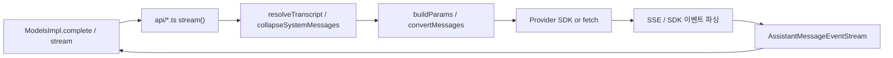

# ai_provider_apis

`packages/ai/src/api/` 아래에 있는 **LLM 프로바이더 API 어댑터 계층**이다. 각 파일은 하나의 와이어 프로토콜(Anthropic Messages, OpenAI Chat Completions/Responses, Bedrock Converse, Google GenAI, Mistral, `pi-messages` 등)을 pi 공통 모델로 정규화한다. 상위 `LLM_Provider_Abstraction_and_Auth` 모듈의 일부이며, 인증은 `ai_auth`, 모델 카탈로그/라우팅은 `ai_models_and_providers`, 공용 유틸은 `ai_utils`, 빌드·모델 생성은 `ai_build_and_model_generation`에서 다룬다 (이 문서들은 해당 모듈 문서 참조).

## 공통 계약

모든 어댑터는 같은 형태를 따른다.

- `stream(model, context: TranscriptContext, options)` → `AssistantMessageEventStream` (`utils/event-stream.ts`)를 즉시 반환하고, 내부 async IIFE에서 요청을 수행한다.
- `streamSimple(model, context, SimpleStreamOptions)` → `buildBaseOptions`/`clampThinkingLevel`로 공통 옵션(`reasoning`, `thinkingBudgets`)을 프로바이더별 옵션으로 변환한 뒤 `stream`을 호출.
- 출력은 `AssistantMessage`(`stopReason: "pending"`으로 시작)에 누적되고, 이벤트 `start → text/thinking/toolcall_(start|delta|end) → done | error`를 push한다.
- 실패 시 예외를 던지지 않고 `error` 이벤트로 변환하며, 스트리밍 스크래치 필드(`partialJson`, `index`, `customInput` 등)를 제거한 뒤 저장한다.
- 훅: `onPayload`(요청 변형), `onResponse`(상태/헤더), `onProviderStreamEvent`(원시 이벤트).
- 재시도는 `retryProviderRequest`(`utils/provider-retry.ts`) 사용(Codex 제외, 자체 구현).
- 비용 계산은 `calculateCost`(`models.ts`), 메시지 변환 전처리는 `transformMessages`.

## 서브 모듈

| 서브 모듈 | 파일 | 요약 |
|---|---|---|
| [ai_provider_apis_anthropic_bedrock](ai_provider_apis_anthropic_bedrock.md) | `anthropic-messages.ts`, `bedrock-converse-stream.ts`, `bedrock-converse-stream.lazy.ts` | Claude 계열. OAuth 토큰 시 Claude Code 스텔스 모드(툴 이름 매핑), 프롬프트 캐시, adaptive/budget thinking, 직접 파싱하는 SSE. Bedrock은 SigV4/bearer 인증, 프록시, 지연 로딩으로 브라우저 번들에서 AWS SDK 제외. |
| [ai_provider_apis_openai_family](ai_provider_apis_openai_family.md) | `openai-completions.ts`, `openai-responses.ts`, `azure-openai-responses.ts`, `openai-codex-responses.ts` | OpenAI 호환. `detectCompat`로 프로바이더별 차이(thinkingFormat, max_tokens 필드 등) 흡수. Codex는 WebSocket(연속 요청용 `previous_response_id`)→SSE 폴백, zstd 압축. |
| [ai_provider_apis_google](ai_provider_apis_google.md) | `google-generative-ai.ts`, `google-vertex.ts`, `google-shared.ts` | Gemini/Vertex. 공유 메시지·툴 변환, thought signature 보존, thinkingLevel vs thinkingBudget 선택. |
| [ai_provider_apis_gateways_and_classifiers](ai_provider_apis_gateways_and_classifiers.md) | `mistral-conversations.ts`, `pi-messages.ts`, `cloudflare-ai-binding.ts`, `llama-cpp-classify.ts`, `typesafe-system-one.ts`, `cloudflare-workers-ai-system-one.ts` | Mistral 네이티브, pi 자체 프로토콜(Radius 게이트웨이), Cloudflare AI 바인딩 fetch, 그리고 분류기(`classify`) API 구현들(System One, llama.cpp 로그확률 방식). |

## 주요 설계 포인트

1. **Stop reason 정규화**: 각 어댑터의 `mapStopReason`이 `stop | length | toolUse | error`로 변환.
2. **툴 호출 ID 정규화**: 프로바이더 제약(길이 64/40/9 등)에 맞춰 `transformMessages`에 normalizer 전달.
3. **스트리밍 JSON**: 툴 인자는 `parseStreamingJson`으로 부분 파싱, 종료 시 확정.
4. **인증 위임**: 어댑터는 `options.apiKey`/`headers`만 받는다. 키 확보·OAuth 갱신은 [ai_auth](ai_auth.md) 책임.
5. **분류기 API**: `classify`는 스트리밍이 아닌 `ClassifierResult`를 반환하며 `ModelsImpl.classify`([ai_models_and_providers](ai_models_and_providers.md))에서 호출된다.

## 연관 모듈

- [ai_auth](ai_auth.md), [ai_models_and_providers](ai_models_and_providers.md), [ai_utils](ai_utils.md), [ai_build_and_model_generation](ai_build_and_model_generation.md)
- 상위에서 이를 소비하는 에이전트 루프: [agent_runtime](agent_runtime.md)
