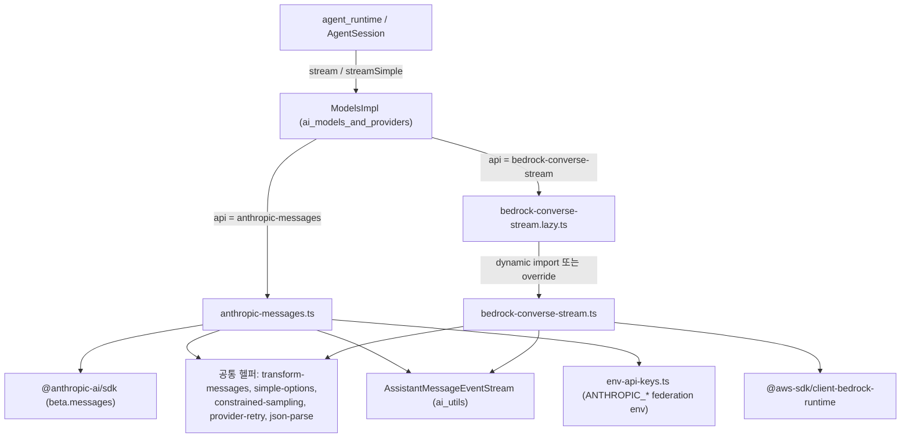
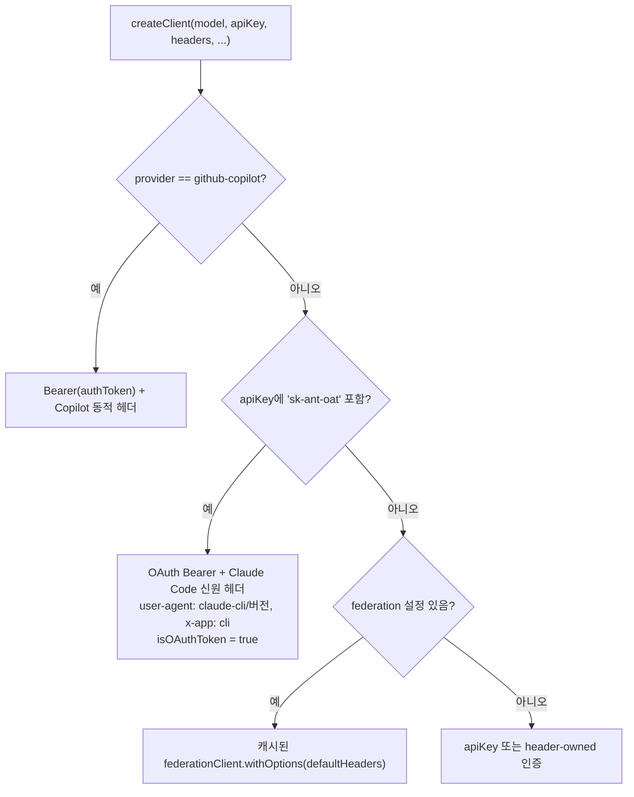
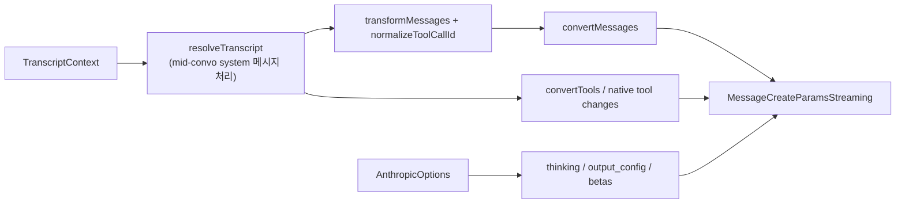
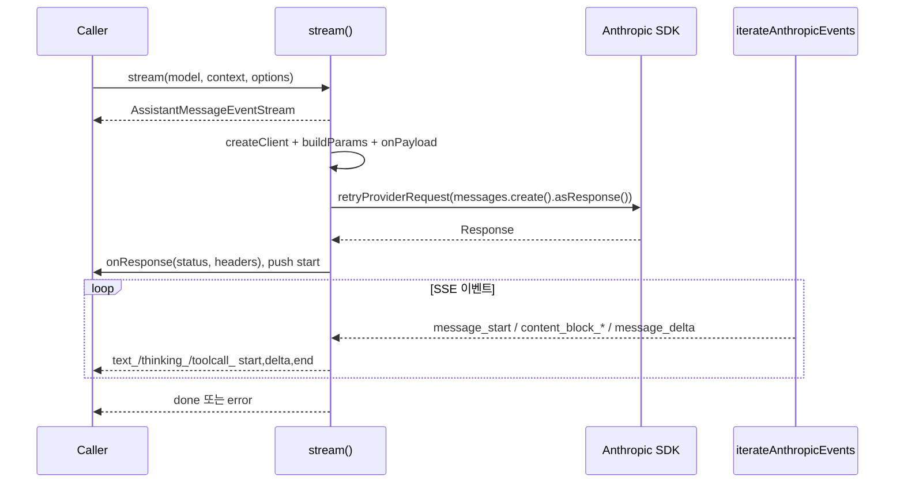
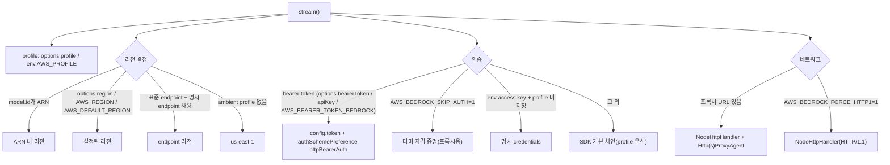
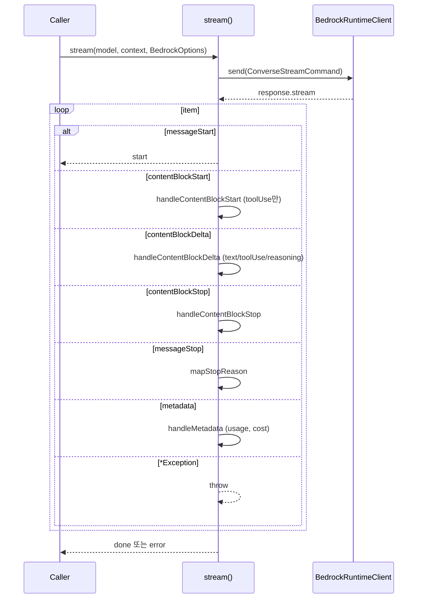
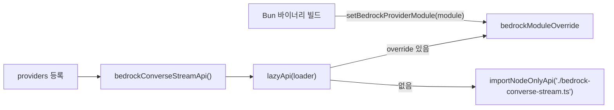

# ai_provider_apis_anthropic_bedrock

`packages/ai`의 Provider API 계층 중 **Anthropic Messages API**와 **Amazon Bedrock ConverseStream API** 어댑터를 담당하는 모듈이다. 두 어댑터는 모두 pi 내부 공통 표현(`TranscriptContext`, `Message`, `Tool`)을 각 Provider의 요청 형식으로 변환하고, 스트리밍 응답을 공통 이벤트(`AssistantMessageEventStream`)와 `AssistantMessage`로 되돌려 준다.

| 파일 | API 식별자 | 역할 |
|---|---|---|
| `packages/ai/src/api/anthropic-messages.ts` | `anthropic-messages` | Anthropic SDK(beta messages) 기반 스트리밍. 직접 키, OAuth, GitHub Copilot, OpenRouter 등 Anthropic 호환 엔드포인트, workload identity federation 지원 |
| `packages/ai/src/api/bedrock-converse-stream.ts` | `bedrock-converse-stream` | `@aws-sdk/client-bedrock-runtime`의 `ConverseStreamCommand` 기반 스트리밍. Node 전용 |
| `packages/ai/src/api/bedrock-converse-stream.lazy.ts` | - | Bedrock 구현을 지연 로딩하고, Bun 바이너리 빌드에서 모듈을 주입하는 `setBedrockProviderModule` 제공 |

상위/형제 문서: [ai_provider_apis](ai_provider_apis.md), [ai_provider_apis_openai_family](ai_provider_apis_openai_family.md), [ai_provider_apis_google](ai_provider_apis_google.md), [ai_provider_apis_gateways_and_classifiers](ai_provider_apis_gateways_and_classifiers.md), 인증은 [ai_auth](ai_auth.md), 모델 카탈로그/레지스트리는 [ai_models_and_providers](ai_models_and_providers.md), 공통 유틸은 [ai_utils](ai_utils.md) 참고.

---

## 1. 아키텍처 개요

핵심 설계 포인트:

- 두 어댑터 모두 `stream`(저수준, Provider 전용 옵션)과 `streamSimple`(공통 `SimpleStreamOptions`의 `reasoning`을 Provider 옵션으로 매핑) 두 진입점을 노출한다.
- 스트림은 `AssistantMessageEventStream`을 즉시 반환하고, 내부 async IIFE가 이벤트를 `push`한다. 실패는 throw 대신 `error` 이벤트로 전달된다 (`stopReason`: `aborted` 또는 `error`).
- 스트리밍 중에만 쓰는 스크래치 필드(`index`, `partialJson`, `redactedChunks`)는 종료/에러 경로 모두에서 제거되어 저장되는 메시지에 남지 않는다.

---

## 2. Anthropic Messages 어댑터 (`anthropic-messages.ts`)

### 2.1 클라이언트 생성 (`createClient`)

인증 방식별 분기:

- `PiAnthropic extends Anthropic`: `_shouldResolveDefaultCredentials()`가 `false`를 반환하여 SDK 자체의 자격 증명 체인(`ANTHROPIC_PROFILE` 설정 파일, federation env)이 pi의 auth resolver 뒤에서 몰래 동작하지 않게 한다.
- `getAnthropicFederation`: provider가 `anthropic`이고 키/인증 헤더가 없으며 `ANTHROPIC_FEDERATION_RULE_ID`, `ANTHROPIC_ORGANIZATION_ID`, `ANTHROPIC_IDENTITY_TOKEN_FILE` 환경변수가 모두 있을 때만 OIDC federation 설정을 만든다. SDK가 토큰 캐시를 클라이언트 단위로 갖기 때문에 모듈 전역 `federationClient`를 유지하고 요청마다 `withOptions()`로 복제한다.
- `options.client`가 주어지면 내부 생성을 건너뛴다 (예: `AnthropicVertex` 주입). 이 경우 `isOAuth = false`.
- 세션 어피니티 헤더: OpenRouter는 `x-session-id`, 그 외 `compat.sendSessionAffinityHeaders`가 켜진 경우 `x-session-affinity`.
- 인증 검증: `assertRequestAuth`는 `apiKey`, `authorization`, `x-api-key`, `cf-aig-authorization` 헤더 중 하나가 없으면 `No API key for provider: ...`를 던진다.

### 2.2 Claude Code 스텔스 모드 (OAuth)

OAuth 토큰 사용 시 시스템 프롬프트 맨 앞에 `You are Claude Code, Anthropic's official CLI for Claude.`를 넣고, 도구 이름을 Claude Code 정식 표기(`Read`, `Write`, `Bash` 등, `claudeCodeTools`)로 변환한다 (`toClaudeCodeName`). 응답의 `tool_use` 이름은 `fromClaudeCodeName`이 현재 도구 목록과 대소문자 무시 비교로 원래 이름으로 되돌린다.

### 2.3 요청 구성 (`buildParams`)

주요 동작:

- **캐시**: `resolveCacheRetention`(기본 `short`, `PI_CACHE_RETENTION=long`이면 `long`). `long`이고 `supportsLongCacheRetention`이면 TTL `1h`. `cache_control: ephemeral`은 시스템 프롬프트, 마지막 도구, 마지막 user/system 메시지 블록에 붙는다.
- **Thinking**:
  - `supportsMidConvoEffort` 모델: 항상 `adaptive` + `block_binding.prefix_mismatch_behavior = drop_block`, 과거 effort를 `insertThinkingLevelMessages`로 system 메시지에 삽입.
  - `forceAdaptiveThinking` 모델: `thinking: adaptive` + `output_config.effort`.
  - 그 외 reasoning 모델: `thinking: enabled` + `budget_tokens`(기본 1024). `thinkingEnabled === false`이면 `disabled`.
  - `thinkingDisplay` 기본값은 `summarized`.
  - `temperature`는 thinking 사용 중이거나 미지원 모델이면 생략.
- **Beta 헤더** (`getBetaFeatures`): `anthropic-beta` 헤더가 명시되어 있으면 그것이 우선(`null`이면 beta 없음). 없으면 OAuth(`claude-code-20250219`, `oauth-2025-04-20`), fine-grained tool streaming, interleaved thinking, server-side fallback, mid-conversation output config / thinking binding / tool changes를 조건부로 추가한다.
- **Native tool changes**: `supportsMidConvoSystemMessages && supportsMidConvoToolChanges`이고 초기 도구가 있으며 재정의가 없을 때, 초기 도구만 active로 두고 이후 도구는 `defer_loading: true`로 선언, `tool_addition`/`tool_removal` 블록으로 노출/철회한다. `DEFERRED_TOOL_PLACEHOLDER`를 처음부터 선언해 숨은 프롬프트 스캐폴딩이 캐시 prefix에 포함되도록 한다 (캐시 무효화 방지).
- **Fallback 모델**: `compat.allowedFallbackModels`가 있으면 `params.fallbacks`로 전달하고, 응답 모델이 다르면 해당 fallback의 `cost`로 비용을 계산한다.

### 2.4 메시지/도구 변환

- `convertMessages`
  - 이후 시스템 메시지는 `pendingSystemMessages`에 보관했다가 다음 assistant 메시지 직전(또는 끝)에 flush한다. `tool_result`는 `tool_use` 바로 뒤에 와야 하기 때문이다.
  - 연속된 `toolResult` 메시지는 하나의 user 메시지로 합친다.
  - 서명이 없는 thinking 블록은 일반 `text`로 강등한다 (`allowEmptySignature` 모델은 빈 서명 유지). redacted thinking은 `redacted_thinking`으로 되돌려 보낸다.
  - 빈 텍스트 블록과 빈 메시지는 제거한다. 이미지만 있는 tool result에는 `(see attached image)` 텍스트를 넣는다.
- `normalizeToolCallId`: `[^a-zA-Z0-9_-]`를 `_`로 치환하고 64자로 자른다.
- `convertTools`: `resolveJsonSchemaStrictSampling`으로 strict 여부를 결정한다. `isAnthropicStrictUnsupportedKeyword`가 `minimum`, `maximum`, `multipleOf`, `maxItems`, `uniqueItems` 등 Anthropic strict 모드가 400으로 거부하는 키워드와 허용되지 않는 `format`, `minItems`(0, 1 외) 값을 감지한다. `eager_input_streaming`은 `supportsEagerToolInputStreaming`일 때 설정, 아니면 fine-grained 스트리밍 beta를 사용한다.

### 2.5 스트림 파싱 (`iterateAnthropicEvents`)

SDK 스트림 대신 `client.beta.messages.create(...).asResponse()`로 raw `Response`를 받아 직접 SSE를 디코딩한다 (`iterateSseMessages`, `decodeSseLine`). 이유는 프록시/게이트웨이가 일부 필드를 누락하는 경우에도 견디고, 원본 SSE 라인을 오류 메시지에 남기기 위함이다 (코드상 확인; 의도는 추론).

- `event: error` → 즉시 throw. 알려진 메시지 이벤트(`message_start`, `content_block_*`, `message_delta`, `message_stop`) 외에는 무시.
- JSON은 `parseJsonWithRepair`로 파싱, 실패 시 이벤트명, 데이터, raw 라인을 포함한 오류.
- `message_start`는 봤는데 `message_stop`이 없으면 `Anthropic stream ended before message_stop`.

- 블록은 Anthropic의 `index`로 추적하며, tool 인자는 `partialJson`을 `parseStreamingJson`으로 점진 파싱한다. `signature_delta`는 thinking 서명에 누적한다.
- 사용량: `message_start`에서 input/cache 토큰을 확보(중간 abort 대비), `message_delta`에서 null이 아닌 값만 갱신. `output_tokens_details.thinking_tokens`는 `usage.reasoning`. 총합은 직접 계산 후 `calculateCost`.
- `input_transformations`가 있으면 `appendAssistantMessageDiagnostic`으로 `anthropic_input_transformations` 진단을 추가한다.
- 재시도: `retryProviderRequest`가 담당하며 SDK의 `maxRetries`는 0으로 고정한다.

### 2.6 `mapStopReason`

| Anthropic | pi `StopReason` |
|---|---|
| `end_turn`, `pause_turn`, `stop_sequence` | `stop` |
| `max_tokens` | `length` |
| `tool_use` | `toolUse` |
| `refusal` | `error` (`stop_details.explanation` 사용) |
| `sensitive` | `error` |
| 그 외 | throw `Unhandled stop reason` |

### 2.7 `streamSimple`의 reasoning 매핑

- reasoning 없음 → `thinkingEnabled: false`.
- `forceAdaptiveThinking` → `mapThinkingLevelToEffort`(`model.thinkingLevelMap` 우선, `minimal`/`low`→`low`, 기본 `high`).
- 그 외 → `adjustMaxTokensForThinking`, `clampMaxTokensToContext`로 예산을 계산하고 `thinkingBudgetTokens = min(budget, maxTokens - 1024)`.

---

## 3. Bedrock ConverseStream 어댑터 (`bedrock-converse-stream.ts`)

### 3.1 클라이언트 구성

- `shouldUseExplicitBedrockEndpoint`: 표준 AWS Bedrock runtime 호스트가 아니면(VPC/프록시/커스텀) 항상 `config.endpoint = model.baseUrl`. 표준 호스트면 리전/ambient profile이 설정되지 않았을 때만 고정한다. 카탈로그 기본값(`us-east-1`)이 사용자의 `AWS_REGION`/`AWS_PROFILE`을 덮어쓰지 않게 하기 위함이다.
- 명시적으로 설정된 profile이 ambient `AWS_ACCESS_KEY_ID`/`AWS_SECRET_ACCESS_KEY`보다 우선한다 (코드 주석의 이슈 #6957). `getConfiguredBedrockCredentials`는 env에서 access key/secret/session token을 읽는다.
- 브라우저 등 비 Node 환경은 `us-east-1`로 폴백한다.
- Smithy 미들웨어:
  - `addCustomHeadersMiddleware`: `build` 단계(서명 이전)에서 사용자 헤더를 주입하므로 SigV4 서명에 포함된다. `x-amz-*`, `authorization`, `host`는 예약 헤더라 무시한다.
  - `addResponseHeadersMiddleware`: `deserialize` 단계에서 raw HTTP 응답(게이트웨이 커스텀 헤더 포함)을 `onResponse`로 전달한다. 관찰되지 않은 경우에만 `$metadata`로 대체 호출한다.

### 3.2 요청 변환

- `collapseSystemMessages`: Bedrock은 중간 시스템 메시지가 없으므로 앞쪽 프롬프트로 합친다.
- `convertMessages`
  - user: 빈 내용은 `<empty>` 플레이스홀더. 이미지는 `createImageBlock`(jpeg/png/gif/webp, base64→bytes).
  - assistant: 빈 메시지/블록 제거. `toolCall`→`toolUse`(`sanitizeBedrockDocument`로 빈 키 제거). thinking은 Claude만 `signature`를 포함(`supportsThinkingSignature`), 서명이 없으면 텍스트로 강등. redacted(예: 비 Anthropic 모델의 암호화 reasoning)는 `decodeRedactedContent`로 복원해 `redactedContent`로 재전송.
  - 연속 `toolResult`는 하나의 user 메시지로 합친다 (Bedrock 요구사항). 상태는 `ToolResultStatus.ERROR/SUCCESS`.
  - 마지막 user 메시지 끝에 `cachePoint` 추가 (`supportsPromptCaching` 및 `cacheRetention !== "none"`일 때).
- `buildSystemPrompt`: 시스템 텍스트 + 선택적 `cachePoint`(`long`이면 TTL 1시간).
- `supportsPromptCaching`: Claude 3.5 Haiku, 3.7 Sonnet, 4.x, 5 계열. 애플리케이션 inference profile 등 이름을 알 수 없으면 `AWS_BEDROCK_FORCE_CACHE=1`로 강제 가능. 모델 ID와 `model.name` 둘 다 검사한다.
- `convertToolConfig`: `toolChoice === "none"`이면 `toolConfig` 자체를 생략. `auto`→`{auto:{}}`, `any`→`{any:{}}`, `{type:"tool"}`→`{tool:{name}}`. strict는 `model.compat.supportsStrictMode`일 때만.
- `buildAdditionalModelRequestFields`: Claude + reasoning 모델에서만 생성.
  - adaptive 모델(`supportsAdaptiveThinking`: Opus 4.6+, Sonnet 4.6+/5, Fable 5): `thinking: adaptive` + `output_config.effort`.
  - 그 외: `thinking: enabled` + `budget_tokens` (기본 minimal 1024, low 2048, medium 8192, high/xhigh/max 16384; `thinkingBudgets`로 덮어쓰기), `anthropic_beta: ["interleaved-thinking-2025-05-14"]`(기본 on).
  - GovCloud(리전 `us-gov-*`, 모델 ID `us-gov.` 또는 `arn:aws-us-gov:`)는 `thinking.display`를 생략한다.

### 3.3 스트림 처리

- 텍스트와 reasoning 블록은 `contentBlockStart`가 오지 않으므로 첫 delta에서 블록과 `*_start` 이벤트를 만든다.
- `redactedContent` 청크는 `redactedChunks`에 쌓고 `flushRedactedContent`가 `bytesToBase64`로 `thinkingSignature`에 인코딩한다 (`Uint8Array`가 JSON 직렬화 시 커지는 것을 방지). 서명과 redacted payload는 한 블록에 섞이지 않는다.
- `finalizeStreamingBlock`: 정상/오류 종료 경로에서 `index`, `partialJson`, redacted 버퍼를 정리한다.
- `handleMetadata`: input/output/cacheRead/cacheWrite, 1시간 캐시 쓰기(`cacheDetails`) 집계 후 `calculateCost`.
- `mapStopReason`: `end_turn`, `stop_sequence`→`stop`; `max_tokens`, `model_context_window_exceeded`→`length`; `tool_use`→`toolUse`; 그 외는 `error` (`Provider stopped with: ...`).

### 3.4 오류 처리

- `formatBedrockError`: `normalizeProviderError`로 상태/본문을 얻고, SDK 예외명을 사람이 읽는 접두사(`Internal server error`, `Model stream error`, `Validation error`, `Throttling error`, `Service unavailable`)로 매핑한다. 상위 재시도 로직(`agent-session`)이 `server.?error`, `service.?unavailable` 같은 패턴으로 매칭하므로 접두사 형식을 유지한다 (주석 확인). `data retention mode` 오류에는 AWS 문서 링크 힌트를 덧붙인다.
- `appendBedrockFailureDiagnostic`: `errorMessage`는 그대로 두고 `bedrock_response_failure` 진단에 `status`, `errorCode`, `requestId`를 구조화하여 추가한다. 알 수 없는 값은 추측하지 않고 생략하며, 200자를 넘는 값은 버린다.

### 3.5 `streamSimple`의 reasoning 매핑

- reasoning 없음 → `reasoning: undefined`.
- Claude + adaptive → 그대로 전달(effort는 `mapThinkingLevelToEffort`; `xhigh`는 Opus 4.7+, Sonnet 5, Fable 5에서 네이티브).
- Claude + 예산형 → `adjustMaxTokensForThinking`/`clampMaxTokensToContext`/`clampReasoning`으로 해당 레벨의 예산 계산.
- 비 Claude 모델 → 옵션 그대로(추가 필드 없음).

---

## 4. 지연 로딩 (`bedrock-converse-stream.lazy.ts`)

- AWS SDK는 Node 전용이므로 변수 specifier로 `import()`하여 브라우저 스모크/Bun compile 번들러가 따라가지 못하게 한다. 빌드 결과(`.js`)에서는 `.ts`를 `.js`로 치환한다.
- `setBedrockProviderModule`: 정적으로 import한 구현을 주입하는 Bun 빌드용 훅.
- 관련 검증 스크립트는 루트 `package.json`의 `check:browser-smoke`, `check:entry-graphs` 등과 연결된다 (스크립트명은 매니페스트 기준, 세부 동작은 미확인).

---

## 5. 두 어댑터 비교

| 항목 | Anthropic Messages | Bedrock ConverseStream |
|---|---|---|
| 전송 | SDK로 `Response` 획득 후 자체 SSE 파싱 | AWS SDK 이벤트 스트림 |
| 인증 | API 키, OAuth, Copilot, federation, 헤더 | SigV4(profile/env), Bearer 토큰, skip-auth |
| 시스템 메시지 | `resolveTranscript`로 네이티브/병합 | `collapseSystemMessages`로 항상 병합 |
| 캐시 | `cache_control` ephemeral (TTL `1h`) | `cachePoint` (TTL `ONE_HOUR`) |
| Thinking | `thinking`/`output_config` 직접 | `additionalModelRequestFields`(Claude만) |
| 도구 이름 | OAuth 시 Claude Code 표기 변환 | 변환 없음 |
| 재시도 | `retryProviderRequest` | 상위 레벨 오류 패턴 기반 (접두사 유지) |
| 환경 | Node/브라우저 | Node 전용 (lazy 로드) |

공통 흐름은 [ai_provider_apis](ai_provider_apis.md)의 스트림 계약과, `AgentSession`의 재시도/컴팩션 처리는 [agent_session_core](agent_session_core.md), 에이전트 루프는 [agent_runtime](agent_runtime.md)와 연결된다. 자격 증명 해석(`getApiKeyAndHeaders`)은 [model_and_auth_management](model_and_auth_management.md)에서 수행된다.

---

## 6. 확장 및 유지보수 포인트

- 새 Anthropic 호환 게이트웨이: `model.compat`(`supportsEagerToolInputStreaming`, `supportsLongCacheRetention`, `supportsCacheControlOnTools`, `supportsTemperature`, `allowEmptySignature`, `supportsStrictTools`, `supportsMidConvo*`)로 동작을 조정한다. 코드 분기보다 카탈로그 메타데이터를 우선한다 (`packages/ai/scripts/generate-models.ts`는 [ai_build_and_model_generation](ai_build_and_model_generation.md) 참고; `models.generated.ts`는 직접 수정 금지, 프로젝트 규칙).
- 새 Claude 모델 세대: Bedrock은 `supportsAdaptiveThinking`, `supportsNativeXhighEffort`, `supportsPromptCaching`의 문자열 매칭 목록을, Anthropic은 `mapThinkingLevelToEffort`와 `thinkingLevelMap`을 갱신해야 한다.
- 테스트: `packages/ai/vitest.config.ts` 기준 vitest. 프로젝트 규칙상 전체 vitest를 직접 실행하지 말고 `./test.sh` 또는 개별 파일을 실행한다.
- 주의: Anthropic의 `claudeCodeVersion`(현재 `2.1.280`)과 `claudeCodeTools` 목록은 수동 갱신 대상이다.

## 7. 검증 수준

위 내용은 제공된 `anthropic-messages.ts`, `bedrock-converse-stream.ts`, `bedrock-converse-stream.lazy.ts` 소스를 읽고 정리한 **코드 확인** 수준이다. 실행 확인은 하지 않았다. 설계 의도(자체 SSE 파싱의 이유 등)는 **추론**으로 표시했고, 빌드 스크립트와의 연계(`check:browser-smoke` 등)와 `lazyApi`, `transform-messages` 등 이 모듈 밖 헬퍼의 내부 동작은 **미확인**이다.
