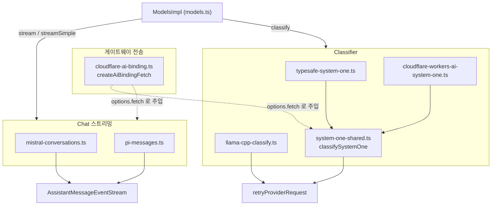
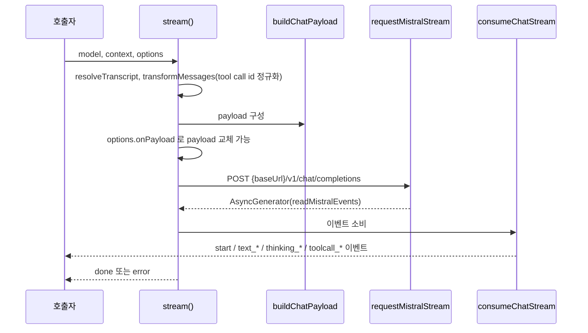
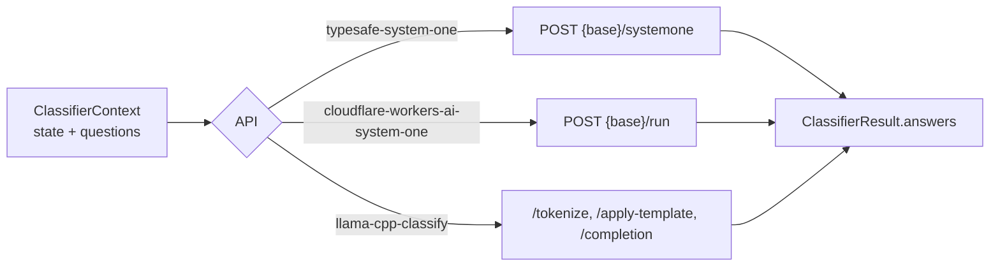
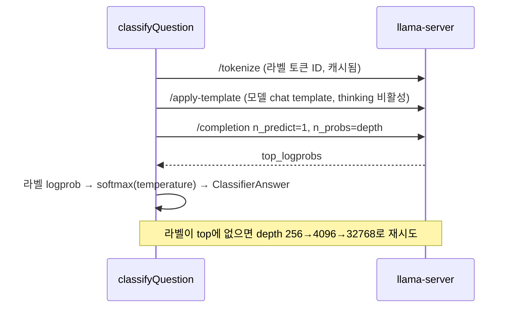

# ai_provider_apis_gateways_and_classifiers

`packages/ai/src/api/` 아래에서 **OpenAI/Anthropic/Google 계열이 아닌 나머지 API 구현**을 묶은 모듈이다. 두 부류로 나뉜다.

1. **Chat 스트리밍 API / 게이트웨이**: `mistral-conversations`, `pi-messages`, 그리고 Cloudflare AI Gateway용 `fetch` 어댑터(`cloudflare-ai-binding.ts`).
2. **Classifier(분류) API**: 텍스트를 생성하지 않고 질문에 대한 답(choice / score / bool)과 확률만 돌려주는 구현. `typesafe-system-one`, `cloudflare-workers-ai-system-one`, `llama-cpp-classify`.

상위 모듈은 [ai_provider_apis](ai_provider_apis.md)이며, 형제 모듈은 [ai_provider_apis_openai_family](ai_provider_apis_openai_family.md), [ai_provider_apis_anthropic_bedrock](ai_provider_apis_anthropic_bedrock.md), [ai_provider_apis_google](ai_provider_apis_google.md)이다. 모델/provider 등록과 `classify` 디스패치는 [ai_models_and_providers](ai_models_and_providers.md), 인증은 [ai_auth](ai_auth.md), 공용 유틸(`EventStream`, 재시도 등)은 [ai_utils](ai_utils.md)를 참고한다.

> 검증 수준: 아래 내용은 제공된 소스와 `system-one-shared.ts`를 직접 읽은 **코드 확인**이다. 호출 주체(`ModelsImpl.classify` 등)와의 연결은 **추론**이다.

## 1. 구성 요소 개요

| 파일 | 역할 | 핵심 export |
|---|---|---|
| `mistral-conversations.ts` | Mistral 네이티브 `/v1/chat/completions` SSE 스트리밍 | `stream`, `streamSimple`, (내부) `buildChatPayload`, `consumeChatStream` |
| `pi-messages.ts` | pi 자체 메시지 프로토콜(Radius 게이트웨이 등) | `stream`, `streamSimple`, `PiMessagesResponseError` |
| `cloudflare-ai-binding.ts` | Workers `env.AI.fetch()`를 `FetchFunction`으로 노출 | `createAiBindingFetch`, `AiBinding`, `CLOUDFLARE_GATEWAY_BINDING_AUTH_SENTINEL` |
| `system-one-shared.ts` | System One 분류 공통 로직(참조용 공유 파일) | `classifySystemOne`, `SystemOneTransport` |
| `typesafe-system-one.ts` | TypeSafe/OpenRouter System One transport | `classify` |
| `cloudflare-workers-ai-system-one.ts` | Workers AI REST 위의 System One transport | `classify`, (내부) `cloudflareErrorMessage` |
| `llama-cpp-classify.ts` | llama-server의 next-token logprob로 분류 | `classify`, `renderQuestion`, `labelProbabilities`, `peakConfidence`, `answerFromProbabilities` |

## 2. Chat 스트리밍 API

### 2.1 `mistral-conversations.ts`

`StreamFunction<"mistral-conversations", MistralOptions>` 구현. SDK 없이 `fetch`로 직접 SSE를 읽는다.

처리 흐름:

핵심 포인트:

- **`streamSimple`**: `buildBaseOptions`로 공통 옵션을 만들고 `clampThinkingLevel`로 reasoning 수준을 보정한다. 모델에 `thinkingLevelMap`이 있으면 `reasoningEffort`(`none|low|medium|high|max`), 없으면 reasoning 모델에 한해 `promptMode: "reasoning"`을 쓴다.
- **Tool call ID 정규화**: Mistral은 9자 영숫자 ID를 요구한다. `createMistralToolCallIdNormalizer`가 `shortHash` 기반으로 변환하고 충돌 시 `attempt`를 올려 재생성한다(양방향 맵 유지).
- **와이어 변환**: 내부는 camelCase(`maxTokens`, `toolCalls`, `imageUrl`)이고 `toMistralWirePayload`가 snake_case로 바꾼다.
- **헤더**: `model.headers` → `options.headers` 순으로 덮어쓰며 값이 `null`이면 삭제. 프롬프트 캐싱은 `sessionId`가 있고 `cacheRetention !== "none"`일 때 `promptCacheKey`와 `x-affinity` 헤더로 설정한다(명시적 `x-affinity`가 있으면 존중).
- **SSE 파서**: `readMistralEvents`는 여러 줄바꿈 조합(`\r\n\r\n`, `\n\n` 등)을 경계로 `data:` 라인을 모아 JSON으로 파싱하고 `[DONE]`에서 종료한다. 기본 타임아웃은 60초이며 사용자 `signal`과 `AbortSignal.any`로 결합한다.
- **`consumeChatStream`**: delta를 `text` / `thinking` / `toolCall` 블록으로 변환한다. 빈 delta는 블록을 열지 않는다(GLM 모델이 빈 content를 보내 thinking이 쪼개지는 문제 회피). 도구 인자는 `partialArgs` 스크래치 버퍼에 누적하며 `parseStreamingJson`으로 점진 파싱하고, 종료 시 `partialArgs`를 삭제해 재전송 시 파싱된 인자만 남긴다.
- **Usage**: `prompt_tokens`에서 캐시 토큰(여러 필드명 변형 지원)을 빼 `input`/`cacheRead`로 나누고 `calculateCost`로 비용 계산.
- **Stop reason**: `stop`→`stop`, `length|model_length`→`length`, `tool_calls`→`toolUse`, 그 외는 `error`.
- **오류**: `MistralHttpError`를 `formatMistralError`가 `Mistral API error (status): body` 형태(본문 4000자 절단)로 포맷한다. 스트림이 finish reason 없이 끝나면 오류로 처리한다.

### 2.2 `pi-messages.ts`

pi 자체 프로토콜: `POST <baseUrl>/messages`로 `{ model, context, options }`를 보내고, 서버는 직렬화된 assistant-message 이벤트를 SSE로 보낸다(Radius 게이트웨이가 사용하는 와이어 프로토콜, `models.json`에서 `"api": "pi-messages"`로 임의 백엔드 연결 가능).

- `createEventConverter`: 서버 이벤트(`PiMessagesEvent`)를 클라이언트 쪽 `partial` `AssistantMessage`에 누적하며 `AssistantMessageEvent`로 변환한다. 도구 호출 JSON은 `toolJson` 맵에 모아 `parseStreamingJson`으로 파싱.
- 종료 이벤트(`done`/`error`)가 없으면 `"stream ended without a terminal event"` 오류. `done`/`error`는 `usage`, `responseId`, `providerThinkingLevel`, 서버측 메시지 재작성 영향(`rewrite` → `pi_messages_rewrite` 진단)을 전달한다.
- HTTP 오류는 `PiMessagesResponseError`(코드, 진단 상세 포함)로 만들어 `pi_messages_response_failure` 진단으로 첨부한다. 취소는 `reason: "aborted"`.
- `options.debug`면 `?debug=1`을 붙인다. `cacheRetention`이 없으면 환경변수 `PI_CACHE_RETENTION=long`만 매핑한다.
- `streamSimple`은 `stream`에 `reasoning`, `toolChoice`, `debug`를 그대로 전달하는 얇은 래퍼다.

### 2.3 `cloudflare-ai-binding.ts` (게이트웨이 전송)

Worker 내부에서 API 토큰 없이 Cloudflare AI Gateway를 쓰기 위한 어댑터. `baseUrl`을 `https://workers-binding.ai/ai-gateway/gateways/{gateway}/{provider}`로 두고 `createAiBindingFetch(env.AI)`가 반환한 `fetch`를 `options.fetch`로 주입한다. 요청은 변환·버퍼링 없이 그대로 `env.AI.fetch()`로 전달된다.

- `AiBinding`은 구조적 타입(`aiGatewayLogId` + 선택적 `fetch`)이며, `fetch` 존재를 생성 시점에 검사해 `TypeError`를 던진다.
- 바인딩 호출은 사전 인증되므로 `cf-aig-authorization: Bearer ${CLOUDFLARE_GATEWAY_BINDING_AUTH_SENTINEL}`로 API 구현의 "인증 필요" 검사를 통과시키고, `Authorization: null` / `x-api-key: null`로 SDK의 placeholder 헤더가 게이트웨이에 BYOK 키로 오인되지 않게 한다.

## 3. Classifier API

공통 타입은 `types.ts`의 `ClassifierContext`(`state` + `questions`), `ClassifierQuestion`(`choice`/`score`/`bool`), `ClassifierAnswer`, `ClassifierResult`이다. 모든 구현은 예외를 던지지 않고 `stopReason: "stop" | "error" | "aborted"`와 `errorMessage`를 담은 `ClassifierResult`를 반환한다.

### 3.1 System One 공통(`system-one-shared.ts`)과 두 transport

`classifySystemOne(transport, model, context, options)`가 모든 로직을 담당하고, `SystemOneTransport`가 서비스별 차이(`api`, `label`, `url`, `payload`, `output`)만 정의한다.

공통 처리:
1. `model.api` 일치 및 `apiKey` 확인.
2. `wireRequest`: 공개 타입 `bool`을 와이어 타입 `noul`로 변환.
3. `transport.payload`로 봉투 구성 후 `onPayload` 훅 적용.
4. `retryProviderRequest`(기본 `maxRetries` 2)로 POST. `timeoutMs`와 사용자 `signal`을 결합하고, 타임아웃은 `TimeoutError`로 구분.
5. `transport.output`으로 `{answers, usage}` 추출 → `parseUsage`(카탈로그 단가로 `calculateCost`) → `parseAnswers`로 질문 타입별 엄격 검증. 잘못된 응답이어도 청구됐으므로 usage를 먼저 기록한다.

| transport | URL | 요청 | 응답 처리 |
|---|---|---|---|
| `typesafe-system-one` | `{baseUrl}/systemone` | `{ model, ...request }` | body 그대로 (OpenRouter도 같은 프로토콜, baseUrl만 다름) |
| `cloudflare-workers-ai-system-one` | `{baseUrl}/run` | `{ model, input: request }` | `success === false`면 `cloudflareErrorMessage(errors)`, `result.state !== "Completed"`면 오류, `result.result` 반환 |

### 3.2 `llama-cpp-classify.ts`

모델이 텍스트를 생성하지 않고, **다음 토큰 로그확률**을 읽어 답을 계산한다.

- **라벨 규칙**: choice는 `A–Z a–z 0–9`(2~62개 옵션), score는 `0–9`(2~10단계), bool은 `Yes`/`No`. 라벨이 단일 토큰이 아니거나 서로 토큰이 겹치면 오류.
- **프롬프트(`renderQuestion`)**: state → 전체 질문 개요 → state(반복) → 최종 질문(라벨 포함) 순. 최종 질문 앞부분이 모든 질문에서 동일하므로 서버 prompt cache가 한 번만 평가한다. 시스템 프롬프트는 state 안의 지시를 따르지 말라고 명시(프롬프트 인젝션 방어).
- **라벨 토큰 해석**: 개행 뒤에 라벨을 토큰화해 선행 공백 마커 차이를 피하고, `labelTokenCache`(서버+모델+라벨 키)로 캐시하며 실패 시 evict.
- **확률 계산**: `labelProbabilities`(temperature로 나눈 softmax), `peakConfidence` = `(n*peak-1)/(n-1)`을 [0,1]로 클램프. bool은 `Yes` 확률, score는 기대값, choice는 argmax + 확률 맵 + confidence.
- `llamaServerRoot`는 OpenAI 호환 `/v1` 접미사를 제거해 서버 루트를 얻는다. 질문은 순차 처리(캐시 활용). `temperature`는 양수여야 하며 모든 질문을 요청 전에 사전 검증한다. API 키는 선택 사항.
- 언더플로(`-1e30`) 로그확률만 있으면 "no probability" 오류.

## 4. 공통 설계 패턴

- **오류를 값으로**: chat은 `error` 이벤트, classifier는 `stopReason: "error"` 결과로 반환(throw 없음). 단 `mistral-conversations.streamSimple`은 API 키가 없으면 동기적으로 throw한다.
- **주입 가능한 `fetch`/훅**: `options.fetch`, `onPayload`, `onResponse`, `onProviderStreamEvent`가 모든 구현에 공통이며, 게이트웨이(`createAiBindingFetch`)와 테스트가 이 지점을 이용한다.
- **서버 오류 본문 보존**: 진단/절단을 거쳐 사용자 메시지로 노출(`formatMistralError`, `PiMessagesResponseError`, `formatProviderError`).
- **스트림 이벤트 스키마 통일**: 모든 chat 구현이 `AssistantMessageEventStream`에 `start → *_start/_delta/_end → done|error` 이벤트를 푸시하므로 상위 [agent 런타임](agent_runtime.md)은 provider 차이를 모른다.
