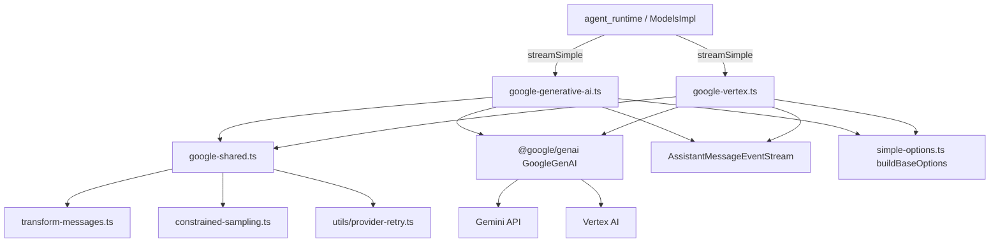
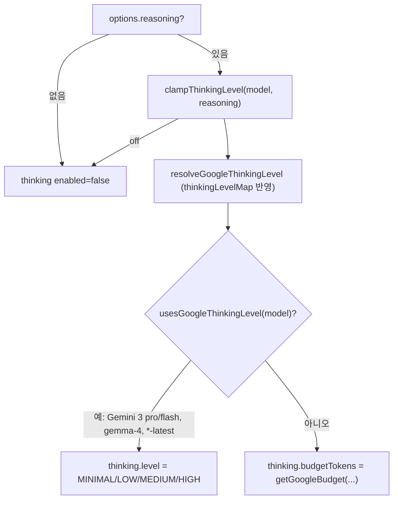
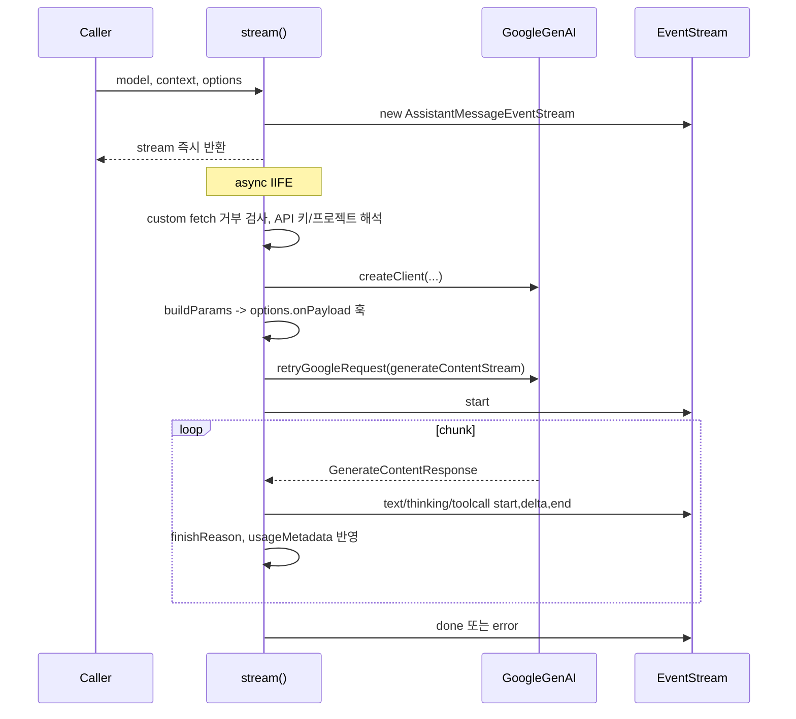
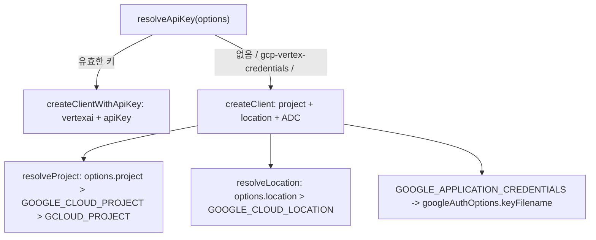

# ai_provider_apis_google

`ai_provider_apis_google`은 `packages/ai`에서 Google Gemini 계열 모델을 호출하는 두 어댑터와 그 공용 유틸리티를 묶은 모듈이다.

| 파일 | 역할 | API 식별자 |
|---|---|---|
| `packages/ai/src/api/google-generative-ai.ts` | Gemini Developer API (API 키 방식) | `google-generative-ai` |
| `packages/ai/src/api/google-vertex.ts` | Vertex AI (ADC 또는 Vertex API 키) | `google-vertex` |
| `packages/ai/src/api/google-shared.ts` | 두 어댑터가 공유하는 메시지/도구/thinking/중단 사유 변환 | - |

모든 어댑터는 `@google/genai`(`GoogleGenAI`) SDK 위에서 동작하며, pi 공통 타입(`TranscriptContext`, `AssistantMessage`)을 Gemini `Content[]`로 바꾸고 스트림 청크를 `AssistantMessageEventStream` 이벤트로 되돌린다.

상위/형제 모듈:
- 상위 모듈: [ai_provider_apis](ai_provider_apis.md), [LLM_Provider_Abstraction_and_Auth](LLM_Provider_Abstraction_and_Auth.md)
- 형제 모듈: [ai_provider_apis_openai_family](ai_provider_apis_openai_family.md), [ai_provider_apis_anthropic_bedrock](ai_provider_apis_anthropic_bedrock.md), [ai_provider_apis_gateways_and_classifiers](ai_provider_apis_gateways_and_classifiers.md)
- 연관: 이벤트 스트림 `AssistantMessageEventStream`은 [ai_utils](ai_utils.md), 모델 메타데이터와 `calculateCost`/`clampThinkingLevel`은 [ai_models_and_providers](ai_models_and_providers.md), 인증은 [ai_auth](ai_auth.md) 참고.
- 소비자: [agent_runtime](agent_runtime.md)이 `streamSimple`을 통해 이 어댑터를 호출한다.

> 검증 수준: 아래 내용은 제공된 소스 코드를 직접 읽고 확인한 것(코드 확인)이다. 실행 확인은 하지 않았다. 개발자 의도는 `추론`으로 표시한다.

---

## 1. 아키텍처



핵심 설계: 두 어댑터는 `stream` 본문이 거의 동일하고(스트림 파싱, 블록 상태 머신, usage 계산), 차이는 **클라이언트 생성**과 **인증/위치 해석**뿐이다. 공통 변환 로직은 `google-shared.ts`에 모여 있다. (추론: 중복된 스트림 루프는 의도적 복제로 보이며, 공용화는 되어 있지 않다. 한쪽을 고치면 다른 쪽도 확인해야 한다.)

## 2. 공개 진입점

각 파일은 두 함수를 export한다.

- `stream`: provider 고유 옵션(`GoogleOptions` / `GoogleVertexOptions`)을 받는 저수준 함수.
- `streamSimple`: 공통 `SimpleStreamOptions`(`reasoning`, `thinkingBudgets`, `toolChoice`)를 provider 옵션으로 변환해 `stream`을 호출한다.

### 옵션 타입

```ts
interface GoogleOptions extends StreamOptions {
  toolChoice?: "auto" | "none" | "any";
  thinking?: { enabled: boolean; budgetTokens?: number; level?: GoogleApiThinkingLevel };
}
interface GoogleVertexOptions extends GoogleOptions-like { project?: string; location?: string }
```

`budgetTokens`는 `-1`이면 동적, `0`이면 비활성이다.

## 3. `streamSimple`: reasoning 매핑



- `usesGoogleThinkingLevel`: 모델 ID가 `gemini-3(.x)-(pro|flash)`, `gemini-flash-latest`, `gemini-flash-lite-latest`, `gemma-4`/`gemma4` 패턴이면 이산 `thinkingLevel`을, 그 외에는 토큰 기반 `thinkingBudget`을 쓴다.
- `getGoogleBudget`: 사용자 `thinkingBudgets[level]`이 우선. 없으면 모델별 기본값을 쓴다.

| 모델 ID 포함 문자열 | minimal | low | medium | high |
|---|---|---|---|---|
| `2.5-pro` | 128 | 2048 | 8192 | 32768 |
| `2.5-flash-lite` (Generative AI만) | 512 | 2048 | 8192 | 24576 |
| `2.5-flash` | 128 | 2048 | 8192 | 24576 |
| 기타 | -1 (동적) | | | |

Vertex 쪽 `getGoogleBudget`에는 `2.5-flash-lite` 분기가 없어 `2.5-flash` 값이 적용된다(문자열 포함 검사 때문). 두 파일의 차이점이다.

- `google-generative-ai`의 `streamSimple`은 API 키가 없으면 즉시 `throw`한다. Vertex는 키가 선택 사항이므로 `buildBaseOptions(..., undefined)`로 호출한다.
- `reasoning`이 꺼진 모델은 `getDisabledGoogleThinkingConfig`로 비활성 설정을 보낸다. level 모델이 "off"를 지원하지 않으면 최소 level로 폴백하고, 그 외에는 `{ thinkingBudget: 0 }`.

## 4. `stream` 처리 흐름



세부 동작 (코드 확인):

1. **사전 검사**: `options.fetch`가 `globalThis.fetch`와 다르면 오류 ("Custom fetch is not supported ..."). 이 SDK 경로에서는 사용자 정의 fetch를 주입할 수 없다.
2. **페이로드 훅**: `buildParams` 결과를 `options.onPayload`에 넘기고, 반환값이 `undefined`가 아니면 교체한다.
3. **재시도**: `retryGoogleRequest`는 `retryProviderRequest`(408/409/429/5xx, retry-after 존중)를 감싼다. SDK의 `ApiError`는 `status`는 있고 `headers`가 없어 재시도 대상에서 빠지므로 `headers = undefined`를 채워 정규화한다. 재시도는 **초기 요청**에만 적용된다. 스트림 도중 실패는 재시도하지 않는다.
4. **블록 상태 머신**: `currentBlock`이 text/thinking 중 하나이며, 파트 종류가 바뀌면 이전 블록에 `*_end`를 내고 새 블록에 `*_start`를 낸다. `functionCall` 파트가 오면 열린 블록을 닫는다.
5. **thinking 판별**: `isThinkingPart`는 `part.thought === true`만 본다. `thoughtSignature`는 어떤 파트에도 붙을 수 있어 thinking 여부와 무관하다.
6. **서명 보존**: `retainThoughtSignature`는 비어 있지 않은 최신 서명을 유지하며, 뒤 delta에 서명이 없어도 덮어쓰지 않는다.
7. **도구 호출 ID**: `functionCall.id`가 없거나 이미 있는 ID면 `${name}_${Date.now()}_${++toolCallCounter}`로 생성한다. 도구 호출은 한 번에 `toolcall_start`, `toolcall_delta`(JSON 전체), `toolcall_end` 세 이벤트로 나온다(인자 점진 스트리밍 없음).
8. **종료 사유**: `mapStopReason`으로 변환하고, 도구 호출이 있는데 `stop`이면 `toolUse`로 승격한다. 원본은 `rawStopReason`에 보관한다.
9. **usage 계산**: `input = promptTokenCount - cachedContentTokenCount`, `output = candidatesTokenCount + thoughtsTokenCount`, `cacheRead = cachedContentTokenCount`, `reasoning = thoughtsTokenCount`. 이후 `calculateCost(model, usage)`로 비용을 채운다.
10. **종료/오류**: 정상 종료 시 `done`. `stopReason`이 `pending`(finish reason 없음), `aborted`, `error`이면 예외로 처리해 `catch`에서 `error` 이벤트를 낸다. `signal.aborted`면 `stopReason = "aborted"`. 오류 메시지는 `formatProviderError(normalizeProviderError(error))`.

## 5. `buildParams`

두 어댑터의 `buildParams`는 사실상 동일하다.

| 입력 | 결과 |
|---|---|
| `convertMessages(model, context)` | `contents` |
| 첫 시스템 메시지 | `config.systemInstruction` (`sanitizeSurrogates` 적용) |
| 현재 도구 목록 | `config.tools = convertTools(tools, false, supportsStrictMode)` |
| `toolChoice`, strict 여부 | `config.toolConfig.functionCallingConfig.mode` |
| `temperature`, `maxTokens` | `temperature`, `maxOutputTokens` |
| `thinking.enabled` + `model.reasoning` | `thinkingConfig { includeThoughts: true, thinkingLevel \| thinkingBudget }` |
| `thinking.enabled === false` + `model.reasoning` | `getDisabledGoogleThinkingConfig` |
| `signal` | `config.abortSignal`. 이미 abort면 `"Request aborted"` 예외 |

Gemini 3 이상 모델은 `supportsGoogleStrictToolSampling`이 true여서, 도구 스키마가 strict면 함수 호출 모드가 `VALIDATED`가 된다. 단 `toolChoice`가 `none`/`any`이면 이쪽이 우선한다(`resolveGoogleFunctionCallingMode`).

## 6. `google-shared.ts` 핵심 함수

### `convertMessages`

pi 메시지를 Gemini `Content[]`로 변환한다.

- 첫 시스템 메시지는 `systemInstruction`으로 보내므로 제거한다(`withoutInitialSystemMessage(collapseSystemMessages(...))`).
- `transformMessages`에 `normalizeToolCallId`를 넘겨 ID를 정규화한다. `requiresToolCallId`(Claude, gpt-oss, Gemini 3 이상)일 때만 `[^a-zA-Z0-9_-]`를 `_`로 바꾸고 64자로 자른다.
- role 매핑: `user` -> `user`, `assistant` -> `model`, `toolResult` -> `user` 안의 `functionResponse`.
- **thinking 처리**: 같은 provider와 같은 model에서 생성된 블록만 `thought: true`와 서명을 유지한다. 다른 모델의 thinking은 태그 없이 평문 text로 바꾼다(모델이 태그를 흉내내지 않게). 이 판단이 `isSameProviderAndModel`이다.
- **서명 검증**: `resolveThoughtSignature`는 같은 provider/model이면서 base64(길이 4의 배수, 정규식 통과)일 때만 서명을 보낸다. 잘못된 서명은 API 오류가 되므로 버린다.
- **빈 블록**: 빈 text/thinking은 버리되, 서명이 있으면 유지한다(코드 주석: 서명을 버리면 reasoning 체인이 깨져 thought-only STOP이 나올 수 있음).
- **도구 결과**: 오류면 `{ error }`, 아니면 `{ output }`. Gemini 3 이상은 이미지를 `functionResponse.parts`에 넣고, 3 미만은 별도 user 턴("Tool result image:")으로 보낸다. 연속된 도구 결과는 단일 user 턴에 병합한다(Cloud Code Assist 요구 사항).
- `model.input`에 `image`가 없으면 도구 결과 이미지는 제외한다.

### `convertTools`

기본은 `parametersJsonSchema`(전체 JSON Schema 지원). `useParameters = true`이면 구형 `parameters`(OpenAPI 스키마)를 쓰고 `sanitizeForOpenApi`가 `$schema`, `$id`, `$defs`, `definitions` 등 메타 선언을 제거한다. strict 여부는 [constrained-sampling]에서 `resolveJsonSchemaStrictSampling`으로 결정한다. 현재 두 어댑터는 `useParameters = false`로만 호출한다. (`true`는 Cloud Code Assist + Claude 용도라고 주석에 있으나 이 모듈 안에서 호출처는 확인되지 않음 - 미확인.)

### `mapStopReason` / `mapStopReasonString`

- `STOP` -> `stop`, `MAX_TOKENS` -> `length`.
- 안전/차단/기타 `FinishReason` 전부 -> `error`. `never` 체크로 SDK에 새 enum 값이 추가되면 컴파일 단계에서 드러난다.
- `mapStopReasonString`은 원시 문자열용으로 `STOP`/`MAX_TOKENS` 외에는 `error`.

### thinking 변환 헬퍼

`resolveGoogleThinkingLevel`(모델의 `thinkingLevelMap` 반영, `xhigh`/`max`는 지원하지 않아 예외) -> `toGoogleThinkingLevel`(대문자 문자열) -> `toGoogleSdkThinkingLevel`(SDK enum).

## 7. Vertex 전용 로직



- `resolveApiKey`: 공백 제거 후 비어 있거나 마커 `gcp-vertex-credentials` 또는 `<...>` 형태 placeholder이면 `undefined`로 취급하고 ADC 경로를 쓴다.
- `resolveProject`/`resolveLocation`: 없으면 안내 메시지와 함께 예외. 환경 변수는 `getProviderEnvValue(name, options.env)`로 읽어 `options.env` 오버라이드를 지원한다.
- API 버전은 상수 `API_VERSION = "v1"`.
- `buildHttpOptions`: `model.baseUrl`이 비어 있거나 `{location}` 템플릿을 포함하면 무시하고 SDK 기본 엔드포인트를 쓴다. 커스텀 URL이면 `baseUrlResourceScope = ResourceScope.COLLECTION`을 설정하고, URL 경로에 `v1`, `v1beta1` 같은 버전 세그먼트가 있으면 `apiVersion = ""`로 중복을 막는다(`baseUrlIncludesApiVersion`).
- Generative AI의 `createClient`는 `model.baseUrl`이 있으면 `baseUrl`을 쓰고 `apiVersion = ""`로 고정한다(baseUrl에 버전 포함 가정).
- 헤더: 두 어댑터 모두 `User-Agent(getPiUserAgent())` < `model.headers` < `options.headers` 순으로 병합하고 `providerHeadersToRecord`로 변환한다.

## 8. 두 어댑터 비교

| 항목 | google-generative-ai | google-vertex |
|---|---|---|
| 인증 | `options.apiKey` 필수 | Vertex API 키 또는 ADC |
| 프로젝트/위치 | 없음 | 필수(ADC 경로) |
| SDK 모드 | 기본 | `vertexai: true` |
| `2.5-flash-lite` 예산 | 별도 값 | 별도 분기 없음 |
| 오류 문구 | "Google stream ended..." | "Google Vertex stream ended..." |

## 9. 확장 및 수정 시 주의점

- 새 Gemini 계열 모델이 level 방식을 쓰면 `usesGoogleThinkingLevel` 정규식을 갱신한다. 지원 level 자체는 모델 카탈로그의 `thinkingLevelMap`에서 오며([ai_build_and_model_generation](ai_build_and_model_generation.md)의 `generate-models` 스크립트가 생성), `models.generated.ts`를 직접 수정하지 않는다(리포지토리 `AGENTS.md` 규칙).
- 스트림 루프가 두 파일에 복제되어 있으므로 동작 변경 시 양쪽을 함께 수정한다.
- 도구 호출 ID 카운터 `toolCallCounter`는 모듈 전역이며 파일별로 독립이다.
- `requiresToolCallId`가 true인 모델(Gemini 3 이상 등)은 `functionCall`/`functionResponse`에 `id`를 실어 보낸다. 새 모델군이 추가되면 이 판별식을 점검한다.
- 이 모듈은 `google-generative-ai`와 `google-vertex` 타입의 `Model<T>`만 받는다(`GoogleApiType`). 다른 어댑터와 공유하는 공통 옵션 구성은 `simple-options.ts`의 `buildBaseOptions`에 있다(이 모듈 밖, 상세는 [ai_provider_apis](ai_provider_apis.md)).

## 10. 미확인 사항

- `transform-messages.ts`, `constrained-sampling.ts`, `provider-retry.ts`, `simple-options.ts`의 내부 동작은 제공된 코드에 없어 인터페이스 사용 방식만 기술했다.
- 실제 호출 환경에서의 동작(실행 확인)은 수행하지 않았다.
