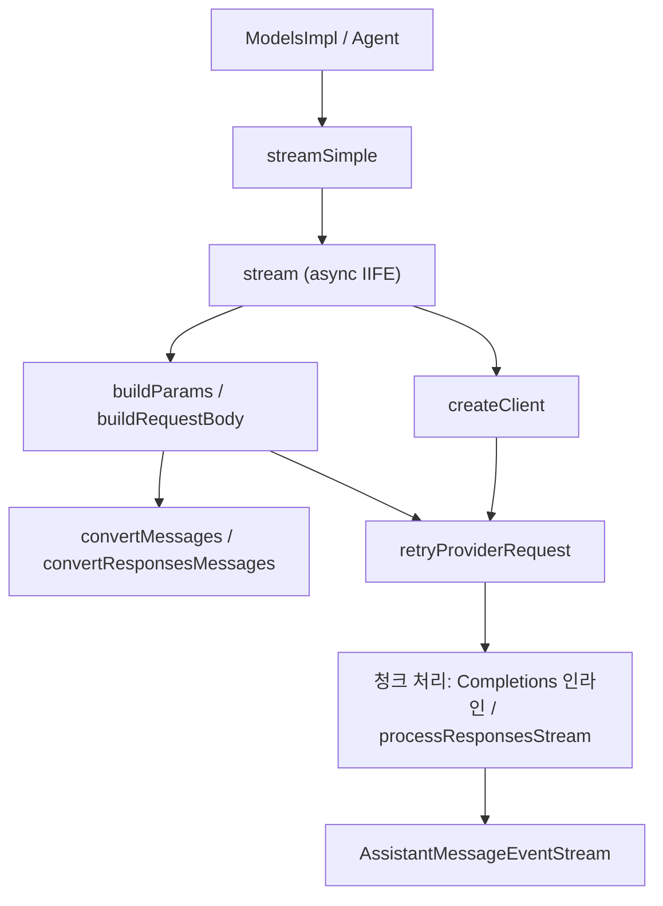
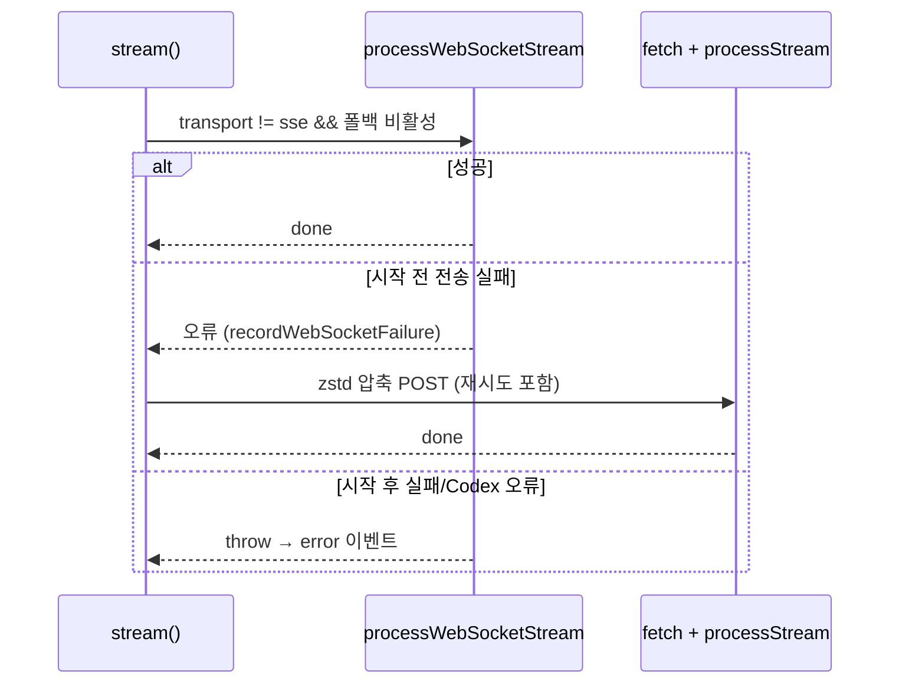

# ai_provider_apis_openai_family

`packages/ai`의 OpenAI 계열 provider API 구현 모듈이다. 4개 파일이 모두 같은 계약(`StreamFunction`)을 구현하며, 상위 모듈 `ai_provider_apis`의 하위 모듈이다. 파일 수가 적고 구조가 동일해 하위 모듈로 쪼개지 않고 이 문서 하나로 설명한다.

| 파일 | `Api` 키 | 대상 |
|---|---|---|
| `packages/ai/src/api/openai-completions.ts` | `openai-completions` | Chat Completions 및 OpenAI 호환 엔드포인트 (OpenRouter, DeepSeek, Z.ai, Together, Moonshot, vLLM, llama.cpp 등) |
| `packages/ai/src/api/openai-responses.ts` | `openai-responses` | OpenAI Responses API (GitHub Copilot, xAI, OpenRouter 포함) |
| `packages/ai/src/api/azure-openai-responses.ts` | `azure-openai-responses` | Azure OpenAI Responses (`AzureOpenAI` 클라이언트) |
| `packages/ai/src/api/openai-codex-responses.ts` | `openai-codex-responses` | ChatGPT Codex 백엔드 (SSE + WebSocket, zstd 압축) |

## 공통 구조

모든 `stream` 함수는 동일한 패턴을 따른다. (검증: 코드 확인)

1. `AssistantMessageEventStream`을 즉시 반환하고, 내부 async IIFE에서 작업한다.
2. `resolveTranscript`로 컨텍스트를 정규화하고 `output: AssistantMessage`(`stopReason: "pending"`)를 만든다.
3. API 키 확인 → `createClient` → `buildParams`(Codex는 `buildRequestBody`) → `options.onPayload`로 페이로드 교체 가능.
4. `retryProviderRequest`(Codex SSE는 자체 재시도 루프)로 요청 → `onResponse` 콜백 → `start` 이벤트.
5. 스트림 이벤트를 `text_*`, `thinking_*`, `toolcall_*` 이벤트로 변환 → `done`.
6. 예외 시 스크래치 버퍼(`partialArgs`, `partialJson`, `customInput`, `streamIndex`)를 제거하고 `stopReason`을 `aborted`/`error`로 설정한 뒤 `error` 이벤트를 push한다.

`streamSimple`은 `SimpleStreamOptions`를 받아 `buildBaseOptions`로 기본 옵션을 만들고, `clampThinkingLevel`로 `reasoning` 수준을 모델이 지원하는 값으로 조정한 뒤(`"off"`는 `undefined`) `stream`에 위임한다.

Responses 계열 3개 파일은 메시지/도구 변환과 이벤트 처리를 `openai-responses-shared.ts`(`convertResponsesMessages`, `convertResponsesTools`, `processResponsesStream`)에 공유한다. Completions는 변환·스트림 처리를 파일 내부에 구현한다.

## openai-completions.ts

가장 큰 호환성 레이어. 핵심은 `getCompat(model)`로, `detectCompat`(provider/baseUrl 자동 감지)에 `model.compat` 명시값을 덮어쓴다.

- `createClient`: `User-Agent`, `model.headers`, GitHub Copilot 동적 헤더, 세션 어피니티 헤더(`x-session-id` 등), 마지막으로 `options.headers` 병합 후 `OpenAI` 클라이언트 생성. API 키가 없어도 `authorization`/`cf-aig-authorization` 헤더가 있으면 `"unused"` 키를 사용한다.
- `buildParams`: `max_tokens` vs `max_completion_tokens`, `stream_options.include_usage`, `store:false`, prompt cache key/retention, 도구 변환(`convertTools`, grammar/strict 지원), 그리고 `thinkingFormat`별 reasoning 파라미터 분기(`zai`, `qwen`, `qwen-chat-template`, `chat-template`, `baseten`, `deepseek`, `openrouter`, `ant-ling`, `together`, `string-thinking`, 기본 OpenAI `reasoning_effort`). `thinkingTokenBudgetField`로 reasoning 예산 상한을 설정한다. 마지막에 `model.samplingParams`, `options.samplingParams`가 덮어쓴다. OpenRouter/Vercel 라우팅 설정과 Anthropic 방식 `cache_control` 주입도 처리한다.
- `convertMessages`: 도구 호출 ID 정규화(`call_id|item_id` 형식을 40자 이하로 sanitize/hash), `developer`/`system` 역할 선택, 이미지 tool result를 별도 user 메시지로 전달, 빈 assistant 메시지 제거, `requiresAssistantAfterToolResult`/`requiresThinkingAsText` 등 호환 플래그 처리.
- 스트리밍: `reasoning_content`/`reasoning`/`reasoning_text` 중 첫 번째 비어있지 않은 필드를 thinking으로 사용. `reasoning_details`는 `appendOpenAIReasoningDetail`로 연속 text/summary 델타를 병합하고 블록 종료 시 `thinkingSignature`에 JSON으로 직렬화한다(재생용). 도구 호출은 `index`/`id`로 블록을 추적하고 `parseStreamingJson`으로 부분 인자를 파싱하며, grammar(custom) 도구는 `customInput`을 별도 버퍼로 처리한다.
- `parseChunkUsage`: `cached_tokens` 위치가 provider마다 다른 점(`prompt_tokens_details.cached_tokens`, `prompt_cache_hit_tokens`, 최상위 `cached_tokens`)을 흡수하고, `input = prompt - cacheRead - cacheWrite`로 계산한 뒤 `calculateCost`를 호출한다.
- `mapStopReason`: `stop/end→stop`, `length`, `tool_calls/function_call→toolUse`, `content_filter/network_error/기타→error`.
- `finish_reason`이 없는 경우: `compat.supportsFinishReason`이 false면 도구 호출 유무로 `toolUse`/`stop`을 추정하고, true면 `"Stream ended without finish_reason"` 오류.

## openai-responses.ts

- `getCompat`: `supportsDeveloperRole`, `supportsAdditionalTools`, `supportsToolSearch`, `supportsExplicitPromptCacheMode`, `supportsMaxOutputTokens` 등 플래그의 기본값을 채운다.
- `buildParams`: `store:false`, `prompt_cache_key`, `max_output_tokens`(최소 16, issue #6265), `service_tier`, reasoning(`effort`, `summary`, `include: reasoning.encrypted_content`). Sign in with ChatGPT 토큰(`isChatGPTSignIn`: openai 기본 URL + `sk-`로 시작하지 않는 키)이면 지원되지 않는 필드를 생략한다.
- `applyServiceTierPricing`: `flex` ×0.5, `priority`/`fast` ×2(`gpt-5.5`는 ×2.5)로 비용을 보정하고 `cost.total`을 재계산한다.
- 오류 시 `subscription_sharing_usage_limit_exceeded`이면 ChatGPT 사용량 URL을 안내한다.

## azure-openai-responses.ts

- `resolveDeploymentName`: `options.azureDeploymentName` → 환경변수 `AZURE_OPENAI_DEPLOYMENT_NAME_MAP`(`modelId=deployment,...`) → `model.id` 순.
- `resolveAzureConfig`/`normalizeAzureBaseUrl`: base URL은 `azureBaseUrl` → `AZURE_OPENAI_BASE_URL` → `azureResourceName`/`AZURE_OPENAI_RESOURCE_NAME` → `model.baseUrl` 순으로 해석. Azure 호스트면 경로를 `/openai/v1`로 보정한다. API 버전 기본값은 `v1`.
- `createClient`는 `AzureOpenAI`를 사용하고, `buildParams`의 `model` 필드에 배포 이름을 넣는다.
- `formatAzureOpenAIError`: 공통 오류 정규화에 `"Azure OpenAI API error"` 접두를 사용한다.

## openai-codex-responses.ts

ChatGPT 백엔드(`https://chatgpt.com/backend-api/codex/responses`)용 가장 복잡한 구현이다.

- 인증: `extractAccountId`가 JWT 페이로드의 `https://api.openai.com/auth`.`chatgpt_account_id`를 추출하여 `chatgpt-account-id` 헤더에 사용(`originator: pi`).
- `buildRequestBody`: 시스템 메시지는 `instructions`로 분리(`includeSystemPrompt:false`), `store:false`, `parallel_tool_calls:true`, `text.verbosity` 기본 `low`, `include: reasoning.encrypted_content`.
- 전송 계층: `transport` 옵션(`auto` 기본, `sse`, `websocket`, `websocket-cached`). WebSocket을 먼저 시도하고 실패 시 SSE로 폴백하며, 세션 단위로 폴백 상태를 기억한다(`recordWebSocketFailure`). `websocket_connection_limit_reached`와 `previous_response_not_found`는 1회 재시도한다. Codex 오류/프로토콜 오류/콜백 오류(`isCodexNonTransportError`)는 폴백하지 않고 그대로 던진다. 전송 실패는 assistant 메시지 diagnostic으로 기록된다.
- WebSocket 연결 캐시: 세션·계정별 연결 재사용(idle 5분, 최대 수명 55분). `useCachedContext`이면 직전 요청과 입력 prefix가 일치할 때 `previous_response_id`와 델타 입력만 전송한다. 디버그 통계는 `getOpenAICodexWebSocketDebugStats`, 정리는 `closeOpenAICodexWebSocketSessions`(`registerSessionResourceCleanup`으로 등록).
- SSE 경로: 본문을 `compressRequestBodyZstd`(Node `zlib.zstdCompressSync`, level 3)로 압축해 `content-encoding: zstd` 전송, 불가하면 평문 JSON. 재시도: `isRetryableError`(429 일부 제외, 5xx, rate-limit 문구), `Retry-After` 해석(`getRetryAfterDelayMs`), 상한 `validateRetryDelayMs`(기본 60초), 기본 `maxRetries`는 0. 오류 응답은 `parseErrorResponse`가 사용량 한도 메시지로 변환한다.
- `processStream`/`processWebSocketStream`: `mapCodexEvents`가 Codex 이벤트(`response.done/incomplete`→`response.completed`, `error`/`response.failed`→`CodexApiError`)를 표준 Responses 이벤트로 정규화하고 `processResponsesStream`에 넘긴다. `resolveCodexServiceTier`는 응답이 `default`일 때 요청한 `flex`/`priority`를 유지한다.

## 의존 관계와 참고

- 타입/비용: `../types.ts`, `../models.ts`(`calculateCost`, `clampThinkingLevel`), 상위 모듈 `ai_models_and_providers`.
- 스트림/유틸: `../utils/event-stream.ts`(`AssistantMessageEventStream`), `provider-retry`, `error-body`, `transcript` — `ai_utils`.
- 인증 및 OAuth 토큰(OpenAI ChatGPT/Codex): `ai_auth`.
- 형제 provider: `ai_provider_apis_anthropic_bedrock`, `ai_provider_apis_google`, `ai_provider_apis_gateways_and_classifiers`. 상위: `ai_provider_apis`.
- 상위 호출자: `ModelRegistry`(`model_and_auth_management`), `Agent`(`agent_runtime`).

검증 수준: 위 내용은 제공된 소스 코드를 직접 읽고 작성했다(코드 확인). `openai-responses-shared.ts`, `constrained-sampling.ts` 등 미제공 파일의 세부 동작은 미확인이다.
