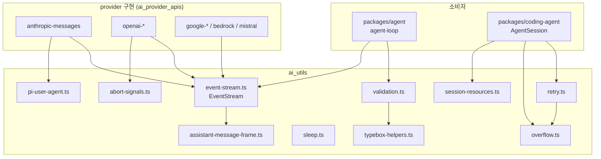
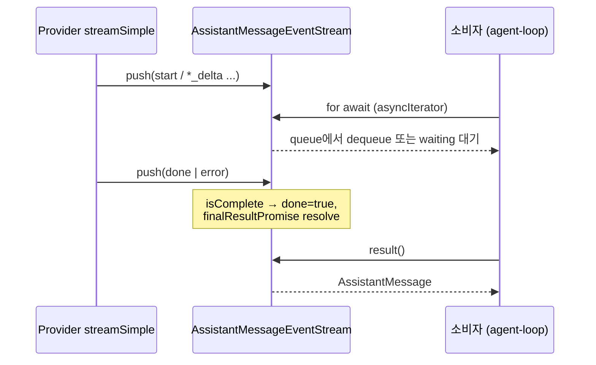
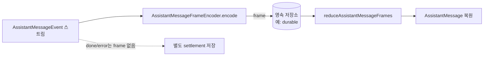
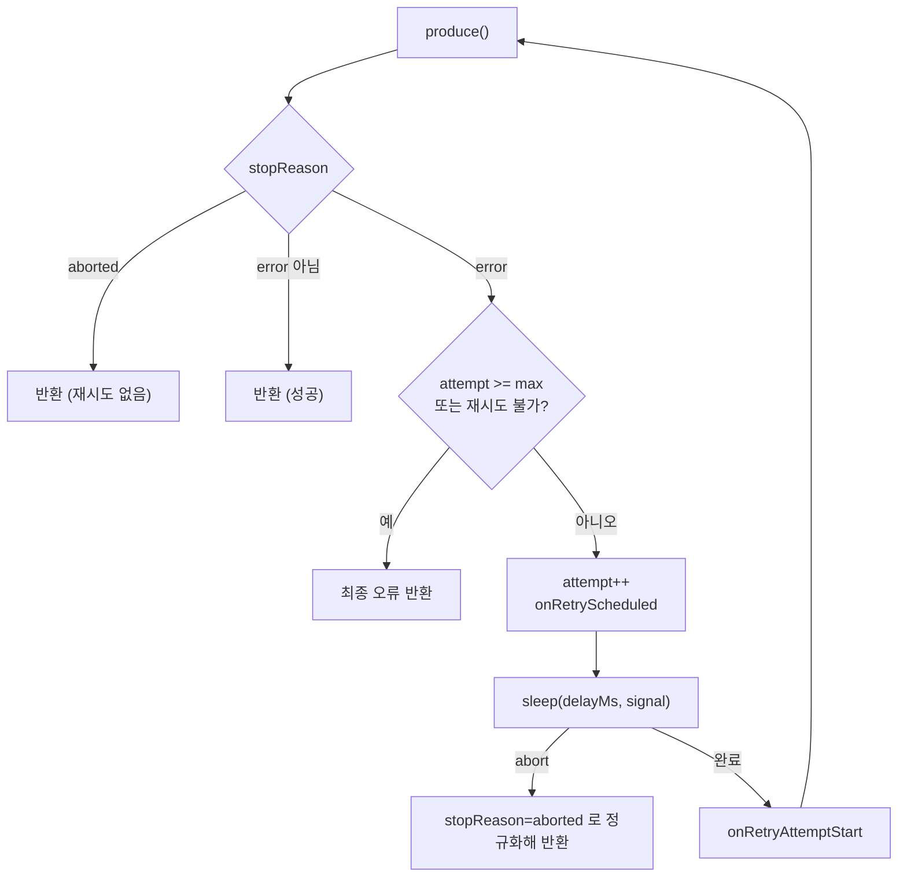

# ai_utils 모듈

`ai_utils`는 `packages/ai`(LLM Provider 추상화 계층) 안에서 모든 provider 구현(`packages/ai/src/api/*`)과 상위 패키지(`packages/agent`, `packages/coding-agent`)가 공유하는 **저수준 유틸리티 모음**이다. 스트림 이벤트 전달, abort 신호 결합, 재시도/컨텍스트 오버플로 분류, tool call 인자 검증, 스트리밍 메시지의 압축 직렬화(frame), 세션 자원 정리 등을 담당한다.

관련 모듈 문서:
- provider 구현: [ai_provider_apis](ai_provider_apis.md)
- 인증: [ai_auth](ai_auth.md)
- 모델/provider 레지스트리: [ai_models_and_providers](ai_models_and_providers.md)
- 빌드/모델 생성: [ai_build_and_model_generation](ai_build_and_model_generation.md)
- 상위 소비자: [agent_runtime](agent_runtime.md), [agent_session_core](agent_session_core.md)

## 구성 요소 개요

| 파일 | 핵심 export | 역할 |
|---|---|---|
| `src/session-resources.ts` | `registerSessionResourceCleanup`, `cleanupSessionResources` | 세션 단위 자원 정리 콜백 레지스트리 |
| `src/utils/abort-signals.ts` | `combineAbortSignals` | 여러 `AbortSignal`을 하나로 결합 |
| `src/utils/event-stream.ts` | `EventStream`, `AssistantMessageEventStream`, `createAssistantMessageEventStream`, `FifoQueue` | push 기반 이벤트를 `AsyncIterable`로 변환 |
| `src/utils/assistant-message-frame.ts` | `AssistantMessageFrameEncoder`, `reduceAssistantMessageFrames` | 스트리밍 assistant 메시지를 재생 가능한 compact frame으로 인코딩/복원 |
| `src/utils/overflow.ts` | `isContextOverflow`, `isRecoverableLength`, `getOverflowPatterns` | provider별 컨텍스트 초과 오류 판별 |
| `src/utils/retry.ts` | `retryAssistantCall`, `isRetryableAssistantError`, `retryDelayMs`, `RetryPolicy`, `buildProviderErrorPattern` | 일시적 오류 분류와 지수 백오프 재시도 |
| `src/utils/sleep.ts` | `sleep` | abort 가능한 sleep |
| `src/utils/validation.ts` | `validateToolCall`, `validateToolArguments` | TypeBox 스키마 기반 tool 인자 검증·강제 변환 |
| `src/utils/typebox-helpers.ts` | `StringEnum` | `anyOf/const`를 쓰지 않는 문자열 enum 스키마 |
| `src/utils/pi-user-agent.ts` | `getPiUserAgent`, `loadNodeOs` | 브라우저 안전한 User-Agent 문자열 |

## 아키텍처

> 참고: 위 의존 방향은 제공된 코드 상 확인되는 관계(`FR`은 `types.ts`의 이벤트 타입과 `json-parse.ts`에 의존, `RT`는 `AssistantMessage`를 입력으로 받음)와 모듈 트리의 역할 분담에서 추정한 것이다. 개별 호출 위치는 소비자 코드로 재검증이 필요하다(추론).

## 컴포넌트 상세

### 1. EventStream (`event-stream.ts`)

provider가 SSE/WebSocket 등에서 받은 이벤트를 `push()`하면, 소비자는 `for await`로 읽고 `result()`로 최종 결과를 받는 구조다.

- `FifoQueue<T>`: 두 개의 배열(`incoming`/`outgoing`)로 구현한 amortized O(1) 큐. `Array.shift()`의 O(n) 비용을 피한다.
- `EventStream<T, R>`
  - `push(event)`: 이미 `done`이면 무시. `isComplete(event)`가 참이면 `done=true`로 만들고 `extractResult`로 최종 Promise를 resolve. 이후 대기 중인 소비자(`waiting`)가 있으면 직접 전달, 없으면 `queue`에 적재.
  - `end(result?)`: 종료 처리. 대기 중인 모든 소비자에게 `done: true`를 전달.
  - `[Symbol.asyncIterator]`: 큐에 값이 있으면 yield, 종료됐으면 return, 아니면 Promise를 `waiting`에 등록하고 대기.
  - `result()`: 최종 결과 Promise.
- `AssistantMessageEventStream`: `done`/`error` 이벤트를 종료로 간주하고, `done`이면 `event.message`, `error`이면 `event.error`를 최종 `AssistantMessage`로 반환. `createAssistantMessageEventStream()`은 확장(extension)에서 쓰기 위한 팩토리.

주의: `error` 이벤트도 reject가 아니라 `AssistantMessage`(`stopReason: "error"`)로 resolve된다. 따라서 `result()`는 오류 시에도 throw하지 않는다(코드 확인).

### 2. Assistant message frame (`assistant-message-frame.ts`)

스트리밍 중인 assistant 메시지를 저장/재생하기 위한 **compact 이벤트 표현**이다. 터미널 상태(`done`/`error`)는 의도적으로 제외되며 별도로 저장해야 한다.

Frame 타입: `start`, `text_*`, `thinking_*`, `toolcall_start/checkpoint/delta/end`.

**`AssistantMessageFrameEncoder.encode(event)`**
- `partial`이 공유 live accumulator이므로, 큐에 있던 오래된 이벤트를 나중에 소비해도 이미 `partial`에 반영된 delta를 중복 재생하지 않도록 블록별 오프셋(`coveredChars`, `deltaChars`)을 유지한다. 텍스트/thinking delta는 `uncovered` 부분만 내보낸다.
- tool call은 `toolcall_start` 시점의 인자 스냅샷과 이후 JSON delta 스트림을 맞추기 위해 `caughtUp` 상태 머신을 사용한다. 스냅샷과 delta 누적 파싱 결과가 일치(또는 `isJsonPrefix`로 prefix 관계)하면 누적 JSON을 `toolcall_checkpoint` 하나로 내보내고 이후 delta는 그대로 전달한다.
- 순서 위반(중복 `start`, 터미널 이후 이벤트, 시작 전 delta, 블록 종류 불일치 등)은 즉시 `Error`를 던진다.

**`reduceAssistantMessageFrames(frames)`**
- frame을 mutate하지 않고 `structuredClone`으로 `AssistantMessage`를 복원한다. start frame이 없으면 `undefined`.
- 블록은 `contentIndex`가 `message.content.length`와 같을 때만 추가 가능(간격/중복 금지).
- 종료되지 않은 tool call은 누적된 `json`을 `parseStreamingJson`으로 파싱해 부분 인자를 채운다.

사용처(예: [durable_harness](durable_harness.md)의 영속화)는 코드로 확인하지 않았다(미확인).

### 3. `combineAbortSignals` (`abort-signals.ts`)

`{ signal?, cleanup }`를 반환한다.
- 유효 신호 0개: signal 없음, no-op cleanup.
- 1개: 그대로 반환.
- 2개 이상: 새 `AbortController`를 만들고 각 신호의 `abort`에 once 리스너를 단다. 이미 abort된 신호가 있으면 즉시 reason을 전파하고 `break`. 호출자는 완료 후 `cleanup()`으로 리스너를 제거해야 누수를 막을 수 있다.

### 4. `sleep` (`sleep.ts`)

`sleep(ms, signal)`: 시작 시 `signal.throwIfAborted()`, 대기 중 abort되면 타이머를 정리하고 `signal.reason`으로 reject. signal이 필수 인자다. 참고로 `retry.ts`는 signal이 선택적인 자체 `sleep`(내부, `RetrySleepAbortError` 사용)을 따로 가진다.

### 5. 컨텍스트 오버플로 (`overflow.ts`)

`isContextOverflow(message, contextWindow?)`는 세 경우를 판정한다.
1. **오류 메시지 매칭**: `stopReason === "error"`이며 `OVERFLOW_PATTERNS`(Anthropic, OpenAI, Google, xAI, Groq, OpenRouter, Mistral, llama.cpp 등) 중 하나에 일치. 단 `NON_OVERFLOW_PATTERNS`(Bedrock throttling 접두사, rate limit, too many requests)에 걸리면 제외. Cerebras는 본문 없는 400/413을 별도 패턴으로 처리.
2. **Silent overflow**: `contextWindow`가 주어지고 `stopReason === "stop"`인데 `usage.input + usage.cacheRead > contextWindow` (z.ai 유형).
3. **Length-stop overflow**: `stopReason === "length"`, `usage.output === 0`, 입력이 `contextWindow * 0.99` 이상 (Xiaomi MiMo 유형).

`isRecoverableLength(message, desiredMaxOutput)`: length 종료가 의도한 출력 한도 미만에서 발생했는지 확인해 compact 후 1회 재시도 여지를 판단한다. `getOverflowPatterns()`는 테스트용 복사본을 반환한다.

새 provider 지원은 `OVERFLOW_PATTERNS`에 정규식을 추가하는 방식이다.

### 6. 재시도 (`retry.ts`)

- `isRetryableAssistantError(message)`: `stopReason === "error"`이고 메시지가 `RETRYABLE_PROVIDER_ERROR_PATTERN`(과부하, 429/5xx, 네트워크 오류, WebSocket 종료, 스트림 조기 종료 등)에 일치하며 `NON_RETRYABLE_PROVIDER_LIMIT_ERROR_PATTERN`(quota, billing, 구독 한도 등)에 일치하지 않을 때 true. `buildProviderErrorPattern`은 문자열 목록을 `|`로 이어 대소문자 무시 정규식으로 만드는 헬퍼.
- `retryDelayMs(policy, attempt)`: `baseDelayMs * 2^(attempt-1)`, 안전 정수 초과 시 `MAX_SAFE_INTEGER`, `maxAgentDelayMs`(기본 `60_000`)로 상한.
- `retryAssistantCall(produce, policy, signal, callbacks?)`: 아래 흐름.

정책이 없거나 `enabled`가 false이면 `produce()` 결과를 그대로 반환한다. 컨텍스트 오버플로는 호출자가 먼저 별도 처리해야 한다는 것이 문서화된 계약이다.

### 7. Tool 인자 검증 (`validation.ts`)

`validateToolCall(tools, toolCall)`은 이름으로 tool을 찾고(없으면 `Tool "..." not found`) `validateToolArguments`에 위임한다.

`validateToolArguments` 처리 순서:
1. `structuredClone`으로 인자 복사.
2. `normalizeOptionalNulls`: 선택 속성이 `null`이고 스키마가 null을 허용하지 않으면 키 삭제.
3. `Value.Convert`(TypeBox 변환).
4. 스키마가 TypeBox 객체가 아닌 순수 JSON Schema(`TypeBox.Kind` 심볼 없음)이면 `coerceWithJsonSchema`로 추가 강제 변환(문자열→숫자/불리언, `anyOf`/`oneOf`/`allOf` 처리, 중첩 object/array).
5. 컴파일된 validator(`WeakMap` 캐시, 스키마 객체 identity 기준)로 `Check`. 실패 시 경로(`a.b.c`)별 오류 목록과 원본 인자를 포함한 `Error`를 던진다.

LLM이 `"5"`처럼 잘못된 타입을 내놓아도 가능한 한 복구하고, 복구 불가능할 때만 구조화된 오류를 모델에 돌려줄 수 있게 한다(설계 의도는 추론).

### 8. 기타

- `StringEnum(values, {description, default})`: `Type.Unsafe({type:"string", enum})`로 만든 스키마. Google 등 `anyOf/const`를 지원하지 않는 provider와 호환된다.
- `getPiUserAgent()`: `process.getBuiltinModule("node:os")`로 OS 정보를 가져와 `pi (platform release; arch)`를, 브라우저면 `pi (browser)`를 반환. 최상위 `import "node:os"`가 브라우저/Vite 빌드를 깨기 때문에 이 방식을 쓴다(코드 주석). `packages/coding-agent/src/utils/pi-user-agent.ts`에 동명의 파일이 별도로 있다.
- `registerSessionResourceCleanup(cleanup)`: 모듈 전역 `Set`에 콜백을 등록하고 해제 함수를 반환. `cleanupSessionResources(sessionId?)`는 모든 콜백을 실행하되 한 콜백이 실패해도 계속 진행하고, 실패가 있으면 마지막에 `AggregateError`를 던진다. provider가 세션별로 잡는 자원(예: `openai-codex-responses`의 WebSocket 세션 — `closeOpenAICodexWebSocketSessions` 존재)을 정리하는 용도로 보이나, 등록 지점은 직접 확인하지 않았다(추론).

## 설계 포인트

- **브라우저 호환**: Node 전용 모듈을 최상위 import하지 않는다 (`pi-user-agent.ts`).
- **실패 격리**: 정리 콜백은 하나가 실패해도 나머지를 실행한다.
- **오류를 값으로**: 스트림/재시도 모두 오류를 `AssistantMessage`로 표현해 호출자 분기를 단순화한다.
- **패턴 기반 분류**: overflow/retry 판정은 provider 오류 문자열 정규식에 의존하므로 provider 문구 변경에 취약하다. 새 provider는 패턴 추가가 필요하다.

## 빌드·테스트 참고

이 모듈은 `packages/ai`의 일부이며 빌드/테스트 스크립트는 `packages/ai/package.json`, `packages/ai/tsconfig.build.json`, `packages/ai/vitest.config.ts`에 있다. 자세한 내용은 [ai_build_and_model_generation](ai_build_and_model_generation.md)을 참고한다. (이 문서 작성 중 해당 파일은 열람하지 않았다.)
