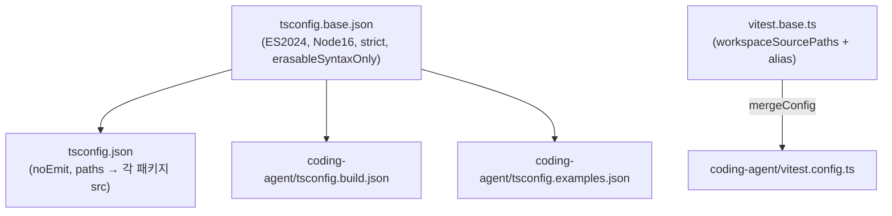
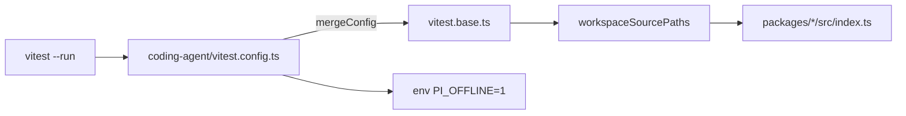
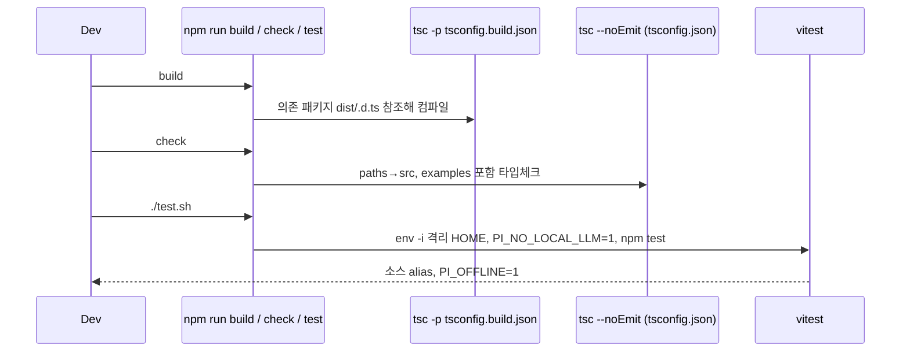

# build_and_test_config

`packages/coding-agent`의 TypeScript 빌드/예제 타입체크/Vitest 설정을 담당하는 모듈이다. 세 파일로 구성된다.

| 파일 | 역할 |
|---|---|
| `packages/coding-agent/tsconfig.build.json` | 배포용 컴파일(`dist/` 출력). 형제 패키지는 **빌드된 `.d.ts`**를 참조 |
| `packages/coding-agent/tsconfig.examples.json` | `examples/**/*.ts` 타입체크 전용(`noEmit`). 형제 패키지는 **소스**를 참조 |
| `packages/coding-agent/vitest.config.ts` | 단위 테스트 설정. 워크스페이스 패키지를 **소스**로 alias, 기본 오프라인 |

상위 맥락: 루트 빌드/체크 스크립트는 [root_build_config](root_build_config.md), 공통 tsconfig·테스트 래퍼는 [workspace_build_and_scripts](workspace_build_and_scripts.md), 패키징은 [coding_agent_packaging](coding_agent_packaging.md), CI는 [ci_workflows](ci_workflows.md) 참고. 대상 코드는 [agent_session_core](agent_session_core.md), [cli_bootstrap_and_config](cli_bootstrap_and_config.md) 등이 속한 `packages/coding-agent`이다.

## 1. 설정 계층 구조



### 공통 기반 (`tsconfig.base.json`)
`target/lib: ES2024`, `module/moduleResolution: Node16`, `strict`, `erasableSyntaxOnly`(Node strip-only 호환; `enum`, parameter property 금지 — `AGENTS.md` 규칙과 일치), `verbatimModuleSyntax`, `allowImportingTsExtensions` + `rewriteRelativeImportExtensions`(소스에서 `.ts` 확장자 import → 출력 시 `.js`로 재작성), `declaration`/`sourceMap`/`inlineSources`.

## 2. `tsconfig.build.json`

- `outDir: ./dist`, `rootDir: ./src`, `include: src/**/*.ts, src/**/*.d.ts`.
- **`paths`**: `@earendil-works/chord`, `pi-agent-core`, `pi-ai`, `pi-tui`를 `../<pkg>/dist/*.d.ts`로 매핑한다. 즉 coding-agent를 컴파일하려면 의존 패키지가 **먼저 빌드**되어 있어야 한다. 루트 `build` 스크립트가 `chord → tui → telemetry → codemode → mcp → ai → durable → agent → protocol → client → server → coding-agent` 순서로 실행하는 이유다.
- 와일드카드 매핑: `pi-ai/*` → `ai/dist/*.d.ts`, `ai/dist/providers/*.d.ts`; `pi-tui/*` → `tui/dist/*.d.ts`, `tui/dist/components/*.d.ts`.
- **`exclude`**: `src/client`, `src/experimental`, `src/cli/experimental`. 실험적 서버/클라이언트 런타임([experimental_cli](experimental_cli.md) 등)은 npm 산출물에서 제외된다. `packages/coding-agent/package.json`의 `files`에서도 `!dist/client`, `!dist/experimental`, `!dist/cli/experimental`로 동일하게 제외하며, `exports`의 `./client`, `./experimental/plugin`은 `source` 조건으로만 노출된다.

사용처(`packages/coding-agent/package.json`):

```text
build:unbundled = tsc -p tsconfig.build.json && chmod +x dist/cli.js dist/rpc-entry.js && npm run copy-assets
build           = build:unbundled && node ../../scripts/build-coding-agent-bundle.mjs
build:binary    = (tui, telemetry, ai, agent, protocol, client 빌드) → build → bun build --compile → copy-binary-assets
```

## 3. `tsconfig.examples.json`

- `noEmit: true`, `skipLibCheck: true`, `include: examples/**/*.ts`.
- `paths`가 `pi-coding-agent`, `pi-coding-agent/hooks`, `pi-tui`, `pi-ai`를 **`src/index.ts`**로 매핑하고 `typebox`를 `../../node_modules/typebox`로 고정한다. → 예제는 빌드 없이 소스 기준으로 타입체크된다.
- 루트 `tsconfig.json`도 `packages/coding-agent/examples/**/*`를 include 하므로(단 `gondolin` 예제는 exclude) `npm run check`의 `tsc --noEmit`에서 검증된다.

## 4. `vitest.config.ts`

`../../vitest.base.ts`의 기본 설정에 `mergeConfig`로 덮어쓴다.

| 옵션 | 값 / 의미 |
|---|---|
| `globals: true`, `environment: "node"` | `describe/it` 전역, Node 환경 |
| `testTimeout: 30000` | 30초 |
| `env: { PI_OFFLINE: "1" }` | 테스트는 기본 오프라인. 네트워크가 필요하면 `test/test-network-env.ts`의 `allowNetwork()`로 opt-in |
| `unstubEnvs: true` | 테스트 후 `vi.stubEnv` 자동 복원 |
| `reporters` | `GITHUB_ACTIONS`면 `dot` + `github-actions`, 아니면 `dot` |
| `silent: "passed-only"` | 통과한 테스트의 출력 억제 |
| `server.deps.external` | `@silvia-odwyer/photon-node`(wasm)를 번들링하지 않고 외부 처리 |
| `resolve.alias` | 아래 참조 |

### Alias 전략
`vitest.base.ts`의 `workspaceSourcePaths`가 chord/telemetry/mcp/ai/agent/codemode/protocol/client/server/tui 등의 `src` 진입점을 정의하고, 기본 alias로 `@earendil-works/*` 패키지를 소스에 연결한다. coding-agent 설정은 추가로:

- `@earendil-works/pi-ai`, `pi-agent-core` → 소스 진입점 재확인
- 레거시 스코프 `@mariozechner/pi-ai`, `pi-ai/oauth`, `pi-agent-core`, `pi-tui` → 동일 소스로 매핑(이전 패키지명으로 작성된 확장/테스트 호환; 의도는 **추론**)

따라서 테스트는 의존 패키지를 빌드하지 않고도 실행된다 (빌드 설정과 대조적).



## 5. 실행 흐름



`test.sh`는 임시 HOME/XDG/npm 설정을 만들고 `env -i`로 환경을 비운 뒤 `npm test`를 실행하여 API 키 없이 격리 테스트한다. `.github/workflows/ci.yml`의 `build-check-test`는 `npm ci --ignore-scripts` → `npm run build` → `npm run check` → `npm test`를 수행한다. `packages/agent/vitest.config.ts`는 대조적으로 `conditions: ["source"]`와 자체 alias를 사용한다 ([agent_runtime](agent_runtime.md)).

## 6. 유지보수 시 주의

- 새 워크스페이스 패키지 추가 시: `tsconfig.build.json`(dist 기준), `tsconfig.json`(src 기준), `vitest.base.ts`(alias) 세 곳의 매핑을 맞춘다.
- 실험적 디렉터리를 새로 만들면 `tsconfig.build.json`의 `exclude`와 `package.json`의 `files`를 함께 갱신한다.
- 테스트에서 네트워크가 필요하면 `PI_OFFLINE=1`을 우회하지 말고 `allowNetwork()`를 사용한다. 전체 vitest 직접 실행 대신 `./test.sh`를 쓴다 (`repos/pi/AGENTS.md`).

검증 수준: 위 내용은 제공된 설정 파일, `tsconfig.base.json`, `tsconfig.json`, `vitest.base.ts`, `package.json`, `test.sh`, `ci.yml`을 직접 읽어 확인한 **코드 확인**이며, 레거시 스코프 alias의 의도만 **추론**이다.
