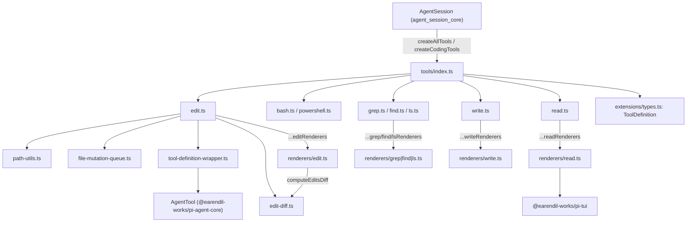
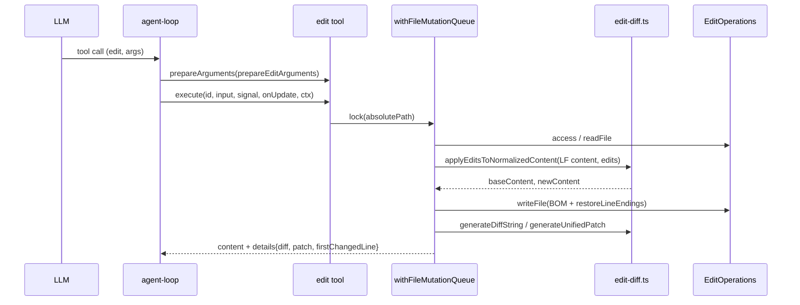

# builtin_tools 모듈

`packages/coding-agent/src/core/tools/` 아래의 **내장 코딩 도구(read, bash, powershell, edit, write, grep, find, ls)** 를 정의·생성·렌더링하는 모듈이다. 이 문서는 제공된 핵심 컴포넌트(`index.ts`, `edit.ts`, `edit-diff.ts`, `path-utils.ts`, `tool-definition-wrapper.ts`, `renderers/*.ts`)를 기준으로 하며, `bash.ts`·`read.ts`·`write.ts`·`find.ts`·`grep.ts`·`ls.ts`·`truncate.ts`·`render-utils.ts`·`file-mutation-queue.ts` 본문은 제공되지 않았으므로 import/export 관계로만 서술한다(미확인).

## 1. 목적과 역할

- LLM이 호출하는 도구를 `ToolDefinition`(프롬프트 메타데이터 + 스키마 + `execute` + 렌더러)으로 정의한다.
- `ToolDefinition`을 코어 런타임이 쓰는 `AgentTool`([agent_runtime](agent_runtime.md))로 변환한다.
- 도구 실행(로컬 FS 접근)과 표시(TUI 렌더링)를 파일 단위로 분리한다.
- 확장 시스템([extension_system](extension_system.md))이 정의한 `ToolDefinition`/`ExtensionContext` 타입을 사용한다.

## 2. 아키텍처

핵심 설계: 각 도구 파일은 `ToolDefinition`을 만들 때 해당 `renderers/*.ts`의 객체를 spread(`...editRenderers`)한다. 렌더러가 별도 파일이므로 "출력만 표시하는 프로세스"(예: 원격 클라이언트, [experimental_services_and_client](experimental_services_and_client.md))는 실행 경로와 typebox 스키마를 로드하지 않아도 된다(renderers 파일 헤더 주석, 코드 확인).

## 3. 컴포넌트

### 3.1 `index.ts` — 팩토리와 레지스트리

| 항목 | 설명 |
|---|---|
| `ToolName` / `allToolNames` | `read, bash, powershell, edit, write, grep, find, ls` |
| `ToolsOptions` | 도구별 옵션(각 `*ToolOptions`, 예: 원격 실행용 `operations`) |
| `createToolDefinition(name, cwd, options)` / `createTool(...)` | 이름으로 단일 `ToolDefinition` / `AgentTool` 생성, 알 수 없으면 `Error` |
| `createCodingToolDefinitions` / `createCodingTools` | 기본 세트: `read, bash, edit, write` |
| `createReadOnlyToolDefinitions` / `createReadOnlyTools` | 읽기 전용 세트: `read, grep, find, ls` |
| `createAllToolDefinitions` / `createAllTools` | `Record<ToolName, ...>` 전체(powershell 포함) |

`createTool*` 계열은 모두 `cwd`를 받아 클로저로 캡처한다. 단 `edit.ts`의 `execute`는 `ctx?.cwd || cwd`로 호출 컨텍스트의 cwd를 우선한다. 또한 `truncate.ts`(`truncateHead/Tail/Line`, `DEFAULT_MAX_BYTES/LINES`, `formatSize`)와 `withFileMutationQueue`를 재export한다.

### 3.2 `tool-definition-wrapper.ts`

- `wrapToolDefinition(definition, ctxFactory?)`: 필드(`name, label, description, parameters, outputSchema, constrainedSampling, prepareArguments, executionMode`)를 복사하고 `execute`에서 `ctx ?? ctxFactory?.(toolCallId, signal)`를 `definition.execute`에 전달한다. 렌더러·프롬프트 메타데이터는 `AgentTool`로 넘어가지 않는다.
- `wrapToolDefinitions(defs, ctxFactory?)`: 배열 map.
- `createToolDefinitionFromAgentTool(tool)`: 역방향. 순수 `AgentTool` 오버라이드를 `AgentSession` 내부의 definition-first 레지스트리에 넣기 위한 최소 `ToolDefinition` 합성(ctx는 전달하지 않음).

### 3.3 `edit.ts` — edit 도구

- 스키마: `{ path, edits: [{ oldText, newText }] }`. `constrainedSampling: { type: "json_schema", strict: "prefer" }`, `renderShell: "self"`.
- `prepareEditArguments`(모듈 내부 함수, `prepareArguments`로 등록): 모델별 출력 편차를 정규화한다.
  - `edits`가 JSON 문자열이면 파싱(배열 또는 단일 객체 → 배열화). 파싱 실패는 무시.
  - `edits`가 단일 `{oldText,newText}` 객체면 배열로 감싼다.
  - 최상위 레거시 `oldText/newText`가 있으면 `edits`에 추가하고 최상위 필드 제거.
- `EditOperations`(`readFile/writeFile/access`)를 주입 가능 → SSH 등 원격 위임 지점. 기본값은 `fs/promises`.
- `execute` 흐름: `validateEditInput` → `resolveToCwd` → `withFileMutationQueue(absolutePath, ...)` 안에서 access → read → BOM 분리(`splitBom`) → 줄바꿈 감지/LF 정규화 → `applyEditsToNormalizedContent` → BOM·원래 줄바꿈 복원 후 write → `generateDiffString` + `generateUnifiedPatch`로 `details`(`diff, patch, firstChangedLine`) 반환.
- 중단 처리: abort 이벤트로 reject하지 않고 각 `await` 뒤 `signal.aborted`를 검사한다. 진행 중인 FS 작업이 끝나기 전에 뮤테이션 큐 잠금이 풀리는 것을 막기 위함(코드 주석).

### 3.4 `edit-diff.ts` — 매칭·diff 엔진

- 줄바꿈/정규화: `detectLineEnding`, `normalizeToLF`, `restoreLineEndings`, `normalizeForFuzzyMatch`(NFKC, 줄 끝 공백 제거, 스마트 따옴표/각종 대시/특수 공백을 ASCII로).
- `fuzzyFindText`: 정확 일치 우선, 실패 시 정규화 공간에서 일치.
- `applyEditsToNormalizedContent(content, edits, path)`:
  1. `oldText` 빈 값 거부.
  2. 모든 edit을 **같은 원본**에 대해 매칭(순차 적용 아님). 하나라도 fuzzy면 전체를 정규화 공간에서 수행.
  3. 미발견/중복(정규화 기준 2회 이상)/겹침/무변경 시 각각 명시적 `Error`.
  4. 뒤에서부터 치환해 오프셋 유지. fuzzy였다면 `applyReplacementsPreservingUnchangedLines`로 건드린 줄만 정규화본으로 쓰고 나머지 줄은 원본 바이트를 보존(줄 수가 다르면 에러).
- `generateDiffString`(줄 번호·컨텍스트 4줄 표시용 diff + `firstChangedLine`), `generateUnifiedPatch`(`diff` 패키지).
- `computeEditsDiff` / `computeEditDiff`: 파일을 쓰지 않고 미리보기 diff 계산, 실패는 throw 대신 `{ error }` 반환. TUI 렌더러가 사용한다.

### 3.5 `path-utils.ts`

- `expandPath`: `normalizePath(..., { normalizeUnicodeSpaces, stripAtPrefix })`(`~` 확장 포함, `utils/paths.ts` 위임).
- `resolveToCwd(path, cwd)`: cwd 기준 절대 경로화(`@` 접두사 제거).
- `resolveReadPath` / `resolveReadPathAsync`: 존재하지 않을 때 macOS 변형을 순차 시도 — AM/PM 앞 narrow no-break space, NFD 정규화, 곡선 따옴표(U+2019), NFD+곡선 따옴표. 모두 실패하면 원래 경로 반환.
- `pathExists`.

### 3.6 `renderers/*.ts` — 표시 계층

각 파일은 `Pick<ToolDefinition, "renderCall" | "renderResult">` 객체를 export한다(`editRenderers`, `findRenderers`, `grepRenderers`, `lsRenderers`, `readRenderers`, `writeRenderers`). 모두 `context.lastComponent`를 재사용해 컴포넌트를 갱신한다.

| 렌더러 | 특징 |
|---|---|
| edit | `Box` 기반. `argsComplete`가 되면 `computeEditsDiff`로 비동기 미리보기 계산 → `invalidate()`. 배경색은 pending/success/error. 결과 diff가 미리보기와 다를 때만 `renderDiff`로 추가 표시. `file_path`/`path`와 레거시 `oldText/newText` 인자 모두 수용 |
| read | 접힘 시 결과 비표시. `SKILL.md`, pi 문서(`README.md`, `docs/`, `examples/`), `AGENTS.md`/`CLAUDE.md` 계열은 compact 호출 표시. 확장 시 언어별 `highlightCode`, 잘림 경고(`[Truncated: ...]`) |
| write | 인자 스트리밍 중 증분 하이라이트 캐시(`updateWriteHighlightCacheIncremental`, 앞 50줄 재하이라이트), 인자 완료 시 전체 재구성. 접힘 10줄 |
| grep / find / ls | `Text` 한 개로 호출/결과 포맷. 접힘 줄 수 grep 15, find·ls 20. `matchLimitReached` / `resultLimitReached` / `entryLimitReached` / `truncation`을 경고로 표시 |

공통 헬퍼(`render-utils.ts`의 `str`, `renderToolPath`, `getTextOutput` 등)와 `keyHint("app.tools.expand")`는 [interactive_message_components](interactive_message_components.md) 및 [settings_and_keybindings](settings_and_keybindings.md)와 연결된다. 모델이 strict 스키마 때문에 생략 필드에 `null`을 보내는 경우를 `read` 렌더러가 `== null`로 처리한다.

## 4. 의존 관계

- 상위 소비자: `AgentSession`([agent_session_core](agent_session_core.md))이 도구 세트를 만들고 [extension_system](extension_system.md)의 `ToolCallEvent`/`ToolResultEvent`(`EditToolCallEvent` 등 도구별 타입)로 훅을 건다.
- 타입 의존: `ToolDefinition`, `ExtensionContext`, `ToolRenderResultOptions` (`core/extensions/types.ts`), `AgentTool` ([agent_runtime](agent_runtime.md)).
- UI 의존: `@earendil-works/pi-tui`([tui_components](tui_components.md)), `modes/interactive/theme/theme.ts`, `components/diff.ts`([interactive_theme](interactive_theme.md)).
- 유사 구현: `packages/durable/src/tools/{edit,edit-diff,read,write,bash}.ts`는 같은 편집 로직의 별도 구현이다([durable_tools](durable_tools.md)). 두 구현의 동기화 여부는 미확인.

## 5. 확장 지점과 유의사항

- **원격 실행**: 각 도구의 `*Operations`(`EditOperations` 등)를 `ToolsOptions`로 주입.
- **프롬프트 기여**: `promptSnippet`, `promptGuidelines`(`editToolSystemPromptContribution`)가 시스템 프롬프트([agent_session_core](agent_session_core.md)의 `buildSystemPrompt`)에 반영되는 것으로 보이나 소비 코드는 미확인(추론).
- **동시성**: 같은 파일에 대한 edit은 `withFileMutationQueue`로 직렬화된다.
- **`createAllTools`에 `powershell` 포함**: 플랫폼별 노출 정책은 호출 측 책임(미확인).
- `edit-diff.ts`는 `diff`(jsdiff) 패키지, `utils/text.ts`의 `splitBom`에 의존한다.
- 저장소 규칙(`AGENTS.md`): 인라인 import 금지, erasable TypeScript 문법만 사용.
