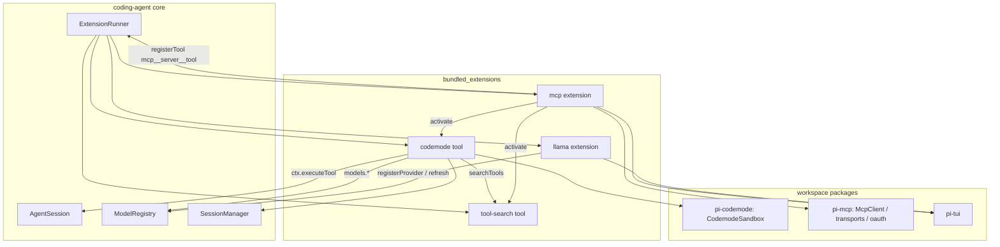
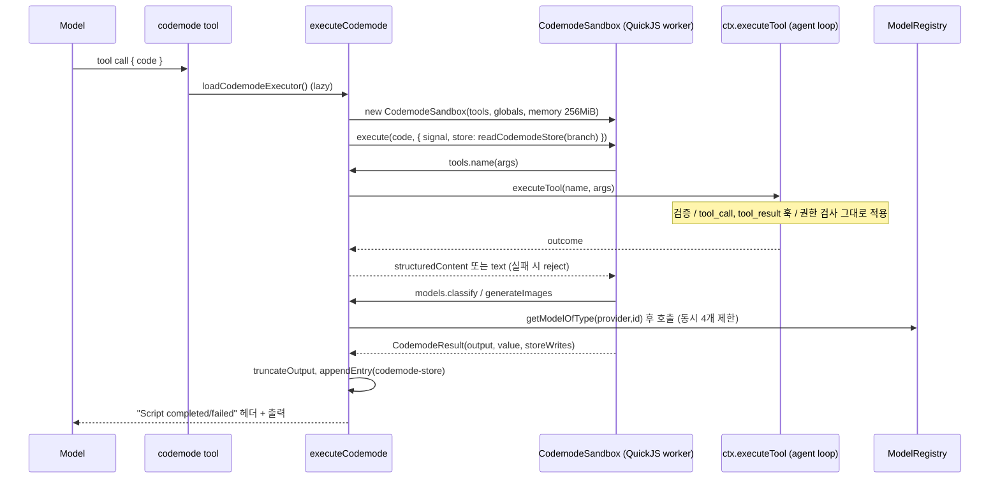
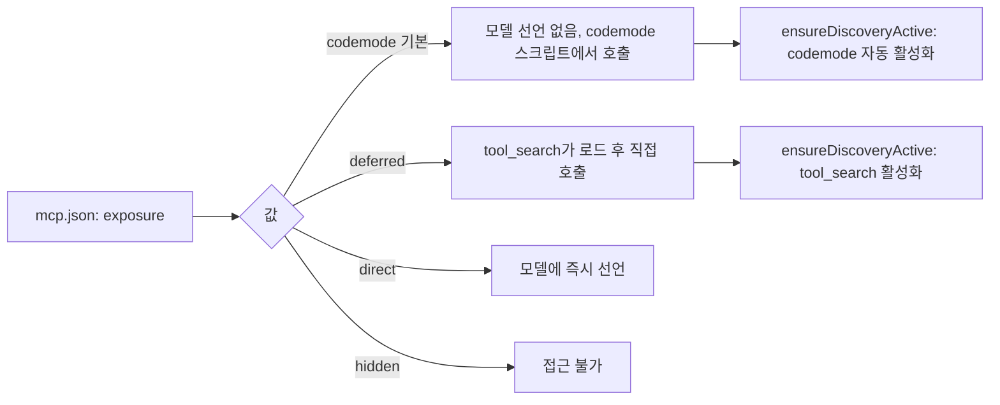
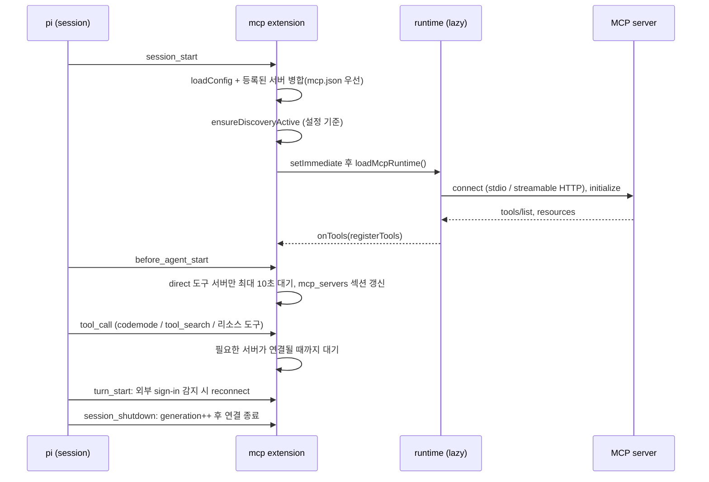
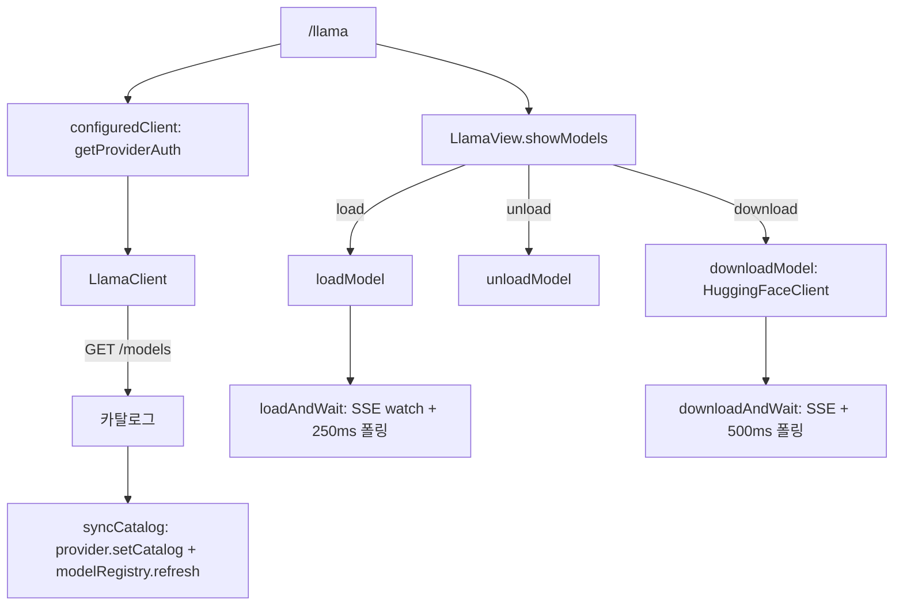

# bundled_extensions

`packages/coding-agent/src/extensions/` 아래에 있는, coding-agent에 기본 탑재된 확장(extension) 모음이다. 모두 일반 확장과 같은 `ExtensionAPI`(`pi.registerTool`, `pi.registerCommand`, `pi.registerProvider`, `pi.on(...)`)만 사용한다. 즉 코어가 특별 취급하지 않고, 확장 시스템 위에서 동작하는 "내장 확장"이다.

| 확장 | 역할 | 진입점 |
|---|---|---|
| `codemode` | 모델이 JavaScript를 작성해 다른 도구를 호출(QuickJS 샌드박스) | `tool.ts::createCodemodeTool` |
| `mcp` | MCP 서버 연결, 도구/리소스 등록, OAuth 로그인, `/mcp` 관리 UI | `mcp/index.ts::createMcpExtension` |
| `tool-search` | BM25 기반 도구 검색 및 지연(deferred) 도구 로드 | `tool-search/tool.ts` |
| `llama` | llama.cpp 라우터 서버의 모델 로드/언로드/다운로드 관리(`/llama`) | `llama/index.ts::llamaExtension` |

관련 문서: 확장 런타임/이벤트는 [extension_system](extension_system.md), 내장 도구는 [builtin_tools](builtin_tools.md), MCP 프로토콜 클라이언트는 [mcp](mcp.md), 샌드박스 런타임은 [codemode](codemode.md), 에이전트 루프는 [agent_runtime](agent_runtime.md), 세션 저장은 [session_persistence_and_compaction](session_persistence_and_compaction.md), 모델 레지스트리는 [model_and_auth_management](model_and_auth_management.md), TUI는 [tui_components](tui_components.md)를 참고한다.

## 1. 아키텍처

핵심 설계: MCP 도구는 기본적으로 모델의 도구 선언에 넣지 않는다(`exposure: "codemode"`). 대신 codemode 스크립트가 `searchTools()`로 찾아 호출하거나, `deferred`이면 `tool_search`가 로드한다. 이렇게 하면 서버가 많아도 프롬프트가 커지지 않고, 서버 연결/변경 시 도구 선언이 바뀌지 않아 프롬프트 캐시가 유지된다.

## 2. codemode

### 2.1 파일 구성
- `tool.ts`: 도구 정의, 설명문 생성, loadout 준비.
- `execute.ts`: 스크립트 1회 실행. `execute.lazy.ts`를 통해 지연 로딩되어 샌드박스(worker, QuickJS wasm)는 첫 호출 때만 로드된다.
- `renderer.ts`: TUI 표시(`renderCall`, `renderResult`).

### 2.2 도구 정의 (`tool.ts`)
- 입력은 `{ code: string }` 하나. 원시 JS 소스이며 첫 줄에 `// @options: {"max_output_tokens":..., "timeout_ms":...}`를 둘 수 있다(`parseCodemodeSource`).
- `exposure: "model-only"`: 스크립트가 다른 스크립트를 시작할 수 없다. `getCodemodeCallableTools`는 자기 자신을 제외한다.
- `constrainedSampling`: grammar(`CODEMODE_SOURCE_GRAMMAR`, openai_lark 변형)로 JSON 이스케이프 없이 원시 텍스트를 쓰게 한다.
- `isCodemodeTool`: 다른 확장의 동명 도구와 구분하기 위해 `parameters === codemodeSchema` 참조 동일성을 비교한다.
- `createCodemodeDescription`: 호출 가능한 도구의 TypeScript 선언을 설명에 넣는다. `selectCatalog`가 토큰 예산(`DEFAULT_CODEMODE_INLINE_BUDGET = 3000`, 문자/4 추정) 안에서 그룹(네임스페이스 없음 → 네임스페이스 이름순)별로 가장 싼 도구부터 라운드로빈 배치한다. `deferred` 도구는 설명에 영향을 주지 않는다.
- `prepareLoadout` (`prepareCodemodeLoadout`): `codemode.mode` 설정에 따라 동작.
  - `on`: 선언된 도구의 설명에 "스크립트에서 `tools.<id>(args)`로 호출, 반환 타입은 …"을 덧붙이고, codemode 설명에는 `direct`가 아닌 도구만 나열.
  - `only`: 모든 호출 가능 도구를 codemode 설명에 나열하고 active `direct` 도구의 선언은 요청에서 숨김(`hiddenDeclarations`).

### 2.3 실행 (`execute.ts::executeCodemode`)

주요 동작:
- **중첩 호출**: `ctx.executeTool`을 거치므로 일반 도구 호출과 같은 검증, 훅, 권한이 적용된다. 모델에는 스크립트 출력만 전달된다. `outputSchema`가 있는 도구는 `structuredContent`로, 없으면 텍스트 문자열로 해석되며 실패는 `Error`로 reject된다(`toScriptValue`).
- **`store()/load()`**: 성공한 스크립트의 쓰기는 `codemode-store` custom 엔트리(`{set, delete}`)로 세션에 append된다. `readCodemodeStore`가 현재 브랜치의 엔트리를 루트부터 적용하므로 브랜치별로 값이 분리된다. 세션 컨텍스트가 없으면 쓰기는 버려진다.
- **발견용 글로벌**: `searchTools(query,{limit,namespace})`(BM25), `describeTool`, `describeNamespace`. 네임스페이스 이름은 `mcp__dev-radius`/`mcp__dev_radius`/`dev-radius` 등 여러 형태로 매칭된다(`isNamespaceName`).
- **`models.*`** (`options.models`일 때): `getModelsOfType`, `getAvailableOfType`, `getModelOfType`, `classify`, `generateImages`. 보안상 스크립트가 준 `baseUrl`/`headers`로 자격 증명이 나가지 않도록 provider+id로만 모델을 다시 조회하고(`runModelCall`), 카탈로그의 `headers`는 제거한다(`toModelInfo`). 컨텍스트 형태는 `checkClassifierContext`/`checkImagesContext`가 검증하여 provider 오류 대신 기대 형태를 알려 준다. 호출은 `createLimiter(4)`로 동시성 제한되고, 중첩 호출 행으로 표시되며 비용(`usage.cost.total`)이 합산된다(`ModelCallResult`).
- **자원 제한**: QuickJS 힙 256 MiB, 기본 출력 10,000 토큰(문자/4). 초과 시 앞뒤 절반만 남기고 전체를 `pi-codemode-*.txt` 임시 파일에 저장한다(`truncateOutput`, `spillOutput`).
- **실패 처리**: 스크립트 오류는 부분 출력을 유지한 채 `Script error:` + 스택 + "실패 전 수행된 도구 호출(되돌려지지 않음)" 요약을 반환하고 `isError: true`. 종료 시점에 `running`이던 호출은 `cancelled`로 바뀐다.
- 반환값(`return`)은 `text()`처럼 출력에 덧붙고, `generateImages` 결과를 `image()`로 보여 주지 않으면 안내 문구가 추가된다.

### 2.4 렌더러 (`renderer.ts`)
- `renderCall`: JS를 하이라이트하여 접힘 시 10 visual line 미리보기(`VisualLinePreview`).
- `renderResult`: 중첩 호출 목록(상태 아이콘 `…/✓/✗/⊘`, 소요 시간, 비용; 접힘 시 최근 8개)과 `Script completed…` 헤더를 제거한 출력(접힘 시 5 visual line)을 표시한다. 유료 호출이 2개 이상이면 `Model calls: $…` 합계를 보여 준다. 중첩 호출은 모델의 실제 tool call이 아니므로 별도 tool 행으로 만들지 않는다.

## 3. tool-search (`tool-search/tool.ts`)

- `Bm25Ranker`(k1=1.2, b=0.75): `tokenize`가 camelCase/비영숫자 분리, 불용어 제거, `stem`(`ies→y`, `ches/shes/sses/xes/zes→-es 제거`, 끝 `s` 제거)을 수행한다.
- `createToolSearchDocument`: 이름, `_`→공백 이름, 설명, 스키마의 description/속성명(재귀), 네임스페이스 이름/설명/지침을 하나의 텍스트로 만든다.
- `tool_search` 도구(`exposure: "model-only"`): `exposure`가 `codemode`/`deferred`이고 아직 active가 아닌 도구를 순위화해 `setActiveTools`로 활성화한다. 다음 모델 호출부터 선언되며 변경은 트랜스크립트에 기록되어 `/tree`, resume, fork에서도 유지된다. 설명문은 도구 목록을 담지 않아 MCP 연결 중에도 변하지 않는다.
- `searchTools()`(codemode)와 랭커를 공유한다. `ToolRanker` 인터페이스로 향후 임베딩 하이브리드 랭커로 교체 가능하다.

## 4. mcp

### 4.1 파일 구성

| 파일 | 책임 |
|---|---|
| `index.ts` | 확장 팩토리(`createMcpExtension`), 라이프사이클, 도구 등록, `/mcp` 명령, `mcp_servers` 시스템 프롬프트 섹션 |
| `config.ts` | `mcp.json` 로딩(에이전트 디렉터리 + 신뢰된 프로젝트), exposure 결정, 설정 패치 |
| `runtime.ts` | `McpServerConnection`, 전송 계층 생성(`createDefaultTransport`), 재연결/재시도 |
| `runtime.lazy.ts` | 서버가 설정된 경우에만 MCP 클라이언트를 로드 |
| `tools.ts` | MCP 도구 → pi `ToolDefinition` 변환, 결과 변환/절단 |
| `resources.ts` | `list_mcp_resources`, `list_mcp_resource_templates`, `read_mcp_resource` |
| `oauth.ts` | 원격 서버 OAuth(PKCE, 동적 클라이언트 등록), 자격 증명 저장 |
| `log.ts` | 서버 로그(`notifications/message`) → `mcp.log` |
| `ui.ts` | `/mcp` 관리자 뷰(`McpManagerView`) |

### 4.2 Exposure 모델

- 도구 이름은 `mcp__<server>__<tool>`이며 `[A-Za-z0-9_]` 외 문자는 `_`로 치환, 64자 초과 또는 충돌 시 SHA-256 8자 접미사를 붙인다(`createMcpToolName`). 충돌하는 모든 이름에 접미사를 붙여 순서 의존성을 없앤다(Codex 방식).
- `toToolExposure`: `codemode`는 코어 관점에서 `deferred`로 매핑된다. 둘의 차이는 어떤 도구(codemode / tool_search)를 활성화하는지뿐이다.
- 서버가 도구를 삭제하면 `pi.registerTool`로 `exposure: "hidden"` 재등록한다(도구 등록 해제가 불가하기 때문).
- `toolExposure`로 개별 도구 exposure를 덮어쓸 수 있다. 리소스 도구 3종은 도달 가능한 서버 중 가장 넓은 exposure(`direct` > `codemode` > `deferred`)로 등록된다(`syncResourceTools`).

### 4.3 세션 라이프사이클

- 연결은 백그라운드이며 첫 프롬프트는 `direct` 도구를 가진 서버만 `startupWaitMs`(기본 10초) 동안 기다린다. codemode 스크립트는 소스에 서버 네임스페이스가 나오거나 `searchTools` 등을 쓰면 해당 서버를 기다린다(`scriptNeedsServer`).
- `generation` 카운터로 세션 종료 후 늦게 끝난 로딩 결과를 폐기한다.
- `mcp_servers_change` 이벤트로 확장이 등록한 서버를 동적으로 연결/해제한다.
- `renderServersSection`: 간접 도구를 가진 서버를 이름순으로 `- <ns> (codemode|tool_search): 요약` 형태로 나열한다. 전체 4096자 제한, 서버 설명 250자 제한이며 넘치면 설명을 줄이고 마지막 서버를 "… N more"로 요약한다.

### 4.4 연결 (`runtime.ts::McpServerConnection`)
- 상태: `connecting | connected | disconnected | needs-auth | failed | closed`. `disconnected`는 다음 호출 시 지연 재연결한다.
- HTTP 서버는 일시적 오류(408, 429, 5xx(501 제외), `TypeError`)에 대해 250ms/1000ms 간격으로 재시도한다.
- `withClient`: 읽기 전용 요청은 일시적 HTTP 오류에 1회 재시도, 세션 만료(`McpSessionExpiredError`)는 새 세션으로 1회 재시도(서버가 실행하지 않았음). 도구 호출은 이미 실행됐을 수 있어 일반 오류 재시도를 하지 않는다. 인증 필요 시 `needs-auth`로 전환한다.
- `tools/list_changed`, `resources/list_changed` 알림으로 목록을 갱신하고 도구를 재등록한다. stdio 실패 시 stderr 꼬리 2000자를 오류에 포함한다.
- 인증: URL 서버에 `Authorization` 헤더나 `auth`가 없으면 OAuth, `auth.provider`가 있으면 pi provider 토큰을 요청마다 읽는다.
- 타임아웃 기본 60초(`config.timeout`).

### 4.5 OAuth (`oauth.ts`)
- 연결은 스스로 브라우저 플로우를 시작하지 않는다. 저장된 access token 전송 → 401 시 refresh → 불가하면 `McpOAuthAuthorizationRequiredError`로 실패하고, 사용자가 `/mcp`에서 로그인한다.
- 자격 증명은 `<agent-dir>/mcp-auth.json`에 `<namespace>|<url>` 키로 저장한다. URL만 쓰던 레거시 키는 처음 로드하는 서버가 승계한다(`McpOAuthCredentialStore.forServer`). `tokens()`는 승계 없이 조회하며 다른 프로세스의 로그인 감지에 쓰인다.
- refresh token 회전 문제를 막기 위해 프로세스 내에서는 refresh를 공유하고, 프로세스 간에는 `proper-lockfile` 잠금(stale 20초, 대기 25초)을 쓴다. 잠금 안에서 토큰이 이미 바뀌었으면 refresh 없이 사용한다.
- `insufficient_scope`는 refresh로 해결되지 않으므로 새 로그인(step-up scope 병합)이 필요하다.
- `signInMcpServer`: 루프백 콜백 서버(기본 `127.0.0.1/callback`)와 붙여 넣은 리다이렉트 URL(SSH 환경) 중 먼저 오는 쪽을 사용한다. 등록된 redirect URI의 포트를 재사용한다.

### 4.6 결과 변환 (`tools.ts`, `resources.ts`)
- 모델용 텍스트는 20KB 초과 시 중간을 잘라내고(`truncateMiddle`) 전체를 `0o600` 임시 파일에 저장한다(`saveToTempFile`, `limitMcpContent`).
- 텍스트가 아닌 blob은 임시 파일에 저장하고 경로를 안내, 이미지는 그대로 전달, resource link는 `read_mcp_resource` 사용을 안내한다.
- codemode 스크립트는 `_meta`를 제외한 전체 `CallToolResult`를 받는다(절단 없음). 모든 MCP 도구는 `createMcpResultSchema`로 `CallToolResult` 출력 스키마를 선언한다. `isError`는 모델에는 오류 결과지만 스크립트는 결과로 resolve된다.
- 입력 스키마에 `type`/`properties`가 없으면 보정한다(`toParameters`).
- 리소스 도구는 Codex/opencode와 동일한 이름/JSON 형식을 쓰며 MCP App 리소스(`ui://`, `profile=mcp-app`)와 아이콘은 제외한다. `server` 지정 시 한 페이지(`cursor` 지원), 미지정 시 전체 서버 전체 페이지를 `Promise.allSettled`로 수집하고 실패한 서버는 `errors`에 담는다.

### 4.7 `/mcp` 명령
- TUI: 서버 목록(주의가 필요한 순: needs-auth → failed → disconnected → 기타 → connected → disabled) → 서버 메뉴(Sign in, Tools, Reconnect, Sign out, Exposure, Enable/Disable). `McpManagerView.menu`는 `subscribe`로 연결 상태 변화에 따라 재렌더하며 선택 항목을 유지한다.
- 비 TUI: 텍스트 상태 출력. 하위 명령 `/mcp login|logout|reconnect [server]`.
- `enabled`, `exposure` 변경은 해당 서버를 정의한 `mcp.json`에 저장하고, 확장이 등록한 서버는 현재 세션에만 적용한다(`saveConfig`).

## 5. llama

llama.cpp **router mode** 서버를 `/llama` 명령으로 관리한다(TUI 전용).

- `LlamaClient`(`client.ts`): `normalizeLlamaServerUrl`이 http/https만 허용하고 `/v1` 접미사와 쿼리/해시를 제거한다. 요청마다 15초 타임아웃, API 키는 Bearer 헤더. `list`는 router mode가 아니면(`id`/`status.value` 없음) 오류를 낸다(`isModelInfo`).
- 진행 추적: SSE(`/models/sse`)는 진행률 표시용 보조 수단이고, 권위 있는 상태는 카탈로그 폴링이다(잘못된 SSE 이벤트는 무시). 로드 실패는 `status.failed`/`exit_code`/`unloaded` 이벤트로 감지한다.
- `index.ts`: provider(`createLlamaProvider`)를 등록하고, 카탈로그 동기화는 `PI_OFFLINE`이어도 `allowNetwork: true`로 새로고침한다(사용자가 이미 서버에 접속 중이므로).
- `loadModel`: 이미 로드된 모델이 있으면 "Unload all and load / Keep loaded and load / Cancel"을 묻는다. 교체 후 취소나 실패 시 `restoreLoaded`로 이전 모델을 복원하며 원래 오류를 보존한다.
- `downloadModel`: Hugging Face 검색(`HuggingFaceSearch`, 500ms 디바운스, 2자 이상, 결과 캐시), gated 모델 안내(`HF_TOKEN` 필요), 양자화 선택(Q4_K_M 권장 표시) 후 `owner/repo:quant`로 다운로드한다.
- `ui.ts`: `LlamaView`가 `LlamaUi`를 구현하며 `showLlamaUi`가 `ctx.ui.custom`으로 마운트한다. `runWithProgress`는 실행과 진행 UI를 경합시키고, 취소 키 입력 시 확인 후 `cancel()` → `AbortController.abort`를 수행한다. 연결 오류는 Retry/Close로 처리한다.

## 6. 확장 간 상호작용 요약

| 상호작용 | 방식 |
|---|---|
| mcp → codemode/tool-search | `isCodemodeTool`, `isToolSearchTool`로 진짜 도구인지 확인 후 `pi.setActiveTools`로 활성화. `autoEnableCodemode: false`면 codemode는 자동 활성화되지 않으며 도달 불가 경고를 1회 출력 |
| codemode → tool-search | `Bm25Ranker`, `createToolSearchDocument`, `DEFAULT_TOOL_SEARCH_LIMIT` 재사용 |
| codemode → mcp 도구 | `ctx.executeTool` 경유. MCP 도구는 `CallToolResult` 구조화 출력 |
| mcp ↔ 코어 | `tool_call`, `before_agent_start`, `turn_start`, `session_start/shutdown`, `mcp_servers_change` 이벤트 |
| llama → model-registry | `registerProvider`, `refresh({providers, allowNetwork})` |

## 7. 설계상 참고점

- **지연 로딩**: codemode 실행기(`execute.lazy.ts`)와 MCP 런타임(`runtime.lazy.ts`)은 필요할 때만 로드해 시작 비용을 줄인다.
- **보안**: 스크립트에 `headers`/자격 증명을 노출하지 않음, 임시 파일 `0o600`, OAuth 토큰은 별도 파일, 프로젝트 `mcp.json`은 신뢰된 프로젝트일 때만 로드(`isProjectTrusted`).
- **캐시 안정성**: codemode 설명은 `tool_search` 로드나 MCP 연결에 영향받지 않도록 exposure 기준으로 구성한다.
- 개발용 확장(`.pi/extensions/*`)은 이 모듈이 아니라 저장소 개발 보조용이며 [extension_system](extension_system.md) 쪽 `pi_dev_extensions`에서 다룬다.
