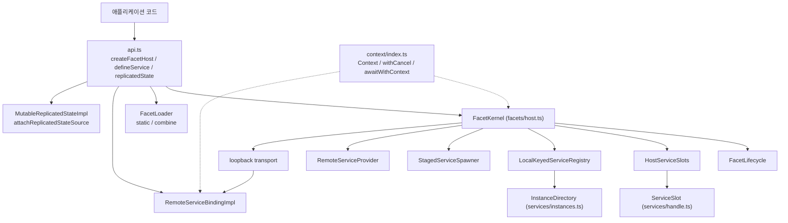
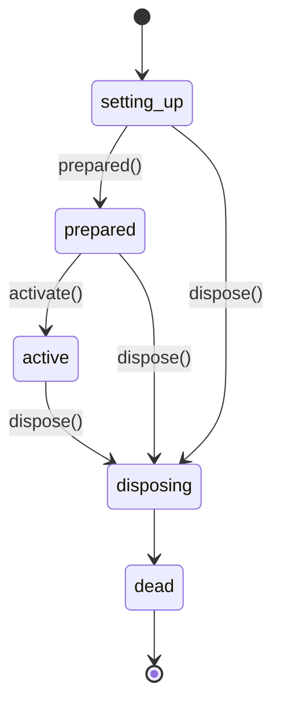
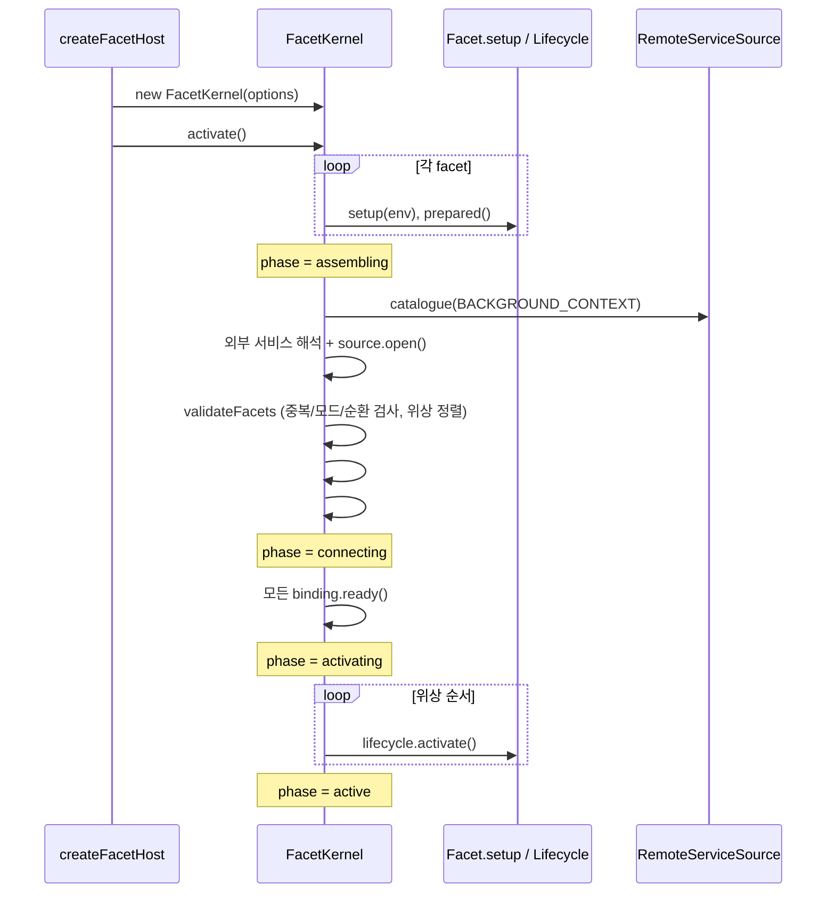
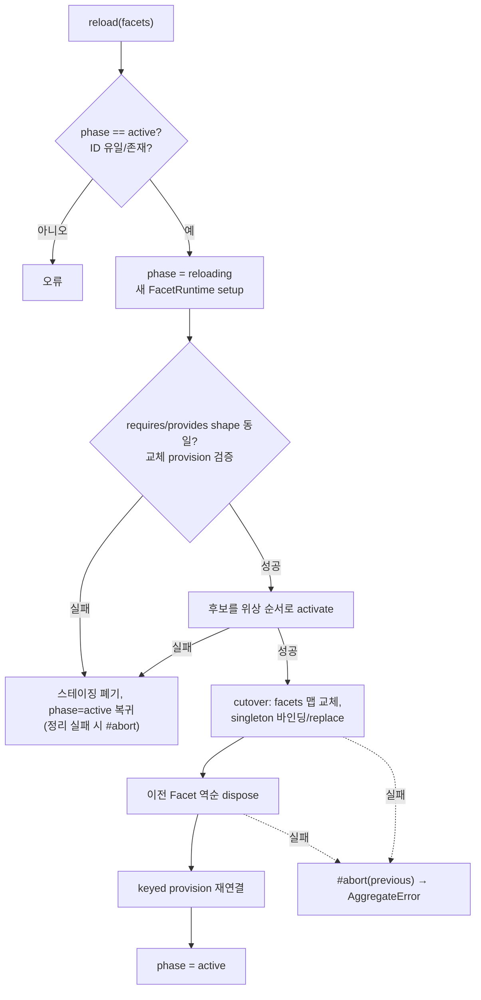

# chord_core

`packages/chord`(`@earendil-works/chord`)의 핵심 계층이다. 이 패키지는 "서비스, 복제 상태(replicated state), RPC, 플러그인을 위한 애플리케이션 합성 런타임"(`package.json`의 `description`)이다. `chord_core`는 그중 다음 세 가지를 담당한다.

1. **공개 API 진입점** (`src/api.ts`): `createFacetHost`, `defineService`, `defineFacet`, `replicatedState` 등
2. **Context** (`src/context/index.ts`): Go의 `context.Context`와 유사한 취소/값 전파 모델
3. **Facet 호스트 커널** (`src/facets/host.ts`): Facet의 생명주기, 의존성 검증, 서비스 연결, 핫 리로드

델타 추적은 [chord_delta](chord_delta.md), 서비스·복제 상태·RPC 구현은 [chord_services](chord_services.md)에서 다룬다. 이 문서는 해당 모듈을 호출하는 쪽의 관점만 설명한다. 전송 계층은 [protocol](protocol.md), [server](server.md), [client](client.md)를 참고한다.

> 검증 수준: 아래 내용은 제공된 `api.ts`, `context/index.ts`, `facets/host.ts`, `package.json`, `tsconfig.build.json`을 읽어 확인한 것이다(코드 확인). `types.ts`, `loader.ts`, `loopback.ts` 등은 직접 읽지 않았으므로 해당 부분은 호출 형태에서 추론한 것이다(추론).

---

## 1. 패키지 구성

| 항목 | 내용 |
|---|---|
| 서브패스 export | `.`, `./context`, `./delta`, `./bundler`, `./node`, `./package.json` |
| 모듈 형식 | ESM(`"type": "module"`), `sideEffects: false` |
| 런타임 요구 | Node `>=22.19.0` |
| 런타임 의존성 | `esbuild` (정확히 고정된 버전. `./bundler`와 연관된 것으로 추론) |
| 스크립트 | `build`=`tsc -p tsconfig.build.json`, `clean`=`shx rm -rf dist`, `test`=`vitest --run`, `prepublishOnly`=clean+build |
| 빌드 설정 | `tsconfig.build.json`이 루트 `tsconfig.base.json`을 상속, `src` → `dist` |

`exports`의 `source` 조건은 소스 체크아웃에서 `.ts`를 직접 가리키고, `types`/`import`는 빌드 산출물 `dist`를 가리킨다. 루트 빌드 구성은 [Build,_Release,_CI_and_Quality_Infrastructure](Build,_Release,_CI_and_Quality_Infrastructure.md)를 참고한다.

---

## 2. 아키텍처



핵심 아이디어는 다음과 같다.

- **Facet**은 `setup(env)` 함수를 가진 플러그인 단위이다. `setup` 안에서 `provide`, `use`, `observe` 등으로 서비스 의존 관계를 선언한다.
- **Service**는 `{ id, local }`로 정의된 식별자이다. 타입 `T`는 컴파일 타임 전용이다.
- **호스트**는 한 세대(generation)의 Facet 집합을 원자적으로 활성화하고, 같은 shape를 유지하는 교체(`reload`)를 허용한다.
- 원격 서비스(`local: false`)는 같은 프로세스 안에서도 **loopback 전송**을 거쳐 RPC 경로로 호출된다(`createLoopbackServiceTransport`). 따라서 로컬/원격 호출 의미가 같다.

---

## 3. 공개 API (`src/api.ts`)

| 함수 | 역할 |
|---|---|
| `createFacetHost(options)` | `FacetKernel`을 만들고 `activate()` 후 동결된 `{ services, reload, dispose }`를 반환한다 |
| `createStaticFacetLoader(facets)` | 고정된 Facet 배열을 반환하는 `FacetLoader`를 만든다 |
| `combineFacetLoaders(loaders)` | 여러 로더를 순차 로드하고 하나로 합친다. 실패 시 이미 로드된 것을 역순 정리하고 `AggregateError`로 묶는다 |
| `defineFacet(facet)` | 타입 추론용 항등 함수 |
| `defineService<T>(id, options?)` | 서비스 토큰을 만든다. 빈 ID와 `$chord.` 접두사는 `TypeError`. `{ local: true }`면 RPC 계약 검사를 받지 않는다 |
| `createRemoteServiceBinding(options)` | `RemoteServiceBindingImpl` 생성 |
| `replicatedState(initial)` / `replicatedState(source, options?)` | 권위(authoritative) 상태 생성 또는 외부 소스에 attach한 읽기 전용 복제본 생성. `attach` 함수 유무로 둘을 구분한다 |

`defineService`의 오버로드는 `[RemoteServiceContract<T>] extends [never]`일 때 옵션을 `never`로 막는다. 즉 원격 계약을 만족하지 못하는 타입은 `{ local: true }`를 명시해야만 정의된다.

---

## 4. Context (`src/context/index.ts`)

불변 연결 리스트 형태의 컨텍스트이다. 부모를 바꾸지 않고 파생 컨텍스트만 만든다.

```mermaid
graph LR
    BG["BACKGROUND_CONTEXT<br/>(EmptyContext)"] --> V1["ContextValue(key1)"] --> V2["ContextValue(ABORT_SIGNAL)"]
    V2 -->|value(key)| Lookup["token 일치 시 반환,<br/>아니면 부모로 위임"]
```

- `createContextKey<T>(description)`: `Symbol`을 token으로 가진 동결 키를 만든다.
- `withContextValue(key, value, parent)`: 값을 추가/덮어쓴다.
- `withAbortSignal(signal, ctx)`: 부모 시그널이 있으면 `AbortSignal.any([...])`로 결합한다.
- `withoutAbortSignal(ctx)`: 값은 유지하고 취소만 제거한다. 주석상 필수 정리 작업 전용이다.
- `withCancel(ctx)`: `{ context, cancel }`을 반환한다.
- `awaitWithContext(promise, ctx)`: 취소 시 **기다리는 쪽만** reject하고 원본 Promise는 취소하지 않는다. 리스너는 정산 시 제거된다.
- `BACKGROUND_CONTEXT`, `TODO_CONTEXT`: 빈 루트 컨텍스트 두 개.

`BaseContext.abortSignal`은 내부 키 `ABORT_SIGNAL_CONTEXT_KEY`를 조회하는 getter이다.

---

## 5. Facet 호스트 커널 (`src/facets/host.ts`)

### 5.1 주요 클래스

| 클래스 | 책임 |
|---|---|
| `FacetKernel` | 호스트 전체를 조율한다. `activate`, `reload`, `dispose`, `provider` getter 제공 |
| `FacetLifecycle` | Facet 하나의 상태 머신. 정리 효과(`own`), 관찰(`observe`), 활성화 콜백(`onActivate`) 보관 |
| `HostServiceSlots` | 싱글톤은 `ServiceSlot`으로, 키드(keyed) 서비스는 소스로 연결하는 호스트 단위 슬롯 테이블 |
| `LocalKeyedServiceRegistry` | `local: true`인 키드 서비스의 인스턴스 디렉터리(`InstanceDirectory`) 관리. 키별 generation 증가 |
| `StagedServiceSpawner` | `provideMany`가 반환하는 `ServiceSpawner`. 설치기(installer)가 연결되기 전 인스턴스를 보관하다가 `connect` 시 설치 |

### 5.2 FacetLifecycle 상태



- `provide`, `use`, `observe`, `onActivate`는 `setting_up`에서만 허용된다(`assertSettingUp`).
- `own`은 `setting_up` 또는 `active`에서 허용된다. `spawn`은 `active`에서만 허용된다(`assertActive`).
- 서비스 핸들 접근은 `activate()` 시 열리고 `revoke()`/`dispose()` 시 닫힌다(`assertServiceAccess`).
- `dispose`는 등록된 효과를 **역순**으로 실행하고, 오류를 모아 하나면 그대로, 둘 이상이면 `AggregateError`로 던진다.

### 5.3 FacetEnvironment (setup에 주입되는 객체)

| 메서드 | 동작 |
|---|---|
| `provide(service, impl)` | 싱글톤 제공. impl은 객체여야 한다. 원격이면 `RemoteServiceProvider.provide/validateReplacement/replace`를 래핑해 기록한다 |
| `provideMany(service)` | 키드 인스턴스 제공자 `ServiceSpawner` 반환 |
| `use(service)` | 싱글톤 서비스의 지연 바인딩 뷰 반환(Facet별 캐시) |
| `observe(service, handler)` | 키드 서비스 인스턴스 출현을 관찰. 실제 구독은 `activate` 때 시작 |
| `replicatedState(initial)` | `MutableReplicatedStateImpl` 생성 |
| `own`, `onActivate`, `onDeactivate` | 정리/활성화 훅 등록(`onDeactivate`는 `own`과 동일) |

`setup`은 **동기**여야 한다. Promise를 반환하면 거부를 삼킨 뒤 에러를 던진다.

### 5.4 activate 흐름



실패 시 `#terminate()`로 전체를 정리하고, 정리 오류가 있으면 원 오류와 함께 `AggregateError`로 던진다.

**GenerationPhase**: `setup → assembling → connecting → activating → active → reloading → disposing → dead`. 서비스 대상(target) 접근은 `activating`/`active`/`reloading`/`disposing`에서만 허용된다(`#assertServiceTargetAccess`).

### 5.5 의존성 검증 (`validateFacets`, `topologicalOrder`)

- 같은 `serviceId`를 두 곳(호스트 외부 소스, 서로 다른 Facet)이 제공하면 오류.
- 한 서비스를 singleton과 keyed로 동시에 제공하면 오류.
- 요구(`use`/`observe`)에 대응하는 제공자가 없거나 모드가 다르면 오류.
- Facet 간 의존 그래프를 Kahn 알고리즘으로 정렬하며, 남는 노드가 있으면 `Facet dependency cycle: ...` 오류.
- 활성화는 위상 순서, 해제는 그 역순이다.

### 5.6 외부 서비스 소스

`FacetOptions.serviceSources`(`RemoteServiceSource[]`)는 `catalogue()`로 제공 서비스를 광고한다. 해석 규칙:

- 로컬 Facet이 제공하는 서비스가 우선이며 외부에서 찾지 않는다.
- 카탈로그에 없는 요구는 `acceptsUnavailableServices`인 소스가 정확히 하나일 때만 그 소스에 위임한다. 둘 이상이면 오류.
- 소스별로 필요한 서비스 ID 목록을 묶어 `source.open({ services, assertAccess, onError })`를 호출한다.

### 5.7 reload (핫 리로드)



핵심 규칙은 두 가지다. 첫째, 리로드된 Facet은 이전과 같은 `requires`/`provides` 집합을 유지해야 한다(`sameFacetShape`). 둘째, cutover 이전 실패는 호스트를 `active`로 되돌리고, cutover 이후 실패는 호스트 전체를 중단한다(복구 불가).

### 5.7 dispose

`active` 상태에서만 호출 가능하다. `#terminate()`는 다음 순서로 정리하며 모든 오류를 수집한다.

1. Facet lifecycle 역순 dispose
2. 추가 레코드 정리
3. `LocalKeyedServiceRegistry.dispose`
4. 서비스 바인딩(소스 + 내부) dispose
5. `HostServiceSlots.dispose` (슬롯 unbind)
6. `RemoteServiceProvider.dispose`
7. phase = `dead`

이미 `dead`이면 no-op이다.

---

## 6. 설계 포인트

| 문제 | 해결 |
|---|---|
| Facet이 비활성 상태에서 서비스를 호출하는 경우 | `ServiceSlot.view(assertAccess)` 프록시가 `FacetLifecycle.assertServiceAccess`를 통해 차단 |
| 리로드 중 호출이 이전/신규 구현에 섞이는 문제 | 슬롯은 안정된 뷰를 유지하고 대상만 `bindSingleton`으로 교체 |
| 로컬과 원격 서비스의 의미 차이 | 원격 서비스는 loopback 전송을 통해 항상 RPC 계약 경로를 사용. 로컬 전용은 `local: true`로 명시 |
| 부분 실패 시 자원 누수 | 모든 정리 경로가 오류를 수집하고 `AggregateError`로 보고 |
| 취소 전파 | `Context.abortSignal`이 키드 서비스 관찰(`observe`)의 종료 검사에도 사용됨 |

예약된 서비스 ID 네임스페이스는 `$chord.`이다(코드에 "Chord에 포함할지 확인 필요"라는 TODO가 있다).

---

## 7. 사용 예 (개념)

```ts
import { createFacetHost, defineFacet, defineService } from "@earendil-works/chord";

const Greeter = defineService<{ hello(name: string): string }>("app.greeter", { local: true });

const host = await createFacetHost({
  facets: [
    defineFacet({
      id: "greeter",
      setup(env) {
        env.provide(Greeter, { hello: (n) => `hi ${n}` });
      },
    }),
  ],
});
await host.dispose();
```

`Facet`의 정확한 형태는 `types.ts`에 있으며 위 예시는 `setup(env)`와 `id` 사용 방식에서 추론한 것이다.

---

## 8. 다른 모듈과의 관계

- [chord_services](chord_services.md): `RemoteServiceBindingImpl`, `RemoteServiceProvider`, `ServiceSlot`, `InstanceDirectory`, `MutableReplicatedStateImpl` 구현.
- [chord_delta](chord_delta.md): 복제 상태의 리비전 diff/추적.
- [protocol](protocol.md), [server](server.md), [client](client.md): 바이트 프레이밍, 세션 라우팅, 클라이언트 연결. `RemoteServiceSource` 구현이 이 계층과 호스트를 잇는다(추론).
- [Experimental_Server_and_Client_Runtime](Experimental_Server_and_Client_Runtime.md): `packages/coding-agent`의 실험적 서버/클라이언트 런타임이 Chord 호스트와 `activateBuiltinClientServices` 같은 서비스 활성화를 사용한다. 세부 호출 관계는 해당 문서를 참고한다.
