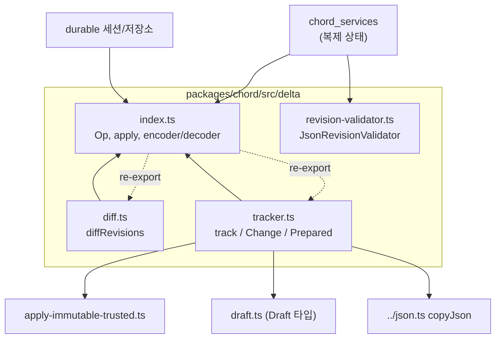
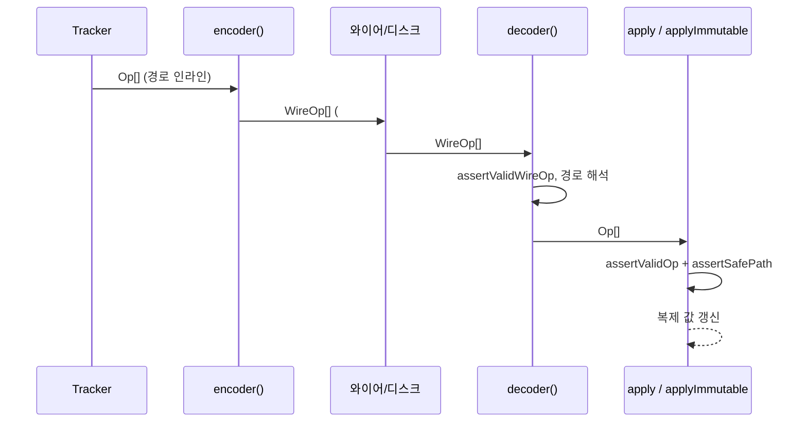
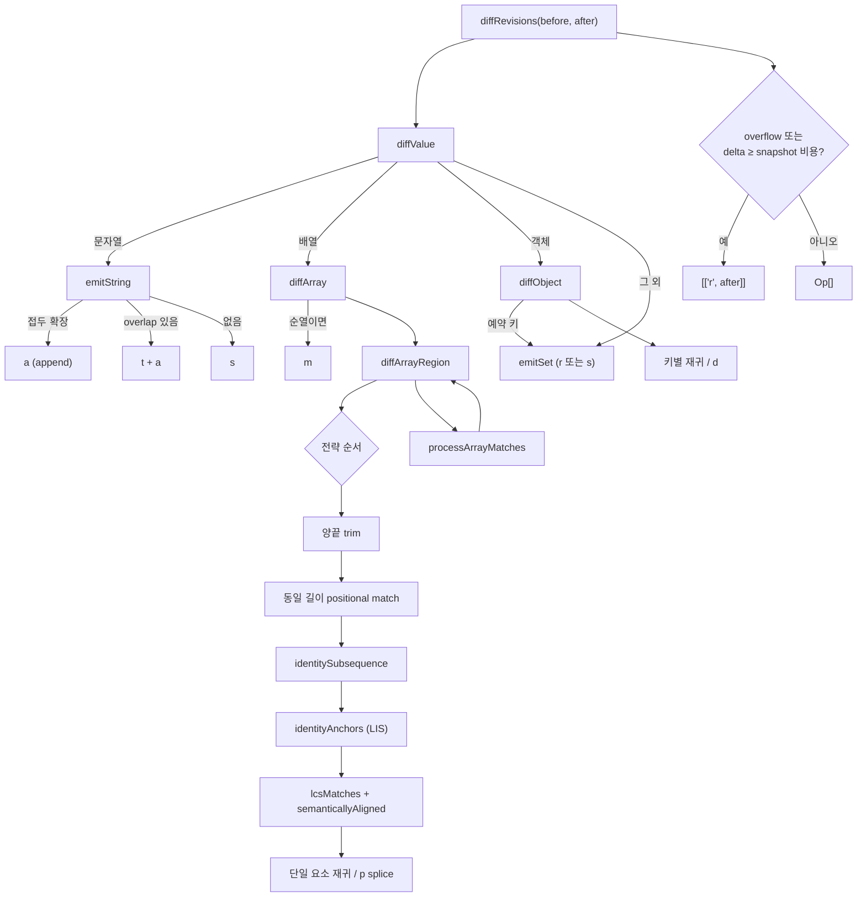
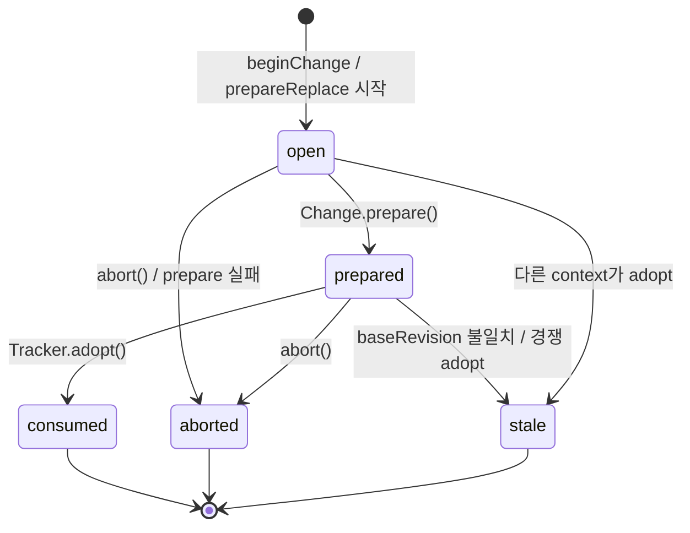

# chord_delta 모듈

`packages/chord/src/delta/` 는 **순수 JSON 값에 대한 불변(immutable) 리비전 추적과 연산(op) 기반 델타 표현**을 제공한다. 프로토콜·세션 저장소·facet 호스트가 이 모듈을 소비하며, 이 모듈은 하니스의 다른 부분에 의존하지 않는다(`index.ts` 주석: "Depends on nothing else in the harness"). 의존 방향은 반드시 delta → 소비자 쪽이어야 한다.

관련 모듈:
- [chord_core](chord_core.md): `defineService`, context, facet 호스트
- [chord_services](chord_services.md): 복제 상태(`ReplicatedState*`)가 이 모듈의 `track`/`encoder`/`decoder`/`JsonRevisionValidator`를 사용
- [protocol](protocol.md): 델타 배치가 와이어로 전달되는 경로
- [durable_session_and_schema](durable_session_and_schema.md): 문서 커밋·저장 시 델타 소비

> 검증 수준: 아래 내용은 제공된 `diff.ts`, `index.ts`, `revision-validator.ts`, `tracker.ts` 소스를 읽고 작성했다(코드 확인). 소비 모듈과의 호출 관계는 주석과 import 구조에서의 추론이며 해당 모듈 문서에서 재확인이 필요하다.

---

## 1. 구성 요소 개요

| 파일 | 역할 | 핵심 심볼 |
|---|---|---|
| `index.ts` | Op/WireOp 타입, 경로 안전성, 적용기(`apply*`), 인코더/디코더, `overlap` | `Op`, `WireOp`, `apply`, `applyImmutable`, `applyImmutableBatches`, `encoder`, `decoder`, `isReplace`, `isBase`, `RESERVED_SEGMENTS`, `UnsafePathError`, `PathError` |
| `diff.ts` | 두 불변 JSON 리비전에서 압축된 Op 배치를 계산 | `diffRevisions`, `diffArrayRegion`, `processArrayMatches`, `semanticallyAligned` |
| `tracker.ts` | Proxy 오버레이 기반 변경 추적, prepare/adopt 2단계 커밋 | `track`, `Tracker`, `Change`, `Prepared`, `TrackerImpl`, `ChangeImpl`, `PreparedImpl` |
| `revision-validator.ts` | 복제 리비전이 strict JSON인지 검증(이미 검증된 컨테이너는 건너뜀) | `JsonRevisionValidator.validate` |



---

## 2. Op 어휘 (`index.ts`)

튜플이 곧 형식이다(메모리·와이어·디스크 동일).

| verb | 형태 | 의미 |
|---|---|---|
| `r` | `["r", value]` | 전체 값 교체. **루트를 바꿀 수 있는 유일한 op** (s/d/a/t는 타입상 루트 불가) |
| `s` | `["s", path, value]` | 경로에 값 설정 |
| `d` | `["d", path]` | 키 삭제 / 배열 요소 splice 제거 |
| `a` | `["a", path, str]` | 문자열 append |
| `t` | `["t", path, n]` | 문자열 앞 `n`글자 잘라냄(`slice(n)`) |
| `p` | `["p", path, index, remove, items]` | 배열 splice (루트 배열도 가능) |
| `m` | `["m", path, permutation]` | 배열 재정렬: `new[i] = old[permutation[i]]` |

Op 형태는 정규(canonical)가 아니다. 배열 비우기는 `r` 또는 루트 `p` 중 어느 쪽으로도 표현 가능하다.

### 와이어 압축 (`WireOp`)
`encoder()`/`decoder()`는 경계 통과 시에만 쓰이는 두 가지 압축만 추가한다.
1. **경로 인터닝**: 경로의 *두 번째* 사용 시 `["#", id, path]` 정의 후 숫자 id로 참조. (첫 사용 인라인 — 정의 비용이 경로보다 크기 때문)
2. **arity 생략**: 직전 op와 같은 경로면 경로 필드를 생략(`["s", value]`, `["d"]` 등). 범위는 **배치 내부**로 제한 — 배치 간 의존이 생기면 배치를 건너뛰는 독자가 잘못된 경로를 해석하기 때문.

`r` op가 나오면 인코더/디코더 모두 id 사전을 초기화한다. base 배치는 복구 지점이므로 이후 내용은 자기완결적이어야 한다. **독립된 상태 스트림마다 인코더/디코더 쌍 하나**를 사용해야 하며, 같은 연결을 공유해도 별개 상태는 별개 스트림이다.



---

## 3. 보안/불변식

- **프로토타입 오염 방지**: `RESERVED_SEGMENTS = {__proto__, constructor, prototype}`. 경로는 데이터이고 출처(facet, 플러그인, 모델 출력을 되풀이하는 tool details)를 신뢰할 수 없으므로 `assertSafePath`가 모든 op/디코딩 경로에서 거부(`UnsafePathError`).
- **인덱스 제한**: `assertIndexInRange`는 기존 요소 또는 정확히 끝 다음 1칸만 허용. 희소 배열은 JSON 왕복에서 `null`로 바뀌어 복제본과 어긋나고, `["s",["xs",4294967290],1]` 같은 op의 거대 할당 DoS도 막는다.
- **알 수 없는 verb는 예외**: 조용히 건너뛰면 새 producer의 op가 사라진다.
- **쓰기는 `Object.defineProperty`**: 상속된 setter가 실행되지 않도록 한다. 경로 탐색은 own property만 따라간다.
- **적용기 어휘 분리**: `assertValidOp`(디코딩된 op)와 `assertValidWireOp`(와이어)는 별개 검증기. 와이어 문법으로 `Op`를 검증하면 `["s", value]`가 통과해 값이 경로로 읽힌다.
- `r`은 값을 **복사하지 않고 채택**한다. 한 배치를 한 프로세스 안에서 여러 소비자에 fan-out하면 복제본이 서로 alias되므로 fan-out 지점에서 복사해야 한다(소유권 규칙).

### 적용기
| 함수 | 동작 |
|---|---|
| `apply(target, ops)` | 가변 값에 제자리 적용. `r`로 루트가 바뀌므로 값을 반환 |
| `applyImmutable` | 이전 불변 값을 변형하지 않고 경로상 컨테이너만 복사(copy-on-write, `owned` WeakSet) |
| `applyImmutableBatches` | 여러 배치를 최종 결과만 남기는 단일 재생. 중간 리비전은 노출하지 않음 |

`p` 적용은 10,000개 단위로 `splice`하여 spread 인자 한도를 피한다.

---

## 4. 델타 계산 — `diffRevisions` (`diff.ts`)

두 불변 JSON 리비전에서 작은 Op 배치를 만든다.



주요 설계:
- **문자열**: 접두 확장이면 `a`; 아니면 `overlap(before, after, 65536)`(before 접미 = after 접두 최장 길이)로 `t`+`a`; 겹침이 없으면 `s`. `overlap`은 `indexOf` 프로브(긴 head → 1글자)와 후보 상한(8)을 사용해 최악의 경우에도 *틀리지 않고 커질 뿐*이다.
- **배열**: 순열 감지 → `m`; 그 외에는 공통 접두/접미 제거 후 단계별 매칭 전략을 시도한다. 단조 증가 identity 앵커는 후보 정렬 + `lowerBound` 기반 LIS(`MAX_IDENTITY_CANDIDATES = 200_000` 초과 시 `greedyIdentityAnchors`), 의미 정렬은 LCS(`MAX_SEMANTIC_CELLS = 65_536` 초과 시 포기). `semanticallyAligned`는 참조가 동일한 하위 컨테이너가 하나라도 있으면 같은 요소로 간주한다.
- **예약 키가 있는 객체**: 필드 단위 델타 대신 전체 `s`(또는 `r`)로 대체하여 안전하지 않은 경로 생성을 회피.
- **상한**: `MAX_DELTA_OPERATIONS = 4096` 초과 시 `overflowedBatches`(WeakSet)에 표시하고 전체 스냅샷 `["r", after]`로 폴백. 추정 비용(`jsonCost`, `pathCost`, `operationCost`)이 65,536 이상이고 스냅샷보다 작지 않으면 스냅샷 선택.

---

## 5. 변경 추적 — `track` (`tracker.ts`)

`track(initial)`은 **중복 참조(alias) 없는 strict-JSON 루트의 불변 소유권을 O(1)로 인수**한다. 변경은 Proxy 오버레이(Draft)에서 일어나며 원본은 건드리지 않는다.



### 인터페이스
- `Tracker<T>`: `value`, `revision`, `beginChange()`, `prepareReplace(value)`, `adopt(prepared)`
- `Change<T>`: `state`(Draft 프록시), `prepare()`, `abort()`
- `Prepared<T>`: `base`, `value`(다음 리비전), `ops`, `baseRevision`, `abort()`

### 2단계 커밋 (prepare → adopt)
1. `prepare()`가 Op를 생성(`emitOperations`)하고 **다음 리비전 값을 미리 materialize**한다.
2. `adopt()`는 포인터 교체 + `revision += 1`뿐이라 실패하지 않는다. 저장소 쓰기가 실패하면 후보(`Prepared`)를 폐기하면 되고 권위 상태는 손상되지 않는다.
3. `adopt` 성공 시 같은 트래커의 다른 열린/준비 context를 `stale`로 만들고 오버레이 참조를 O(1)로 해제(`releaseOverlayReferences`)한다. 경쟁하는 draft의 모든 노드를 순회하지 않는다.

```mermaid
sequenceDiagram
    participant C as 호출자
    participant T as TrackerImpl
    participant Ch as ChangeImpl
    participant S as 저장소/전송
    C->>T: beginChange()
    T-->>C: Change (state = Proxy)
    C->>Ch: state.a.b = 1; list.push(x)
    C->>Ch: prepare()
    Ch->>Ch: emitOperations → Op[]
    Ch->>Ch: materializePrepared → 새 값
    Ch-->>C: Prepared{ops, value, baseRevision}
    C->>S: ops 기록/전송
    alt 성공
        C->>T: adopt(prepared)
        T->>T: value=prepared.value, revision++
    else 실패
        C->>Ch: prepared.abort()
    end
```

### 오버레이 구조
- **객체 노드**: `writes`/`deletes`/`readded` 집합. 흔한 단일 키 쓰기를 위해 `writeKey/writeValue`, `deleteKey` 단일 슬롯 최적화를 두고 두 번째 키부터 Map/Set으로 승격한다. 삭제 후 재추가(`readded`)는 문자열 키 삽입 순서를 맞추기 위해 `d` op를 명시 방출한다.
- **배열 노드(`ArrayOverlay`)**: **piece table + treap**(`PieceNode`, priority는 xorshift, `elements`로 subtree 크기 유지). piece는 `base` 구간 또는 `insert` 소스 구간이며 `step: ±1`로 역순도 표현한다. `push/pop/shift/unshift/splice/reverse/sort/fill/copyWithin`은 `ARRAY_MUTATORS`로 가로채 piece 연산으로 구현한다(`replacePieceRange`, `joinNormalized`로 인접 piece 병합). 구멍(hole)은 금지(`Overlay arrays cannot contain holes`), `length` 증가는 `null` 채움 삽입.
- **값 저장**: 컨테이너는 `stored[]` + `{index}` 참조로 보관하고, 쓰기 시 `clonePlacement`/`copyJson`으로 복사해 외부 alias를 끊는다. 다른 오버레이 프록시를 대입하면 `clonePlacementNode`로 현재 상태를 복제한다.
- **Proxy 핸들러**(`sharedObjectHandler`): `get/set/deleteProperty/has/ownKeys/getOwnPropertyDescriptor`는 오버레이로 위임, `defineProperty`/`preventExtensions`/`setPrototypeOf`는 `TypeError`. 상태가 `consumed/aborted/stale`이거나 `prepared`면 접근/쓰기 불가("settled overlay", "read-only"). `then`은 settled일 때 `undefined`를 돌려 `await`에 안전.
- **수명**: `WeakRef<OverlayContext>` 레지스트리와 `pruneBudget`으로 죽은 context 정리, `clearContext`는 노드·프록시 참조를 `RELEASED`로 교체해 GC를 돕는다.

### Op 방출 (`emitOperations`)
- **단순 객체 경로(`emitSimpleObjectOperations`)**: dirty 노드가 128개 이하, 배열·예약키·placement 조상이 없으면 깊이순 삽입 정렬 후 객체 연산만 방출하고, `simpleObjectMaterialization`이면 `cloneNode`로 직접 materialize.
- **일반 경로**: dirty 노드의 경로를 `resolvePath`로 계산(부모 값이 더 이상 같지 않으면 `undefined` → 건너뜀), 깊이 bucket 순으로 방출, 이미 접힌(folded) 조상 아래는 생략.
- **예약 키 변경**은 가장 가까운 안전한 조상을 통째로 `s`로 접는다(`forcedFolds`).
- **dense region**: 배열에서 많은 요소(≥256)가 흩어져 바뀌고 밀도 ≥50%이면 개별 `s` 대신 구간 `p` 하나로 압축(`buildDenseRegions`).
- **구조 변경 배열**(`buildArrayPlan`): 뒤에서부터 `p` 제거 run → 필요 시 `m` 순열 → `p` 삽입 run → 남은 base override의 개별 변경 순으로 방출.
- **값 변경**(`emitChangedValue`): 동일하면 생략, 문자열은 `a`/`t+a`, 그 외 `s`.
- Op 수가 4096 초과면 `["r", 루트 전체]`로 폴백. `prepareReplace`는 현재 값과 동일하면 빈 배치(noop), 아니면 `["r", value]`.
- 실제 값 materialize: `p`/`m`이 있으면 `applyImmutable`, 아니면 `applyImmutableTrusted`(신뢰된 불변 전송 계약: payload를 새 리비전과 공유).

---

## 6. 리비전 검증 — `JsonRevisionValidator`

복제 상태의 불변 리비전이 **strict JSON**인지 검증한다. 이전 리비전에서 검증된 컨테이너는 `#validated` WeakSet으로 건너뛰므로 구조 공유가 있는 연속 리비전에서 비용이 변경분에 비례한다.

거부 조건:
- 순환 참조 (`ancestors` 집합)
- 일반 객체/배열이 아닌 프로토타입, 심볼 키
- getter/setter·비열거 속성 (열거 가능한 데이터 속성만 허용)
- 희소 배열, `undefined` 요소
- 유한하지 않은 숫자(`NaN`, `Infinity`), 비 JSON 원시값

---

## 7. 다른 모듈과의 관계

```mermaid
flowchart LR
    Tracker["track / Tracker<br/>(chord_delta)"] -->|Op[]| Pub["ReplicatedStatePublisher<br/>(chord_services)"]
    Pub -->|encoder| Wire["protocol 프레임"]
    Wire -->|decoder| Rep["ReplicatedStateReplica"]
    Rep -->|applyImmutable| Val["JsonRevisionValidator"]
    Tracker -->|Op[]| Store["durable 저장소<br/>(jsonl/sqlite/memory)"]
```

- **chord_services** ([chord_services](chord_services.md)): `ReplicatedStatePublisher`/`ReplicatedStateReplica`가 base(`r`) + 델타 배치 스트림을 발행·복원한다고 추정(추론). `isBase`는 배치가 `r`로 시작하는지 정확히 판별하므로 복구 지점 탐색에 쓰인다.
- **durable** ([durable_storage](durable_storage.md)): 문서 커밋 시 델타를 기록하는 용도로 추정(추론; 해당 모듈에서 확인 필요).
- 빌드/테스트 설정은 `packages/chord/package.json`, `packages/chord/tsconfig.build.json` 참조. 소스는 Node strip-only 모드에서 직접 실행되도록 erasable TypeScript만 사용한다(예: `UnsafePathError`는 parameter property 대신 명시 필드 사용).

## 8. 유지보수 시 주의

1. 새 op verb 추가 시 `Op`, `WireOp`, `assertValidOp`, `assertValidWireOp`, 인코더/디코더 양쪽 switch, `apply`, `diff.ts`의 `operationCost`, tracker의 방출 경로를 모두 갱신해야 한다.
2. 경로를 생성하는 모든 코드는 `RESERVED_SEGMENTS`를 우회하지 않아야 한다(diff·tracker 모두 접힘/스냅샷으로 처리).
3. 상한 상수(`MAX_DELTA_OPERATIONS`, `MAX_IDENTITY_CANDIDATES`, `MAX_SEMANTIC_CELLS`, `DEFAULT_OVERLAP_SCAN`)는 정확성이 아닌 **크기/시간 트레이드오프**이다. 한도 초과 시 결과는 커질 뿐 틀리지 않도록 폴백이 설계되어 있다.
4. `tracker.ts`의 모듈 전역 `locatedDenseArray`/`locatedDenseIndex`는 단일 스레드 방출 중 임시 캐시이며 `emitOperations` 종료/`clearContext` 시 초기화된다.
