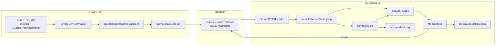
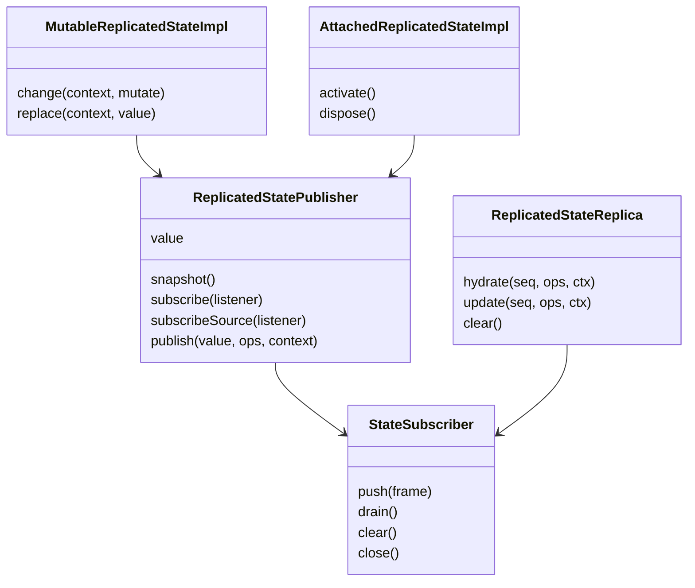
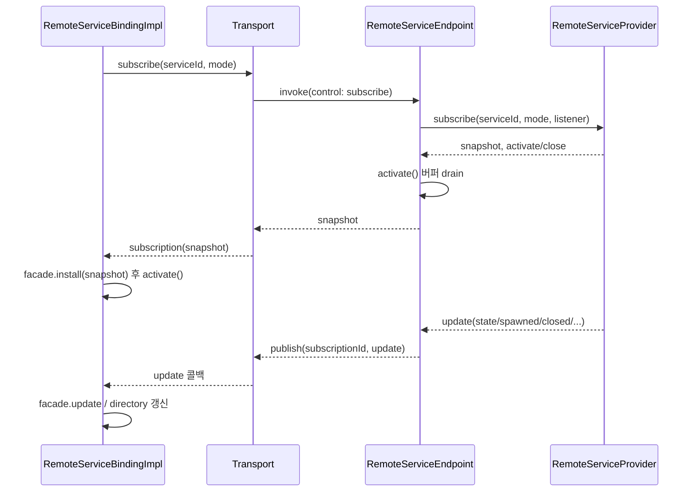

# chord_services

`chord_services`는 `packages/chord/src/services/` 아래에서 **프로세스 경계를 넘는 서비스 호출과 복제 상태(replicated state)** 를 구현하는 모듈이다. 한쪽(provider)이 객체를 서비스로 노출하면, 다른 쪽(consumer)은 transport를 통해 같은 모양의 프록시(facade)를 얻는다. 메서드는 RPC로, state 멤버는 snapshot + delta 스트림으로 복제된다.

관련 모듈: [chord_core](chord_core.md) (`defineService`, `Context`), [chord_delta](chord_delta.md) (`Op`, `track`, `applyImmutable`, `encoder/decoder`), [protocol](protocol.md) (wire 프레임/메시지), [server](server.md), [client](client.md). 실제 사용처는 [experimental_services_and_client](experimental_services_and_client.md)의 `RoutedServiceBinding`, `ServerServiceSourceImpl`, `SessionServiceSourceImpl`이다.

## 1. 구성 파일과 역할

| 파일 | 핵심 구성요소 | 역할 |
|---|---|---|
| `provider.ts` | `RemoteServiceProvider`, `createRemoteServiceEndpoint` | 서비스 구현 등록, 호출 처리, 구독자에게 update 방송 |
| `consumer.ts` | `RemoteServiceBindingImpl`, `KeyedBinding`, `ServiceFacade`, `MemberSlot` | 원격 서비스의 로컬 프록시와 구독 수명 관리 |
| `state.ts` | `MutableReplicatedStateImpl`, `AttachedReplicatedStateImpl`, `ReplicatedStatePublisher`, `ReplicatedStateReplica`, `StateSubscriber` | 복제 상태의 생산(publish)과 소비(replica) |
| `state-codec.ts` | `createServiceStateEncoder/Decoder`, `StateCodecRegistry`, `CodecEntry` | 구독 단위로 state별 delta encoder/decoder 유지 |
| `instances.ts` | `InstanceDirectory` | keyed 서비스 인스턴스 수명 및 observer 태스크 관리 |
| `handle.ts` | `ServiceSlot` (+ 내부 `ServiceView`, `ValueView`) | host가 소유한 가변 대상에 consumer용 가드 프록시 제공 |
| `errors.ts` | `RemoteServiceError`, `isRemoteServiceErrorCode` | 오류 코드 8종 정의 |

(`wire.ts`, `state-internals.ts`, `types.ts`는 이 모듈의 핵심 컴포넌트 목록에는 없지만 import되어 사용된다. 세부 형태는 코드로 확인하지 못했다: 미확인.)

## 2. 아키텍처

핵심 설계 포인트:

- **allowlist**: provider는 생성 시 카탈로그(`ServiceCatalogueEntry[]`)를 고정하고, consumer binding도 `options.services`의 id만 허용한다. 위반하면 `service_not_allowed`.
- **두 가지 mode**: `singleton`(서비스 id당 하나)과 `keyed`(key + generation으로 주소 지정되는 다수 인스턴스). 한 id를 두 mode로 쓰면 `service_mode_mismatch`.
- **member 종류**: 구현 객체의 own data property 중 함수는 `method`, `ReplicatedState`는 `state`로 분류(`classifyRemoteServiceImplementation`). 그 외 값, getter, 멤버 0개는 `TypeError`.
- **`local` 서비스**는 원격 게시/사용 불가(`#assertRemotable`).

## 3. Provider (`provider.ts`)

`RemoteServiceProvider`는 서비스별 `ServiceRegistration`(singleton 또는 `instances` 맵, `generations`, `subscribers`)을 관리한다.

| 메서드 | 동작 |
|---|---|
| `provide` | singleton 구현 등록. 이미 있으면 `service_mode_mismatch` |
| `withdraw` | singleton 제거 후 `unavailable` update 방송 (구독과 consumer facade는 유지) |
| `validateReplacement` / `replace` | member shape(이름→kind)가 같을 때만 교체, `replaced` 방송 |
| `spawn` | keyed 인스턴스 생성. `generation`을 key별로 증가시키고 `spawned` 방송, 닫기 함수 반환 |
| `invoke` | `call.instance`로 인스턴스를 해석(`#resolveInstance`)해 method를 `[...args, context]`로 호출 |
| `subscribe` | snapshot 반환 + `activate()`/`close()` 핸들 |
| `dispose` | 모든 등록 해제, 오류 수집 후 throw |

오류 해석 규칙(`#resolveInstance`): singleton인데 주소 지정 → `service_mode_mismatch`, keyed인데 주소 없음 → `service_mode_mismatch`, key 없음 → `service_instance_not_found`, generation 불일치 → `service_stale_instance`.

### Update 방송과 backpressure

`#emit`은 먼저 모든 구독자 버퍼에 큐잉한 뒤 `drainSubscriber`로 순서대로 전달한다(재진입 발행 안전). 구독자 버퍼가 100개에 도달하면 버퍼를 비우고 **현재 snapshot을 담은 `reset` update**로 대체한다. 또한 `snapshotSequences`로 이미 snapshot에 반영된 state update(`sequence <= snapshot sequence`)는 건너뛴다(`updateCoveredBySnapshot`).

### Endpoint

`createRemoteServiceEndpoint(provider)`는 consumer 한 곳에 대한 호스트다. `decodeServiceControlCall`로 제어 호출을 구분한다:

- `catalogue` → 카탈로그 반환
- `subscribe` → `subscriptionId` 중복 검사 후 `provider.subscribe`, `publish(subscriptionId, update, ctx)`로 update 전달, 즉시 `activate()`, snapshot 반환
- `unsubscribe` → 구독 close
- 그 외 → `provider.invoke`

## 4. 복제 상태 (`state.ts`)

- **`MutableReplicatedStateImpl`** (권위 있는 쪽): `track(initial)`로 만든 tracker에서 `change(context, mutate)`가 동기 콜백으로 draft를 수정하고 `prepare()`가 `ops`를 만든다. 비동기 콜백은 `TypeError`, 재진입 변경은 오류. `ops`가 비어 있으면 publish하지 않는다. `replace`는 전체 교체.
- **`ReplicatedStatePublisher`**: `sequence`를 1씩 올리며 발행 순서를 유지. 발행 중 재진입 publish는 큐에 쌓고 바깥 루프에서 처리. 리스너 오류는 모아서 반환(한 구독자 실패가 다른 구독자를 막지 않음). 구독 시 `hydrate` delivery를 먼저 받고 이후 `update`를 받는다.
- **`StateSubscriber`**: 구독자별 큐. 리스너가 Promise를 반환하면 완료 때까지 다음 delivery를 보류. 큐가 100개를 넘으면 오래된 프레임을 버리되 아직 시작 전이면 첫 hydration은 보존.
- **`AttachedReplicatedStateImpl` / `attachReplicatedStateSource`**: 외부 권위 소스(`ReplicatedStateSource`)의 프레임을 받는 publication 전용 상태. `cursor`가 정확히 +1씩 증가해야 하며 gap이 있으면 소스를 dispose하고 오류 보고.
- **`ReplicatedStateReplica`** (consumer 쪽): 처음엔 `value === undefined`(cold). `hydrate`는 base op(`isBase`)만 허용하고, `update`는 `sequence === current + 1`만 허용. `JsonRevisionValidator`로 JSON 유효성 검증. 검증 실패/gap이면 `clear()` 후 throw.

## 5. Consumer (`consumer.ts`)

`RemoteServiceBindingImpl.use(service)`는 singleton 서비스의 프록시를, `observe(service, handler)`는 keyed 인스턴스가 나타날 때마다 `handler`를 호출한다.

- **`ServiceFacade`**: `Proxy`로 프로퍼티 접근 시 `MemberSlot`을 지연 생성. `install(snapshot)`이 주소와 member 목록을 검증하고 state 멤버를 hydrate. 알 수 없는 member는 `service_member_not_found`.
- **`MemberSlot`**: 값 자체가 Proxy이면서 callable. 호출 시 마지막 인자가 `Context`여야 하며(`service_invalid_value`), 나머지를 `transport.invoke({serviceId, instance?, member, args}, context)`로 보낸다. `.value`/`.subscribe`는 state로 취급. 같은 멤버를 method와 state로 섞어 쓰면 `service_member_mismatch`.
- **`KeyedBinding`**: `InstanceDirectory`와 구독을 소유. `reset` update는 snapshot과 비교해 generation이 다른 인스턴스를 제거하고 새로 spawn. `spawned`/`closed`/`state` update는 key+generation이 일치할 때만 반영.
- **revision 카운터**: `rebind`/`close` 시 revision을 올려 늦게 도착한 구독 결과와 update를 무시(경쟁 상태 방지).

### 구독 시퀀스

### rebind / dispose

- `rebind(bound, context)`: 연결 상태 변경(예: 재연결). 모든 facade를 `clear()`하고 기존 구독을 닫은 뒤, `bound`면 재구독. 실패는 `AggregateError`로 묶는다. `#bindingTransition`과 `#readinessRevision`을 써서 `ready()`가 전환이 끝날 때까지 반복 대기.
- `dispose`: 모든 binding 비활성화, 구독 close, 오류는 `AggregateError`.

## 6. `InstanceDirectory` (`instances.ts`)

keyed 인스턴스를 `key → entry`로 보관하고, observer마다 인스턴스별 취소 가능한 태스크(`withCancel(BACKGROUND_CONTEXT)`)를 시작한다.

- `ready()` 이전에는 태스크를 시작하지 않고(`#ready=false`), ready가 되면 현재 인스턴스 모두에 대해 시작.
- `replace`는 같은 key의 다른 generation만 허용(같으면 오류). 이전 인스턴스는 `deactivate()` 되고 해당 태스크가 취소된다.
- `observe`가 반환한 해제 함수는 모든 태스크 취소. 마지막 observer가 사라지면 `KeyedBinding`이 `onEmpty`로 구독을 닫는다.
- handler의 오류는 취소되지 않은 경우에만 `onError`로 보고.

## 7. `ServiceSlot` (`handle.ts`)

host가 소유한 가변 구현(`bind`/`unbind`)을 두고, consumer에게는 `view(assertAccess)`로 **가드된 읽기 프록시**를 준다. 매 접근마다 `assertAccess()`를 호출하고 `resolve`가 현재 구현을 조회하므로, 구현이 교체되거나 `unbind`되면(`Service X is disconnected`) 이미 건네준 뷰도 즉시 영향을 받는다. `KeyedBinding.observe`가 handler에 넘기는 서비스 뷰가 이것을 쓰며, observer가 중단되면 `service_stale_instance`를 던진다.

## 8. State codec (`state-codec.ts`)

wire 상에서 state `ops`는 구독 단위의 **상태ful delta 인코딩**이다. `StateCodecRegistry`가 `(instance, member)` 키로 `Encoder`/`Decoder`를 보관한다.

| update | encoder/decoder 동작 |
|---|---|
| snapshot, `reset`, `replaced`, `unavailable` | 레지스트리 `reset()` 후 snapshot의 state 멤버마다 새 codec `add` |
| `spawned` | 해당 인스턴스 멤버 codec 추가 |
| `state` | 해당 codec으로 `encode/decode` (없으면 `Unknown service state`) |
| `closed` | 해당 인스턴스 codec 제거 |

양쪽이 같은 순서로 같은 이벤트를 처리해야 codec 상태가 일치하므로, update 순서 보존이 전제다.

## 9. 오류 코드 (`errors.ts`)

`service_not_allowed`, `service_not_found`, `service_mode_mismatch`, `service_member_not_found`, `service_member_mismatch`, `service_instance_not_found`, `service_stale_instance`, `service_invalid_value`. `isRemoteServiceErrorCode`는 문자열이 이 목록에 속하는지 검사하는 타입 가드(wire에서 온 코드 검증용).

## 10. 검증 수준

- 위 내용은 제공된 `consumer.ts`, `provider.ts`, `state.ts`, `state-codec.ts`, `instances.ts`, `handle.ts`, `errors.ts` 소스 **코드 확인** 기준이다.
- `wire.ts`, `state-internals.ts`, 실제 transport 구현(`packages/client`, `packages/server`)과의 결합 방식은 **미확인**이며, 위 sequence는 provider/consumer 코드에서 도출한 것이다.
- 100개 버퍼 한도의 설계 의도(느린 구독자 보호)는 **추론**이다.
