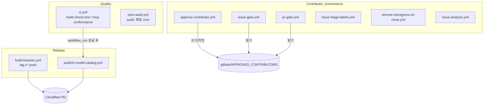
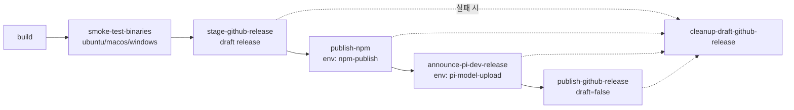
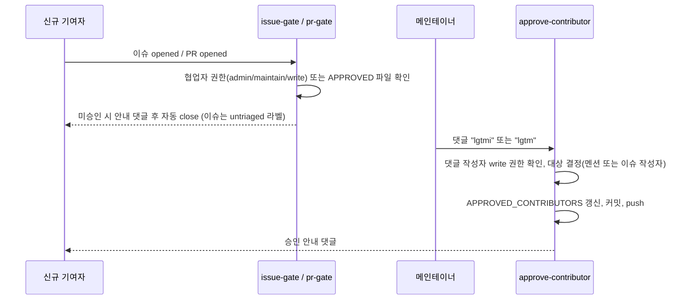

# ci_workflows 모듈

`.github/workflows/` 아래 GitHub Actions 워크플로 10개를 다룬다. 역할은 세 가지다.

1. **품질 게이트**: build, check, test와 MCP 적합성 검사 (`ci.yml`)
2. **릴리스·배포**: 바이너리 빌드, npm 발행, GitHub Release, 모델 카탈로그 발행 (`build-binaries.yml`, `publish-model-catalog.yml`)
3. **기여자·이슈 운영 자동화**: 기여자 승인과 이슈·PR 게이트, 라벨 관리, 이슈 분석 (나머지 파일)

이 모듈은 코드 모듈이 아니라 CI 설정이다. 그래서 하위 모듈로 나누지 않고 이 문서 하나에 모두 정리한다. 워크플로가 호출하는 `npm run build`, `check`, `test`, `hydrate:model-data`, `generate:model-catalog` 같은 스크립트는 루트 `package.json`에 있다. 이 부분은 상위 모듈인 `Build,_Release,_CI_and_Quality_Infrastructure`의 `root_build_config`, `workspace_build_and_scripts`, `coding_agent_packaging` 하위 모듈 문서를 참고한다.

> 검증 수준: 아래 내용은 제공된 YAML 본문을 읽고 정리한 것이므로 모두 "코드 확인"이다. 예외가 있다. `issue-analysis.yml`은 제공 본문이 중간(약 16KB)에서 잘려 있다. 그래서 `analyze` 잡 후반부, 즉 세션 gist 업로드와 `PI_AUTH_JSON` 갱신 부분은 상단 주석으로만 설명했고 "미확인"이다.

## 아키텍처 개요

## 워크플로 요약

### 품질 게이트

| 파일 | 트리거 | 잡 | 핵심 동작 |
|---|---|---|---|
| `ci.yml` | `main`에 push, `main` 대상 PR | `build-check-test`, `mcp-conformance` | Node 22에서 `npm ci --ignore-scripts`, `npm run build`, `npm run check`, `npm test`를 실행한다. 시스템 의존성은 cairo, pango, `fd-find`, `ripgrep`이다. `mcp-conformance`는 `npm run test:mcp-conformance`로 MCP 클라이언트를 공식 적합성 스위트에 돌리고, `packages/coding-agent/test/mcp-conformance/baseline.json` 대비 회귀를 검사한다. 같은 ref의 이전 실행은 취소한다(`cancel-in-progress: true`). |
| `npm-audit.yml` | 매일 cron `37 7 * * *`, 수동 | `audit` | `npm audit --omit=dev --audit-level=moderate`와 `npm audit signatures --omit=dev`를 실행한다. |

### 릴리스·배포

**`build-binaries.yml`**: `v*` 태그 push 또는 수동 실행(`tag`, `source_ref` 입력)으로 시작한다. 잡 순서는 아래와 같다.

- `build`
  - Bun 1.3.14와 Node 22를 설치하고 `npm run hydrate:model-data`를 실행한다.
  - `scripts/create-source-archive.sh`로 소스 아카이브를 만든다. 그 아카이브를 풀어 `scripts/build-binaries.sh --offline-model-data`로 6개 플랫폼 바이너리(darwin, linux, windows × arm64, x64)를 빌드한다.
  - 릴리스 노트를 추출하고 install-lock을 검사한다. 이후 `SHA256SUMS`를 만들어 artifact로 업로드한다.
- `smoke-test-binaries`
  - 현재 러너 플랫폼의 바이너리를 풀어 `--help`, `--version`, `scripts/smoke-test-codemode-binary.mjs`를 실행한다.
- `stage-github-release`
  - 자산 목록과 체크섬을 검증한 뒤 **draft** 릴리스를 만든다.
  - 이미 공개된 릴리스는 변경을 거부한다.
- `publish-npm`
  - build, check, test, `check:package-install`을 다시 통과한 뒤 `npm@11.16.0`으로 올려 `scripts/publish.mjs`를 실행한다. 신뢰 발행을 위해 `id-token: write` 권한을 쓴다.
- `announce-pi-dev-release`
  - `scripts/publish-release-announcement.mjs`로 R2에 릴리스를 공지한다.
- `publish-github-release`
  - 마지막 단계에서 draft를 공개로 전환한다.
- `cleanup-draft-github-release`
  - 후속 잡이 하나라도 실패하면 draft를 삭제한다.

설계 의도는 **공개 릴리스를 가장 마지막에 하는 것**이다. 파일 상단 주석에도 같은 취지가 적혀 있다. 권한은 최상위에서 `permissions: {}`로 비우고, 잡마다 필요한 권한만 부여한다.

**`publish-model-catalog.yml`**: 트리거는 `CI` 워크플로 성공(`workflow_run`, `main`만), 평일 cron, 관련 경로를 바꾸는 PR, 수동 실행이다.
- `generate`: `npm run generate:model-catalog`와 `npm run check:model-catalog`를 실행하고 `model-catalog-json` artifact를 올린다.
- `publish`: `pi-model-upload` 환경에서 동작한다. 평일 Europe/Vienna 10:00–15:00 창 안에서만 R2 발행을 허용한다. 스케줄 실행은 10:17, 12:17, 14:17만 해당한다. 수동 발행(`publish=true`)은 창과 무관하게 허용한다. 발행은 `scripts/publish-model-catalog.mjs`가 수행한다. 프로토콜은 `scripts/model-catalog-protocol.ts`에 있고, 소비 측은 `packages/ai`의 모델 카탈로그다. 자세한 내용은 [LLM_Provider_Abstraction_and_Auth](LLM_Provider_Abstraction_and_Auth.md)를 참고한다.

### 기여자·이슈 운영 자동화

기여자 권한은 저장소의 `.github/APPROVED_CONTRIBUTORS` 파일에 `username capability` 형식으로 둔다. capability는 `issue` 또는 `pr`이다. 이 정책은 `AGENTS.md`와 `CONTRIBUTING.md`의 `lgtm`/`lgtmi` 규칙으로 문서화되어 있다.

| 파일 | 트리거 | 동작 |
|---|---|---|
| `issue-gate.yml` | 이슈 `opened` | 신뢰 봇(`dependabot[bot]`, `sentry[bot]`, `claude[bot]`)과 쓰기 권한 협업자는 통과시킨다. 승인 목록에 `issue` 또는 `pr`이 있는 사용자도 통과시킨다. 그 외는 안내 댓글을 달고 `untriaged` 라벨을 붙인 뒤 `not_planned`로 닫는다. |
| `pr-gate.yml` | `pull_request_target` `opened` | 같은 판정을 하되 `pr` capability만 통과시킨다. 미승인 PR은 댓글을 달고 닫는다. |
| `approve-contributor.yml` | 이슈 댓글 `created` | 댓글 시작이나 끝의 `lgtmi`(→`issue`) 또는 `lgtm`(→`pr`)을 파싱한다. 댓글 작성자에게 write 이상 권한이 있어야 하고, 대상은 멘션된 사용자 또는 이슈 작성자다. 이미 `pr`이거나 같은 capability면 변경하지 않는다. 변경이 있으면 파일을 갱신해 커밋·push하고 댓글을 단다. |
| `issue-triage-labels.yml` | 이슈 `reopened`, `labeled` | reopen 시 `untriaged`와 `no-action`을 제거한다. `no-action`이 붙으면 `untriaged`를 제거한다. `last-read`가 붙으면 이전 `last-read` 번호부터 현재 번호 사이의 `untriaged` 이슈를 `no-action` 처리해 닫는다. `to-discuss` 라벨이 있으면 `no-action`을 붙이지 않는다. |
| `remove-inprogress-on-close.yml` | 이슈 `closed` | `inprogress` 라벨을 제거한다. |
| `issue-analysis.yml` | `pi-analyze` 라벨 부착 또는 이슈 댓글 `@issuron analyze` | `authorize`와 `analyze` 두 잡으로 구성된다(아래 참고). |

#### issue-analysis.yml 상세

- `authorize`
  - 발신자가 `earendil-works/staff` 팀의 active 멤버인지 `EARENDIL_ORG_READ_TOKEN`으로 확인한다.
  - 저장소 권한이 `admin` 또는 `write`인지도 확인한다.
  - 실패하면 트리거 라벨을 제거하고 워크플로를 실패시킨다.
  - 댓글의 `#run-on-linux|windows|mac` 태그는 하드코딩된 별칭 표(`RUNNER_PROFILES`)로만 러너에 매핑한다. 알 수 없는 태그나 서로 충돌하는 태그는 실패 처리한다. 이는 임의 러너 선택을 막기 위한 설계다.
  - 나머지 댓글 본문은 추가 지시(`extra_instructions`)로 넘긴다.
- `analyze`
  - `pi-analyze` 환경에서 실행한다. 타임아웃은 45분이고, 모델은 `openai-codex/gpt-5.5`, thinking은 `high`다.
  - 고엔트로피 디렉터리명(`pi-ci-<hex>`)에 체크아웃한다. 세션의 cwd가 유일한 문자열이 되게 하려는 것이다.
  - `npm ci --ignore-scripts`와 `npm run build` 뒤, `PI_AUTH_JSON` secret을 임시 `auth.json`으로 쓴다(권한 0600).
  - `node packages/coding-agent/src/cli.ts -p --approve --session-dir ... "/is <issue URL>"`를 실행한다. 이 CLI는 [Agent_Loop_and_Session_Core](Agent_Loop_and_Session_Core.md)와 [User-Facing_Modes_(Interactive_and_RPC)](User-Facing_Modes_(Interactive_and_RPC).md)에 해당하는 `packages/coding-agent`다.
  - 상단 주석에 따르면 이후 세션을 gist로 올리고(`PI_GIST_TOKEN`) 갱신된 인증을 `PI_AUTH_JSON`에 되쓴다(`PI_AUTH_UPDATE_TOKEN`). 이 부분 본문은 잘려 있어 직접 확인하지 못했다(미확인). 세션은 `.pi/extensions/import-repro.ts`의 `/ir` 명령으로 로컬에 가져온다. 해당 확장은 [Extensibility,_Tools_and_Integrations](Extensibility,_Tools_and_Integrations.md)의 `pi_dev_extensions`에 속한다.
  - Codex OAuth는 갱신 시마다 refresh token이 회전한다. 그래서 `PI_AUTH_JSON`은 이 워크플로 전용 로그인이어야 하고, 개발자 머신과 공유하면 안 된다고 주석에 명시돼 있다.

## 공통 설계 특징

- **액션 SHA 고정**: 모든 `uses:`가 커밋 SHA로 핀되어 있다(`actions/checkout`, `setup-node`, `github-script` 등). 보안 규칙(AGENTS.md의 "Dependency and Install Security")과 맞는다.
- **`npm ci --ignore-scripts`**: 설치 중 lifecycle script를 실행하지 않는다.
- **최소 권한**: 잡 단위 `permissions`를 쓰고, 릴리스 워크플로는 `permissions: {}`에서 시작한다.
- **환경 분리**: 민감 작업은 GitHub environment(`npm-publish`, `pi-model-upload`, `pi-analyze`)로 격리한다.
- **동시성 제어**: CI는 취소형이다. 릴리스, 이슈 분석, R2 발행은 직렬화하거나 `cancel-in-progress` 정책을 따로 둔다.
- **자체 앱 활용**: `issue-analysis.yml`은 pi CLI를 CI에서 직접 실행한다. 제품이 CI의 사용자이기도 하다.

## 관련 문서

- [Build,_Release,_CI_and_Quality_Infrastructure](Build,_Release,_CI_and_Quality_Infrastructure.md): 상위 모듈. 루트 `package.json` 스크립트, `scripts/`, evals, telemetry를 다룬다.
- [LLM_Provider_Abstraction_and_Auth](LLM_Provider_Abstraction_and_Auth.md): 모델 카탈로그 생성(`packages/ai/scripts/generate-models.ts`)과 OAuth 인증.
- [Extensibility,_Tools_and_Integrations](Extensibility,_Tools_and_Integrations.md): `mcp-conformance`가 검증하는 MCP 클라이언트(`packages/mcp`)와 `.pi/extensions`.
