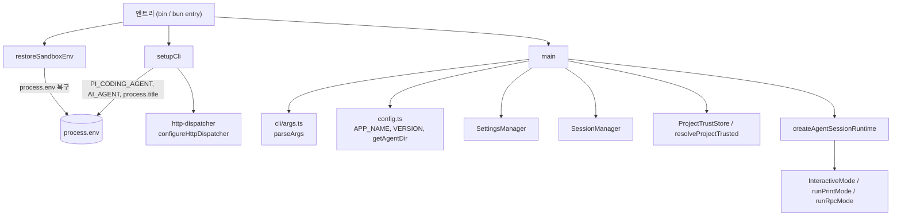
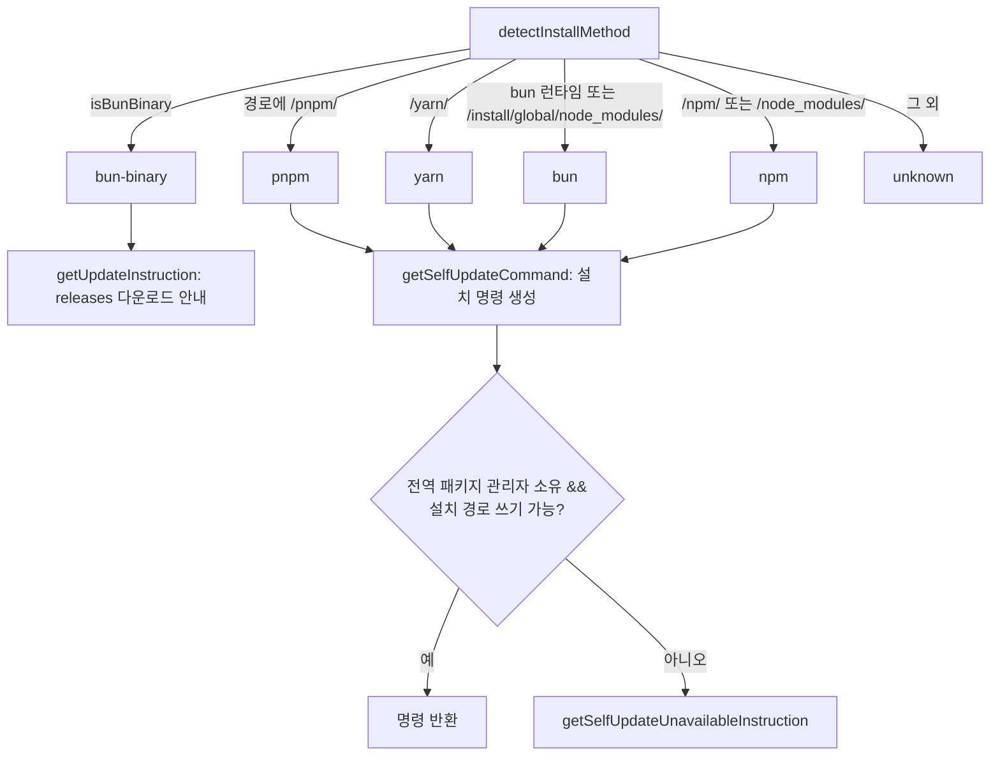
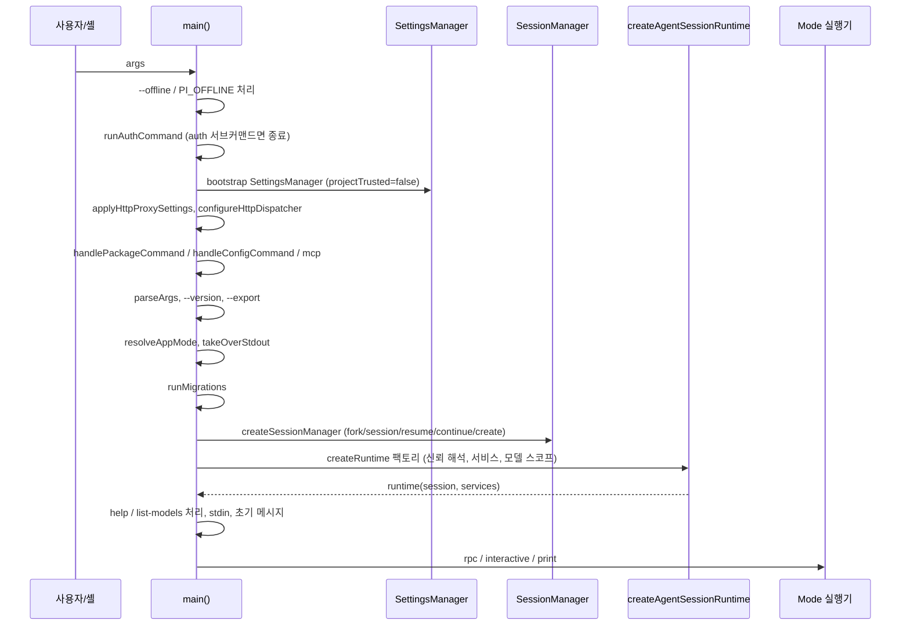

# cli_bootstrap_and_config

`packages/coding-agent`의 **CLI 부트스트랩과 설치/경로 설정** 계층이다. 프로세스가 시작될 때 환경을 정리하고(`setupCli`, `restoreSandboxEnv`), CLI 인자를 해석해 실행 모드(interactive / print / json / rpc)를 결정하며(`main`), 패키지·사용자 설정 경로와 설치 방식 감지를 제공한다(`config.ts`).

> 이 문서의 모든 근거는 제공된 소스 코드(`main.ts`, `cli/setup.ts`, `bun/restore-sandbox-env.ts`, `config.ts`) 기준이다. 외부 모듈 내부 동작은 해당 문서로 링크한다.

## 1. 구성 요소

| 파일 | 핵심 심볼 | 역할 |
|---|---|---|
| `packages/coding-agent/src/main.ts` | `main`, `createSessionManager` | CLI 오케스트레이션. 인자 파싱 → 세션/신뢰/런타임 생성 → 모드 실행 |
| `packages/coding-agent/src/cli/setup.ts` | `setupCli` | 프로세스 제목/환경변수 설정, 경고 억제, undici dispatcher 초기 설정 |
| `packages/coding-agent/src/bun/restore-sandbox-env.ts` | `restoreSandboxEnv` | Bun 컴파일 바이너리가 샌드박스에서 빈 `process.env`를 가질 때 `/proc/self/environ`으로 복구 |
| `packages/coding-agent/src/config.ts` | `getPackageDir`, `getAgentDir`, `getModelsPath`, `getPromptsDir`, `getToolsDir`, `getPackageJsonPath`, `getUpdateInstruction`, `setEmbeddedQuickJSWasmPath`, `PackageJson` 등 | 설치 방식 감지, 에셋 경로, 사용자 설정 경로, 앱 이름/버전 상수 |

## 2. 아키텍처

관련 모듈: 세션 런타임은 [agent_session_core](agent_session_core.md), 세션 영속화는 [session_persistence_and_compaction](session_persistence_and_compaction.md), 설정은 [settings_and_keybindings](settings_and_keybindings.md), 모델/인증은 [model_and_auth_management](model_and_auth_management.md), 모드 구현은 [interactive_mode_core](interactive_mode_core.md) · [rpc_mode](rpc_mode.md), 확장은 [extension_system](extension_system.md)을 참고한다.

## 3. `setupCli` / `restoreSandboxEnv`

`setupCli()`는 다음만 수행한다(코드 확인).
- `process.title = APP_NAME`
- `process.env.PI_CODING_AGENT = "true"`, `process.env.AI_AGENT = "pi"`
- `process.emitWarning`을 no-op으로 교체
- `configureHttpDispatcher()` 호출: provider SDK가 요청을 보내기 전에 undici를 설정. 실제 설정값은 `SettingsManager` 로드 후 `main`에서 다시 적용.

`restoreSandboxEnv()`는 Bun 런타임(`process.versions.bun`)이고 `process.env`가 비어 있을 때만 `/proc/self/environ`을 `\0`로 분리해 복구한다. 읽기 실패는 무시한다. 주석에 따르면 `packages/ai/src/utils/provider-env.ts`의 `getBunSandboxEnvValue()`와 동기화해야 한다(참고: [ai_utils](ai_utils.md)).

## 4. `config.ts`

### 4.1 설치 방식과 자기 업데이트

- `isBunBinary`: `import.meta.url`에 `$bunfs`, `~BUN`, `%7EBUN` 포함 여부.
- `isBundledNode`: 빌드 시 주입되는 `PI_BUNDLED_NODE`.
- 명령은 모두 `--ignore-scripts` 사용. 패키지 이름이 바뀐 경우 uninstall 후 install의 2단계(`steps`)로 구성.
- `getUpdateInstruction(packageName)`은 명령이 있으면 `Run: ...`, 없으면 사유 안내 문자열을 반환.

### 4.2 패키지 에셋 경로

`getPackageDir()` 우선순위: `PI_PACKAGE_DIR` 환경변수 → Bun 바이너리면 `dirname(process.execPath)` → `findNodePackageDir(__dirname)`(`dist/` 안에 Bun 메타데이터가 있으면 상위 패키지 루트 선택).

`getThemesDir`, `getExportTemplateDir`, `getInteractiveAssetsDir`는 Bun 바이너리면 실행 파일 옆, 아니면 `src` 존재 여부에 따라 `src`/`dist` 하위를 가리킨다. `AGENTS.md` 규칙상 에셋은 `__dirname` 직접 사용 대신 이 헬퍼를 써야 한다.

QuickJS wasm: `setEmbeddedQuickJSWasmPath`로 Bun 엔트리가 임베드 경로를 주입하고, 없으면 `quickjs-wasi/quickjs.wasm`을 `createRequire`로 해석(`getQuickJSWasmPath`). codemode worker는 런타임별로 `resolveCodemodeWorkerSpecifier`가 결정(상세: [codemode](codemode.md)).

### 4.3 앱 설정 상수와 사용자 경로

`package.json`의 `piConfig`(`PackageJson` 인터페이스)에서 값을 읽는다. 파일이 없으면(ENOENT) 기본값 사용.

| 상수 | 값 |
|---|---|
| `APP_NAME` | `piConfig.name` 또는 `"pi"` |
| `CONFIG_DIR_NAME` | `piConfig.configDir` 또는 `.pi` |
| `VERSION` | `pkg.version` 또는 `0.0.0` |
| `ENV_AGENT_DIR` / `ENV_SESSION_DIR` | `${APP_NAME.toUpperCase()}_CODING_AGENT_DIR` / `..._SESSION_DIR` |

`getAgentDir()`는 `ENV_AGENT_DIR` 또는 `~/.pi/agent`. 하위 경로: `models.json`(`getModelsPath`), `auth.json`, `settings.json`, `tools/`(`getToolsDir`), `bin/`, `prompts/`(`getPromptsDir`), `sessions/`, `themes/`, `<APP_NAME>-debug.log`.

## 5. `main()` 실행 흐름

### 5.1 서브커맨드 우선 처리
순서대로 `runAuthCommand`(자격 증명 출력·`check`; 종료 코드 ready=0, not_ready=1, invalid=2), `handlePackageCommand`(`install/update` 등; 성공 시 `process.exit`, Windows `pi update`만 자연 종료), `handleConfigCommand`, `mcp`(`loadMcpCommand` 지연 로드)를 처리한다. 하나라도 처리하면 이후 단계를 건너뛴다. (관련: [bundled_extensions](bundled_extensions.md))

### 5.2 모드 결정 (`resolveAppMode`)
| 조건 | 모드 |
|---|---|
| `--mode rpc` | `rpc` |
| `--mode json` | `json` (출력은 json) |
| `--print` 또는 stdin/stdout이 TTY 아님 | `print` |
| 그 외 | `interactive` |

interactive가 아니고 help/list-models도 아니면 `takeOverStdout()`로 stdout을 보호한다. 파이프된 stdin이 있으면 interactive는 `print`로 강등된다. RPC에서는 `@file` 인자가 오류.

### 5.3 세션 선택 (`createSessionManager`)
우선순위: `--no-session`/help/list-models → in-memory, `--fork`, `--session`, `--resume`(선택 UI), `--continue`, `--session-id`, 기본 `SessionManager.create`.
- `--fork`는 `--session/--continue/--resume/--no-session`과 충돌(`validateForkFlags`), `--session-id`는 `--session/--continue/--resume`과 충돌.
- 세션 인자가 경로처럼 보이면(`/`, `\`, `.jsonl`) 경로로, 아니면 정확한 ID → 프로젝트 내 prefix → 전역 prefix 순으로 탐색. 다른 프로젝트에서 찾으면 현재 디렉터리로 fork할지 확인한다.
- 세션 cwd가 사라졌으면 interactive는 선택 UI, 비대화형은 오류 종료.
자세한 저장 형식은 [session_persistence_and_compaction](session_persistence_and_compaction.md).

### 5.4 런타임 팩토리와 프로젝트 신뢰
`createRuntime` 팩토리는 세션 교체 시에도 재호출된다. 핵심:
1. 프로젝트 신뢰 해석: `--project-trust` 오버라이드 > 캐시 > `ProjectTrustStore`. 신뢰가 필요한 프로젝트 리소스(`hasTrustRequiringProjectResources`)가 있으면 리소스 로더 reload 중 `resolveProjectTrusted`로 결정.
2. `createAgentSessionServices`에 CLI 경로(`-e`, skills, prompt templates, themes), `--no-*` 플래그, 시스템 프롬프트 옵션, `extensionFactories`(= `builtInExtensions` + 호출자 제공) 전달.
3. 진단 수집(설정, 확장 로드 오류/경고).
4. `resolveModelScope`로 `--models`/설정의 enabled models 해석, `buildSessionOptions`로 모델·thinking·툴 옵션 조립(`--provider`는 `--model` 필요, `--model pattern:thinking` 약식 지원, `--thinking` 우선).
5. `--api-key`는 `modelRuntime.setRuntimeApiKey`로 비영속 런타임 키 설정.
6. `createAgentSessionFromServices`로 세션 생성.

모델/인증은 [model_and_auth_management](model_and_auth_management.md), 세션 코어는 [agent_session_core](agent_session_core.md) 참고.

### 5.5 실행 단계
런타임 생성 후 `setCapabilityOverrides`, 프록시/idle timeout 재적용 → `--help`(확장 플래그 포함 출력) / `--list-models` 처리 후 종료 → stdin·`@file`로 초기 메시지 준비 → 테마 초기화(`setThemeJsonValidator`, `initTheme`) → 진단 보고(오류 있으면 `-ne` 힌트와 함께 종료) → 비대화형인데 모델이 없으면 종료 → 모드 실행:
- `rpc`: 백그라운드 모델 카탈로그 refresh(15초 타임아웃, offline 제외) 후 `runRpcMode` ([rpc_mode](rpc_mode.md))
- `interactive`: `InteractiveMode` 생성 후 `run()`. `PI_STARTUP_BENCHMARK`면 `init()` 후 즉시 종료 ([interactive_mode_core](interactive_mode_core.md))
- 그 외: `runPrintMode`, 종료 코드 전파, `restoreStdout()`

`--offline`/`PI_OFFLINE`은 `PI_OFFLINE=1`, `PI_SKIP_VERSION_CHECK=1`을 설정한다.

## 6. 주요 환경변수

| 변수 | 용도 |
|---|---|
| `PI_OFFLINE`, `PI_SKIP_VERSION_CHECK` | 네트워크 작업 억제 |
| `PI_PACKAGE_DIR` | 패키지 루트 강제 지정 |
| `PI_CODING_AGENT_DIR` (`ENV_AGENT_DIR`) | agent 설정 디렉터리 |
| `PI_CODING_AGENT_SESSION_DIR` (`ENV_SESSION_DIR`) | 세션 디렉터리 (`--session-dir` > env > 설정) |
| `PI_SHARE_VIEWER_URL` | 공유 뷰어 기본 URL 변경 |
| `PI_STARTUP_BENCHMARK` | interactive 시작 시간 측정 |

## 7. 설계 메모
- 프로젝트 로컬 설정/리소스는 최종 세션 cwd가 정해진 뒤에만 해석한다(코드 주석 확인). 시작 cwd의 `SettingsManager`는 `sessionDir` 조회용이다.
- 부트스트랩용 `SettingsManager`는 `projectTrusted: false`로 생성되어 신뢰되지 않은 프로젝트 설정이 초기 프록시 설정에 영향을 주지 않는다(코드 확인; 의도는 추론).
- 빌드/패키징(`build:binary`, `build:unbundled`, `copy-assets`)이 `config.ts`의 경로 분기와 연결된다. 자세한 내용은 [coding_agent_packaging](coding_agent_packaging.md).
