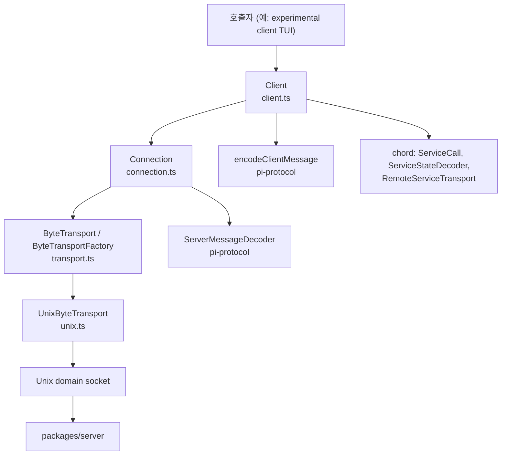
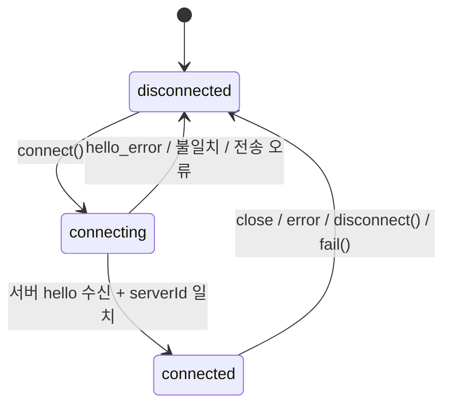
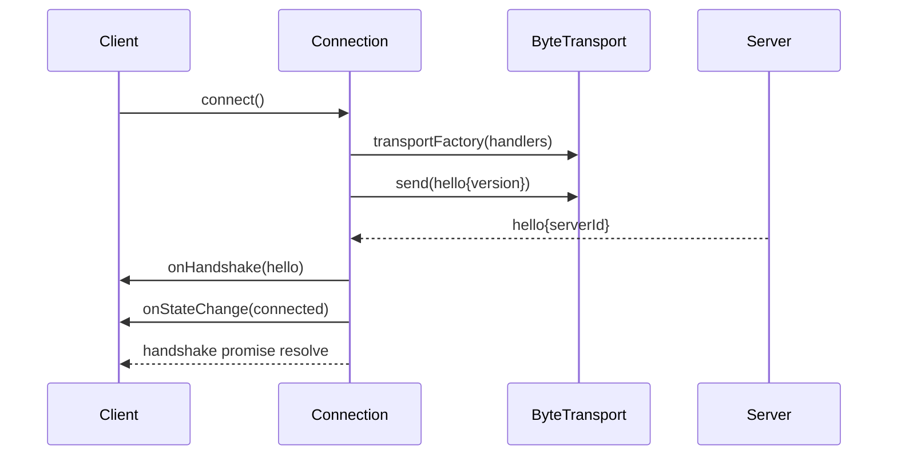
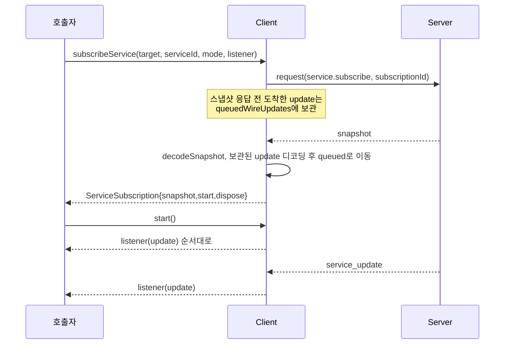
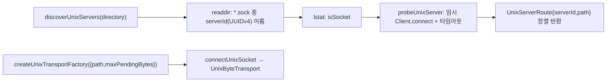

# client 모듈 (`@earendil-works/pi-client`)

`packages/client`는 원격 pi 서버/세션에 접속하기 위한 **전송 방식 중립(transport-neutral) 클라이언트**다. 길이 프레임이 붙은 CBOR 바이트 스트림 위에서 핸드셰이크, 요청/응답, 취소, 서비스 구독(`service_update`), 세션 attachment 통지를 처리한다. 실제 바이트 전송은 `ByteTransportFactory`로 주입되며, Node용 Unix 도메인 소켓 구현은 `@earendil-works/pi-client/unix`로 별도 제공된다.

- 패키지 정보: `packages/client/package.json` (ESM, `node >=22.19.0`, 의존성: `@earendil-works/chord`, `@earendil-works/pi-protocol`)
- exports: `.`(`dist/index.js`), `./unix`(`dist/unix.js`)
- 검증 수준: 아래 내용은 제공된 소스(`client.ts`, `connection.ts`, `types.ts`, `unix.ts`, 설정 파일) 기준 **코드 확인**. `errors.ts`, `transport.ts`, `promise.ts` 내용은 사용 방식으로부터의 **추론**.

## 1. 아키텍처

| 파일 | 역할 |
|---|---|
| `src/client.ts` | 공개 API `Client`. 요청 ID 관리, 응답 매칭, 취소(`AbortSignal`→`cancel` 메시지), 서비스 구독 및 순서 보장 전달, attachment 추적 |
| `src/connection.ts` | `Connection`. `disconnected → connecting → connected` 수명주기, hello 핸드셰이크, 프레임 디코딩, 실패 시 정리 |
| `src/types.ts` | `ClientOptions`, `ConnectionState`, `ServiceSubscription` 등 공개 타입 |
| `src/unix.ts` | Unix 소켓 전송(`createUnixTransportFactory`), 로컬 서버 탐색(`discoverUnixServers`) |

관련 모듈: 프로토콜/프레임/CBOR는 [protocol](protocol.md), 서비스 모델(`ServiceCall`, 복제 상태)은 [chord_services](chord_services.md), 상대편 서버는 [server](server.md), 이를 사용하는 상위 런타임은 [experimental_services_and_client](experimental_services_and_client.md)를 참고.

## 2. Connection 수명주기

핵심 동작 (`connection.ts`):
- `connect()`는 `disconnected` 상태에서만 허용된다. 아니면 `DisconnectedError("Client is already ...")`로 reject.
- 연결마다 증가하는 `id`를 두어, 이전 연결의 지연된 콜백(`onData/onClose/onError`)을 `#isCurrent(id)`로 무시한다.
- 전송이 열리면 `{type:"hello", version: PROTOCOL_VERSION}`을 먼저 보낸다. hello 전에 서버 데이터가 오면 `ProtocolValidationError`.
- 첫 서버 메시지는 반드시 `hello`여야 하며 `serverId`가 `ClientOptions.serverId`와 같아야 한다. `hello_error`는 `ServerError`로 변환된다.
- `maxFrameLength`는 1~`0xffffffff` 정수만 허용(기본 `DEFAULT_MAX_FRAME_LENGTH`).
- `#failAndClose`는 상태를 `disconnected`로 바꾸고 handshake를 reject한 뒤 transport를 `close()`한다.

### 연결 시퀀스

## 3. 요청/응답과 취소

`Client.#request(target, call, signal, transform)` 흐름:
1. disposed/미연결/이미 abort된 signal이면 즉시 reject (`ClientDisposedError`, `DisconnectedError`, abort 오류).
2. `request-N` ID를 만들고 `#pendingRequests`에 등록, `{type:"request", id, target, call}` 프레임을 인코딩해 전송.
3. 응답 `ok`면 `transform`을 거쳐 resolve, 아니면 `ServerError`로 reject. 응답에 매칭되는 요청이 없으면 프로토콜 위반으로 연결을 `fail`.
4. `AbortSignal`이 abort되면 로컬 promise를 즉시 reject하고, 이미 전송됐다면 `{type:"cancel", id, target}`을 서버로 보낸다.
5. 연결이 끊기면 모든 pending 요청이 reject된다.

`target`(`RpcTarget`)은 서버 대상 또는 `sessionId`/`attachmentId`를 가진 세션 대상이다. `#targetIsCurrent`는 대상이 현재 hello/attachment와 일치하는지 확인한다(구독 해제 시 사용).

## 4. 서비스 구독

- `ServiceSubscription.start()`는 호출자가 snapshot을 반영한 **이후** 업데이트 전달을 시작하게 하는 장치다. 그 전 업데이트는 `queued`에 쌓인다.
- 전달은 `deliveryTail` promise 체인으로 **직렬화**되어 순서가 보장된다. 리스너 예외는 `onListenerError`로만 보고되며 클라이언트 상태를 오염시키지 않는다.
- `dispose()`는 연결과 대상이 유효하면 unsubscribe 요청을 보내고 진행 중인 전달이 끝나길 기다린다.
- 디코딩 실패는 `ProtocolValidationError`로 연결 전체를 실패시킨다.
- `serviceCatalogue(target)`는 카탈로그를 조회하고 `parseServiceCatalogue`로 검증한다.
- `createClientServiceTransport(client, getTarget)`은 지연 해석되는 대상을 chord의 `RemoteServiceTransport`(`invoke`/`subscribe`)로 어댑트한다.

## 5. Attachment와 상태 통지

- 서버가 보내는 `attachment` 메시지는 `#setAttachment`로 반영되고 `onAttachmentChange` 리스너에게 전달된다. 다른 `serverId`의 attachment는 프로토콜 위반으로 연결 실패 처리.
- 연결이 `disconnected`가 되면 `hello`, attachment를 비우고 pending 요청을 reject하며 서비스 리스너를 정리한다.
- `onConnectionStateChange`는 상태 변화(`connecting/connected/disconnected` + 선택적 `error`)를 알린다.
- `dispose()`(및 `Symbol.asyncDispose`)는 멱등이며 모든 리스너/요청을 정리한다. `Client.connect(options)` 정적 팩토리는 실패 시 자동 dispose한다.
- `reconnect()`는 `connect()`의 별칭이므로 `disconnected` 상태에서만 동작한다.

## 6. Unix 전송 (`@earendil-works/pi-client/unix`)

- `createUnixTransportFactory`는 Windows에서 예외를 던지며, `maxPendingBytes`(기본 `DEFAULT_MAX_FRAME_LENGTH * 4`)로 쓰기 대기 바이트를 제한한다.
- `UnixByteTransport.send`는 `#writeTail` 체인으로 쓰기를 직렬화하고, backpressure(`drain`)와 쓰기 콜백을 모두 기다린 뒤 resolve한다. 청크는 복사(`slice`)해 보관한다. `close()`는 소켓을 destroy하며 로컬 종료를 표시해 `onClose` 중복 호출을 막는다.
- `discoverUnixServers`는 동시 프로브를 최대 16개로 제한하고 기본 타임아웃은 1,000ms다. 소켓 파일이 사라짐(`ENOENT`), 거부(`ECONNREFUSED`), 프로토콜 불일치, 버전 오류(`ServerError.code === "version"`) 등은 stale/타 서버로 보고 결과에서 제외하며, 그 외 오류는 전파한다.

## 7. 빌드·테스트 설정

- `build`: `tsc -p tsconfig.build.json` (`rootDir ./src`, `@earendil-works/pi-protocol`를 `../protocol/dist/index.d.ts`로 매핑). `typecheck`: `tsconfig.test.json`(noEmit, 워크스페이스 소스로 path 매핑).
- `test`: `vitest --run`. `vitest.config.ts`는 `source` export 조건과 `pi-protocol` → `../protocol/src/index.ts` alias를 사용해 빌드 없이 테스트한다.
- `prepublishOnly`: `clean` 후 `build`.

## 8. 설계 포인트 요약

| 관심사 | 처리 방식 |
|---|---|
| 전송 중립성 | `ByteTransportFactory` 주입, Unix 구현은 서브패스로 분리(`sideEffects: false`) |
| 오래된 콜백 | 연결 `id` 비교로 무시 |
| 프로토콜 위반 | `ProtocolValidationError` → 연결 `fail` → 모든 pending reject |
| 구독 순서 | snapshot 이전 update 버퍼링 + `start()` + promise 체인 직렬 전달 |
| 리스너 격리 | `onListenerError`로만 보고 |
