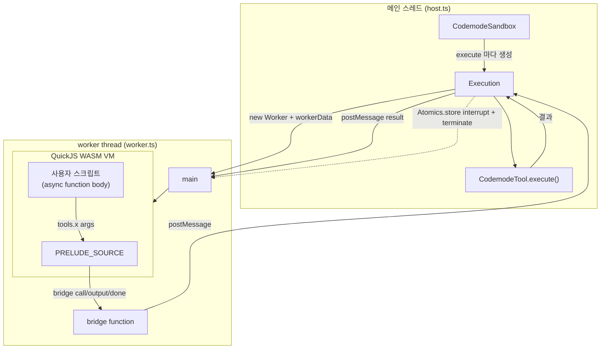
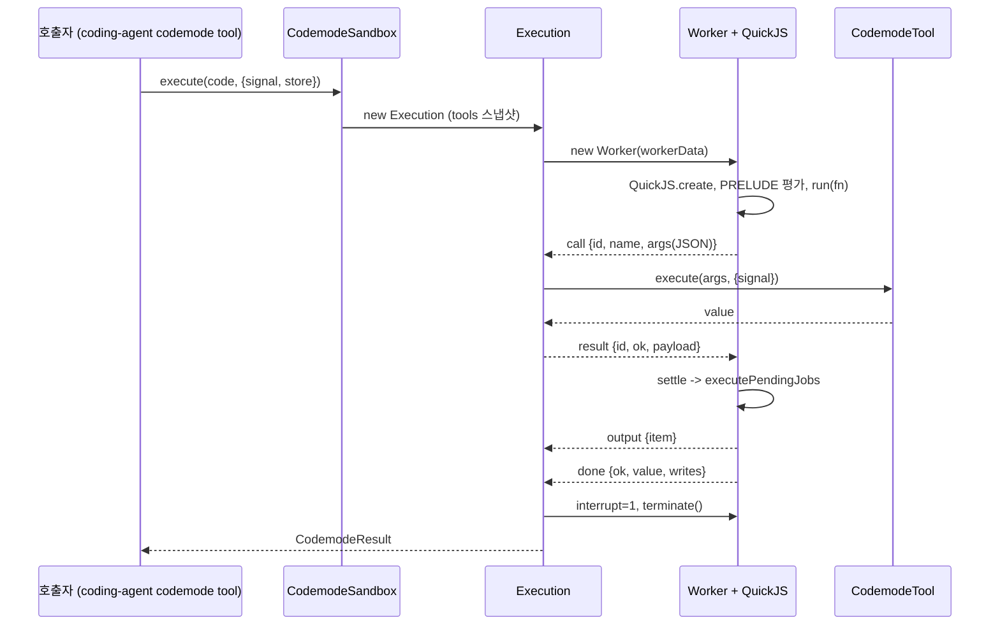
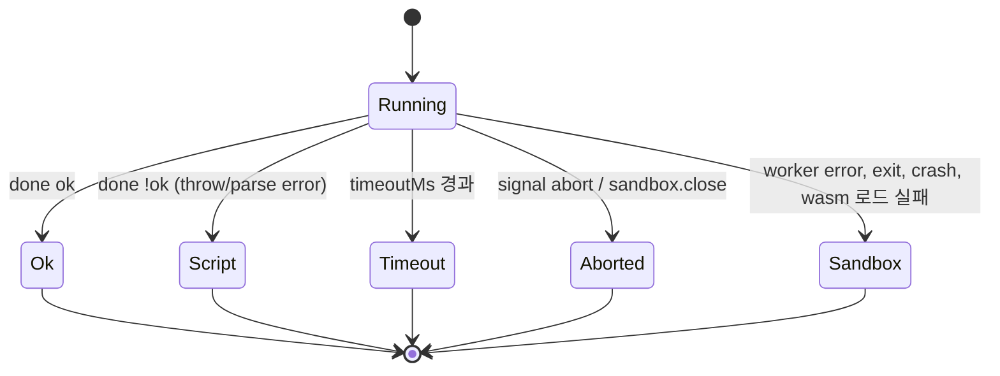

# codemode 모듈

`packages/codemode` (`@earendil-works/pi-codemode`)는 **"주입된 도구 호출만이 유일한 capability인 샌드박스 JavaScript 실행기"**다. LLM이 작성한 JS 스크립트를 QuickJS(WASM) VM에서 worker thread 안에 격리해 실행하고, 스크립트는 `tools.<name>(args)`를 통해서만 호스트 기능(파일 읽기, MCP 도구 등)을 호출할 수 있다. 타이머, `fetch`, `process`, `require`, 모듈은 존재하지 않는다.

이 모듈은 [Extensibility,_Tools_and_Integrations](Extensibility,_Tools_and_Integrations.md)의 하위 모듈이며, 실제 에이전트 툴은 `packages/coding-agent/src/extensions/codemode/*` (`createCodemodeTool`, `execute.ts`, `renderer.ts`)가 이 패키지를 감싸서 제공한다. 에이전트 루프는 [Agent_Loop_and_Session_Core](Agent_Loop_and_Session_Core.md), MCP 도구 연동은 `packages/mcp`(관련 문서: [Extensibility,_Tools_and_Integrations](Extensibility,_Tools_and_Integrations.md))를 참고한다.

> 검증 수준: 아래 내용은 `packages/codemode/src/*` 코드 확인 기준이다. `packages/coding-agent/src/extensions/codemode/*` 와의 연결은 모듈 트리 기준이며 해당 파일 내부는 미확인이다.

---

## 1. 패키지 구성

| 파일 | 역할 |
|---|---|
| `src/index.ts` | 공개 API 재노출 |
| `src/types.ts` | `CodemodeTool`, `CodemodeResult`, `CodemodeSandboxOptions` 등 타입 |
| `src/runtime/host.ts` | 메인 스레드: `CodemodeSandbox`, `Execution` (worker 수명 관리) |
| `src/runtime/worker.ts` | worker 진입점: QuickJS VM 생성, 브리지, 결과 보고 |
| `src/runtime/prelude-source.ts` | VM 내부에서 먼저 평가되는 JS(`PRELUDE_SOURCE`): `tools`, `text`, `store` 등 구성 |
| `src/runtime/protocol.ts` | host↔worker 메시지 타입과 타입가드 |
| `src/declarations.ts` | JSON Schema → TypeScript 선언 렌더링 (`renderDeclarations`) |
| `src/identifier.ts` | `toCodemodeIdentifier` (도구 이름 → JS 식별자) |
| `src/source.ts` | `// @options: {...}` 첫 줄 파싱 (`parseCodemodeSource`) |
| `src/wasm.ts` | `loadQuickJSWasm` (wasm 컴파일 캐시) |

`package.json` exports: `.`, `./declarations`, `./source`, `./worker`. 의존성은 `quickjs-wasi` 3.6.2 하나이며, Node `>=22.19.0`이 필요하다. 빌드는 `tsc -p tsconfig.build.json`(`tsconfig.base.json` 확장, `src` → `dist`), 테스트는 `vitest --run`이고 `vitest.config.ts`는 `resolve.conditions: ["source"]`로 소스를 직접 참조한다. 이 값은 `package.json`의 `exports.*.source` 조건과 짝을 이룬다.

## 2. 아키텍처



핵심 설계:

- **실행당 새 worker + 새 VM**: 폭주 스크립트(마이크로태스크 큐만 도는 경우 포함)도 `terminate()`로 종료할 수 있고 다음 실행을 오염시키지 않는다. `CodemodeSandbox`는 도구 테이블과 기본값만 보유한다.
- **JSON 문자열 경계**: 인자·결과·store는 모두 JSON 문자열로 VM 경계를 넘는다. worker는 구조화된 값을 직접 만들지 않는다.
- **WASM 모듈 공유**: `loadQuickJSWasm()`이 경로별로 한 번 컴파일하고(실패 시 캐시에서 제거해 재시도), structured clone으로 worker에 전달된다.
- **realm 보호가 아닌 capability 제한**: VM 자체가 별도 wasm 인스턴스이므로 prelude는 브리지를 클로저에 숨겨 스크립트가 직접 호출하지 못하게만 한다.

## 3. 핵심 컴포넌트

### 3.1 `CodemodeSandbox` (`runtime/host.ts`)

- 생성자 옵션(`CodemodeSandboxOptions`): `tools`, `globals`, `timeoutMs`(기본 300000, `Infinity` 가능), `memoryLimitBytes`, `wasm`, `workerUrl`.
- `globals` 검증: 이름은 `ident` 또는 `ns.member`(최대 2단계), 예약어(`tools`, `ALL_TOOLS`, `console`, `text`, `image`, `exit`, `globalThis`, `store`, `load`) 불가, 중복 및 네임스페이스 충돌 시 `Error`.
- `registerTool` (중복 이름 시 throw), `unregisterTool`, getter `tools` / `globals`.
- `execute(code, {signal, timeoutMs, store})`: 스크립트 실패는 reject하지 않고 `{ ok:false }`로 반환한다. sandbox가 닫혔다면 reject한다. 실행 시점의 도구 테이블은 `new Map(...)`으로 스냅샷된다.
- `close()`: 진행 중 실행을 `kind: "aborted"`로 종료하고 새 실행을 거부한다.
- `workerUrl` 기본값은 `import.meta.url`이 `.ts`면 `worker.ts`, 아니면 `worker.js`. 번들(예: Bun compiled executable) 환경에서는 `@earendil-works/pi-codemode/worker`를 import하는 별도 엔트리를 만들어 `workerUrl`로 넘겨야 한다.

### 3.2 `Execution` (`runtime/host.ts`, 내부 클래스)

한 번의 실행을 담당한다.

1. 타임아웃 타이머와 `AbortSignal` 리스너 등록.
2. wasm 준비 후 `Worker` 생성(`workerData`: 코드, 도구 메타, globals, wasm, 메모리 제한, store 스냅샷, `interrupt` SharedArrayBuffer).
3. worker 메시지 처리: `output`은 누적, `call`은 도구 실행, `done`은 결과 확정, `crash`는 `sandbox` 오류.
4. `finish()`가 단 한 번 실행되어 pending 호출들의 `AbortController`를 abort하고, `Atomics.store(interrupt, 0, 1)` 후 `worker.terminate()`로 정리한다.

`interrupt` 플래그는 QuickJS `interruptHandler`가 폴링한다. 주석 기준으로 Bun의 `terminate()`가 wasm 안에서 스핀하는 스레드를 멈추지 못하기 때문이다.

`handleCall`은 `target === "tool"`인 호출만 `result.calls`에 기록한다(`globals`는 기록되지 않음). 이미 `finish()`가 취소한 호출은 `cancelled` 상태로 남고 응답은 전송되지 않는다.

### 3.3 worker (`runtime/worker.ts`)

- `QuickJS.create({ wasm, memoryLimit, maxStackSize: MAX_STACK_SIZE, interruptHandler, wasi: discardOutput })`.
  - `discardOutput`: QuickJS가 fd 1/2로 쓰는 진단 출력을 버린다(TUI 화면 오염 방지). 모든 바이트를 쓴 것으로 보고해 libc 재시도를 막는다.
  - `maxStackSize`: 깊은 재귀가 wasm trap이 아닌 잡을 수 있는 `RangeError`가 되게 한다.
- `bridge(kind, a, b, c)`: `call` / `global` → `type: "call"`, `output` → text/image 아이템, `done` → 성공/실패.
- 스크립트는 `(async (tools, console) => {<code>\n})`로 감싸 평가한다. 접두부가 첫 줄에 붙어 오류 줄 번호가 원본과 일치한다. 파싱 오류(`JSException`)는 `done ok:false`로 보고된다.
- 호스트의 `result` 메시지가 오면 `settle` 후 `drain()`(`executePendingJobs` + `stalled`)을 호출한다.
- `stalled()`: 보류 중 호출이 없는데 끝나지 않은 스크립트는 영원히 재개될 수 없으므로 "never settle" 오류로 종료한다(타이머가 없기 때문).

### 3.4 Prelude가 만드는 스크립트 전역 (`runtime/prelude-source.ts`)

| 전역 | 설명 |
|---|---|
| `tools` | 도구 호출 객체(frozen). `tools.<jsName>`과 `tools["<원래이름>"]` 둘 다 지원. 존재하지 않는 멤버는 비슷한 이름 제안과 함께 `TypeError`를 던지는 `Proxy`. 정규화 후 이름이 충돌하면 먼저 등록된 도구가 우선 |
| `ALL_TOOLS` | `{ name, description }[]` |
| `text(v)`, `console.*` | 텍스트 출력 아이템 추가. 비문자열은 JSON |
| `image(v)` | base64 `data:` URL, `{image_url}`, MCP `ImageContent` 허용. http(s) URL 거부, PNG/JPEG/GIF/WebP 시그니처 검증 |
| `exit()` | 성공으로 즉시 종료(내부 `EXIT` throw) |
| `store(k, v)`, `load(k)` | 동기 key-value. 값당 `MAX_STORE_VALUE_CHARS`(256K), 전체 `MAX_STORE_TOTAL_CHARS`(1M) 제한. `store(k, undefined)`는 삭제 |
| globals | `spread` 옵션이면 인자 배열 전체 전달. `a.b` 이름은 frozen 네임스페이스 `a`로 묶임 |

### 3.5 `declarations.ts`

LLM 프롬프트에 넣을 TypeScript 선언을 생성한다.

- `renderDeclarations({ tools, globals })`: `declare const tools: {...}`, `declare function ...`, `declare const ns: {...}`.
- `schemaToType`: JSON Schema → TS. 지원: `$ref`(로컬만, 순환/원격은 `unknown`, 확장 최대 `MAX_REF_EXPANSIONS`=32), `const`, `enum`, `anyOf/oneOf/allOf`, 배열/튜플, 객체(속성 이름순 정렬, 설명이 있으면 `//` 주석으로 여러 줄). `maxChars` 초과 시 `unknown`.
- `renderToolSignature` / `renderToolSample`: 입력 타입 길이 제한(`DEFAULT_INPUT_SCHEMA_MAX_CHARS`=16000).
- MCP `CallToolResult` 출력 스키마를 감지(`mcpStructuredContentSchema`)해 `CallToolResult<T>`로 렌더링하며, 이때 `MCP_TYPESCRIPT_PREAMBLE`이 필요하다.

### 3.6 `source.ts`

`parseCodemodeSource(input)`은 선택적 첫 줄 `// @options: {"max_output_tokens":N,"timeout_ms":N}`를 분리한다. 옵션 줄은 빈 줄로 치환되어 줄 번호가 유지된다. 허용 필드 외 키, 잘못된 JSON, `timeout_ms` 범위 초과(0 또는 `2_147_483_647` 초과)는 `CodemodeSourceError`. `CODEMODE_SOURCE_GRAMMAR`는 grammar-constrained 도구 입력을 지원하는 provider용 Lark 문법이다.

## 4. 실행 시퀀스



## 5. 종료 조건과 결과 모델



`CodemodeResult`:

- 성공: `{ ok: true, value, output, calls, storeWrites: { set, delete } }`
- 실패: `{ ok: false, error: { kind: "script" | "timeout" | "aborted" | "sandbox", name?, message, stack? }, output, calls }`

실패해도 `output`은 실패 시점까지 보존된다. `storeWrites`는 성공 실행에서만 보고되며 영속화는 호출자의 책임이다. `CodemodeToolContext.signal`은 스크립트 종료(await하지 않은 호출 포함), 타임아웃, 호출자 abort, sandbox close 시 abort된다.

## 6. 사용 예

```ts
import { CodemodeSandbox, renderDeclarations } from "@earendil-works/pi-codemode";

const sandbox = new CodemodeSandbox({
  tools: [{ name: "read", description: "Read file", execute: async (a) => readFile(a) }],
  timeoutMs: 30_000,
});
const prompt = renderDeclarations({ tools: sandbox.tools, globals: sandbox.globals });
const result = await sandbox.execute(`text(await tools.read({ path: "package.json" }))`);
await sandbox.close();
```

## 7. 설계상 유의점

- 도구가 던진 예외는 스크립트에서 같은 메시지의 `Error`로 재현된다. 스택은 전달되지 않는다.
- 인자와 반환값은 JSON round trip을 거치므로 `undefined`, 함수, 순환 참조 등은 보존되지 않는다.
- `inputSchema`/`outputSchema`는 선언 렌더링에만 쓰이며 런타임 검증은 하지 않는다.
- `memoryLimitBytes` 미설정 시 wasm32 4 GiB 주소 공간이 상한이다.
- 이 패키지는 보안 경계 자체를 도구 권한에 위임한다: 스크립트가 할 수 있는 일은 등록된 `tools`/`globals`가 허용하는 범위로 제한된다(코드 확인).
