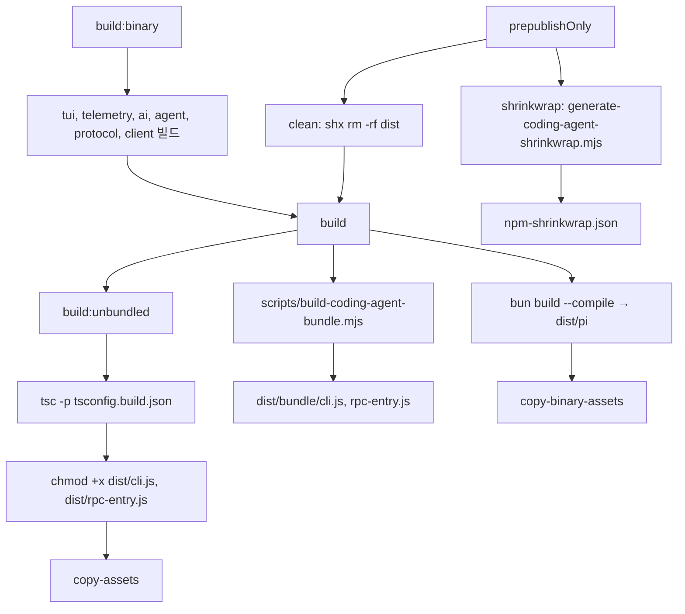
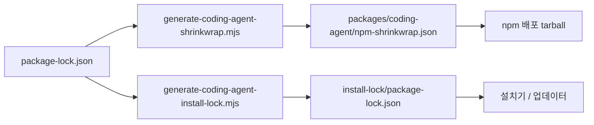
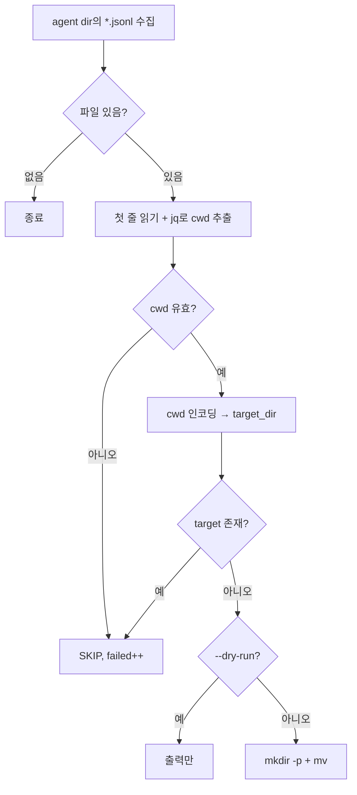
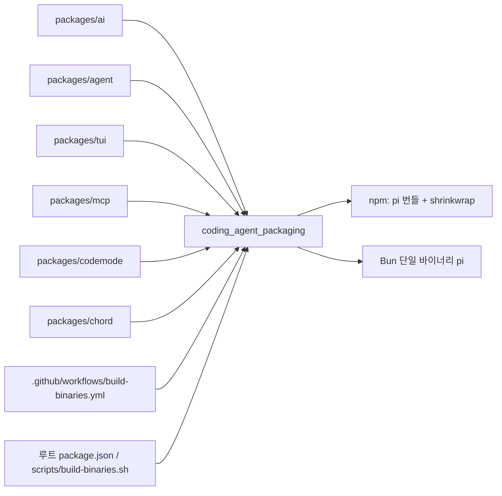

# coding_agent_packaging

`packages/coding-agent`(`@earendil-works/pi-coding-agent`, 바이너리 `pi`)를 npm 패키지, 번들, 단일 실행 바이너리로 배포하기 위한 패키징 모듈이다. 구성 요소는 세 가지다.

- `packages/coding-agent/package.json`: 빌드 스크립트, 엔트리포인트, 배포 파일 목록, 의존성 정의
- `packages/coding-agent/install-lock/package.json`: 설치기/업데이터가 사용하는 lockfile 루트 (private 패키지)
- `packages/coding-agent/scripts/migrate-sessions.sh`: v0.30.0 버그로 잘못 저장된 세션 파일을 이전하는 일회성 마이그레이션 스크립트

> 검증 수준: 아래 내용은 제공된 파일과 `scripts/*coding-agent*.mjs` 일부(앞부분)를 직접 읽고 작성했다(코드 확인). 스크립트 후반부 동작은 미확인이다.

관련 모듈: [Build,_Release,_CI_and_Quality_Infrastructure](Build,_Release,_CI_and_Quality_Infrastructure.md)(워크플로·루트 빌드 설정), [Agent_Loop_and_Session_Core](Agent_Loop_and_Session_Core.md)(세션 저장 형식), [LLM_Provider_Abstraction_and_Auth](LLM_Provider_Abstraction_and_Auth.md), [Terminal_UI_Framework](Terminal_UI_Framework.md), [Extensibility,_Tools_and_Integrations](Extensibility,_Tools_and_Integrations.md), [Experimental_Server_and_Client_Runtime](Experimental_Server_and_Client_Runtime.md).

## 1. 패키지 매니페스트 (`packages/coding-agent/package.json`)

| 항목 | 값 / 의미 |
|---|---|
| `name`, `version` | `@earendil-works/pi-coding-agent`, `1.0.0` |
| `type` | `module` (ESM) |
| `piConfig.configDir` | `.pi` — 사용자 설정 디렉터리 이름 |
| `bin.pi` | `dist/bundle/cli.js` (번들된 CLI) |
| `main` / `types` | `./dist/index.js` / `./dist/index.d.ts` |
| `engines.node` | `>=22.19.0` |

### exports

| 서브패스 | 대상 | 비고 |
|---|---|---|
| `.` | `dist/index.js` + 타입 | 라이브러리 SDK 진입점 |
| `./rpc-entry` | `dist/bundle/rpc-entry.js` | RPC 모드 번들 진입점 (→ [User-Facing_Modes_(Interactive_and_RPC)](User-Facing_Modes_(Interactive_and_RPC).md)) |
| `./client` | `./src/client/index.ts` (`source` 조건) | 소스로만 노출, 빌드 제외 |
| `./experimental/plugin` | `./src/experimental/plugin.ts` (`source` 조건) | 소스로만 노출, 빌드 제외 |

### 배포 파일 (`files`)

`dist`, `docs`, `examples`, `containerization.md`, `CHANGELOG.md`, `npm-shrinkwrap.json`. 단 `dist/client`, `dist/experimental`, `dist/cli/experimental`은 제외(`!`)한다. `tsconfig.build.json`도 `src/client`, `src/experimental`, `src/cli/experimental`을 컴파일에서 제외하므로, 실험적 서버/클라이언트 런타임은 npm 배포물에 포함되지 않는다.

### 의존성 정책

- 내부 패키지는 `^1.0.0` 범위: `chord`, `pi-agent-core`, `pi-ai`, `pi-codemode`, `pi-mcp`, `pi-tui`.
- 외부 직접 의존성은 정확한 버전으로 고정(`undici` 8.10.2, `typebox` 1.3.27, `jiti` 2.7.0, `quickjs-wasi` 3.6.2 등). 루트 `AGENTS.md`의 "Direct external deps stay pinned" 규칙과 일치하며 `check:pinned-deps`로 검증된다(루트 `package.json`).
- `pi-client`, `pi-protocol`, `pi-server`는 `devDependencies`에만 있다(실험 코드용).
- `overrides.protobufjs = 7.6.6`: 설치 트리에서 protobufjs 버전 고정. `install-lock/package.json`에도 동일하게 있다.

## 2. 빌드 파이프라인



| 스크립트 | 동작 |
|---|---|
| `clean` | `dist` 삭제 |
| `build` | `build:unbundled` 후 `scripts/build-coding-agent-bundle.mjs` 실행 |
| `build:unbundled` | `tsc -p tsconfig.build.json`, 실행 권한 부여, `copy-assets` |
| `copy-assets` | 테마 JSON, PNG 에셋, export-html 템플릿(`template.html/.css/.js`)과 `vendor/*.js`를 `dist/`로 복사 |
| `build:binary` | 의존 패키지(tui → telemetry → ai → agent → protocol → client)를 순서대로 빌드 → `npm run build` → `bun build --compile`로 `dist/pi` 생성(`dist/bun/cli.js`, `image-resize-worker.ts`, `codemode/worker.ts`를 엔트리로) → `copy-binary-assets` |
| `copy-binary-assets` | 단일 바이너리 옆에 필요한 리소스 복사: `package.json`, `README.md`, `CHANGELOG.md`, `theme/`, `assets/`, `export-html/`, `docs`, `examples`, `photon_rs_bg.wasm` |
| `shrinkwrap` | `scripts/generate-coding-agent-shrinkwrap.mjs` — `npm-shrinkwrap.json` 생성 |
| `prepublishOnly` | `clean` → `build` → `shrinkwrap` |
| `test` | `vitest --run` |

에셋 복사 경로가 두 가지(`dist/modes/interactive/theme` vs `dist/theme`)인 이유는 npm 설치물과 Bun 단일 바이너리가 에셋을 찾는 위치가 다르기 때문이다(추론). 루트 `AGENTS.md`는 에셋 경로를 `src/config.ts`의 헬퍼(`getPackageJsonPath`, `getPromptsDir` 등)로만 해석하도록 규정하며, 이 헬퍼가 소스 체크아웃/npm/바이너리 세 환경을 구분한다.

### 번들 스크립트 (`scripts/build-coding-agent-bundle.mjs`)

esbuild 기반이며 코드로 확인한 핵심은 다음과 같다.

- `platform: "node"`, `format: "esm"`, `target: "node22.19"`, `define: { PI_BUNDLED_NODE: "true" }`, 소스맵 없음, 구문/공백 minify.
- `external`로 `@earendil-works/chord`와 `@silvia-odwyer/photon-node`(WASM)를 번들에서 제외.
- `validateExternalImports`: 외부로 남은 import가 Node 내장 모듈 또는 허용 목록(`allowedExternalPackages`: chord 서브패스, photon-node, jiti, 선택적 네이티브 가속기 `bufferutil`/`utf-8-validate`, `kerberos`, `supports-color`)에 없으면 빌드를 실패시킨다.
- `lazyJitiPlugin`: 소스의 `jiti/static`(Bun에서 Babel 변환 포함용)을 Node 패키지에서는 지연 `require("jiti")`로 치환 → 확장(extension)을 import할 때만 jiti 로드.
- `httpsProxyAgentNamedExportPlugin`: 동적 import된 `https-proxy-agent`에 named export를 보장.
- `tsconfigRaw: {}`: 모노레포 소스용 경로 alias를 쓰지 않아, 릴리스 빌드가 설치된 npm 패키지와 동일하게 해석되도록 한다.

## 3. 설치 lockfile 루트 (`install-lock/package.json`)

```json
{ "name": "@earendil-works/pi-coding-agent-install", "private": true,
  "dependencies": { "@earendil-works/pi-coding-agent": "1.0.0" },
  "overrides": { "protobufjs": "7.6.6" }, "engines": { "node": ">=22.19.0" } }
```

설치기/업데이터가 `pi-coding-agent`를 정확히 `1.0.0`으로 설치할 때 재현 가능한 의존성 트리를 얻도록 하는 lockfile 루트다. `scripts/generate-coding-agent-install-lock.mjs`가 루트 `package-lock.json`에서 `install-lock/package-lock.json`을 생성하며, `npm-shrinkwrap.json` 생성기(`generate-coding-agent-shrinkwrap.mjs`)와 동일한 install-script 허용 목록(`@google/genai@2.21.0`, `esbuild@0.28.2`, `protobufjs@7.6.6`)을 쓴다. 두 스크립트 모두 `--check` 옵션으로 검증만 수행한다. 루트의 `check:shrinkwrap`, `check:install-lock:coding-agent`가 이를 호출한다(루트 스크립트 이름만 확인, 내용 미확인).



AGENTS.md 규칙: shrinkwrap 재생성은 `node scripts/generate-coding-agent-shrinkwrap.mjs`, 라이프사이클 스크립트가 있는 새 의존성은 허용 목록에 명시적으로 추가해야 하며 조용히 추가하면 안 된다.

## 4. 세션 마이그레이션 (`scripts/migrate-sessions.sh`)

v0.30.0 버그로 `~/.pi/agent/*.jsonl`에 저장된 세션을 `~/.pi/agent/sessions/<encoded-cwd>/`로 옮긴다.

- 사용법: `./migrate-sessions.sh [--dry-run]`. 에이전트 디렉터리는 `PI_AGENT_DIR` 환경변수(기본 `$HOME/.pi/agent`).
- 각 파일의 첫 줄(세션 헤더)에서 `jq`로 `.cwd`를 추출. 읽기 실패, 잘못된 JSON, `cwd` 없음, 대상 존재 시 `SKIP`.
- 인코딩: 선행 `/` 제거 → `/ : \`를 `-`로 치환 → `--...--`로 감싼다. 예: `/Users/a/proj` → `--Users-a-proj--`.
- 마지막에 `Migrated` / `Skipped` 개수 출력.



주의: 스크립트는 `set -e` 상태에서 `((failed++))`를 쓴다. 카운터가 0일 때 후위 증가 식의 값이 0이라 종료 코드 1이 되어 스크립트가 중단될 수 있다(bash 동작에 따른 추론, 실행 미확인).

세션 파일 형식과 현재 저장 로직은 [Agent_Loop_and_Session_Core](Agent_Loop_and_Session_Core.md)의 `session_persistence_and_compaction`(`SessionManager`)을 참조한다.

## 5. 시스템 내 위치



CI의 바이너리 빌드·npm 게시(`build-binaries.yml`의 `build`, `publish-npm`, `smoke-test-binaries`)는 이 패키지의 스크립트를 호출한다. 자세한 워크플로는 [Build,_Release,_CI_and_Quality_Infrastructure](Build,_Release,_CI_and_Quality_Infrastructure.md) 참조.
