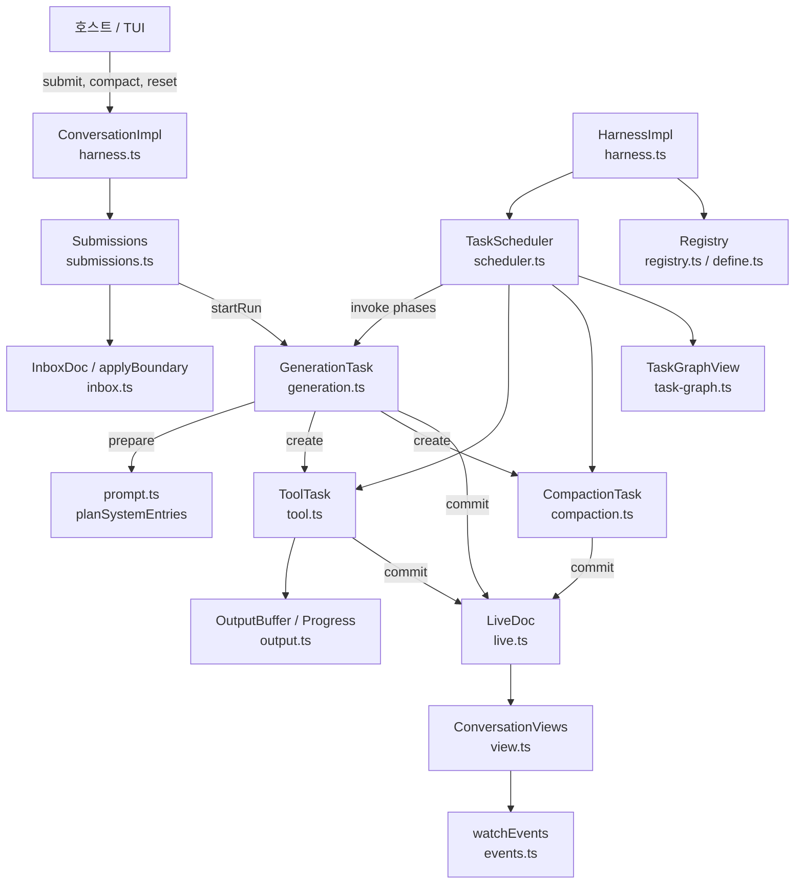
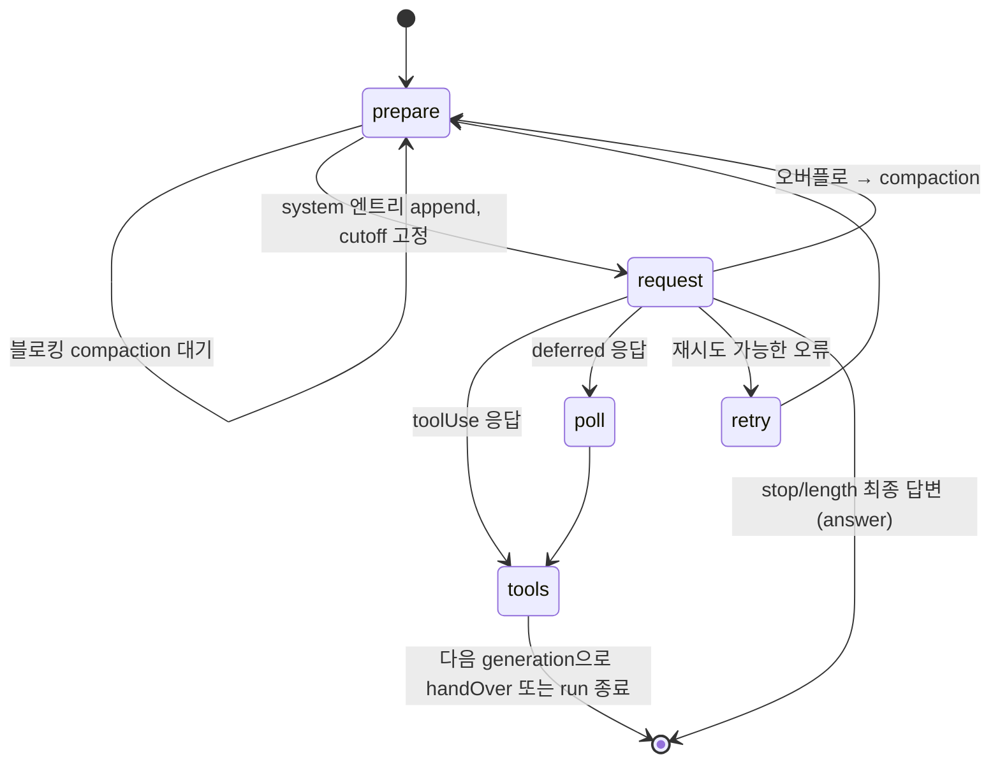
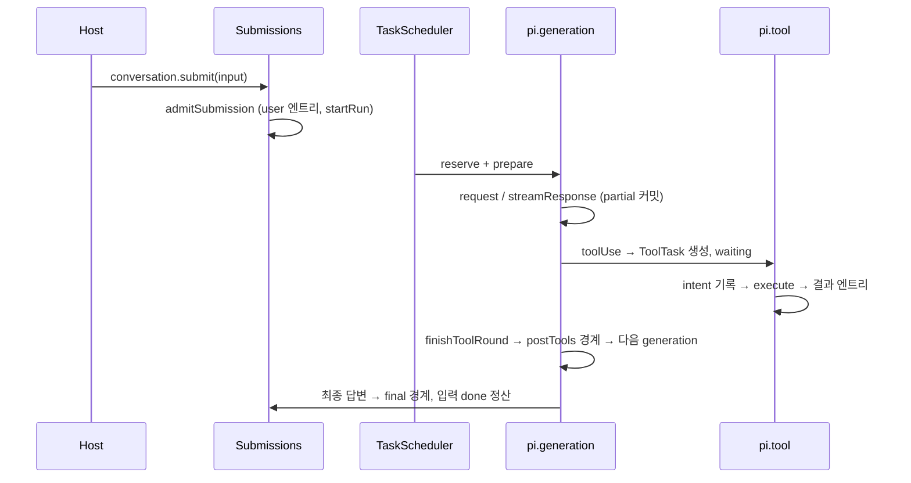

# durable_harness

`packages/durable/src/harness/` 하위 파일들로 구성된 **내구성(durable) 에이전트 하네스**의 핵심 모듈이다. 대화(conversation)·제출(submission)·태스크(task)를 모두 Session(트랜잭션 로그) 위의 커밋된 상태로 저장하여, 프로세스가 중단되어도 재개(resume)할 수 있는 LLM 에이전트 루프를 제공한다.

관련 모듈 (같은 `Durable_Agent_Harness` 트리):
- `durable_session_and_schema`: Session, 트랜잭션, `defineDoc`/`defineEntry`/`defineTask` 스키마 정의
- `durable_storage`: JSONL / Memory / SQLite 스토리지
- `durable_tools`: bash/read/write/edit 도구 구현
- `durable_testing_and_build`, `experimental_durable_harness`: 테스트·벤치마크 및 CLI/TUI 진입점

이 모듈은 리프(leaf) 모듈이라 별도 하위 문서 없이 본 문서 하나로 설명한다.

## 1. 핵심 개념

| 개념 | 설명 |
|---|---|
| Harness | `SessionImpl`을 확장한 `HarnessImpl`. 레지스트리, 스케줄러, 제출 큐, 뷰를 묶는다. `Harness.open()`으로 연다. |
| Conversation | 상태 없는 핸들(`ConversationImpl`). `submit`, `compact`, `reset`, `fork`, `abort`, `watch` 제공. |
| Submission | 호스트가 내구적으로 접수한 입력(`input`) 또는 수동 엔트리 쓰기(`write`). |
| Task | 체크포인트 단계(phase)로 진행되는 내구성 작업. 내장: `pi.generation`, `pi.tool`, `pi.compaction`. |
| Extension / Registry | 도구·프롬프트 섹션·훅·태스크를 묶은 확장. `createRegistry()`로 만들고 실행 중 install/uninstall 가능. |
| Live 문서 | `pi.live`, `pi.inbox`, `pi.agent`, `pi.usage` — 대화별 내장 문서. |

## 2. 아키텍처

모든 상태 전이는 Session 라인(직렬화된 커밋 콜백) 위에서 결정·기록되며, 핸들러는 라인 밖에서 실행된다. 관찰자(뷰, 이벤트, 태스크 그래프)는 커밋 publication으로부터 파생된다.

## 3. 구성 요소

### 3.1 harness.ts — Harness / Conversation
- `HarnessImpl`: `resolveAgent`, `buildEnv`, `inspect`, `usage`, `abortTask`, `waitForTask`, `waitForIdle`, `watchTaskGraph`. 대화 생성 시 `conversationCreated` 훅에서 `pi.live`, `pi.inbox`, `pi.usage`, `pi.agent`를 초기화한다.
- `Harness.open()`: 레지스트리에 내장 태스크(`BUILTIN_TASKS`)가 있는지 검사하고 `openTasks`로 남아 있던 `running` 태스크를 `pending`으로 되돌린다.
- `boundConversation`: 태스크/도구에 주는 invocation 바인딩 핸들. invocation이 끝나면 모든 연산이 거부된다.
- `ConversationImpl`: `fork`, `reset`(head: "self" 쓰기 제출), `compact`(수동 compaction 태스크 생성), `viewState`/`watch`.

### 3.2 submissions.ts / inbox.ts — 입력 접수와 경계(boundary)
- `admitSubmission`: 한 커밋 안에서 requestId 중복 확인 → 바쁜 대화면 `pi.inbox`에 큐잉(`whenBusy: reject`면 `ConversationBusy`) → idle이면 user 엔트리를 추가하고 `startRun`.
- `applyBoundary(tx, boundary, "postTools" | "final", now)`: 큐된 write, steer, follow-up을 `steeringMode`/`followUpMode`(`all` | `one-at-a-time`)에 따라 배치한다. reset write는 `postTools`를 `final`로 승격하고, 활성 범위 이전을 가리키는 head write는 `stale`로 정산한다.
- `withdrawQueuedInputs`: 대화 abort 시 큐된 input을 `aborted`로 정산(write는 유지).
- `Submissions.wait/abort/status`와 `SubmissionHandle`.

### 3.3 scheduler.ts — TaskScheduler
- `#live`가 커밋된 비종료 태스크(pending/running/waiting/completing)를 미러링.
- 소유권 트리(태스크 → 소유 태스크 또는 대화)를 따라 abort 전파, `failFast` 대기, idle 판정, `completing` 보류 결과의 최종화(`#finalize`)를 수행한다.
- 한 invocation 단계: `#step`이 라인에서 규칙(종료/waiting/close/abort mark/미처리 오류/진행 없음 fault)을 적용 후 phase 핸들러를 실행. 체크포인트가 변하지 않으면 "durable progress 없음"으로 fault 처리.
- 레지스트리 스냅샷으로 정의 버전을 해석하고(`missing_task`, `task_too_old`, `migration_failed`), 불가능하면 abort 시 `orphaned`로 종료한다.
- `#runtime`이 phase 핸들러에 `commit`, `memo`, `sleep`, `watchDoc`, `snapshot`, `context`, `hooks` 등을 제공한다.

### 3.4 generation.ts — GenerationTask (`pi.generation`)

- `prepare`: 섹션 렌더링 + `planSystemEntries`로 위치형 `pi.system` 엔트리 추가, `thresholdCompaction`이 `blocking`/`background` compaction 결정.
- `request`: `beforeRequest` 훅 후 `streamResponse`. 부분 응답은 100ms 스로틀로 `pi.live.generation.message`에 커밋.
- `classify`: 응답을 한 커밋에서 분류(deferred/도구/최종/오버플로/재시도/실패).
- `startToolRound`, `finishToolRound`: 도구 태스크 생성(병렬 또는 순차)과 `terminate`/`handoff`/`addTools` 제어 처리.
- `convertPartial`: 중단된 부분 응답을 `aborted` assistant 엔트리로 보존.

### 3.5 tool.ts — ToolTask (`pi.tool`)
`call` 단계에서 도구 해석 → `prepareArguments` → 검증 → `beforeTool` → intent(`execute` 체크포인트, `replay`) 기록 → 실행 → `afterTool` → 결과 엔트리 append. 복구 시 `execute` 단계는 저장·현재 정책이 모두 `safe`일 때만 재실행하고, 아니면 "interrupted" 오류 결과로 `failed` 종료한다. 진행 출력은 `OutputBuffer`/`Progress`로 제한·스로틀한다.

### 3.6 compaction.ts — CompactionTask (`pi.compaction`)
`select`(`selectCut`으로 유지할 최근 토큰 기준 절단점 선택, `beforeCompact` 훅) → `summarize`(요약 모델 호출, 사용량 기록) → `retry`(내구적 백오프). 요약은 `
` 사용자 메시지를 가진 `pi.compaction` 엔트리(`head: firstKept`)로 배치된다. 블로킹이면 generation이 직접 append, 대화 소유면 write 제출로 접수된다.

### 3.7 prompt.ts / define.ts / registry.ts
- `renderSections`, `replaySections`, `planSystemEntries`: 섹션·도구 변경을 최소 패치 엔트리로 계획(순서가 달라지면 전체 제거 후 재추가, head marker 뒤에는 완전 baseline).
- `defineTool`, `defineExtension`, `section`, `hook`, `wrapTool`, `wrapSection`: 타입 지정용 항등 함수와 래퍼 선언.
- `RegistryImpl`/`RegistryState`: 불변 스냅샷 발행, 태스크 이름 충돌·섹션 키 검증.

### 3.8 live.ts / view.ts / events.ts / task-graph.ts — 관찰
- `LiveDoc`(`pi.live`): run 제어, generation 부분 응답, `ToolSlot`, `CompactionStatus`. `settleSchedulerOutcome`은 스케줄러가 쓴 `faulted`/`orphaned` 결과의 정리를 담당한다.
- `ConversationViews`: 대화별 마운트(엔트리 + 내장 문서)를 커밋 publication으로 갱신.
- `watchEvents`: 뷰 변화를 `AgentEvent`(run/turn/message/tool_execution/compaction 등)로 변환. 오버플로 시 최신 snapshot으로 대체.
- `TaskGraphView`: 살아 있는 모든 태스크와 소유 관계의 읽기 전용 상태.

### 3.9 output.ts / util.ts
`OutputBuffer`(head/tail 보존, 바이트·줄 제한, 누락량 정확 집계), `Progress`(첫 변경 즉시, 이후 100ms + 100KiB/s 적응형 커밋), `Waiters`, `scanAll`.

## 4. 대표 실행 흐름

## 5. 설계 포인트
- **모든 쓰기는 커밋**: 부분 응답, 도구 진행, compaction 상태까지 `pi.live`에 커밋되어 복구 가능.
- **Single writer**: 바쁜 대화에는 Harness만 쓴다. 외부 입력은 항상 `pi.inbox` 경계를 거친다.
- **Usage 원장**: `appendAssistant`, `appendToolResult`, compaction이 `recordUsage`를 같은 커밋에서 호출한다.
- **검증 수준**: 위 내용은 제공된 소스 코드 직접 확인(코드 확인) 기반이며, `agent.ts`, `context.ts`, `usage.ts`, `json.ts`의 세부 구현은 제공되지 않아 미확인이다.
