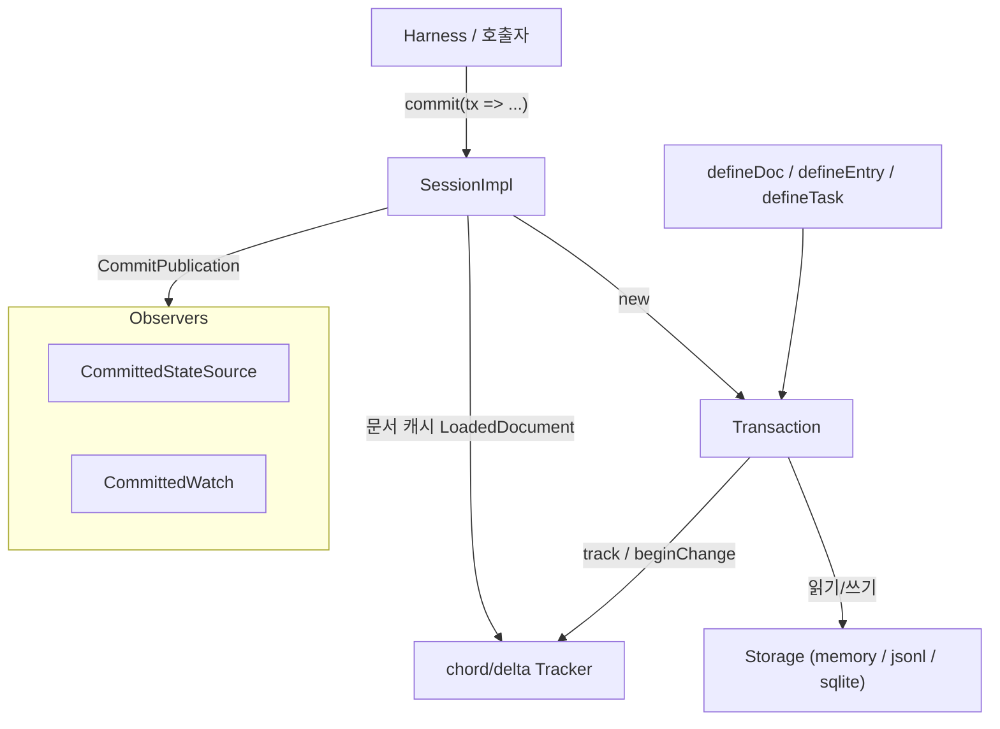
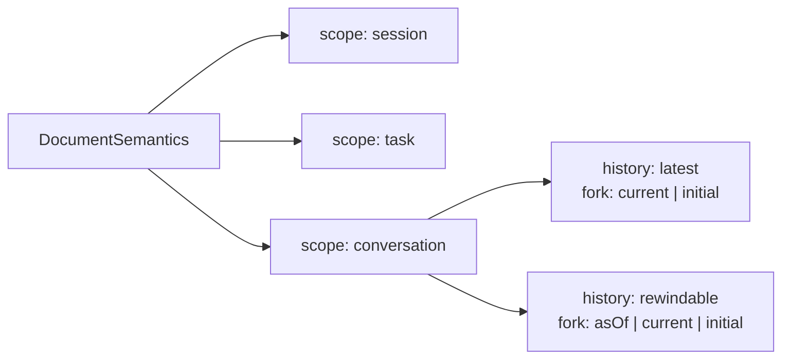
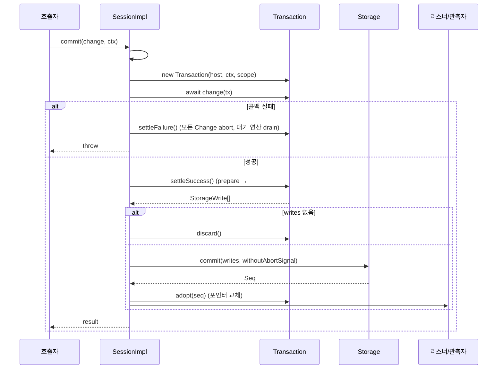
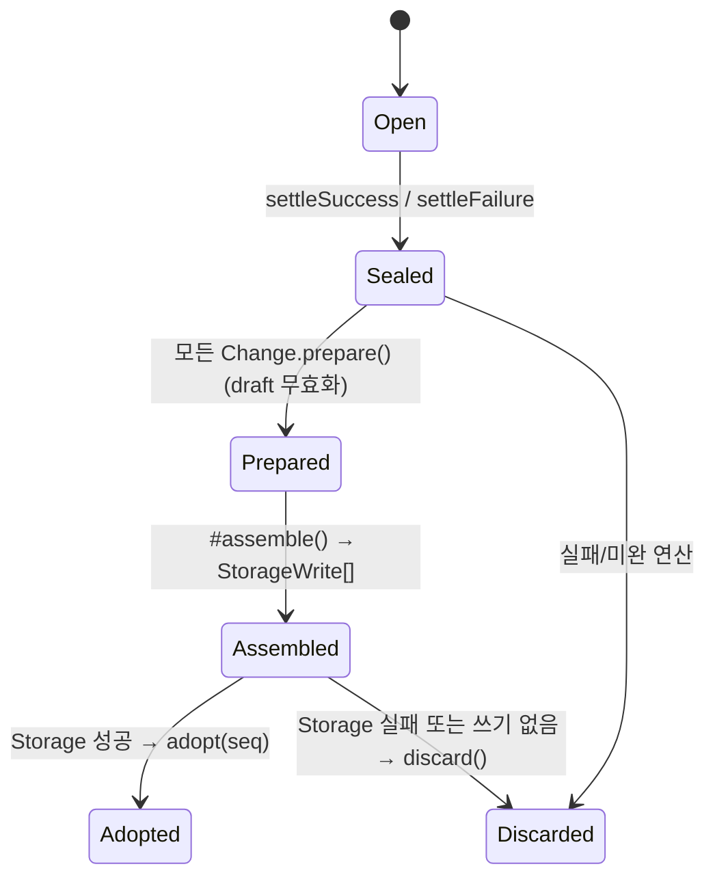
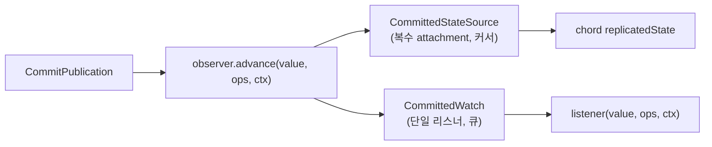

# durable_session_and_schema

`packages/durable`의 기반 계층이다. 영속 데이터 모델(문서·엔트리·태스크·제출 타입)을 정의하고, 단일 변경 라인(mutation line) 위에서 원자적 트랜잭션과 커밋 후 관측(observation)을 제공하는 `Session` 커널을 담는다. 상위 계층 [durable_harness](durable_harness.md)는 이 위에 대화·스케줄러·생성 루프를 올리고, 하위 계층 [durable_storage](durable_storage.md)는 `Storage` 인터페이스의 구현(memory/JSONL/SQLite)을 제공한다. 문서 변경 추적과 복제 상태는 [chord_delta](chord_delta.md), [chord_services](chord_services.md)(`@earendil-works/chord`)에 의존한다.

검증 수준: 아래 내용은 제공된 소스 코드(`documents.ts`, `entries.ts`, `tasks.ts`, `types.ts`, `session/*.ts`)를 직접 읽은 **코드 확인**이다. `./ids.ts`, `./errors.ts`, `./session/forks.ts`의 세부 동작은 **미확인**이다.

## 1. 구성 요소

| 파일 | 역할 |
|---|---|
| `src/types.ts` | 모든 영속 레코드·`Session`·`Storage`·`Tx` 계약 |
| `src/documents.ts` | `defineDoc` / `defineDocFamily`, 주소 해석, 버전·스코프 검사, 마이그레이션 |
| `src/entries.ts` | `defineEntry` 및 내장 엔트리 종류 6개 |
| `src/tasks.ts` | `defineTask` (실행 가능한 태스크 상태 기계 정의) |
| `src/session/session.ts` | `SessionImpl`, `createSession` — 변경 라인, 문서 캐시, 발행 |
| `src/session/transaction.ts` | `Transaction` — 한 커밋 콜백의 스테이징·조립·채택 |
| `src/session/observation.ts` | `CommittedStateSource`, `CommittedWatch` — 커밋된 상태만 관측 |

## 2. 데이터 모델 (`types.ts`)

- **ID**: `Id<Kind>`는 브랜드된 number. `ConversationId`, `EntryId`, `TaskId<R>`, `SubmissionId`, `DocumentId`. 루트 대화는 `ROOT_CONVERSATION_ID = 1`로 예약. `Seq`는 커밋마다 단조 증가하는 순번(간격 허용).
- **Conversation**: `parent`(포크 원본과 포함 상한 엔트리), `owner`(생성 태스크)로 계보와 소유를 표현.
- **Entry**: 불변 트랜스크립트 이벤트. `model`(모델 컨텍스트 메시지), `data`(앱용 JSON), `head`(활성 컨텍스트의 첫 엔트리, `"self"` 가능), `edits`(`omit`/`replace` 컨텍스트 편집), `byTaskId`.
- **Submission**: `input`(queued → placed → done/unanswered)과 `write`(queued → done/unanswered) 두 가지 수명주기. `requestId`로 대화 범위 중복 제거.
- **Task**: `TaskState` = `pending | running | waiting(on, policy) | completing | terminal`. `TaskOutcome` = `completed | failed | aborted | orphaned | faulted`. `abortRequested` 마크, `memos`(first-writer-wins), 소유권(`conversation` 또는 부모 `task`), `background`.
- **Document**: 한 번의 생성~폐기 incarnation(`DocumentRecord`: `createdAt`/`retiredAt`).

### 문서 의미론

- `history`/`fork`는 대화 스코프에서만 선언한다. `rewindable`만 `Session.snapshotAsOf`로 시점 조회가 가능하다.
- 문서 값은 항상 `JsonObject` 루트. 저장은 `base`(전체) 또는 `delta`(Chord `Op[]`) 중 하나이며, `checkpointWhen`이 true면 일반 변경도 base로 저장한다.

## 3. 정의 API

### 문서 (`documents.ts`)
- `defineDoc(definition)`: 오버로드로 스코프에 맞는 토큰(`SessionDocToken`, `ConversationDocToken`, `RewindableConversationDocToken`, `TaskDocToken`) 반환. 유일한 런타임 검증은 `version`이 양의 안전 정수인지 확인.
- `defineDocFamily(definition)`: `family: true`, `initial(seed)`는 멤버가 없을 때만 실행. 키 있는 멤버를 가진다.
- `resolveAddress(definition, args)`: 가변 인자에서 `[소유자 ID][, family key]`를 소비해 `DocumentAddress`와 문자열 ID(`JSON.stringify([kind, scope.kind, owner, key])`)를 만들고 다음 인자 위치를 반환. 이후 인자(예: `context`)는 호출자가 꺼낸다.
- `checkRecordScope`: 토큰과 저장된 스코프/history/fork 불일치 시 `TypeError`.
- `checkRecordVersion`: 저장 버전이 더 새로우면 오류, 더 낮은데 `migrate`가 없으면 오류.
- `materializeDocument(Value)`: 검사 후 버전이 낮으면 `migrate`로 변환(`copyJson`).

### 엔트리 (`entries.ts`)
`defineEntry<D>(kind)`는 `{ kind, is() }` 가드를 반환. 내장 종류:

| 상수 | kind | 의미 |
|---|---|---|
| `UserEntry` | `pi.user` | 사용자 입력 |
| `AssistantEntry` | `pi.assistant` | 프로바이더 결과 |
| `SystemEntry` | `pi.system` | 위치 기반 프롬프트/도구 변경 |
| `ToolResultEntry` | `pi.tool-result` | 도구 결과 + `diagnostics` |
| `ResetEntry` | `pi.reset` | 새 컨텍스트 시작(`head: "self"`) |
| `CompactionEntry` | `pi.compaction` | 요약, `head`는 유지되는 첫 엔트리 |

### 태스크 (`tasks.ts`)
`defineTask(definition)`은 `{ definition }`을 돌려줄 뿐이다. `TaskDefinition`은 `name`, `version`, `initial(input)`, 전 phase를 망라하는 `phases` 맵, `abort`, 선택적 `migrate`/`hooks`를 가진다. 각 phase 핸들러는 `TaskRuntime.commit()`으로 체크포인트 또는 종료 결과를 반드시 커밋해야 하며, 그렇지 않으면 task가 fault 처리된다(타입 주석 기준).

## 4. Session 커널 (`session.ts`)

`createSession(storage)`가 `SessionImpl`을 반환한다. 핵심 불변식: **하나의 직렬화된 mutation line**과 **커밋된 상태만 관측 가능**.

- `#enqueue(job)`: `#tail` 프로미스 체인으로 모든 커밋·콜드 로드·읽기 작업을 직렬화. 실패는 체인을 끊지 않는다.
- `#documents`: `addressId → LoadedDocument`(`record`, `storedVersion`, `valueVersion`, `deltasSinceBase`, `tracker`) 캐시. 다른 `definition.version` 토큰으로 접근하면 폐기 후 Storage에서 재로딩.
- `#poison`: Storage 승인 이후 채택(adopt) 실패, 또는 `StorageRejected`가 아닌 커밋 오류가 나면 세션이 오염되어 이후 사용이 거부된다. `StorageRejected`는 배치 효과가 전혀 없음을 보장하므로 오염시키지 않는다.

### 커밋 흐름

중요 세부:
- Storage 승인 이후에는 호출자 취소가 정산을 중단하지 않는다(`withoutAbortSignal`).
- 콜백이 끝났는데 미완 `Tx` 연산이 있으면 모두 abort하고 오류를 던진다.
- 리스너는 라인을 잡은 상태에서 동기적으로 호출되므로 던지거나 블록하거나 Session API를 호출하면 안 된다.

### 읽기와 관측 API
- `snapshot(token, ...owner/key, context)`: 캐시 hit(같은 버전)이면 라인 밖에서 즉시 반환, 아니면 라인에서 로드. 문서가 없으면 `undefined`.
- `snapshotAsOf(token, conversationId, [key], at, context)`: `rewindable` 문서만. `at` 엔트리의 `commitSeq`를 기준으로 `findDocument`/`document`를 조회해 과거 값을 materialize. 엔트리가 해당 대화에서 보이지 않으면 오류.
- `documentState(...)`: `CommittedStateSource`를 Chord `replicatedState`로 감싼 `DocumentState` 반환.
- `watchDoc(...)`: `CommittedWatch` 반환. 취소 신호를 대기 중에도 추적해 라인 진입 전후 취소를 모두 처리.
- `subscribeCommits` / `subscribeClose`, `unloadDocuments()`(캐시 비우기, 이후 콜드 로드).
- 보호된 훅 `conversationCreated(tx, record)`(대화 생성/포크 트랜잭션 내부), `beforeClose()`: Harness가 서브클래스로 내장 문서를 스테이징하는 확장 지점. 내부용 `commitWith`, `readOnLine`, `conversationDocumentOnLine`도 Harness가 사용한다.
- `close(context)`: 종료 리스너 호출 → `beforeClose` → 라인에서 리스너/캐시 정리 후 `storage.close`.

### 관측 연결 (`#attachDocument`)
커밋 발행을 구독해 대상 incarnation의 `document` 변경만 걸러 `observer.advance`로 전달한다. 관측자가 다른 정의 버전으로 hydrate되어 있으면(`observedOperations`) 연산 대신 루트 교체 `[["r", value]]`를 보낸다. 마이그레이션만 있는 base(ops 0개)는 건너뛴다. 폐기되면 `[["r", null]]`(`RETIREMENT_OPERATIONS`).

## 5. Transaction (`transaction.ts`)

`Transaction`은 한 커밋 콜백의 스테이징 단위다. 핵심 규칙:

1. **읽기 후 쓰기 금지(Read-after-write)**: 테이블 쓰기(`#write`, `settleSubmission`, `placeSubmission`, `setTask`) 이후의 테이블 읽기는 `ReadAfterWrite` 오류. 읽기는 `#read`가 검사.
2. **추적된 비동기**: 모든 비동기 연산이 `#track`에 등록되어 정산 시 abort/drain.
3. **문서는 Draft**: `tx.doc(token, ...)`는 캐시 또는 Storage에서 로드해 `tracker.beginChange()`의 draft를 반환(같은 주소 중복 호출은 동일 promise). 없으면 `definition.initial()`로 새 incarnation을 만들고 소유 대화/태스크 존재(태스크는 non-terminal) 검증. 한 트랜잭션 안에서 폐기 후 재생성하면 새 incarnation은 로드를 건너뛴다(`skipLoad`).
4. **`retireDoc`**: draft가 있으면 최종 내용을 저장한 뒤 폐기. 포크 복사본은 스코프 검사 후 폐기 표시.
5. **포크**: `forkConversation`은 `prepareForkDocumentCopies`로 정의 없는(definition-free) `document.copy` 쓰기를 스테이징. 포크 원본 문서를 같은 트랜잭션에서 변경하거나, `fork: "current"` 문서를 가진 원본 대화를 포크하며 변경하면 거부(`#rejectForkSourceWrites`).
6. **엔트리**: `appendEntry`는 `mintId` 후 `head: "self"`를 자기 ID로 해석하고 `byTaskId`(scope의 `taskId`)를 찍어 `copyJson`한다.
7. **태스크**: `createTask`는 소유권 규칙(자식은 소유자 대화에 거주, 자식은 background 불가)을 강제하고 `pending` 레코드를 생성. 소유자의 최종 후보 상태가 `completing`/`terminal`/abort-marked면 `#validateOwners`가 거부해 태스크가 자신을 끝내는 커밋에서 소유 작업을 만들 수 없다.
8. **제출**: `settleSubmission`/`placeSubmission`은 조립 단계에서 최신 후보 레코드에 `applySubmissionChange`로 적용. 이미 settled면 그대로, `queued → placed`(input) 또는 `done`(write), `done`은 `placed` input만 가능.
9. **terminal 태스크**: 상태가 `terminal`이 되는 커밋은 해당 태스크 스코프의 모든 문서(이 트랜잭션에서 만든 것 포함)를 폐기한다. 현재 Storage 상태도 `scanDocuments`로 페이지 조회해 추가 폐기.

### 정산 3단계

`#assemble`은 문서 계획(`DocumentPlan`) 수립 → 포크 원본 쓰기 거부 → 소유자 검증 → 태스크 교체 유효성(존재·비terminal·대화 불변) → terminal 태스크 문서 폐기 → 발행용 `conversationId` 해석(Storage 승인 전에 끝내 채택은 읽기가 없음) → 제출 변경 적용 → 쓰기 배치 구성 순으로 진행하며, **`checkpointWhen`은 모든 검증 뒤 마지막에** 호출되어 delta를 base로 승격할 수 있다.

`planDocument`의 문서 쓰기 종류:
- `created` → `document.create`(base)
- `fork-copy` → `document.copy`
- `loaded` → 버전이 올랐으면 `document.change`(base, 연산이 없어도), 아니면 ops가 있을 때만 delta
- `retire-only` → `document.retire`만

`adopt(seq)`는 Storage 성공 후 동기적으로 tracker를 교체(`tracker.adopt`)하고 `loaded.deltasSinceBase`·`storedVersion`을 갱신, 새 incarnation은 캐시에 `install`, 폐기는 `evict`, 그리고 `DocumentCommitChange[]`를 반환한다. `createdAt`/`retiredAt`은 이때 `seq`로 찍는다.

## 6. 관측 (`observation.ts`)

- **`CommittedStateSource`**: Chord `ReplicatedStateSource` 구현. `attach()`마다 `{value, cursor}` 스냅샷을 가진 `SessionSourceAttachment`를 만들고 `advance`마다 커서를 올려 프레임을 모든 attachment에 푸시한다. attachment는 `activate` 후 마이크로태스크로 직렬 배달하며, 리스너 예외는 해당 attachment만 dispose. 마지막 attachment가 해제되면 소스가 닫히며 release 호출. `value === null`이면 retired.
- **`CommittedWatch`**: `WatchHandle` 구현. 정확한 프레임 단위, 직렬 비동기 배달. 대기 프레임이 `MAX_PENDING_WATCH_FRAMES = 100`에 도달하면 큐를 비우고 `replace()`(기본은 최신 값)의 루트 교체 프레임 하나로 압축한다(오버플로 정책). 종료 사유 `WatchEnd`: `stopped | cancelled | session_closed | retired | listener_error`. 배달 컨텍스트는 `withoutAbortSignal`로 감싸고 취소는 `observeCancellation`이 별도로 처리한다. `start()` 전에 쌓인 프레임은 시작 시 배달.

## 7. 다른 모듈과의 관계

- [durable_storage](durable_storage.md): `Storage` 계약(원자 `commit`, `mintId`, 스캔, `findDocument`/`document`)을 구현. Session은 의미적으로 유효한 레코드를 공급한다고 가정하고, Storage는 원자성·ID 소유·불변성·분리된 값을 책임진다.
- [durable_harness](durable_harness.md): `SessionImpl`을 상속하는 Harness가 `conversationCreated`로 내장 문서를 스테이징하고, `TaskRuntime`·스케줄러·제출·생성 루프에 이 모듈의 `Tx`, 엔트리, 태스크 정의를 사용.
- [chord_delta](chord_delta.md): `track`, `Tracker`, `Change`, `Prepared`, `Op` — 문서 변경을 draft→prepared→adopt로 처리.
- [chord_services](chord_services.md): `replicatedState`, `ReplicatedStateSource` — `documentState`의 기반.
- [durable_testing_and_build](durable_testing_and_build.md): 저장소 적합성 테스트(`registerStorageConformance`)와 `packages/durable/package.json` 빌드/벤치 스크립트.
- 모델 메시지 타입(`Message`, `Models`)은 [LLM_Provider_Abstraction_and_Auth](LLM_Provider_Abstraction_and_Auth.md)(`@earendil-works/pi-ai`)에서 온다.

## 8. 설계 포인트 요약

| 문제 | 해결 |
|---|---|
| 동시 변경 충돌 | 단일 mutation line으로 직렬화 |
| 부분 적용 | Storage 성공 후에만 tracker 포인터 교체(adopt), 실패 시 abort |
| 메모리와 디스크 불일치 | 승인 후 채택 실패 시 poison, 재오픈 요구 |
| 미커밋 상태 노출 | 관측은 커밋 발행 이후만 |
| 느린 리스너 | 100프레임 상한, 초과 시 루트 교체로 압축 |
| 스키마 진화 | `version` + `migrate`, 버전별 tracker 재로딩, 루트 교체 프레임 |
| 포크 | 정의 없는 `document.copy` + `history/fork` 정책, 원본 변경 금지 |
