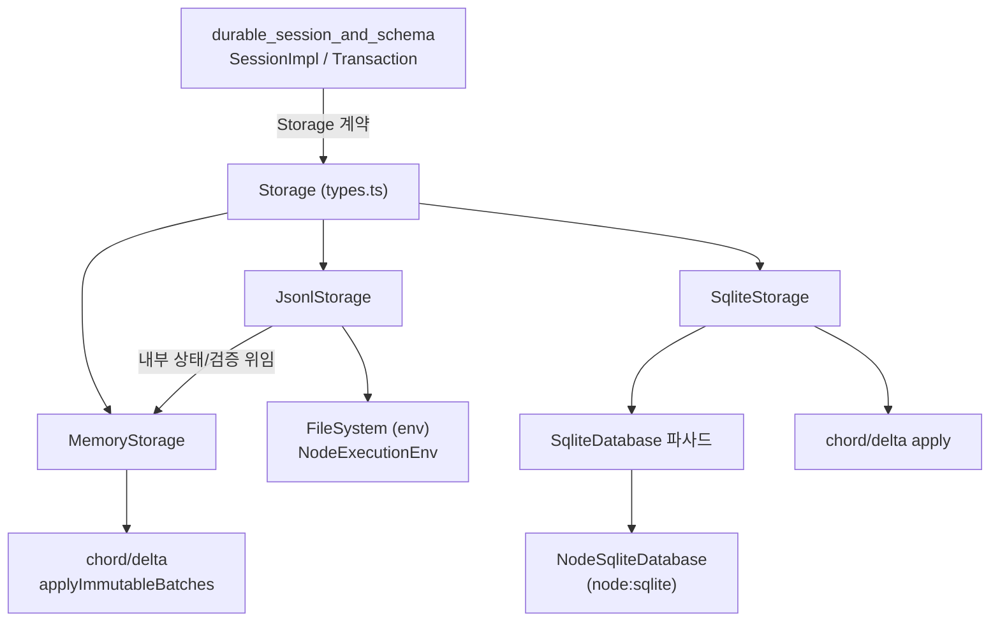
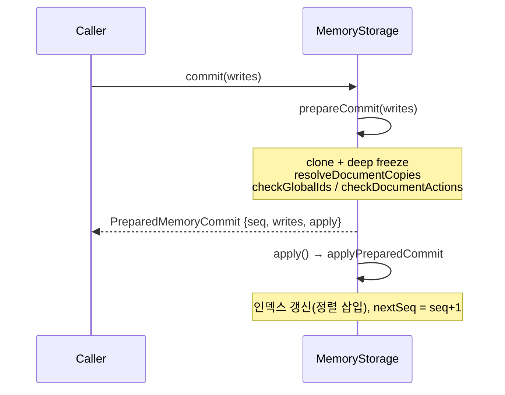
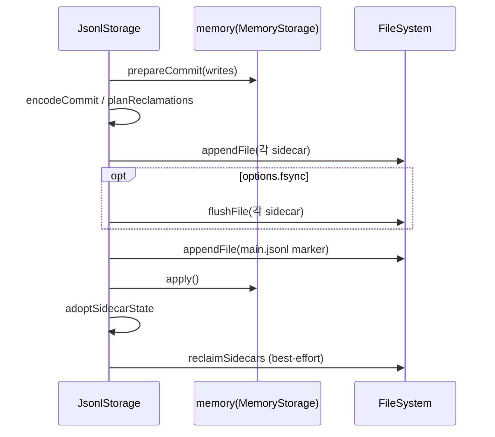
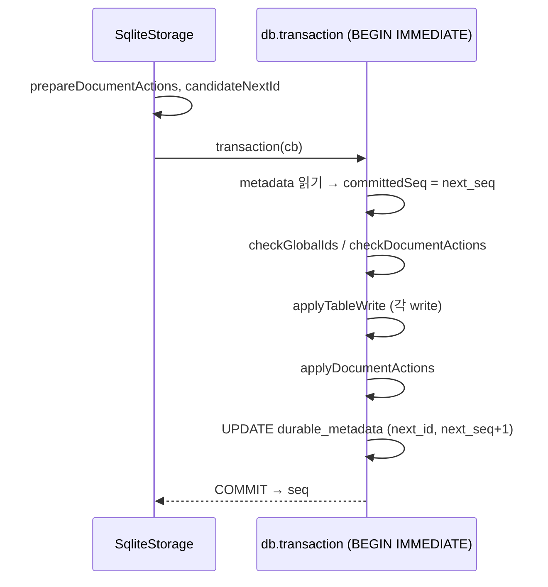
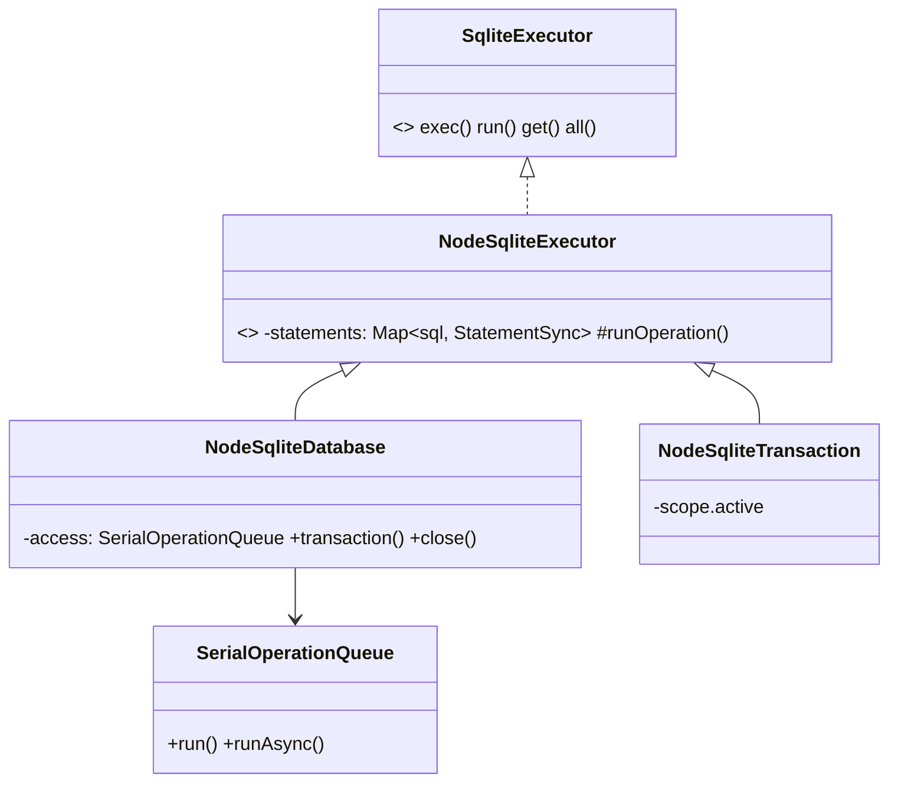

# durable_storage 모듈

`packages/durable/src/storage/` 아래의 **영속 계층(Storage 계약의 세 가지 구현체)**을 다룬다. 상위 모듈 [Durable_Agent_Harness](Durable_Agent_Harness.md)의 하위 모듈이며, 세션/하네스 계층([durable_session_and_schema](durable_session_and_schema.md), [durable_harness](durable_harness.md))이 `Storage` 인터페이스(`packages/durable/src/types.ts`)를 통해 이 모듈을 사용한다.

| 구현체 | 파일 | 용도 |
|---|---|---|
| `MemoryStorage` | `storage/memory.ts` | 참조 구현. 테스트, 그리고 JSONL의 인메모리 인덱스로 재사용 |
| `JsonlStorage` | `storage/jsonl/storage.ts`, `node.ts` | 이식성 높은 파일 기반(append-only) 저장소 |
| `SqliteStorage` | `storage/sqlite/storage.ts`, `node.ts` | `node:sqlite` 기반 트랜잭션 저장소 |

> 검증 수준: 아래 내용은 제공된 소스 코드를 직접 읽고 작성(코드 확인). `Storage` 인터페이스 본문, `database.ts`, `migrations.ts`, `env/*`는 이번 입력에 없어 호출 형태로만 추론했다(추론).

## 1. 아키텍처



핵심 설계 포인트:

- **하나의 계약, 세 구현.** 모든 구현은 같은 메서드 집합을 가진다: `commit`, `mintId`, `conversation`, `entry`, `findLatestHeadMarker`, `task`, `submission`, `submissionByRequest`, `findDocument`, `document`, 그리고 `scan*`(conversations/entries/tasks/submissions/documents), `close`. 적합성은 [durable_testing_and_build](durable_testing_and_build.md)의 `registerStorageConformance`가 검증한다.
- **쓰기는 항상 `commit(writes)` 한 번의 원자적 배치**이고 반환값은 단조 증가하는 `Seq`.
- **읽기는 커서 페이징**: `scan*`은 `limit + 1`개를 읽어 `page()`로 `{items, next:{after}}`를 만든다. 커서는 마지막 항목의 숫자 ID.
- **ID 공간 공유**: `mintId`가 conversation/entry/task/submission/document 모두에 하나의 증가 카운터로 ID를 발급한다. `checkGlobalIds`는 한 ID가 두 레코드 타입에 속하지 못하게 한다(task, submission만 같은 타입 재기록(upsert) 허용).

## 2. 도메인 레코드와 문서(Document) 모델

| 레코드 | 설명 |
|---|---|
| conversation | `parent: {conversationId, at}`로 포크 구조, `owner`(대화/태스크) 인덱스 |
| entry | conversation 소속, `head` 마커 가능, 커밋 시 `commitSeq` 기록 |
| task | `status`: pending/running/waiting/completing/terminal, `kind`, `abortRequested`, `background` |
| submission | `status`: queued/placed/done/unanswered, `requestId`로 멱등 조회 |
| document | `scope`(session/conversation/task) + `kind` + 선택적 `key`(family)로 주소 지정. 내용은 `base` 또는 `delta(ops)` 리비전의 연속 |

### 가시성(포크 상속)
`visibleEntries`(Memory)와 `readEntries`(SQLite)는 현재 conversation에서 시작해 `parent.at` 이하의 상위 conversation 엔트리까지 거슬러 올라가며 역순으로 방출한다. `findLatestHeadMarker`도 같은 방식으로 부모 체인을 탄다.

### 문서 리비전
- `materializeDocument`: `at`(`"current"` 또는 `Seq`) 이하의 가장 최근 `base`를 찾고 그 뒤의 `delta`들을 `chord/delta`로 적용. `version`이 다른 delta를 만나면 오류(버전 경계는 반드시 base).
- **`isCurrentOnly`**: conversation 스코프가 아니거나 `history === "latest"`이면 과거 이력을 보존하지 않는다. 새 `base`가 오면 이전 리비전을 버리고, retire되면 리비전을 모두 삭제. 이런 문서에 `at !== "current"`로 읽으면 오류.
- 같은 주소(`addressKey`)에는 동시에 하나의 현재(live) 문서만 허용(`checkDocumentActions`의 `liveCounts`).
- `document.copy`(포크용): 원본을 `at` 시점에 materialize하여 `base`로 복제. 같은 배치에서 원본이 변경되면 `StorageRejected`.

## 3. MemoryStorage



- **2단계 커밋**: `prepareCommit`은 검증과 분리(detach)만 하고 상태를 바꾸지 않으며, `apply()`는 실패 가능한 준비 작업이 없다. 이것이 JSONL이 "디스크 기록 성공 후에 메모리 반영"을 할 수 있게 하는 기반이다.
- 읽기/보관 쓰기 모두 `clone`으로 직렬화 저장소와 같은 소유권 경계를 흉내낸다.
- 인덱스: `conversationIds`, `taskIdsByStatus`, `submissionIdsByStatus`, `submissionIdsByRequest`, `documentAddresses`, `documentIdsByScope` 등을 정렬 배열로 유지하고 `lowerBound/upperBound` 이진 탐색으로 커서 위치를 찾는다.
- `prepareCommit(writes, seq)`의 `seq` 인자로 복구 시 디스크의 시퀀스를 그대로 재생할 수 있다(`seq < nextSeq`이면 거부).

## 4. JsonlStorage

### 디스크 레이아웃

```
<directory>/
  main.jsonl            # 커밋 마커(1줄 = 1커밋). 진실의 원천
  doc-<id>.jsonl        # 문서 내용 사이드카
  task-<id>.jsonl       # 비종료(live) 태스크 사이드카
  *.jsonl.reclaim       # 사이드카 압축 중 임시 파일
```

- `main.jsonl` 마커: `{format:1, type:"commit", seq, writes:[...]}`. conversation/entry/submission/종료 task/document.retire는 마커에 **인라인**, 문서 내용과 비종료 task는 **사이드카 레코드를 가리키는 `ordinal`** 참조(`document.create/change`, `task.sidecar`).
- 사이드카 레코드: `{format, type:"record", seq, ordinal, payload}`.

### 커밋 프로토콜



**메인 마커가 커밋 지점(commit point)**이다. 사이드카가 먼저 기록되고 마커가 마지막에 추가되므로, 마커가 없는 사이드카 레코드는 미확정 데이터다. 파일 기록 실패 시 `poison()`으로 인스턴스를 `JsonlStoragePoisonedError` 상태로 만들어 재오픈을 강제한다(메모리와 디스크 불일치 방지).

### 복구(`recover`) 절차

1. `main.jsonl` 읽기. 끝이 개행이 아니면 **찢어진 마지막 줄을 잘라냄**(`readLines`). 완결된 줄의 JSON/UTF-8 오류는 `JsonlCorruptionError`. `seq`는 엄격히 증가해야 함.
2. `*.reclaim` 임시 파일 삭제.
3. 사이드카 파일을 모두 파싱하고 `(file, seq, ordinal)` 키로 인덱싱, 순서 검증.
4. 마커를 순서대로 재생해 `writes`를 재구성: 사이드카 레코드를 `confirmRecord`로 "확정" 표시하고 `memory.prepareCommit(writes, marker.seq).apply()`.
5. 확정되지 않은 사이드카 **꼬리(tail)를 `truncateFile`로 제거**. 확정 레코드가 미확정 레코드 뒤에 오면 손상으로 판정.
6. 회수(reclaim) 대상 계산 후 압축.
7. `currentOnlyDocuments`, `liveTaskSidecars` 상태 복원.

### 사이드카 회수(공간 정리)

- 종료(terminal)된 task의 사이드카는 삭제(마커에 최종 상태가 인라인으로 남음).
- current-only 문서: retire되면 파일 삭제, 새 `base`가 오면 그 이전 레코드를 버리고 base부터만 남김.
- 교체는 `.reclaim`에 쓰고 `renameFile`로 원자 교체. 마커가 이미 상태를 공개한 뒤의 **재시도 가능한 best-effort 유지보수**이므로 실패해도 오류를 던지지 않는다. 회수된 레코드는 복구 시 "optional"로 취급되어 없어도 괜찮다.

### 기타

- `JsonlStorage.open(directory, fs, context, options)`는 `FileSystem` 추상화를 받고, `openNodeJsonlStorage`는 `NodeExecutionEnv({cwd: process.cwd()})`로 이를 감싼 편의 함수.
- `options.fsync`(기본 false): 켜면 사이드카를 마커 전에 flush.
- 읽기 메서드는 모두 내부 `memory`에 위임(`store` getter가 `assertUsable` 수행). 즉 읽기 성능은 Memory와 동일하고 시작 시 전체를 재생해야 한다(규모 한계; 추론: 대용량이면 SQLite 선택).

## 5. SqliteStorage

### 스키마 개요 (SQL 문에서 확인되는 범위)

| 테이블 | 주요 컬럼 |
|---|---|
| `durable_metadata` | `singleton`, `next_id`, `next_seq` |
| `record_ids` | `id`, `record_type` (전역 ID 소유권) |
| `conversations` | `id`, `owner_conversation_id`, `owner_task_id`, `record`(JSON) |
| `entries` | `id`, `conversation_id`, `head`, `commit_seq`, `record` |
| `tasks` | `id`, `conversation_id`, `kind`, `status`, `abort_requested`, `background`, `record` |
| `submissions` | `id`, `conversation_id`, `request_id`, `status`, `record` |
| `documents` | `id`, `kind`, `family`, `key_value`, `scope_kind`, `owner_id`, `created_at`, `retired_at`, `record` |
| `document_revisions` | `document_id`, `seq`, `kind`, `version`, `content` |

마이그레이션은 `applySqliteMigrations`(`migrations.ts`, 입력 외)가 `open` 시 수행. 레코드 본문은 JSON 문자열(`record`)로 저장하고 필터링용 컬럼만 별도로 둔다.

### commit



`BEGIN IMMEDIATE`로 쓰기 락을 먼저 잡고, 실패 시 `ROLLBACK`(롤백도 실패하면 `AggregateError`). 메모리상 `nextId`는 커밋 성공 후에만 갱신.

### 읽기 특성
- 인덱스 가능한 문자열(`kind`, `requestId`, `key`)은 `encodeIndexedString`(= `JSON.stringify`)로 인코딩. 일부 SQLite 바인딩이 외톨이 UTF-16 서로게이트를 치환하는 문제를 피하기 위함.
- `document()`는 record와 revision 조회가 하나의 커밋 상태를 보도록 **트랜잭션 안에서** materialize(중간 커밋이 base를 교체할 수 있기 때문).
- `entry`/`findLatestHeadMarker`/`scanEntries`는 여러 쿼리를 쓰므로 `admitRead`로 감싸 **`close`가 진행 중인 읽기를 기다리게** 한다(`admittedReads`, `readsDrained`).
- `close`는 멱등: 첫 호출에서 `closing` Promise를 만들고 이후 호출은 같은 Promise 반환.

## 6. Node SQLite 어댑터 (`sqlite/node.ts`)



- `SerialOperationQueue`: 호출 순서대로 직렬 실행. 대기 중이 없으면 즉시 실행, 있으면 꼬리 뒤에 붙인다. `runAsync`는 비동기 작업(트랜잭션) 동안 큐를 점유하며, 장벽(barrier)을 작업 시작 전에 게시해 작업 내부의 동기 호출이 뒤로 밀리지 않게 한다. 이로써 `node:sqlite`의 동기 API 위에서 트랜잭션 도중 다른 호출이 끼어들지 않는다.
- `NodeSqliteTransaction.runOperation`은 `scope.active`가 false면(커밋/롤백 이후) 오류 → 누수된 트랜잭션 핸들 방지. 트랜잭션 내부 호출은 큐를 거치지 않는다(이미 큐를 점유).
- 준비된 문장(`StatementSync`)은 SQL 텍스트 키로 연결당 캐시, 데이터베이스와 트랜잭션이 공유.
- `openNodeSqliteDatabase(path, options)`: `mkdir -p`, `PRAGMA journal_mode = WAL`, `synchronous = NORMAL`, `wal_autocheckpoint`(기본 1000 페이지), `busyTimeoutMs`(기본 5000ms). 설정 실패 시 닫고 원 오류 보존.
- `close`: statements 비우고 `wal_checkpoint(TRUNCATE)` 후 DB 닫기.
- `openNodeSqliteStorage(path, options)` = 위 어댑터 + `SqliteStorage.open`.

## 7. 구현체 비교

| 항목 | Memory | JSONL | SQLite |
|---|---|---|---|
| 영속성 | 없음 | 있음 (append-only) | 있음 (WAL) |
| 원자성 | prepare/apply | 마커 append가 커밋 지점 | DB 트랜잭션 |
| 크래시 복구 | 해당없음 | 찢긴 줄/미확정 꼬리 절단 | SQLite WAL |
| 읽기 | 메모리 | 메모리(재생된 상태) | SQL 쿼리 |
| 이식성 | 최고 | `FileSystem` 추상화 | `node:sqlite` 필요 |
| 이력 정리 | 메모리에서 즉시 | 사이드카 회수 | `document_revisions` 삭제 |
| 오류 상태 | closed | closed / poisoned / corruption | closed |

## 8. 의존성과 연관 모듈

- 상위 소비자: [durable_session_and_schema](durable_session_and_schema.md) (`SessionImpl.commit`, `Transaction.scan*`), [durable_harness](durable_harness.md).
- 공통 계약/오류/ID: `../types.ts`, `../errors.ts`(`StorageRejected`), `../ids.ts`(`idFromNumber`, `seqFromNumber`).
- 외부: `@earendil-works/chord`의 `Context`, `JsonValue`, `delta`(`apply`, `applyImmutableBatches`) — [chord_delta](chord_delta.md), [chord_core](chord_core.md).
- 테스트/벤치마크: [durable_testing_and_build](durable_testing_and_build.md) (`registerStorageConformance`, `storage-benchmark.ts`; `package.json`의 `bench:storage`, `bench:storage:memory`).

## 9. 유지보수 시 주의점

- `JsonlStorage`의 마커/사이드카 포맷에는 `FORMAT_VERSION = 1`이 박혀 있다. 포맷 변경 시 `parseMainMarker`/`parseSidecarRecord`의 엄격 검증 때문에 구 파일이 손상으로 판정된다.
- `MemoryStorage`와 `SqliteStorage`에 문서 검증 로직(`checkDocumentActions`, `checkGlobalIds`, `prepareDocumentActions`)이 중복 구현되어 있다. 규칙을 바꾸면 양쪽과 JSONL(Memory 위임)을 함께 확인해야 하며, 적합성 테스트가 이를 지킨다.
- JSONL의 시작 비용은 로그 전체 길이에 비례한다(코드 확인: `recover`가 전체 재생).
- 파일 쓰기 실패 후에는 인스턴스를 재사용할 수 없다(`poison`).
