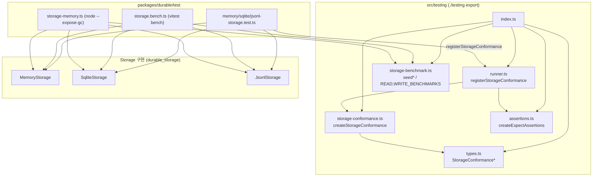
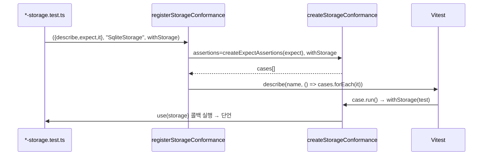
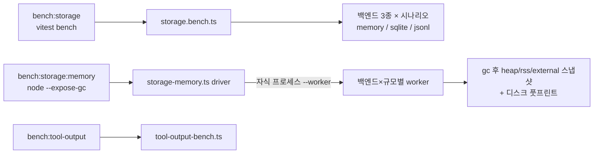

# durable_testing_and_build

`packages/durable`(`@earendil-works/pi-durable`)의 **테스트 지원 코드, 스토리지 벤치마크, 빌드/테스트 설정**을 다루는 모듈이다. 핵심은 세 가지다.

1. **스토리지 적합성(conformance) 스위트**: 모든 `Storage` 구현(Memory, SQLite, JSONL)이 같은 계약을 지키는지 동일한 케이스로 검증한다.
2. **스토리지 벤치마크**: 공개 `Storage` 계약만으로 결정적(deterministic) 데이터를 시드하고 읽기/쓰기 성능과 메모리/디스크 풋프린트를 측정한다.
3. **빌드·테스트 설정**: `package.json` 스크립트, `tsconfig.build.json`, `vitest.config.ts`.

관련 모듈: 저장소 구현은 [durable_storage](durable_storage.md), 세션/문서 모델은 [durable_session_and_schema](durable_session_and_schema.md), 하니스는 [durable_harness](durable_harness.md), 워크스페이스 전체 빌드/CI는 [Build,_Release,_CI_and_Quality_Infrastructure](Build,_Release,_CI_and_Quality_Infrastructure.md)를 참고한다.

> 검증 수준: 아래 내용은 제공된 소스(`runner.ts`, `storage-benchmark.ts`, `package.json`, `tsconfig.build.json`, `vitest.config.ts`)와 `src/testing/{index,types,storage-conformance}.ts`, `test/{storage-memory,storage.bench,*-storage.test}.ts`를 직접 읽고 확인한 것이다(코드 확인). `vitest.benchmark.config.ts`의 내용과 `src/testing/assertions.ts` 본문은 읽지 않았다(미확인).

## 1. 아키텍처

`./testing` 서브패스(`@earendil-works/pi-durable/testing`)는 `src/testing/index.ts`가 재노출한다. 러너(Vitest/Jest)에 의존하지 않도록, 단언(assertion)을 인터페이스로 주입받는다.

## 2. 적합성 스위트 (`runner.ts`, `storage-conformance.ts`, `types.ts`)

### 구성 요소

| 식별자 | 역할 |
|---|---|
| `StorageConformanceRunner` | `describe`, `it`, `expect`만 요구하는 최소 러너 인터페이스(Vitest/Jest 호환) |
| `registerStorageConformance(runner, name, withStorage)` | 케이스를 만들어 `runner.describe(name, …)` 안에 `runner.it`으로 등록 |
| `StorageConformanceProvider` | `(use: (storage) => Promise<void>) => Promise<void>`. 케이스마다 새 스토리지를 열고 `use`를 정확히 한 번 호출·대기해야 하며 정리(close)는 제공자 책임 |
| `createStorageConformance({assertions, withStorage})` | 러너 독립 케이스 배열(`{name, run}`)을 반환 |
| `StorageConformanceAssertions` | `ok`, `strictEqual`, `deepEqual`, `partialDeepEqual`, `greaterThan`, `rejects` |
| `createExpectAssertions(expect)` | Vitest/Jest `expect`를 위 인터페이스로 어댑트 |

`storage-conformance.ts` 내부의 `assertionFacade`가 `expect(x).toBe/toEqual/toMatchObject/rejects.toThrow` 형태의 얇은 파사드를 제공하므로 케이스 본문은 익숙한 expect 스타일로 쓰여 있다.

### 등록 흐름

### 실제 사용 (코드 확인)

- `memory-storage.test.ts`: `registerStorageConformance({ describe, expect, it }, "MemoryStorage", (use) => use(new MemoryStorage()))`
- `sqlite-storage.test.ts`: `"SqliteStorage"`와 **`"SqliteStorage across reopen"`**(닫았다가 다시 여는 영속성 검증) 두 번 등록
- `jsonl-storage.test.ts`: `"JsonlStorage"`와 `"JsonlStorage across reopen"`

검증되는 계약 예(첫 케이스들): ID 1은 불변 root conversation 전용(`mintId`는 2부터), 혼합 테이블 쓰기의 원자적 커밋과 실패 시 전체 롤백 등. 새 스토리지 백엔드를 추가할 때는 같은 한 줄 등록만 하면 동일한 계약 검증을 받는다.

## 3. 스토리지 벤치마크 (`storage-benchmark.ts`)

### 데이터셋 시딩

`seedStorageBenchmark(storage, scale = TIMING_SCALE)`는 오직 공개 `Storage` 계약(`commit`, `mintId`)으로 결정적 데이터를 만든다. `BATCH_SIZE = 100` 단위로 커밋한다.

| 규모 | entryCount | taskCount | documentCount |
|---|---|---|---|
| `STORAGE_MEMORY_SCALES` `1k` | 1,000 | 200 | 200 |
| `STORAGE_MEMORY_SCALES` `10k` | 10,000 | 2,000 | 2,000 |
| `TIMING_SCALE` | 1,000 | 300 | 300 |

시드되는 구조:
- root conversation + `benchmark.entry` 엔트리(첫 엔트리에 `head` 마커)
- task: `pending/running/terminal`을 순환, `kind`가 4의 배수면 `benchmark.filtered`, `background`·`abortRequested`는 각각 5, 7의 배수
- 문서(`benchmark.family`, session 스코프, key `key-N`)
- **리플레이 문서** `REPLAY_TAILS = [0,16,128,1024]`: base 뒤에 delta 꼬리 길이가 다른 `rewindable` 문서
- **히스토리 문서**: delta 128개 → 새 base → delta 128개 (`ancientAt`, `recentAt`로 base 이전/이후 시점 읽기 비교)
- **포크 체인**: 깊이 `FORK_DEPTH = 8`, 포크당 `ENTRIES_PER_FORK = 32` 엔트리

`storageBenchmarkPrimaryRecordCount(scale)`는 위 구성에서 기본 레코드 수(`1 + entries + tasks + documents + 4 + 1 + 8*(1+32)`)를 계산하며, `storage-memory.ts`에서 "레코드당 JS 힙 바이트"의 분모로 쓰인다.

### 읽기 시나리오 `STORAGE_READ_BENCHMARKS`

각 시나리오는 `run`이 숫자를 반환하고 `expected(dataset)`과 일치해야 한다(벤치마크 자체가 정확성 검증을 겸함).

| 이름 | 측정 대상 |
|---|---|
| exact entry lookup | `storage.entry` |
| entry page scan (100) | `scanEntries` 페이지 |
| filtered task scan (50) | `scanTasks` 필터(kind/status/background) |
| exact document address among many | `findDocument` |
| document replay tail (0/16/128/1024) | base+delta 재생 비용 |
| ancient / recent historical read | `document(id, seq)` 과거 시점 읽기 |
| fork-depth history scan (100) | 8단계 포크 조상 순회 |
| fork-depth head lookup | `findLatestHeadMarker` |

### 쓰기 시나리오 `STORAGE_WRITE_BENCHMARKS`

`seedStorageWriteBenchmark`가 root + 100개 기준 엔트리를 만든 뒤: `commit one entry`(1), `commit 100 entries`(100), `commit mixed entry/task/submission/document`(4)를 실행하고 쓴 레코드 수를 반환한다.

## 4. 벤치마크 실행기 (test/)

- **`storage.bench.ts`** (`vitest bench`): 먼저 모든 시나리오 결과를 `strictEqual`로 검증한 뒤 `bench()` 등록. 읽기는 `time:300, iterations:10`, 쓰기는 반복마다 **미리 시드해 둔 fixture 풀**에서 하나씩 꺼내 사용(`iterations 20 + warmup 5`), 추가로 영속 백엔드의 **reopen 후 첫 정확 읽기**(복사본 스토리지)를 측정한다. 종료 시 임시 디렉터리를 모두 삭제한다.
- **`storage-memory.ts`**: 드라이버가 백엔드×규모마다 `process.execPath --conditions=source --expose-gc --experimental-strip-types … --worker`로 **별도 프로세스**를 띄워 측정 간섭을 막는다. worker는 GC 3회 후 baseline → 시드 후 → 읽기 10라운드 후 스냅샷을 JSON으로 출력하고, SQLite는 `page_count`/`freelist_count` 및 `-wal`/`-shm` 크기, JSONL은 `main.jsonl`·`doc-*`·`task-*` 파일 수를 수집한다. 결과는 한도가 아니라 프로세스 델타라고 출력에 명시된다.

## 5. 빌드·테스트 설정

### `packages/durable/package.json`

| 스크립트 | 명령 |
|---|---|
| `clean` | `shx rm -rf dist` |
| `build` | `tsc -p tsconfig.build.json` |
| `test` | `vitest --run` |
| `bench:storage` | `vitest bench --config vitest.benchmark.config.ts` |
| `bench:storage:memory` | `node --conditions=source --experimental-strip-types test/storage-memory.ts` |
| `bench:tool-output` | `node --conditions=source --experimental-strip-types --expose-gc test/tool-output-bench.ts` |
| `prepublishOnly` | `npm run clean && npm run build` |

- `exports`의 각 서브패스(`.`, `./env`, `./env/node`, `./tools`, `./storage/memory|jsonl|jsonl/node|sqlite|sqlite/node`, `./testing`)는 `source`/`types`/`import`/`default` 조건을 가진다. `source` 조건은 `src/*.ts`를 직접 가리키며 테스트·벤치가 빌드 없이 소스를 실행하는 근거다.
- `engines.node >= 22.19.0` (strip-types와 `node:sqlite` 사용과 일치). `sideEffects: false`.
- 의존성: `@earendil-works/chord`, `@earendil-works/pi-ai`, `diff`, `typebox`(정확한 버전 고정, 루트 AGENTS.md의 pin 정책과 일치). dev: `shx`, `vitest`.
- `./testing`은 일반 export라 `dist`에 포함되어 다른 패키지/백엔드 저자가 재사용할 수 있다.

### `tsconfig.build.json`
`../../tsconfig.base.json`을 확장, `rootDir ./src` → `outDir ./dist`, `paths`로 `@earendil-works/chord`와 `@earendil-works/pi-ai`를 각 패키지의 `dist/index.d.ts`에 매핑한다(워크스페이스 빌드 순서상 chord, ai가 먼저 빌드되어야 함). `src/**/*.ts`만 포함하므로 `test/`는 빌드 산출물에 들어가지 않는다.

### `vitest.config.ts`
- `environment: "node"`
- `resolve.conditions`와 `ssr.resolve.conditions`에 `"source"` → 의존 워크스페이스 패키지도 소스로 해석
- alias: `@earendil-works/pi-durable` → `src/index.ts`, `@earendil-works/pi-durable/testing` → `src/testing/index.ts`. 그래서 테스트가 자기 패키지를 공개 이름으로 import해도 `dist` 없이 동작한다.

### 저장소 규칙과의 관계
루트 `AGENTS.md`에 따라 전체 vitest 대신 루트의 `./test.sh`를 쓰고, 패키지 단위는 `node "$(git rev-parse --show-toplevel)/node_modules/vitest/dist/cli.js" --run test/<file>.test.ts`로 실행한다. 빌드(`npm run build`)와 `npm test`는 요청 시에만 실행한다. 워크스페이스 CI 연결은 [ci_workflows](Build,_Release,_CI_and_Quality_Infrastructure.md)와 `test.sh`를 참고(이 모듈에서는 미확인).

## 6. 확장 가이드

- **새 Storage 백엔드**: `test/<name>-storage.test.ts`에서 `registerStorageConformance`를 호출하고(필요 시 reopen 변형 추가), `storage.bench.ts`/`storage-memory.ts`의 `STORAGE_BENCHMARK_BACKENDS`에 추가한다.
- **새 계약 케이스**: `createStorageConformance` 배열에 `createCase(options, name, async (storage) => …)`를 추가한다. 모든 백엔드가 즉시 같은 검증을 받는다.
- **새 벤치 시나리오**: `STORAGE_READ_BENCHMARKS`에 `{name, run, expected}`를 추가하고, 필요한 데이터는 `seedStorageBenchmark`에서 시드하되 `storageBenchmarkPrimaryRecordCount`도 함께 갱신한다.
