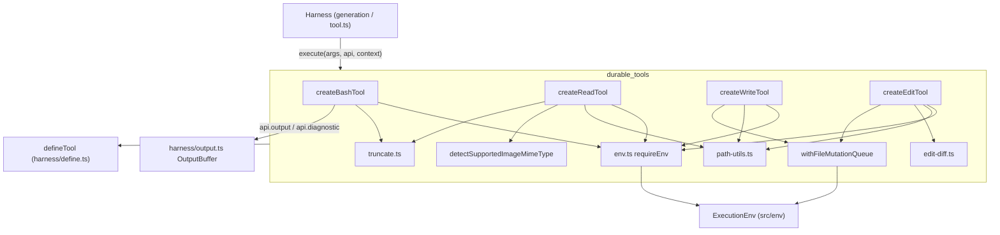
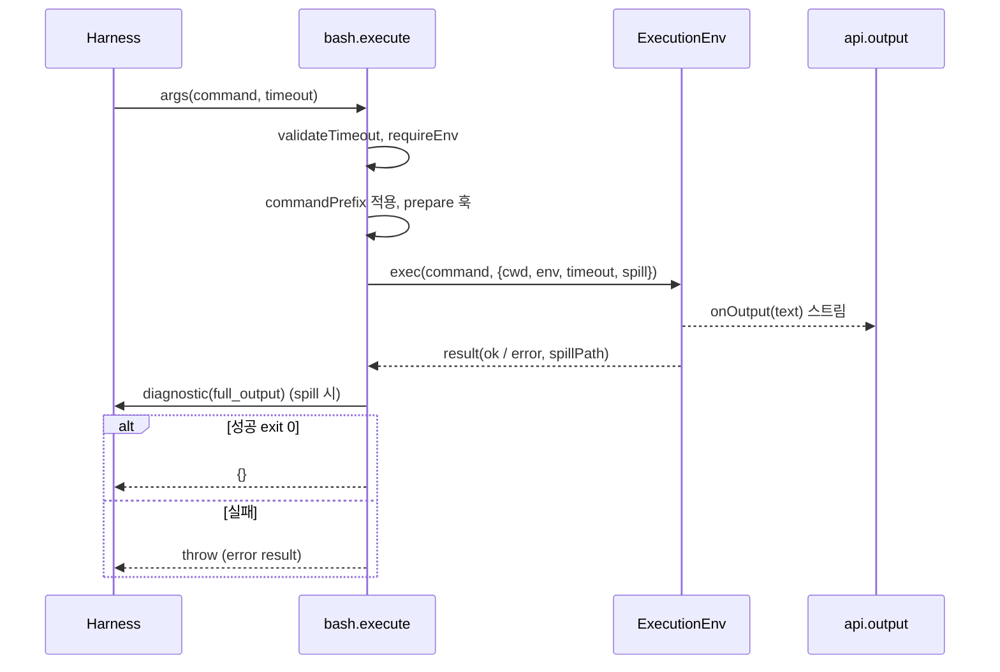
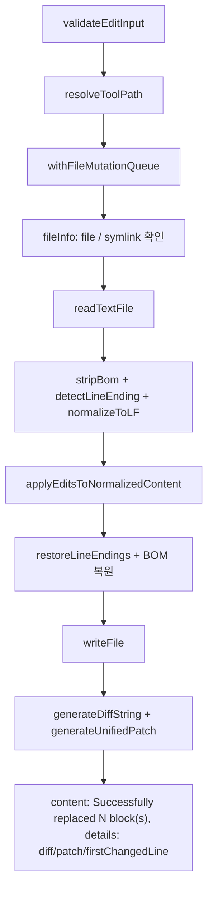

# durable_tools 모듈

`packages/durable/src/tools/*`와 `packages/durable/src/truncate.ts`로 구성된 **Durable Harness용 내장 도구 모음**이다. 에이전트가 파일 시스템과 셸을 다룰 때 쓰는 `bash`, `read`, `write`, `edit` 네 가지 도구와, 이들이 공유하는 보조 유틸리티(diff 계산, 파일 변경 직렬화 큐, 이미지 시그니처 감지, 출력 절단)를 제공한다.

모든 도구는 `defineTool`(`packages/durable/src/harness/define.ts`)로 만든 `ToolRegistration`이며, 실제 I/O는 직접 하지 않고 `api.env`(`ExecutionEnv`)를 통해서만 수행한다. 상위 구조는 [durable_harness](durable_harness.md), 저장 계층은 [durable_storage](durable_storage.md), 세션/스키마는 [durable_session_and_schema](durable_session_and_schema.md)를 참고한다. 비교 대상인 coding-agent 쪽 내장 도구는 [builtin_tools](builtin_tools.md)에 있다.

## 1. 구성 요소 한눈에 보기

| 파일 | 핵심 심볼 | 역할 |
|---|---|---|
| `tools/bash.ts` | `createBashTool` | 환경의 셸로 명령 실행, 출력 스트리밍 |
| `tools/read.ts` | `createReadTool` | 텍스트 파일 읽기(offset/limit, 헤드 절단) |
| `tools/write.ts` | `createWriteTool` | 파일 생성/덮어쓰기 |
| `tools/edit.ts` | `createEditTool`, `prepareEditArguments` | 정확 텍스트 치환 다중 편집 |
| `tools/edit-diff.ts` | `applyEditsToNormalizedContent`, `detectLineEnding`, `restoreLineEndings`, `stripBom`, `generateDiffString`, `generateUnifiedPatch` | 편집 매칭/적용 및 diff 생성 |
| `tools/file-mutation-queue.ts` | `withFileMutationQueue` | 동일 파일 `edit`/`write` 직렬화 |
| `tools/image.ts` | `detectSupportedImageMimeType` | 매직바이트 기반 이미지 MIME 감지 |
| `truncate.ts` | `truncateHead`, `formatSize`, `RuntimeBuffer` | 줄/바이트 한도 절단 |

문서에 직접 나타나진 않지만 코드에서 import하는 보조 모듈: `tools/env.ts`의 `requireEnv`(`api.env`가 없으면 일반 오류), `tools/path-utils.ts`의 `resolveToolPath`/`resolveReadToolPath`.

## 2. 아키텍처

핵심 설계: 도구는 순수한 "정책 + 포맷" 계층이다. 파일/프로세스 접근은 `ExecutionEnv`로 위임하므로 로컬, 원격, 테스트용 환경을 바꿔 끼울 수 있다. (코드 확인)

## 3. 도구별 상세

### 3.1 `bash` — `createBashTool(options?)`

- 스키마: `command: string`, `timeout?: number`(초). `validateTimeout`이 유한 양수이고 `2_147_483_647 / 1000`초 이하인지 검사한다.
- `BashToolOptions`: `commandPrefix`(명령 앞에 줄바꿈과 함께 삽입), `prepare`(`BashExecution`의 `command/cwd/env/inheritEnv`를 실행 직전에 수정하는 훅).
- 출력: `env.exec`의 `onOutput`을 `api.output(text)`에 연결한다. `outputLimits: { retain: "tail" }`이므로 Harness가 마지막 부분만 보존한다. 결과 content는 보존된 출력이며 핸들러는 `{}`를 반환한다.
- 스필: `spill: { afterBytes: DEFAULT_MAX_BYTES, afterLines: DEFAULT_MAX_LINES }`. 한도를 넘으면 전체 출력이 파일로 저장되고 `spillPath`가 `full_output` info 진단으로 보고된다.
- 오류 매핑: `aborted` + `context.abortSignal.aborted`면 원 오류 재던짐, `timeout`은 `Command timed out after N seconds`, 그 외 `aborted`는 `Command aborted`, 종료 코드가 0이 아니면 `Command exited with code N`. 던져진 오류는 출력과 진단을 유지한 error result가 된다.

### 3.2 `read` — `createReadTool()`

1. `resolveReadToolPath`로 경로 해석. macOS 스크린샷 이름 등을 위해 `AM/PM` 앞 narrow NBSP, NFD, 곧은 따옴표→`’` 변형을 순서대로 `env.exists`로 시도한다.
2. `readBinaryFile` 후 `detectSupportedImageMimeType`이 MIME을 반환하면 `unsupported_image` 오류 진단과 `isError: true`로 반환한다(이미지 읽기는 아직 미지원).
3. 텍스트 디코딩 → `offset`(1-index)/`limit` 적용. `offset`이 파일 끝을 넘으면 예외.
4. `truncateHead`로 2000줄 / 50KB 한도 적용. 분기:
   - 첫 줄이 바이트 한도 초과: `characterEnd`로 문자 경계에서 잘라 앞부분만 보여 주고 `sed -n ... | tail -c` 힌트를 `warn` 진단으로 제공.
   - 절단 발생: `Showing lines a-b of N. Use offset=...` info 진단, `details.truncation`에 상세 기록.
   - 사용자 `limit`로 끊긴 경우: 남은 줄 수와 다음 offset 안내.
- 안내 문구는 모두 **진단**이고 content는 파일 텍스트뿐이다.

### 3.3 `write` — `createWriteTool()`

경로 해석 → `withFileMutationQueue` 안에서 `env.writeFile`(상위 디렉터리 자동 생성은 도구 설명상 동작) → `Successfully wrote to <path>`. 전후로 `abortSignal` 확인.

### 3.4 `edit` — `createEditTool()`

스키마: `path`, `edits: [{ oldText, newText }]`.

**인자 복구(`prepareEditArguments`)**: 모델이 자주 보내는 잘못된 형태를 복사본에서 고친다. `edits`가 JSON 문자열이거나 단일 객체, 혹은 최상위 `oldText/newText` 쌍인 경우 배열로 정규화한다. (코드 확인)

**실행 흐름**

**`applyEditsToNormalizedContent` 규칙** (`edit-diff.ts`)
- 모든 edit는 **원본**에 대해 매칭되며 증분 적용이 아니다. 오프셋 안정성을 위해 뒤에서부터 치환한다.
- 빈 `oldText` 거부, 미발견 오류, 중복(2회 이상) 오류, 겹치는 edit 오류, 결과가 동일하면 "No changes" 오류.
- 정확 매칭 실패 시 `normalizeForFuzzyMatch`(NFKC, 줄 끝 공백 제거, 스마트 따옴표/대시/특수 공백 정규화)로 퍼지 매칭한다. 퍼지가 하나라도 쓰이면 정규화 공간에서 치환한 뒤 `applyReplacementsPreservingUnchangedLines`가 **건드린 줄 블록만** 새 내용으로 쓰고 나머지 줄은 원본 바이트를 복사한다. 그래서 퍼지 매칭이 파일 전체를 정규화해 버리지 않는다.
- 줄바꿈(CRLF/LF)과 BOM은 읽을 때 기록하고 쓸 때 복원한다.

diff 출력: `generateDiffString`은 줄 번호가 붙은 표시용 diff(기본 컨텍스트 4줄, 생략은 `...`)와 `firstChangedLine`을, `generateUnifiedPatch`는 표준 unified patch를 만든다(`diff` 패키지 사용).

## 4. 공유 유틸리티

### 4.1 `withFileMutationQueue`
- 키 = `env.id` + 정규 경로. 아직 없는 파일은 정규화된 부모 경로 + 이름을 사용해, 심볼릭 링크 디렉터리 아래에서도 `write`로 만든 뒤 `edit`해도 같은 키를 공유한다.
- 모듈 전역 `Map<string, Promise<void>>`에 꼬리 Promise를 연결하는 체인 방식. 슬롯은 `await` 없이 동기적으로 잡아 사이에 다른 호출이 끼어들지 못한다.
- 범위: **같은 프로세스 내 `edit`/`write`**만 직렬화. `bash`나 다른 프로세스에 대한 잠금은 아니다. 다른 파일/파일시스템은 서로 대기하지 않는다.

### 4.2 `truncateHead` / `formatSize` / `RuntimeBuffer`
- 한도: `DEFAULT_MAX_LINES = 2000`, `DEFAULT_MAX_BYTES = 50 * 1024`. 먼저 도달하는 쪽이 이긴다. 부분 줄은 반환하지 않는다.
- `utf8ByteLength`는 `globalThis.Buffer`가 있으면 `Buffer.byteLength`, 없으면(브라우저 등) 수동 UTF-8 계산으로 폴백한다. `RuntimeBuffer`는 이 선택적 `Buffer`의 최소 인터페이스다.
- `TruncationResult`에 `truncatedBy`, `firstLineExceedsLimit`, 원본/출력 줄·바이트 수가 담긴다.
- 도구 **출력 스트림**의 한도는 `harness/output.ts`가 따로 담당한다(주석 명시).

### 4.3 `detectSupportedImageMimeType`
JPEG/PNG/GIF/WebP/BMP를 시그니처로 판별한다. 애니메이션 PNG(`acTL` 청크가 `IDAT` 앞에 있음)와 JPEG 끝 바이트 `0xf7`(JPEG-LS) 시그니처, 유효하지 않은 BMP 헤더는 `undefined`로 처리한다. `read`는 이 결과로 이미지를 텍스트로 잘못 디코딩하는 것을 막는다.

## 5. 설계 포인트

| 문제 | 해결 |
|---|---|
| 모델이 잘못된 형태의 `edit` 인자를 보냄 | `prepareArguments`로 복구, 원본 인자는 불변 |
| 유니코드 따옴표/공백 차이로 매칭 실패 | 퍼지 매칭 + 변경 줄만 덮어쓰기 |
| 동시 `edit`/`write` 경합 | 파일별 Promise 체인 큐 |
| 거대한 출력으로 컨텍스트 폭주 | head/tail 절단 + 파일 스필 + 진단 안내 |
| 환경 독립성 | 모든 I/O를 `ExecutionEnv`로 위임 |

## 6. 관련 모듈
- [durable_harness](durable_harness.md): `defineTool`, `ToolExecutionApi`(`api.output`, `api.diagnostic`, `api.env`), 출력 버퍼
- [durable_session_and_schema](durable_session_and_schema.md), [durable_storage](durable_storage.md)
- [durable_testing_and_build](durable_testing_and_build.md): `bench:tool-output` 스크립트(`packages/durable/package.json`)
- [builtin_tools](builtin_tools.md): coding-agent의 유사한 `edit`/`read` 도구(`prepareEditArguments`, `computeEditDiff` 등)

검증 수준: 위 내용은 제공된 소스(`bash.ts`, `edit.ts`, `edit-diff.ts`, `file-mutation-queue.ts`, `image.ts`, `read.ts`, `write.ts`, `truncate.ts`, `path-utils.ts`, `env.ts`)를 직접 읽어 확인한 것이다(코드 확인). `ExecutionEnv`와 `defineTool`의 내부 동작은 직접 읽지 않았다(미확인).
