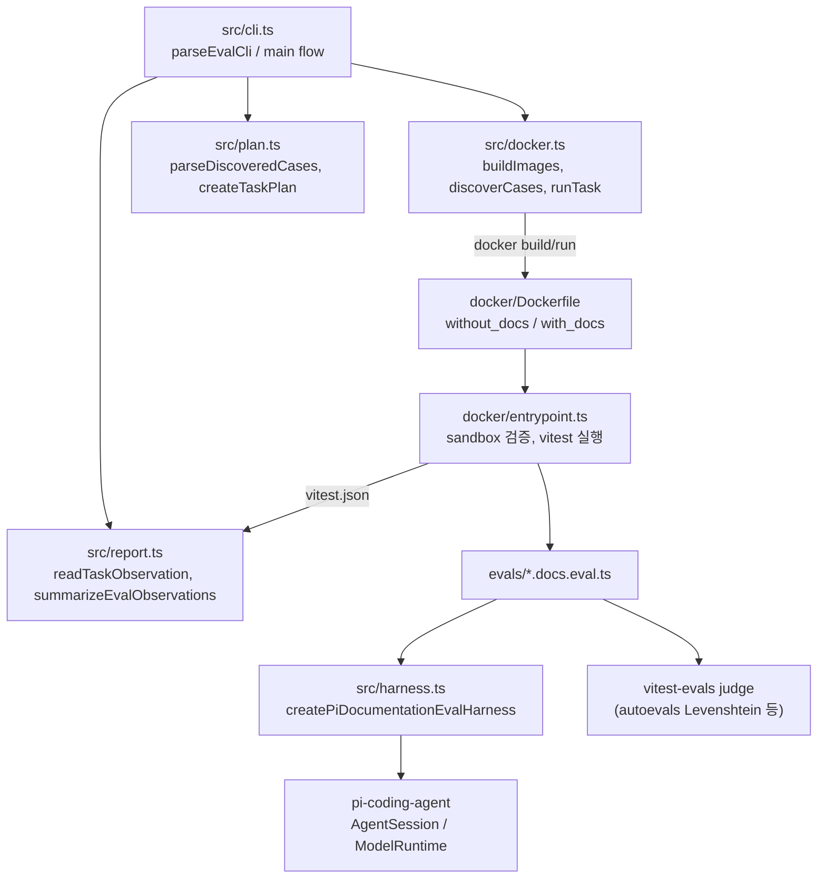
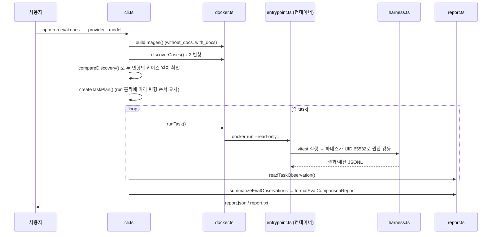

# evals 모듈

`packages/evals` (`@earendil-works/pi-evals`, private)는 **Pi coding-agent 문서(README/CHANGELOG/docs/examples)가 에이전트 성능을 실제로 높이는지**를 측정하는 A/B 평가 하네스다. 같은 모델·같은 과제를 두 Docker 이미지 변형으로 실행하고 결과를 짝지어 비교한다.

- `without_docs` (control): 시스템 프롬프트의 `<docs>` 섹션과 설치된 문서를 제거
- `with_docs` (treatment): 기본 상태 그대로

관련 모듈: coding-agent는 [Agent_Loop_and_Session_Core](Agent_Loop_and_Session_Core.md), 모델/인증은 [Model,_Credential_and_Settings_Management](Model,_Credential_and_Settings_Management.md), TUI는 [Terminal_UI_Framework](Terminal_UI_Framework.md), 빌드/CI 전반은 [Build,_Release,_CI_and_Quality_Infrastructure](Build,_Release,_CI_and_Quality_Infrastructure.md) 참고.

## 아키텍처

## 실행 흐름

## 구성요소

### CLI와 오케스트레이션 — `src/cli.ts`
- `parseEvalCli`: `--provider`, `--model`, `--runs-per-variant`, `-t/--testNamePattern`, `*.docs.eval.ts` 파일 인자를 파싱. CLI 모델 선택은 provider/model 둘 다 필요하며, 아니면 `PI_PROVIDER`/`PI_MODEL` 환경변수(둘 다 또는 둘 다 없음)를 사용. 반복 수는 `PI_EVAL_RUNS_PER_VARIANT`.
- `containerPath`: 평가 파일을 패키지 상대 경로로 변환(패키지 밖이면 오류).
- `compareDiscovery`: 두 변형이 같은 `(fullName, file)` 집합을 발견했는지 검증.
- `artifactRunId`: 타임스탬프+UUID로 `.eval/<runId>` 산출물 디렉터리 생성.
- 산출물: `protocol.json`(SHA-256 `protocolDigest` 포함), `expected-runs.json`, `observations.jsonl`, `report.json`, `report.txt`. 차단된 쌍(blocked pair)이 있으면 종료코드 1.

### 계획 — `src/plan.ts`
- `parseDiscoveredCases`: 케이스 이름은 `"<eval set> > <case>"` 형식이어야 하며 중복 불가.
- `createTaskPlan`: 케이스 × run 마다 두 변형 task 생성. 순서 편향을 줄이려 홀수 run은 `without_docs → with_docs`, 짝수 run은 반대 순서.

### Docker 실행 — `src/docker.ts`
- `buildImages`: 레포 경로 해시 기반 이름으로 `--target without_docs|with_docs` 빌드 후 image ID 기록. 두 ID가 같으면 cli가 중단.
- `requireEvalAuthFile`: `PI_CODING_AGENT_DIR`(기본 `~/.pi/agent`)의 `auth.json`에 해당 provider 자격증명이 있는지 확인.
- `discoverCases` / `runTask`: `docker run --rm --read-only`, `/tmp` tmpfs, 아티팩트 bind mount, auth.json은 읽기 전용 마운트. task 디렉터리는 task 식별자의 SHA-256.

### 컨테이너 — `docker/Dockerfile`, `docker/entrypoint.ts`
- 멀티스테이지: `builder`(`npm ci --ignore-scripts`, `build:offline`, `install-runtime.mjs`) → `without-docs-install`(coding-agent의 README/CHANGELOG/docs/examples 삭제) → `evaluator` → `without_docs` / `with_docs`(`PI_EVAL_VARIANT` 설정).
- 평가 소스(`src`, `evals`, `docker`, vitest 설정)는 `chmod go-rwx`로 root 전용.
- `entrypoint.ts`: `assertWorkspace`(이미지 내용·문서 가시성이 변형과 일치하는지), `assertRootOnly`, `assertSandboxCannotRead`(샌드박스 UID로 실제 읽기 시도 후 실패해야 함), coding-agent가 `dist`에서 해석되는지 확인, auth.json 복사 후 chown, vitest `run`/`list` 실행, 결과 chown. `parseId`는 UID/GID 검증.
- `Dockerfile.dockerignore`: `.git`, `node_modules`, `dist`, `.env*` 등 제외.

### 하네스 — `src/harness.ts`
- `createPiDocumentationEvalHarness`: 컨테이너(`PI_EVAL_CONTAINER=1`)와 샌드박스 UID/GID가 없으면 거부. 도구는 `read/write/edit/grep/find/ls`로 제한(shell, 네트워크 제외). `without_docs`는 `excludePiDocumentation`으로 시스템 프롬프트의 `<docs>` 구간 제거, `verifySystemPrompt`로 변형과 프롬프트 일치 확인.
- `runPiCodingAgent`(내부): 임시 홈/agentDir/workspace 생성, `InMemoryCredentialStore`와 `ModelRuntime`으로 인증, `createAgentSessionServices` → `createAgentSessionFromServices`, `enterToolSandbox`로 root에서 `setuid/setgid` 강등 후 프롬프트 실행(`prompt` / `reload` 단계). 트랜스크립트·토큰·비용·도구 호출 수를 `vitest-evals` 형식으로 반환하고 세션 JSONL을 아티팩트(`piSessionJsonl`)로 저장. 모델 자격증명 환경변수는 샌드박스 진입 전 숨김.

### 보고 — `src/report.ts`
- `readTaskObservation`: vitest JSON에서 정확히 1개 어설션, 이름·모델 일치 등을 검증해 `scored | unscored | skipped | pending | errored` 관측값 생성. 하나라도 어긋나면 `errored`.
- `summarizeEvalObservations`: 같은 `(evalSet, caseId, model, runNumber)` 쌍이 양쪽 모두 `scored`일 때만 적격. 차단된 쌍이 있으면 해당 eval set의 pass rate는 공개하지 않음(withheld). pass는 `score >= 1`. 플래그: `no-lift`, `negative-delta`, `control-saturated`, `treatment-saturated`, `flaky`. 토큰·도구·지연·추정 비용의 쌍별 평균 차이와 변형별 합계 제공.
- `formatEvalComparisonReport`: 사람이 읽는 텍스트 보고서.

### 평가 케이스·픽스처 — `evals/`
- `tui.docs.eval.ts`: "Customize the interactive context footer" — 에이전트가 푸터의 `42.2%/272k (auto)`를 10칸 진행 막대로 바꾸도록 요청. `RecordingTerminal`(가상 터미널)로 `InteractiveMode`를 렌더링하고 `inspectContextFooter`가 42.2/65/120% 픽스처에서 출력을 수집, `ContextFooterJudge`가 막대 정확성·100% clamp·기존 상태 텍스트 유지율(Levenshtein)을 채점.
- `configured-runtime.ts`: `loadConfiguredModelRuntime`, `inspectProvider`, `inspectAddedModel` — `models.json` 기반 커스텀 provider/모델 추가 평가용 오라클(`allowModelNetwork: false`).
- `acme-server.ts`: `createAcmeServer("openai" | "stream")` — 로컬 가짜 OpenAI 호환(SSE) 및 NDJSON 스트리밍 서버. 올바른 요청이 도달했는지 `validRequestReceived()`로 확인.

### 설정
- `package.json` 스크립트: `eval`(host 후 docs), `eval:host`(`vitest --project host`), `eval:docs`(`node --experimental-strip-types src/cli.ts`), `test`, `clean`. 루트 `package.json`의 `eval` 스크립트가 이를 호출한다.
- `tsconfig.json`: 루트 설정 확장, `noEmit`, NodeNext.

## 보안/격리 설계 요약

| 위험 | 대응 |
|---|---|
| 모델이 평가 코드·judge를 읽음 | 소스 root 전용 + 비특권 UID 실제 읽기 프로브 |
| 모델이 자격증명 탈취 | auth.json 삭제, 환경변수 숨김, 인메모리 저장소 |
| 문서 효과 오염 | 이미지 내용 검증, 내부 의존성 문서 노출 금지, 시스템 프롬프트 검증 |
| 순서·편향 | run별 변형 순서 교차, 쌍 단위 비교 |
| 불완전 데이터로 인한 오판 | 차단 쌍이 있으면 headline 지표 보류, 종료코드 1 |

모든 내용은 제공된 소스 코드 기준(코드 확인)이다.
