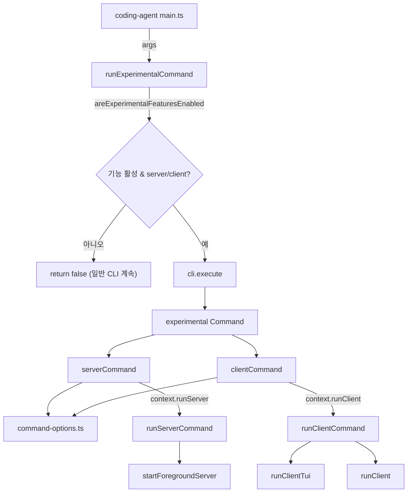
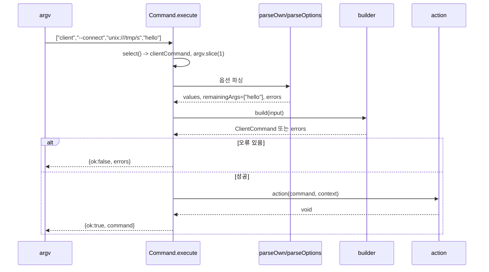
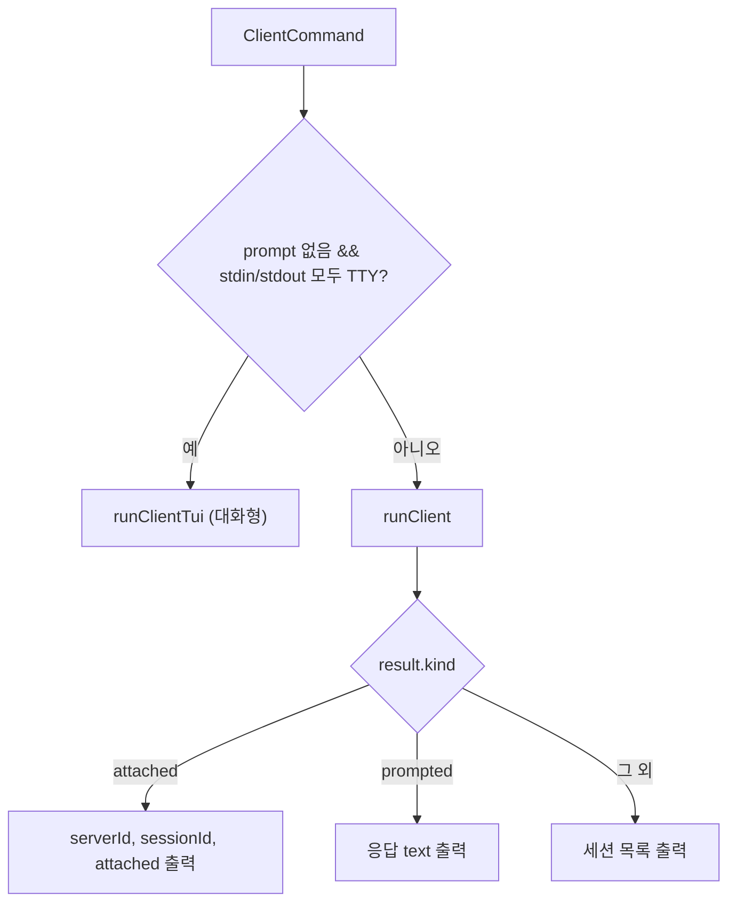
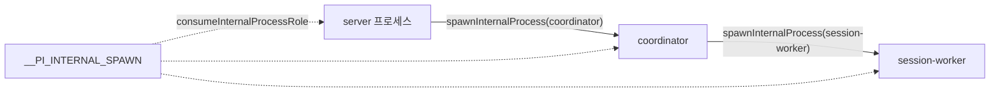

# experimental_cli 모듈

`experimental_cli`는 `pi` CLI의 **개발 전용(experimental) `server` / `client` 서브커맨드**를 파싱하고 실행으로 연결하는 얇은 진입 계층이다. 실제 서버·클라이언트 동작은 다른 모듈이 담당하며, 이 모듈은 다음만 책임진다.

1. 타입 안전한 미니 커맨드 파서(`Command`) 제공
2. `experimental server` / `experimental client`의 옵션 정의·검증
3. 파싱 결과를 `runServer` / `runClient` 콜백으로 디스패치(`runExperimentalCommand`)
4. 내부 프로세스(coordinator / server / session-worker) 역할 환경변수 관리(`process.ts`)

> 상위 모듈: [Experimental_Server_and_Client_Runtime](Experimental_Server_and_Client_Runtime.md). 형제 모듈: [experimental_server_runtime](experimental_server_runtime.md), [experimental_radius_relay](experimental_radius_relay.md), [experimental_services_and_client](experimental_services_and_client.md).

## 구성 파일

| 파일 | 역할 |
|---|---|
| `packages/coding-agent/src/cli/experimental/command.ts` | 범용 `Command` 빌더, 옵션 헬퍼(`stringOption`, `flagOption`, `valueOption`) |
| `packages/coding-agent/src/cli/experimental/command-options.ts` | 공통 옵션: `--connect`, `--auth-token`, `--auth-token-file`; `parseAuth`, `parseTransportAddress`, `unsupportedOptions` |
| `packages/coding-agent/src/cli/experimental/commands/server.ts` | `server` 커맨드 정의, `ServerCommandContext` |
| `packages/coding-agent/src/cli/experimental/commands/client.ts` | `client` 커맨드 정의, `ClientCommandContext` |
| `packages/coding-agent/src/cli/experimental/cli.ts` | `experimental` 루트에 두 서브커맨드를 합성한 `cli` |
| `packages/coding-agent/src/experimental/commands.ts` | `runExperimentalCommand`, `runServerCommand`, `runClientCommand` |
| `packages/coding-agent/src/experimental/process.ts` | 내부 프로세스 role(`__PI_INTERNAL_SPAWN`), spawn/terminate, 제어 라인 인코딩 |

## 아키텍처

`CliContext = ServerCommandContext & ClientCommandContext`이며, `Command.command()`의 제네릭이 서브커맨드 context를 교차 타입(`TContext & TSubcommandContext`)으로 누적한다. 따라서 `cli.execute(args, { runServer, runClient })`에서 누락된 핸들러는 컴파일 타임에 잡힌다.

## Command 파서 (`command.ts`)

- **빌더 체인**: `new Command(name).option(...).build(input => result).action((cmd, ctx) => ...)`.
- **`build`**: `ParsedCommandInput`(`value`, `values`, `remainingArgs`)을 받아 `{ok:true, command}` 또는 `{ok:false, errors}` 반환. 교차 옵션 검증은 여기서 한다.
- **서브커맨드 선택**: `select()`가 `argv[0]`이 등록된 서브커맨드명이면 나머지 argv를 위임한다.
- **옵션 파싱 규칙** (`parseOptions`):
  - `--` 또는 등록되지 않은 토큰을 만나면 그 지점부터 전부 `remainingArgs`로 남기고 중단한다.
  - `--name=value`, `--name value` 모두 지원. 값이 `-`로 시작하면 다음 토큰을 값으로 취급하지 않는다.
  - flag 옵션에 값이 붙으면 오류, 값 누락/빈 값 오류, `repeatable`이 아닌 옵션 중복 오류.
  - 오류는 모아서 한꺼번에 반환한다(첫 오류에서 중단하지 않음).
- 이미 등록된 옵션/서브커맨드명을 재등록하면 즉시 `throw`한다.

## 공통 옵션 (`command-options.ts`)

- **인증**: `--auth-token`과 `--auth-token-file`은 상호 배타. 결과는 `AuthInput` (`{type:"token"}` | `{type:"file"}`).
- **`--connect` 주소** (`parseTransportAddress`): 엄격한 정규형만 허용한다.
  - `unix:///abs/path` — authority 없음, `unix:////` 금지, query/hash 금지, 퍼센트 디코딩 후 NUL 불가, 절대경로 필수 → `UnixTransportAddress`.
  - `radius://<serverId>` — 포트/경로/계정정보 금지, `isServerId`(소문자 UUIDv4, [protocol](protocol.md)) 통과 필요 → `RadiusTransportAddress`.
- **`unsupportedOptions`**: 남은 인자가 있으면 "기존 CLI 옵션 미지원" 오류를 낸다(실험 커맨드는 기존 CLI 옵션과 아직 호환되지 않음).

## 서브커맨드

### `server`
옵션: `--server-id`(UUIDv4 검증), `--session-dir`, `--provider`, `--model`, `-e`(반복, plugin 패키지), 인증 옵션.
검증: `--provider`는 `--model` 필요, 남은 인자 불허.

### `client`
옵션: `--connect`, `--session-id`, `--continue`/`-c`, `--resume`/`-r`, `--provider`, `--model`, `-e`(반복), 인증 옵션.
검증:
- `--session-id`, `--continue`, `--resume`은 상호 배타.
- `--provider`는 `--model` 필요.
- 남은 인자가 정확히 하나의 비어있지 않은 문자열이면(`--` 뒤이거나 `-`로 시작하지 않을 때) **prompt**로 해석. 그 외 남은 인자는 `unsupportedOptions` 오류.

## 실행 계층 (`experimental/commands.ts`)

### `runExperimentalCommand(args)`
- `areExperimentalFeaturesEnabled()`가 거짓이거나 `args[0]`이 `server`/`client`가 아니면 `false` 반환 → 호출자가 일반 CLI 흐름을 계속한다.
- 처리한 경우 `true` 반환. 파싱/실행 오류는 `Error: ...`(chalk red)로 stderr에 출력하고 `process.exitCode = 1`.
- 주석상 **개발 전용**이며 배포 엔트리포인트는 이 모듈을 import하면 안 된다.

### `runServerCommand`
`startForegroundServer`([experimental_server_runtime](experimental_server_runtime.md))에 옵션을 전달하고 `Server:`, `Socket:`을 출력한다. Radius 릴레이 상태(`connected`, `not connected; local only`, `reconnecting: ...`)는 서버/소켓 출력 이후에 중복 제거해 출력한다(출력 전 도착한 상태는 `pendingRelayStatus`에 보관). `SIGINT`/`SIGTERM` 또는 `runtime.closed` 시 `finally`에서 `runtime.close()`.

### `runClientCommand`

비-TTY 출력은 탭 구분이라 스크립트에서 쓰기 쉽다.

## 내부 프로세스 관리 (`process.ts`)

서버 런타임은 다중 프로세스(coordinator, server, session-worker)로 구성되며, 이 파일이 공통 spawn 규약을 제공한다.

- `INTERNAL_PROCESS_ENV = "__PI_INTERNAL_SPAWN"`: role 값(`coordinator` | `server` | `session-worker`)을 환경변수로 전달.
- `consumeInternalProcessRole()`: role을 읽고 검증한 뒤 **env에서 삭제**해 하위 프로세스로 상속되지 않게 한다. 알 수 없는 값은 `throw`.
- `isDirectInternalProcessEntry(moduleUrl)`: Bun 바이너리/번들 Node가 아니고 `argv[1]`이 해당 모듈 파일일 때만 참(소스 직접 실행 감지).
- `spawnInternalProcess`: `detached` + `stdio: "ignore"` + `unref()`. 소스(.ts) 실행이면 `--import source-resolver.ts`를 붙이고, 번들 Node는 `dist/bundle/{coordinator,cli}.js`, Bun 바이너리는 자기 자신을 args로 재실행한다.
- `terminateInternalProcess`: `SIGKILL` 후 `exit`/`error`까지 대기.
- `encodeControlLine`: JSON + `\n`, 128 MiB(`MAX_CONTROL_LINE_BYTES`) 초과 시 오류 — coordinator 제어 채널의 줄 단위 프레임.

## 다른 모듈과의 관계

- 서버 구현: [experimental_server_runtime](experimental_server_runtime.md), Radius 릴레이: [experimental_radius_relay](experimental_radius_relay.md).
- 클라이언트(`runClient`, `runClientTui`)와 서비스 계층: [experimental_services_and_client](experimental_services_and_client.md).
- 주소/서버 ID 검증과 와이어 프로토콜: [protocol](protocol.md); 서버·클라이언트 패키지: [server](server.md), [client](client.md).
- 기능 플래그 `areExperimentalFeaturesEnabled`는 `core/experimental.ts`에 있으며, 패키징/번들 판별(`isBunBinary`, `isBundledNode`, `getPackageDir`)은 `config.ts`([cli_bootstrap_and_config](cli_bootstrap_and_config.md))에 의존한다.

## 유지보수 메모

- 새 서브커맨드 추가: `commands/<name>.ts`에서 `Command`와 `<Name>CommandContext`를 정의 → `cli.ts`에서 `.command()` 체인 → `CliContext`에 교차 → `runExperimentalCommand`의 첫 인자 조건과 context 객체 갱신.
- 옵션 검증은 `build` 안에서 오류 배열로 누적하는 패턴을 유지한다.
- 이 문서는 제공된 소스 코드 기준이며 `runClient`, `startForegroundServer` 내부 동작은 확인하지 않았다(미확인).
