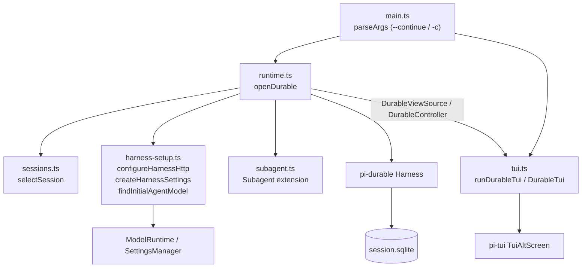
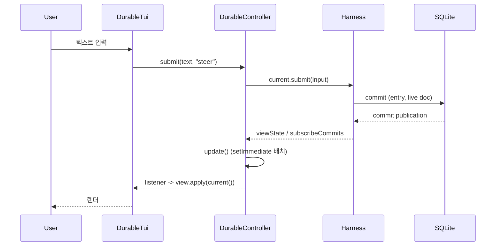

# experimental_durable_harness

`packages/coding-agent/src/experimental/durable/` 와 `packages/coding-agent/src/experimental/vacation/` 에 있는 실험적 진입점이다. `@earendil-works/pi-durable` 의 `Harness` 를 SQLite 저장소 위에 열고, 그 위에 alt-screen TUI 를 얹는다. 두 디렉터리는 거의 같은 코드(복제본)이며 차이는 아래 "durable vs vacation" 절에 정리했다.

관련 모듈 문서(링크만 제공, 내용은 중복하지 않음):
- [Durable_Agent_Harness](Durable_Agent_Harness.md): `Harness`, `Conversation`, 저장소, 도구 구현
- [Terminal_UI_Framework](Terminal_UI_Framework.md): `TuiAltScreen`, `ScrollView`, `VStack` 등
- [Model,_Credential_and_Settings_Management](Model,_Credential_and_Settings_Management.md): `ModelRuntime`, `SettingsManager`
- [User-Facing_Modes_(Interactive_and_RPC)](User-Facing_Modes_(Interactive_and_RPC).md): 재사용하는 `AssistantMessageComponent`, `CustomEditor`, 테마 등
- [Distributed_Runtime_Foundation_(Chord,_Protocol,_Transport)](Distributed_Runtime_Foundation_(Chord,_Protocol,_Transport).md): `AttachedReplicatedState`, `BACKGROUND_CONTEXT`

## 아키텍처

핵심 경계: TUI 는 `Harness` 객체를 직접 보지 않는다. `runtime.ts` 가 `DurableView`(평범한 값)를 `DurableViewSource` 로 내보내고, 사용자 동작은 `DurableController` 로만 받는다.

## 구성 요소

### main.ts
`parseArgs` 는 `--continue`/`-c` 만 허용하고 그 외 인자는 `Unknown argument` 오류를 던진다. top-level await 로 `openDurable` → `runDurableTui` 를 실행하고 `finally` 에서 `durable.close()` 를 호출한다.

### sessions.ts — `selectSession`
- 세션 루트: `getAgentDir()/experimental/durable-sessions/<sha256(cwd)[0:24]>/`
- 새 세션 디렉터리 이름: `<13자리 timestamp>-<uuid>`. `continueSession` 이면 이름 정렬상 최신 디렉터리를 선택하고, 없으면 오류.
- `proper-lockfile` 로 디렉터리를 잠근다(재시도 12회, 1초 간격; 죽은 프로세스의 lock 은 10초 후 stale). 실패하면 "Session is already open in another process".
- 반환하는 `SessionLocation` 에 `database`(`session.sqlite`)와 `release()` 가 있다.

### harness-setup.ts
- `configureHarnessHttp`: 프록시와 undici dispatcher 설정(없으면 일부 provider 스트림이 끊김).
- `createHarnessSettings`: `HarnessSettings` 를 getter 로 구현해 매 사용 시점에 `SettingsManager` 값(stream 타임아웃/재시도, compaction, retry, steering/followUp 모드)을 읽는다.
- `findInitialAgentModel`: CLI 지정(`resolveCliModel`) 또는 pi 기본 해석(`findInitialModel`)으로 새 root conversation 의 초기 model/thinkingLevel 결정.
- `createVacationRegistry`(vacation 전용): `Vacation`, `Search` 만 설치한 registry.

### runtime.ts — `openDurable`
순서:
1. `selectSession` 으로 위치 확정 및 lock.
2. `ModelRuntime.create()`, `SettingsManager.create(cwd)`, HTTP 설정.
3. `Harness.open(openNodeSqliteStorage(db), { models, registry, settings, env, onReport }, BACKGROUND_CONTEXT)`.
4. `harness.root(...)` 로 root conversation 확보(새 세션이면 초기 모델 지정).
5. 모든 conversation 을 `scanConversations` 로 훑어 `ConversationSummary`(subagent 는 첫 user 메시지를 title 로) 구성.
6. `viewState` 구독과 `subscribeCommits` 로 `state` 갱신. `update` 는 `setImmediate` 로 한 번에 모아 리스너를 호출(burst 당 1회 렌더).
7. `DurableController` 구현. 모든 변경성 동작은 `command()` 로 직렬화(promise 체인).
8. 작업 패널(`toggleTasks`)을 열고 `harness.resume()` 으로 중단된 턴을 재개.

`DurableController` 메서드:

| 메서드 | 동작 |
|---|---|
| `submit(text, whenBusy)` | `current.submit({type:"input"})`; 유휴면 prompt, 바쁘면 `steer`/`followUp` |
| `compact(instructions)` | `current.compact` 후 `waitForTask` 로 결과를 notice 로 보고 |
| `abort()` | 큐를 거치지 않고 `current.abort` |
| `cycleThinking()` | 모델이 지원하는 thinking 레벨을 순환 |
| `setModel(ref)` | `configure({model, thinkingLevel: clamp})` |
| `toggleTasks()` | `taskGraph` 구독 열기/닫기 |
| `switchConversation(id)` | 다른 conversation 의 `viewState` 로 전환 |

`close()` 는 구독 해제 후 `harness.close` 를 호출한다. 결과(outcome)를 쓰지 않으므로 실행 중이던 턴은 `--continue` 로 재개된다. durable 쪽은 추가로 `envs.cleanup` 을 실행한다.

### subagent.ts — `Subagent` extension
`subagent` 도구(`replay: "safe"`)를 정의한다. 호출마다 해당 task 소유의 자식 conversation 을 만들고(이미 있으면 재사용 → 크래시 후 재실행에 안전), 자식에서 `requestId: subagent:<taskId>` 로 입력을 submit 해 답을 기다린 뒤 `answerText`(`AssistantEntry` 의 text 연결)를 반환한다. 자식은 `Subagent` 확장을 제거해 재귀 위임을 막고, 호출이 끝나도 남아 `/agents` 로 전환해 대화를 이어갈 수 있다.

### tui.ts — `runDurableTui`
- `DurableTui`: `TuiAltScreen` 위에 `ScrollView`(transcript, follow end) + 하단 dock(`VStack`: tasks, queue, notices, editor, footer) 구성.
- `apply(view)`: entries 를 증분 렌더(앞부분이 바뀌면 `#rebuild`), `pi.live` 의 streaming 메시지/도구 슬롯 반영, 작업 트리·inbox 큐·notice·상태 표시줄·footer(토큰, 비용, context %) 동기화.
- `ListSelector`: 필터 입력 + `SelectList` 로 `/model`, `/agents` 선택기 제공.
- `CompactionComponent`: 요약을 접힌 한 줄로 보여주고 확장 가능.
- 명령: `/model`, `/tasks`, `/agents`, `/compact [지침]`; 일반 텍스트는 `submit(text, "steer")`, follow-up 키는 `"followUp"`.
- pi 의 `KeybindingsManager`, 도구 렌더러(`createAllToolRenderers`), `InteractiveThemeController` 를 재사용한다.

## 실행 흐름

## durable vs vacation

| 항목 | durable | vacation |
|---|---|---|
| 세션 루트 | `durable-sessions` | `vacation-sessions` |
| registry | `createCodingRegistry` + `Subagent` (코딩 도구) | `createVacationRegistry` (`Vacation`, `Search`, 코딩 도구/pi 프롬프트 없음) |
| root agent | `cwd` 지정 | `extensions: [Vacation]` |
| 실행 환경 | `ExecutionEnvs` 사용, close 시 cleanup | 없음 |

참고: `durable/` 쪽 `harness-setup.ts` 는 `createCodingRegistry`, `ExecutionEnvs` 를 export 하지만 제공된 소스에는 없다(미확인). 위 표는 `runtime.ts` import 로부터 추론한 것이다. `vacation.ts` 도 제공되지 않았다.

## 하위 모듈

모듈이 작고 두 디렉터리가 중복이므로 별도 하위 문서는 만들지 않았다.
