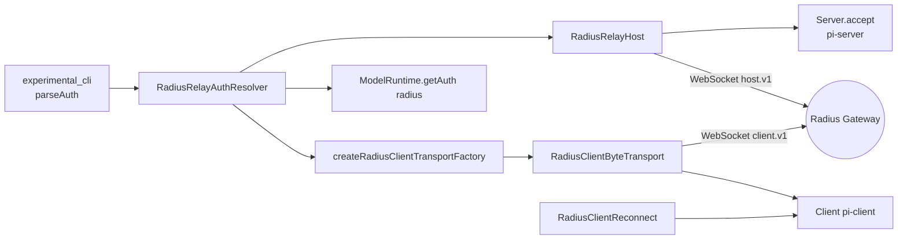
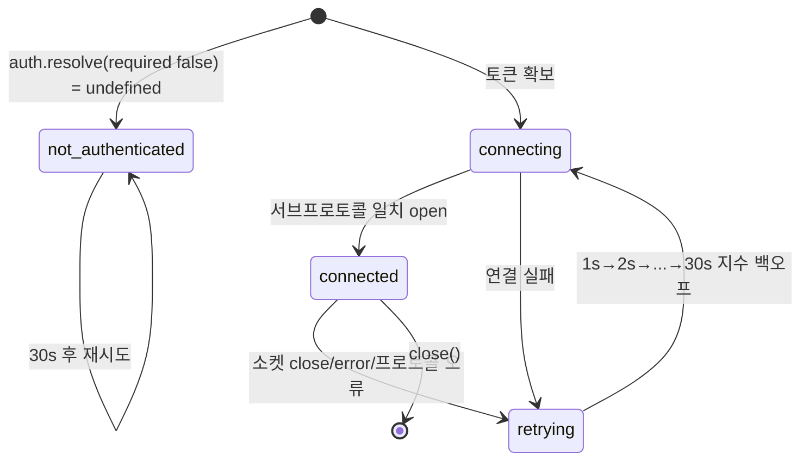
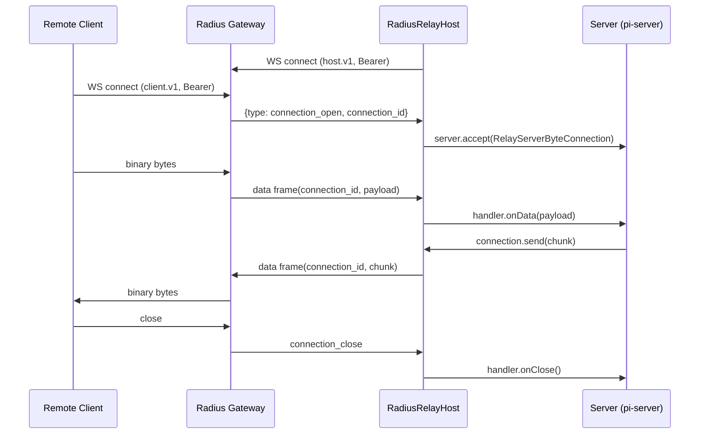

# experimental_radius_relay

`experimental_radius_relay`는 실험적 Server/Client 런타임이 **Radius 게이트웨이**를 통해 서로 연결되도록 하는 모듈이다. 로컬 Unix 소켓이 닿지 않는 원격 클라이언트도 하나의 WebSocket 위에서 다중화(multiplex)된 바이트 스트림으로 서버 세션에 붙을 수 있다.

구성 파일은 두 개다.

| 파일 | 역할 |
|---|---|
| `packages/coding-agent/src/experimental/radius-auth.ts` | `RadiusRelayAuthResolver`: 연결 시도마다 Radius 토큰을 새로 해석 |
| `packages/coding-agent/src/experimental/radius-relay.ts` | `RadiusRelayHost`(서버 측), `createRadiusClientTransportFactory`/`RadiusClientByteTransport`(클라이언트 측), `RadiusClientReconnect`, 프레임 인코딩/파싱, `OrderedWebSocketWriter` |

> 검증 수준: 아래 내용은 제공된 소스 코드를 직접 읽고 작성했다(코드 확인). 게이트웨이 서버 측 구현은 이 저장소에 없으므로 미확인이다.

## 1. 시스템 내 위치

상위 모듈 [Experimental_Server_and_Client_Runtime](Experimental_Server_and_Client_Runtime.md)의 하위 모듈이며, 형제 모듈과의 관계는 다음과 같다.

- [experimental_cli](experimental_cli.md): `--auth`, 전송 주소(`RadiusTransportAddress`)를 파싱해 `RadiusRelayAuthResolver`를 만든다.
- [experimental_server_runtime](experimental_server_runtime.md): `runServerProcess`/coordinator가 `RadiusRelayHost`를 시작하고 `Server.accept`를 연결한다.
- [experimental_services_and_client](experimental_services_and_client.md): 클라이언트 TUI/서비스가 `ByteTransportFactory`로 이 모듈의 전송을 사용한다.
- [Distributed_Runtime_Foundation_(Chord,_Protocol,_Transport)](Distributed_Runtime_Foundation_(Chord,_Protocol,_Transport).md): `Server`(`accept`), `Client`, `ByteTransport`, `DEFAULT_MAX_FRAME_LENGTH`, `ServerId` 제공.
- [Model,_Credential_and_Settings_Management](Model,_Credential_and_Settings_Management.md): `ModelRuntime.getAuth("radius")`로 저장된 OAuth 자격 증명 조회.
- `packages/ai` 의 `providers/radius-config`(`normalizeRadiusGatewayUrl`)와 [LLM_Provider_Abstraction_and_Auth](LLM_Provider_Abstraction_and_Auth.md)의 인증 계층.



## 2. 인증: `RadiusRelayAuthResolver`

생성자: `new RadiusRelayAuthResolver(input?: AuthInput, gateway = getRadiusGatewayUrl())`. 게이트웨이 URL은 `normalizeRadiusGatewayUrl`로 정규화되며 `gateway` getter로 노출된다.

`resolve({ required, signal })` 순서:

1. `signal.throwIfAborted()`.
2. 환경변수 `PI_OFFLINE`이 설정되어 있으면 `required`일 때 오류, 아니면 `undefined`.
3. **명시적 입력**: `AuthInput`이 `token`이면 그 값, 아니면 파일 경로를 읽는다(`resolvePath` 후 `readFile`). trim 후 비어 있으면 오류.
4. 없으면 `ModelRuntime.create({ refreshOnCreate: false, allowModelNetwork: false })`(지연 생성 후 캐시)로 `getAuth("radius", { minOAuthValidityMs: 5 * 60_000 })`를 호출해 토큰을 얻는다. OAuth 만료까지 5분 미만이면 갱신 대상이다.
5. 토큰이 없고 `required`면 `/login radius`를 안내하는 오류, 아니면 `undefined`.

핵심 설계: 토큰을 캐시하지 않고 **재연결 시도마다 다시 해석**한다. 파일 토큰 교체나 OAuth 갱신이 재시작 없이 반영된다. `required: false`는 호스트(서버)가 로그인 전에도 기동할 수 있게 하고, `required: true`는 클라이언트 연결 시 사용한다.

## 3. 와이어 프로토콜

WebSocket URL: `{gateway}/v1/session-relays/{serverId}/connect` (`https`→`wss`, `http`→`ws`, 그 외 프로토콜은 오류). 인증은 `Authorization: Bearer <token>` 헤더.

서브프로토콜(핸드셰이크 후 `socket.protocol`이 일치해야 하며 아니면 실패):

- 호스트: `pi-session-relay.host.v1`
- 클라이언트: `pi-session-relay.client.v1`

### 호스트 ↔ 게이트웨이 (다중화)

텍스트 프레임 = JSON 제어 메시지(`version: 1`), 바이너리 프레임 = 데이터.

| 제어 메시지 | 방향 | 의미 |
|---|---|---|
| `ping` / `pong` | 수신 / 송신(`pong`) | 활성 확인 |
| `connection_open` + `connection_id` | 수신 | 새 원격 클라이언트 연결 |
| `connection_close` + `connection_id` + `code?` | 양방향 | 연결 종료(`code` 1000~4999 정수) |

`connection_id`는 UUID v4 형식(`CONNECTION_ID_PATTERN`)만 허용한다.

데이터 프레임(18바이트 헤더 + payload):

```
byte 0     : version = 1
byte 1     : type    = 1
byte 2..17 : connection_id (UUID 16바이트)
byte 18..  : payload (pi-protocol 바이트 스트림 조각)
```

`encodeRelayDataFrame`/`parseRelayDataFrame`이 변환을 담당하며, 헤더가 잘못되면 `undefined`를 반환해 호스트가 프로토콜 오류로 처리한다.

### 클라이언트 ↔ 게이트웨이

클라이언트는 연결 하나 = WebSocket 하나이며, 바이너리 프레임이 곧 `pi-protocol` 바이트 스트림이다(별도 헤더 없음). 텍스트 프레임은 오류.

## 4. 서버 측: `RadiusRelayHost`

옵션: `serverId`, `server`(`Pick<Server, "accept">`), `auth`, 선택적 `webSocketFactory`, `onStatus`.

`start()`는 한 번만 `#run()` 루프를 시작하고, `close()`는 중단 신호 → writer 닫기 → 소켓 `1000` 종료 → 모든 연결 정리 후 루프 종료를 기다린다.



- 성공적 연결 시 백오프는 1초로 리셋된다. 상태는 `onStatus`로 보고(`not_authenticated | connecting | connected | retrying{error}`).
- `#serve`는 소켓 이벤트를 구독하고, 종료 시 `#dropConnections`로 모든 활성 연결에 `onClose`(정상) 또는 `onError`를 전달한다.
- `connection_open` 수신 시 `RelayServerByteConnection`을 만들어 `server.accept(connection)`을 호출하고 반환된 handler를 `connection_id`에 매핑한다. `accept` 중 이미 닫힌 경우 `connection_close` code `1012`를 보낸다. 같은 ID 재사용은 프로토콜 오류.
- 알 수 없는 `connection_id`의 데이터 프레임에는 `connection_close`(1000)로 응답한다.
- 서버가 연결을 닫으면(`close(finalChunk?)`) 마지막 청크를 데이터로 보낸 뒤 `connection_close`를 전송한다.
- 프로토콜 위반 시 로컬 코드 `4000`, 전송 실패 시 `4001`로 닫는다. undici WebSocket은 1000과 3000~4999만 `close()`로 보낼 수 있기 때문이다(코드 주석).

### 연결 시퀀스



## 5. 클라이언트 측

### `createRadiusClientTransportFactory({ serverId, auth, webSocketFactory? })`

`ByteTransportFactory`를 반환한다. 호출될 때마다 `auth.resolve({ required: true })`로 토큰을 새로 얻고 WebSocket을 열어 `RadiusClientByteTransport`를 만든다.

### `RadiusClientByteTransport`

- 수신: 바이너리(`ArrayBuffer`)만 `handlers.onData`로 전달, 그 외는 `#fail`.
- `send(chunk)`: `Uint8Array` 검증 후 복사하여 `OrderedWebSocketWriter`로 전송.
- `close()`: `1000 "Pi client closed"`. 오류 시 `4001`로 닫고 `handlers.onError`.
- `#markClosed`로 한 번만 정리(리스너 제거, writer 닫기).

### `RadiusClientReconnect`

이미 연결된 `Client`에 붙어 `connectionState === "disconnected"`가 되면 자동 재연결한다.

1. 마지막으로 선택된 세션 ID(`#desiredSessionId`)를 `onAttachmentChange`로 추적(연결 중에 attachment가 해제되면 의도적 해제로 보고 초기화).
2. 1초 대기 → `client.reconnect()` → 세션이 있으면 `reattach(sessionId)`.
3. 실패 시 2배씩, 최대 30초 백오프. 재연결은 동시에 하나만 실행.
4. `dispose()`는 리스너 제거, abort, 연결 해제 후 진행 중 재연결을 기다린다.

## 6. 흐름 제어: `OrderedWebSocketWriter`

WebSocket `send`는 비동기 백프레셔가 없으므로 이 클래스가 보완한다.

- **순서 보장**: Promise 체인(`#tail`)으로 호출 순서대로 직렬 전송. 앞선 실패는 체인을 끊지 않는다(`catch(() => {})`).
- **한도**: 대기 중 바이트가 `MAX_PENDING_BYTES = DEFAULT_MAX_FRAME_LENGTH * 4`를 넘으면 즉시 거부.
- **배수(drain)**: `bufferedAmount > 1 MiB`면 5ms 간격으로 대기하고, 그 사이 소켓이 닫히면 오류.
- 입력은 복사(`slice`)해 호출자가 버퍼를 재사용해도 안전하다.

## 7. 확장/테스트 지점

- `RadiusRelayWebSocketFactory`를 주입하면 실제 네트워크 없이 테스트할 수 있다. 기본값 `defaultWebSocketFactory`는 `undici`의 `WebSocket`에 `protocols`와 `authorization` 헤더를 넘긴다.
- `ByteTransport`/`Server.accept` 계약만 지키므로 Unix 소켓 전송(`packages/server/src/transports/unix`, `packages/client/src/unix.ts`)과 교체 가능하다.

## 8. 유의 사항

- `PI_OFFLINE`에서는 릴레이가 항상 비활성이다.
- 호스트의 인증 미비는 오류가 아닌 `not_authenticated` 상태로 30초마다 재확인된다. 클라이언트는 즉시 오류.
- 서버 측 게이트웨이 구현과 서브프로토콜 협상 세부는 이 저장소 밖이므로 미확인.
