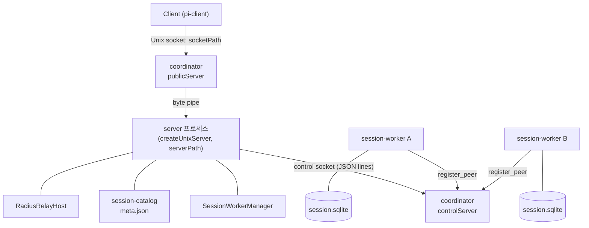
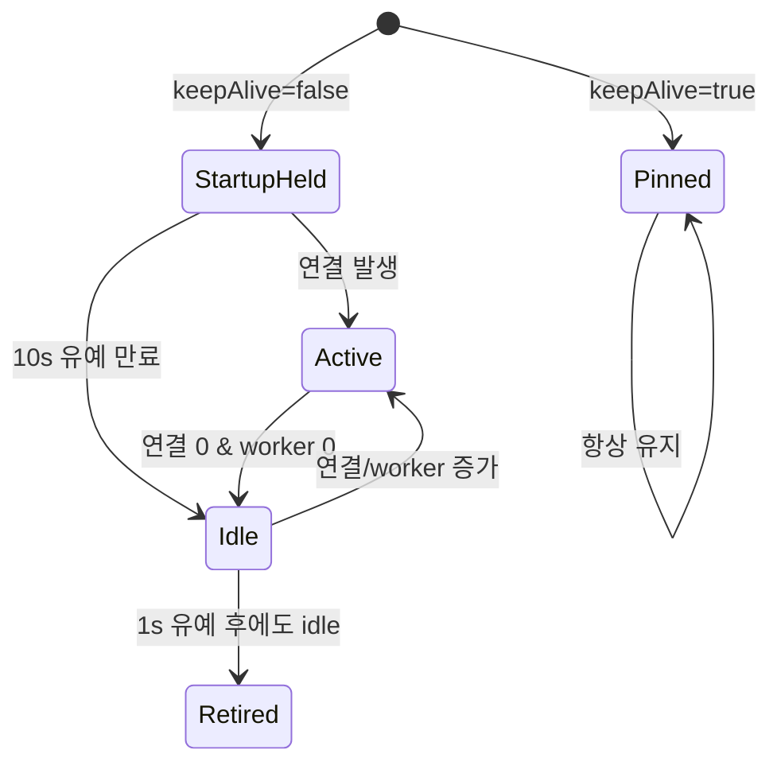
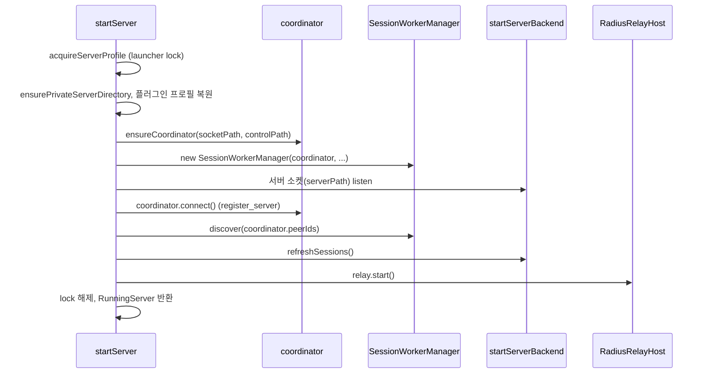
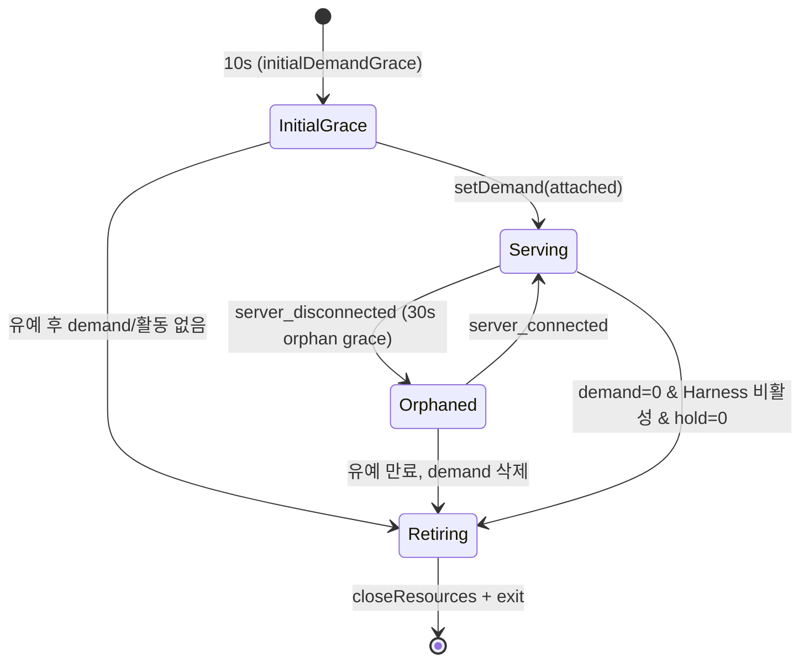
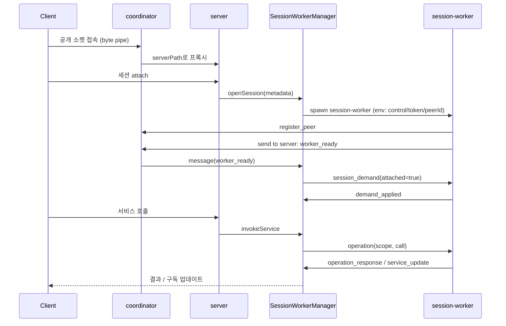

# experimental_server_runtime

`experimental_server_runtime`은 `packages/coding-agent/src/experimental/` 아래에서 **실험적 서버(experimental server)** 를 구성하는 프로세스 계층이다. 하나의 논리 서버(`ServerId`)를 **세 종류의 OS 프로세스**로 나눠 운영한다.

| 프로세스 | 진입점 | 역할 |
|---|---|---|
| coordinator | `coordinator.ts::runCoordinatorProcess` | 고정된 공개 소켓을 유지하는 "전송 shim". 현재 server로 바이트를 프록시하고, server/worker 간 불투명 메시지를 라우팅 |
| server | `server.ts::runServerProcess` | 교체 가능한(replaceable) 서버 본체. 세션 카탈로그, 플러그인 선택, worker 관리, Radius relay 호스팅 |
| session-worker | `session-worker.ts::runSessionWorkerProcess` | 세션 1개당 1개. `@earendil-works/pi-durable`의 `Harness`와 SQLite 저장소를 단독 소유 |

상위 CLI(`pi experimental server|client`)는 [experimental_cli](experimental_cli.md), 원격 중계는 [experimental_radius_relay](experimental_radius_relay.md), 서비스·클라이언트 TUI는 [experimental_services_and_client](experimental_services_and_client.md)를 참고한다. 하위 프로토콜/서버 기반은 [protocol](Distributed_Runtime_Foundation_(Chord,_Protocol,_Transport).md), [server](Distributed_Runtime_Foundation_(Chord,_Protocol,_Transport).md), [client](Distributed_Runtime_Foundation_(Chord,_Protocol,_Transport).md), Harness는 [Durable_Agent_Harness](Durable_Agent_Harness.md), 모델/설정은 [Model,_Credential_and_Settings_Management](Model,_Credential_and_Settings_Management.md)에 있다.

> 검증 수준: 아래 내용은 제공된 소스(`server.ts`, `coordinator.ts`, `session-catalog.ts`, `session-worker-manager.ts`, `session-worker.ts`, `source-resolver.ts`, `plugins/bundled.ts`)를 직접 읽은 **코드 확인**이다. `process.ts`, `services/*.ts`, `plugins/package.ts`의 세부 동작은 **미확인**(시그니처 사용처만 확인).

---

## 1. 아키텍처 개요

핵심 설계 포인트:

- **안정 엔드포인트 / 교체 가능한 서버**: 클라이언트는 항상 `getUnixSocketPath(serverId, directory)`(공개 경로)로 접속한다. 새 server가 `register_server`로 등록하면 coordinator는 기존 server에 `server_replaced`를 보내고 기존 공개 연결을 닫는다. 이전 server는 worker를 **종료하지 않고 `detach()`** 하므로 worker는 새 server에 재연결 없이 이어진다(`server.ts` 의 `activeCoordinator.replaced` 처리).
- **세션 = worker 프로세스**: 세션 디렉터리는 `proper-lockfile`로 잠기고 worker만 `session.sqlite`를 연다.
- **coordinator는 payload를 해석하지 않는다**: Node 내장 모듈만 사용하며 Pi/세션/수명주기 메시지를 이해하지 않는다(파일 주석).

### 디렉터리/파일 레이아웃 (`PI_SERVER_DIR`, 기본 `~/.pi/server`)

| 파일 | 용도 |
|---|---|
| `default-server-id` | 기본 논리 서버 ID (`wx` 플래그로 경쟁 안전하게 생성) |
| `launcher-<serverId>` | `acquireServerProfile`이 잡는 lock |
| `activation-<serverId>` | 자동 활성화 직렬화 lock (`acquireServerActivation`) |
| `control-<serverId>.sock` | coordinator control 소켓 |
| `server-<serverId>-<nonce>.sock` | 해당 server 세대의 실제 소켓(coordinator가 upstream으로 연결) |
| `<sessionDir>/<id>/meta.json`, `session.sqlite` | 세션 메타데이터, worker가 소유하는 저장소 |

세션 디렉터리 기본값은 `<agentDir>/experimental/sessions`(`resolveSessionDirectory`). 서버 디렉터리는 `ensurePrivateServerDirectory`가 `0700`·소유자 UID를 강제하고 소켓은 `0600`이다.

---

## 2. 컴포넌트

### 2.1 `server.ts` — 서버 프로세스

주요 함수/클래스:

- `activateServer(options)`: 클라이언트 측 자동 활성화. 활성화 lock을 잡고 접속을 시도 → 실패 시 `spawnInternalProcess("server", [directory, serverId, sessionDir, modelJson?])`로 자식 서버를 띄우고 10초(`ACTIVATION_TIMEOUT_MS`)까지 10ms 간격으로 재접속. 이미 다른 활성화자가 이겼는데 `model`이 지정됐다면 오류(시작 시 선택만 유효).
- `acquireServerProfile(directory, requestedServerId?)`: 서버 ID 결정(명시값 → 파일 → 신규 UUID) 후 `launcher-<id>` lock 획득.
- `startServer(options)`: 서버 본체 기동 (아래 시퀀스). `startForegroundServer`는 활성화 lock으로 자동 cold activation과 직렬화하고 `keepAlive: true`로 호출.
- `runServerProcess(args)`: 내부 자동 활성화 서버의 진입점. 인자 `[directory, serverId, sessionDir, serializedModel]`을 엄격히 검증(절대 경로, canonical server ID)하고 `keepAlive: false`로 시작, `SIGINT/SIGTERM` 시 종료.
- `ServerLifetime`: 자동 활성화 서버의 수명 조정기. 아래 상태 참고.
- `startServerBackend`: `createExperimentalServerServices`(세션 목록/생성/삭제/플러그인 준비 콜백)와 `ServerHost`(`resolveSession`, `openSession`)를 조립해 `createUnixServer`(mode `0o600`)를 시작.

#### 플러그인 선택

- 서버 기본 플러그인 패키지는 `restoreServerPluginPackageProfile`로 복원, 세션별 선택은 `readSessionPluginPackageProfile`/`writeSessionPluginPackageProfile`에 저장.
- `buildPluginSelection`이 각 패키지를 `build()`해 `manifestPaths`와 presentation artifact를 얻는다.
- 활성/시작 중 worker가 있는 세션에 다른 manifest 선택이 오면 `SessionPluginSelectionConflictError` → 클라이언트에는 `service_invalid_value`로 전달.

#### `ServerLifetime` 규칙

`AUTO_SERVER_STARTUP_GRACE_MS=10_000`, `AUTO_SERVER_IDLE_GRACE_MS=1_000`. 연결 수(`onConnectionCountChanged`)와 worker 수(`SessionWorkerManager`의 콜백) 둘 다 0일 때만 retire.

#### `startServer` 시퀀스

실패 시 `Promise.allSettled`로 relay/backend/workers/coordinator/lock을 모두 정리하고 오류가 겹치면 `AggregateError`로 묶는다. 교체(replaced)된 경우 worker는 shutdown 대신 `detach()`.

### 2.2 `coordinator.ts` — 전송 shim

두 부분으로 구성된다.

**(a) 서버 측 클라이언트 `CoordinatorConnection`** — `connect()`는 `register_server`(`protocol: COORDINATOR_PROTOCOL_VERSION = 3`, `serverConnectionId`, `endpoint`)를 보내고 `server_registered` 응답을 기다린다. `send(peerId, payload)`, `broadcast(payload)`, `onEvent(listener)`(`peer_connected` / `peer_disconnected` / `message`), `replaced` Promise, `wasReplaced`, `peerIds`를 제공. 모든 수신 메시지는 TypeBox(`CoordinatorMessageSchema`)로 검증하며 위반 시 소켓 파괴. 줄 단위 JSON이며 `MAX_CONTROL_LINE_BYTES` 초과 시 파괴.

**(b) 프로세스 본체** (`runCoordinatorProcess`)

- `publicServer`(공개 경로) + `controlServer`(control 경로) 두 Unix 소켓 listen, 기존 stale 소켓은 `removeStaleSocket`이 살아있는지 연결 테스트 후 정리(살아있으면 오류). 모드 `0600`.
- control 연결은 첫 메시지로 역할을 등록: `register_server`(현재 server, 이전 server는 교체) 또는 `register_peer`(worker; `"server"` 예약, 중복 ID 거부).
- 라우팅: `send {to}` → `"server"` 또는 peer ID로 `message {from, payload}` 전달, `broadcast`는 **현재 server만** 가능.
- `acceptPublicConnection`: 현재 server의 `endpoint`에 upstream 연결 후 양방향 `pipe`. server가 없으면 즉시 종료.
- 비어 있으면(server·peer·연결 없음) 기동 후 30s, 이후 250ms 유예로 자동 종료(`EMPTY_STARTUP_GRACE_MS`, `EMPTY_SHUTDOWN_GRACE_MS`).

`ensureCoordinator`는 control 소켓에 접속해 보고, 없으면 `spawnInternalProcess("coordinator", ...)` 후 10s 대기. 반환되는 `CoordinatorStartupLease`는 coordinator가 조기 종료되지 않도록 붙잡아 두는 연결이다.

### 2.3 `session-catalog.ts` — 파일 기반 세션 카탈로그

- `SessionCatalogMetadata { id, createdAt, cwd, path }`, ID 규칙 `^[A-Za-z0-9][A-Za-z0-9._-]{0,127}$`.
- `listSessions`(유효한 `meta.json`이 없는 항목은 무시), `readSession`, `createSession`(디렉터리 `mkdir`로 중복 검출 → `meta.json` 작성), `deleteSession`(worker가 먼저 닫혀 있어야 함), `sessionStoragePath`(`session.sqlite`).
- 저장소 파일 자체는 worker가 첫 open에서 생성한다.
- 서버의 세션 목록은 디스크 목록과 `workers.trackedSessions`를 `path` 기준으로 병합한다.

### 2.4 `session-worker-manager.ts` — worker 수명·RPC 관리

server 프로세스 내부에서 worker를 launch/추적/종료하고 서비스 호출을 중계한다.

- **launch**: `spawnInternalProcess("session-worker", [JSON(options)], { env })`. env로 `PI_SESSION_WORKER_CONTROL_ADDRESS`, `..._CONTROL_TOKEN`, `..._SESSION_KEY_BASE64`, `..._PEER_ID` 전달. 15s 안에 `worker_ready` 없으면 실패·SIGKILL.
- **인증**: 모든 worker 이벤트는 `peerId`, `token`, `sessionKey` 3중 일치를 검사(불일치 시 무시/거부). 서버 세대는 `serverConnectionId`로 구분.
- **demand**: 클라이언트가 세션에 attach하면 `session_demand{attached:true}`를 worker로 전송하고 `demand_applied`를 5s 기다림. 타임아웃 시 보상으로 `attached:false`를 재전송, 이것도 실패하면 worker 종료.
- **operation**: `ServiceCall`을 `operation`으로 전송, `operation_response`로 결과/오류 수신. 시간 제한은 없으며 완료·연결 끊김·교체·종료로만 정산. `AbortSignal` 발생 시 `operation_cancel` 전송.
- **subscription**: `subscribe` 제어 호출을 감지해 `(scope, subscriptionId)` 키로 등록하고 `service_update`를 순서 보장(`deliveryTail`)으로 `publish`.
- **종료**: `#stopWorker`는 `shutdown` 전송 → 10s 후 SIGKILL. `shutdown()`은 pending·active 모두 정리. `detach()`는 worker를 그대로 두고 상태만 폐기(서버 교체 시).
- **discovery**: 새 server가 `peerIds` 중 모르는 worker에 `discover_workers`를 브로드캐스트 → 각 worker가 `worker_ready`로 재발표(5s 제한). 이것이 서버 교체 후 worker 승계 메커니즘이다.
- **workerPids / trackedSessions**: 상태 조회용.

### 2.5 `session-worker.ts` — 세션 worker 프로세스

- 시작: `connectControl` → `register_peer` → `peer_registered` 확인 → 세션 디렉터리 lock(`proper-lockfile`, 최대 약 8s 재시도) → `createCodingAgentHarness` → `createSessionWorkerServices` → `harness.resume()` → `worker_ready` 전송.
- `createCodingAgentHarness`: `ModelRuntime.create()`, `SettingsManager.create(cwd)`, `ExecutionEnvs`, `Harness.open(openNodeSqliteStorage(...))`. 초기 모델은 **루트 conversation이 새로 만들어질 때만** 적용(`findInitialAgentModel`), 이후는 저장된 모델 유지. 플러그인은 `createSessionPluginFacetLoader`로 연결.
- 메시지 스키마(모두 TypeBox `StrictObject`): `SessionWorkerCommand`(`shutdown`, `discover_workers`, `session_demand`, `operation`, `operation_cancel`) / `SessionWorkerEvent`(`worker_ready`, `worker_failed`, `demand_applied`, `demand_rejected`, `operation_response`, `service_update`).
- `WorkerLifecycle`: worker 자기 종료 조정기.

종료를 막는 요인: (1) 활성 demand, (2) Harness에 살아있는 task(`taskGraph` 구독, 백그라운드 작업 포함), (3) 진행 중 요청/demand 처리의 `holdRetirement`. 유예 시간은 테스트용 env `__PI_SESSION_WORKER_INITIAL_DEMAND_GRACE_MS`, `__PI_SESSION_WORKER_ORPHAN_DEMAND_GRACE_MS`로 조정.
- 오래된 server 세대의 요청은 `beginRequest`가 거부한다.
- 오류는 `RemoteServiceError` 코드를 보존해 `operation_error`로 반환 → manager가 `ServerError`로 복원.
- `closeResources`는 services → harness → runtime.cleanup → lock 해제 순으로 닫고 오류를 `AggregateError`로 합친다.

### 2.6 `source-resolver.ts` — 소스 실행용 모듈 resolve

Node의 TypeScript strip 실행은 `tsconfig.json`의 `paths` 별칭을 적용하지 않는다. 이 모듈은 로드되면 `registerHooks({ resolve })`로 루트 `tsconfig.json`의 `@earendil-works/*` 별칭을 `.ts` 소스 파일로 resolve(`.js→.ts`, `.mjs→.mts` 매핑, index.ts 폴백)한다. 별칭이 매칭되었으나 실패하면 오류를 던져 **오래된 `dist`로 조용히 빠지는 것을 방지**한다. 별칭은 패턴 길이가 긴 순으로 우선 매칭하고 와일드카드는 1개만 허용. 저장소 루트 밖으로 벗어나는 경로는 거부.

### 2.7 `plugins/bundled.ts` — 플러그인 facet 로더

- `createSessionPluginFacetLoader(manifestPaths)`: manifest마다 `createOptionalSessionFacetLoader`(entry `session`이 없으면 빈 facet)를 만들어 `combineFacetLoaders`로 결합.
- `createPresentationFacetData` / `createPresentationFacetLoaders`: 서버가 선택·빌드한 presentation artifact를 `presentationFacetBundles` 키의 JSON으로 전달하고, 클라이언트는 **서버가 보낸 artifact로만** 로더를 만든다(로컬 임의 로드 방지).
- `resolvePluginExternal`: `@earendil-works/pi-coding-agent/experimental/plugin` 지정자를 현재 확장자(.ts/.js)에 맞는 `../plugin.*`로 매핑.

---

## 3. 대표 흐름: 클라이언트 접속 → 세션 작업

## 4. 서버 교체(replacement) 흐름

1. 새 server가 `register_server` → coordinator가 `peers` 목록과 함께 `server_registered` 응답.
2. coordinator: 공개 연결 닫기, 피어에 `server_disconnected`/`server_connected`, 이전 server에 `server_replaced`.
3. 이전 server: `lifetime.stop()`, `workers.detach()`, relay/backend 종료.
4. 새 server: `workers.discover(peerIds)`로 worker를 재발견. worker의 `WorkerLifecycle`은 orphan 유예(30s) 안에 `server_connected`를 받아 demand를 유지.
5. 클라이언트는 재접속(`Client.reconnect`, [client](Distributed_Runtime_Foundation_(Chord,_Protocol,_Transport).md))으로 이어간다.

## 5. 오류 처리·안전 장치 요약

| 영역 | 처리 |
|---|---|
| 소켓 보안 | 서버 디렉터리 `0700`·UID 검사, 소켓 `0600` |
| 동시 기동 | `launcher-*`, `activation-*`, 세션 디렉터리 lock (`proper-lockfile`) |
| 프로토콜 | `COORDINATOR_PROTOCOL_VERSION=3` 불일치 거부, TypeBox 검증, 줄 크기 제한 |
| worker 위조 방지 | token + peerId + sessionKey + scope 일치 확인 |
| 정리 | 모든 종료 경로가 `Promise.allSettled` + `AggregateError` |
| 취소 | `AbortSignal` → `operation_cancel` → worker의 `withCancel` context |

## 6. 의존 관계

- 내부: `process.ts`(`spawnInternalProcess`, `encodeControlLine`, `MAX_CONTROL_LINE_BYTES`), `services/server.ts`, `services/worker.ts`, `services/sessions.ts`, `plugins/package.ts`, `durable/harness-setup.ts` — [experimental_services_and_client](experimental_services_and_client.md), [experimental_durable_harness](Durable_Agent_Harness.md)
- 외부 패키지: `@earendil-works/chord`(Context, 서비스 호출/갱신), `pi-server`(`createUnixServer`, `ServerHost`, `RoutedSessionHandle`), `pi-client`(`Client`), `pi-protocol`(`isServerId`), `pi-durable`(`Harness`, SQLite 저장소)
- 코어: `ModelRuntime`, `SettingsManager`([Model,_Credential_and_Settings_Management](Model,_Credential_and_Settings_Management.md))

## 7. 빌드·구성 참고

TS 소스 별칭은 루트 `tsconfig.json`의 `paths`에 정의되며 `source-resolver.ts`가 이를 직접 읽는다. 패키지 구성은 `packages/coding-agent/package.json`, `packages/server/package.json`, `packages/client/package.json`을 참고(이 문서에서는 내용 미확인).
