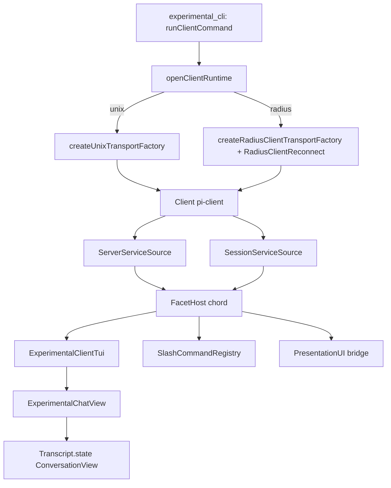
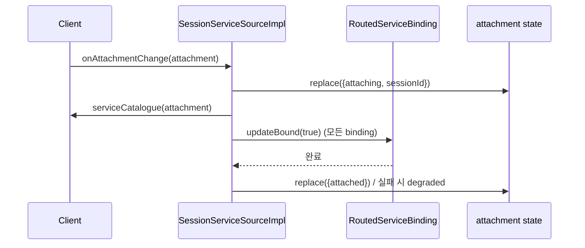
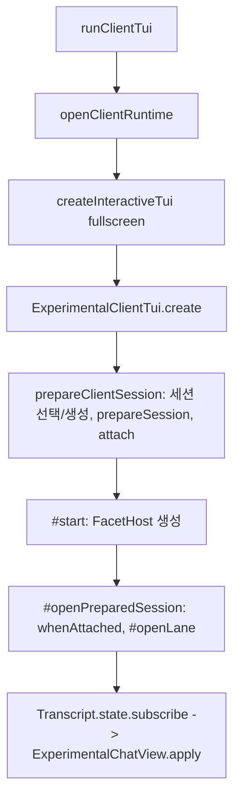

# experimental_services_and_client

`Experimental_Server_and_Client_Runtime`의 하위 모듈로, **실험적 pi 클라이언트가 서버/세션에 접속해 서비스 파사드를 열고, 이를 전체 화면 TUI로 표시하는 계층**을 담당한다. 서버 쪽 구현은 [experimental_server_runtime](experimental_server_runtime.md), CLI 진입은 [experimental_cli](experimental_cli.md), Radius 중계는 [experimental_radius_relay](experimental_radius_relay.md)를 참고한다.

> 검증 수준: 아래 내용은 제공된 소스(`packages/coding-agent/src/experimental/*`)를 직접 읽은 **코드 확인**이다. 외부 패키지(`chord`, `pi-client`, `pi-durable`) 내부 동작은 **미확인/추론**으로 표기한다.

## 1. 구성 요소 개요

| 파일 | 역할 |
|---|---|
| `client-runtime.ts` | `openClientRuntime`(서버 탐색/활성화/연결), `activateBuiltinClientServices`(비대화형 클라이언트용 내장 서비스 획득) |
| `client-tui.ts` | `ExperimentalClientTui`: 서비스 전용(service-only) 프레젠테이션. 입력, 슬래시 명령, 재연결 복구 |
| `client-tui-chat.ts` | `ExperimentalChatView`: `ConversationView`(durable 문서)를 TUI 컴포넌트로 렌더 |
| `services/connection.ts` | `ServerServiceSource` / `SessionServiceSource`: Client를 chord `RemoteServiceSource`로 감싸고 연결/첨부 상태를 복제 상태로 공개 |
| `services/agent-controller.ts` | `AgentController` 서비스 계약 (prompt/steer/followUp/abort/compact) |
| `services/sessions.ts` | `SessionDirectory`(복제 상태), `SessionManagement`(create/remove/attach/detach) 계약 |
| `services/presentation-ui.ts` | `PresentationUI`: facet이 쓰는 프로세스 로컬 UI 능력(`select`, `showStatus`) |
| `services/slash-commands-provider.ts` | `SlashCommandRegistry`와 내장 `/model` `/thinking` `/compact` `/reload` facet |

## 2. 아키텍처

핵심 아이디어: 클라이언트는 도메인 로직을 갖지 않고, 서버가 소유한 서비스(`SessionDirectory`, `AgentController`, `Transcript`, `Models`, `PresentationPlugins` 등)를 chord 원격 서비스로 사용한다. TUI는 `Transcript.state`(복제된 `ConversationView`)를 구독해 그리기만 한다.

## 3. client-runtime.ts

### openClientRuntime
1. 옵션 검증: `auth`는 Radius 전용, `provider`는 `model` 필요, `--connect`와 `model` 동시 불가, Radius에는 `pluginPackages` 불가.
2. 경로 결정
   - `--connect` 지정: Radius는 `serverId`, Unix는 경로 끝이 `<uuidv4>.sock`이어야 한다(`routeFromExplicitPath`).
   - 미지정: `discoverUnixServers({directory})`. 서버가 없으면 `activateServer`(server.ts)로 새 서버를 띄운다. 기존 서버가 있는데 `model`을 주면 오류.
3. 서버별로 `Client.connect` 후 `createServerServiceSource`, `createSessionServiceSource` 생성. 자동 탐색한 Unix 서버가 `ServerError.code === "version"`이면 같은 serverId로 `activateServer`하여 재활성화한다.
4. Radius 경로면 `SessionManagement`를 열어 `RadiusClientReconnect`를 달아, 재연결 시 `attach(sessionId)`를 다시 호출한다.
5. `dispose`는 reconnector → service source → client 순으로 `allSettled` 정리하고, 실패 여럿이면 `AggregateError`.

### activateBuiltinClientServices
서버 범위 `[SessionDirectory, SessionManagement, PresentationPlugins]`와 세션 범위 `[Models, AgentController, Transcript]`를 열고 `ready`까지 기다린다. `management`는 원격 호출을 감싸 `attach` 후 `whenAttached`, `detach` 후 `whenDetached`, 현재 첨부 세션을 `remove`하면 `whenDetached`를 기다려 **서비스 바인딩 상태와 호출 완료 시점을 일치**시킨다.

## 4. services/connection.ts

- `RoutedServiceBinding`: chord `RemoteServiceBinding`을 감싸 `bound`를 외부 조건(연결됨/첨부됨)에 따라 `updateBound`로 재바인딩. 첫 `ready`에서 활성화하고 `onActivate`를 한 번 실행.
- `ServerServiceSourceImpl`: `client.onConnectionStateChange`에 따라 `connection` 상태(`connecting|connected|disconnected`)를 발행하고 binding들을 직렬(`#transition`)로 재바인딩. `acceptsUnavailableServices = false`.
- `SessionServiceSourceImpl`: 첨부 변경마다 `#attachmentRevision`을 올려 **오래된 전이 결과를 버린다**(`sameAttachment` 검사). 상태는 `detached|attaching|attached|degraded`. `whenAttached`/`whenDetached`는 해당 세대(generation)의 hydrate 완료를 기다린다. 카탈로그를 캐시하며 첨부 전에는 사용 불가 서비스를 허용(`acceptsUnavailableServices`).

## 5. 서비스 계약

- `AgentController` (`pi.agent-controller`): `prompt`는 실행 중이면 `busy`로 거절, `steer`는 실행 중 개입 또는 유휴 시 시작, `followUp`은 큐잉, `cancelQueued`, `abort`(큐 철회 + 실행/압축 중단), `compact`, `waitForPrompt`. 응답은 `accepted` 판별 유니온. 압축 요청은 `AgentCompactionRequest { customInstructions }`.
- `SessionDirectory` (`pi.session-directory`): `ReplicatedState<SessionDirectoryState>`(`revision`, `sessions[]`).
- `SessionManagement` (`pi.session-management`): create/remove/attach/detach.
- `PresentationUI` (`pi.local.presentation-ui`, `local: true`): 원격이 아닌 로컬 전용 서비스.

## 6. client-tui.ts

`ExperimentalClientTui`는 `Component`이며 `create()`로만 생성된다.

### prepareClientSession 선택 규칙
- `--session <id>`: 여러 서버에 중복되면 오류. 없으면 Radius는 오류, Unix는 해당 id로 생성.
- `--continue/--resume`: `createdAt` 최신 세션(동률은 serverId, sessionId 순).
- 그 외: 단일 서버에서 새 세션 생성(`requireSingleServer`).
- 이후 `PresentationPlugins.prepareSession`으로 플러그인 데이터를 받고 `attach` + `whenAttached`.

### Facet 구성
`createFacetHost`에 `slash-commands-runtime`, `presentation-bridge`, `slash-commands-builtin`, 공유 facet, 프레젠테이션 플러그인 facet을 올린다. `presentation-bridge`가 `PresentationUI`를 제공(`select`는 화면을 `select`로 전환해 `SelectList` 표시)하고 `SlashCommands`, `AgentController`, `Transcript`를 캡처한다. `/reload`는 `reloadPresentationPlugins`로 후보 세대를 로드해 `facetHost.reload`, 성공 시 이전 세대 dispose, 실패 시 후보 dispose. `#facetReloadTail`로 직렬화.

### 입력 처리
- 일반 텍스트: 실행 중이면 `steer`, 아니면 `prompt`. `/name args`는 슬래시 명령 실행. 후속 큐잉 키(`app.message.followUp`)는 `followUp`. Esc는 `abort`. `#busy`(재연결 중)에는 종료 키만 허용.

### Radius 복구
`connection`/`attachment` 상태 구독으로 연결 끊김 시 `#closeLane`, 재첨부 후 `#openLane`. `#queueRecovery`가 전이를 직렬화하고 오류는 상태줄에 표시.

### 종료
`close()`는 멱등(`#closePromise`). 복구 전이 → lane → facet reload tail → facetHost → facet 세대 순으로 정리하고 오류는 `AggregateError`로 모은다.

## 7. client-tui-chat.ts: ExperimentalChatView

`apply(view)`는 증분 렌더:
- `#syncTranscript`: 이미 그린 entry id 접두가 달라지면(압축/리셋) `#rebuild`, 아니면 새 entry만 추가. `pi.user`, `pi.assistant`, `pi.tool-result`, `pi.compaction`, `pi.reset` 종류별 컴포넌트.
- `pi.live` 문서: 스트리밍 중인 assistant 메시지(`generation.message`), 실행 중인 도구 슬롯(`pending/running`)을 `ToolExecutionComponent`로 표시.
- `pi.inbox`: 대기 입력을 `[mode] text`로 표시.
- 상태줄: 재시도, 지연 응답, 압축, 도구 실행, 작업 중 순서로 텍스트 결정 후 `WorkingStatusIndicator` 교체.
- 도구 호출 ID는 턴 간 재사용될 수 있어 `#tools`(최신)와 `#cards`(전부)로 분리. 중단된 응답의 호출은 "Not run" 오류 카드.
- `refreshTheme`/`dispose`: 타이머 있는 bash 카드를 최종 결과로 닫는다.

## 8. 슬래시 명령 (slash-commands-provider.ts)

`SlashCommandRegistry`: 이름은 `/^[a-z0-9][a-z0-9:-]*$/`. `register`는 중복 시 오류, `replace`는 같은 이름을 스택처럼 덮어쓰며(해제 시 앞쪽 closed 항목 정리) 변경 시 `subscribe` 리스너에 알림. 내장 명령: `/model`(인자 또는 선택 UI, `models.select`), `/thinking`(`getThinkingLevels`, `selectThinking`), `/compact`(`controller.compact`), `/reload`(PresentationPlugins + SessionPlugins 재로드 후 TUI facet 재로드).

## 9. 의존 관계

- 서비스/facet 런타임: `@earendil-works/chord` ([chord_core](chord_core.md), [chord_services](chord_services.md))
- 전송/클라이언트: [client](client.md), [protocol](protocol.md)
- 데이터 모델: `@earendil-works/pi-durable` ([durable_harness](durable_harness.md))의 `ConversationView`
- UI: [tui_core](tui_core.md), [tui_components](tui_components.md), [interactive_message_components](interactive_message_components.md), [interactive_theme](interactive_theme.md)
- 모델/설정: [model_and_auth_management](model_and_auth_management.md), [settings_and_keybindings](settings_and_keybindings.md)
- 서버 측 대응: [experimental_server_runtime](experimental_server_runtime.md)

관련 빌드/테스트 설정은 `packages/coding-agent/package.json`, `packages/coding-agent/vitest.config.ts` 참고 (본 모듈 고유 설정은 없음).

## 10. 유의점

- 서비스 바인딩은 "연결/첨부 세대" 기준으로 무효화된다. 새 비동기 전이를 추가할 때 `#attachmentRevision` 검사를 빼면 오래된 결과가 상태를 덮어쓴다.
- TUI 코드는 `process.cwd()`를 도구 렌더 기준으로 사용한다(원격 서버의 cwd와 다를 수 있음, 추론).
- `assertAccess() {}`와 `onError() {}`가 빈 구현인 호출부가 있어 서비스 오류가 조용히 무시될 수 있다.
