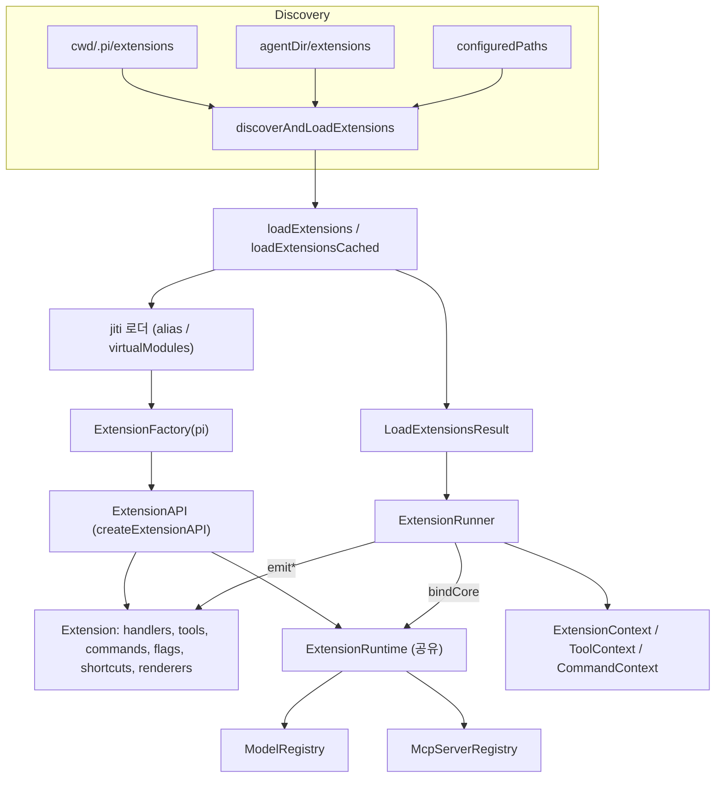
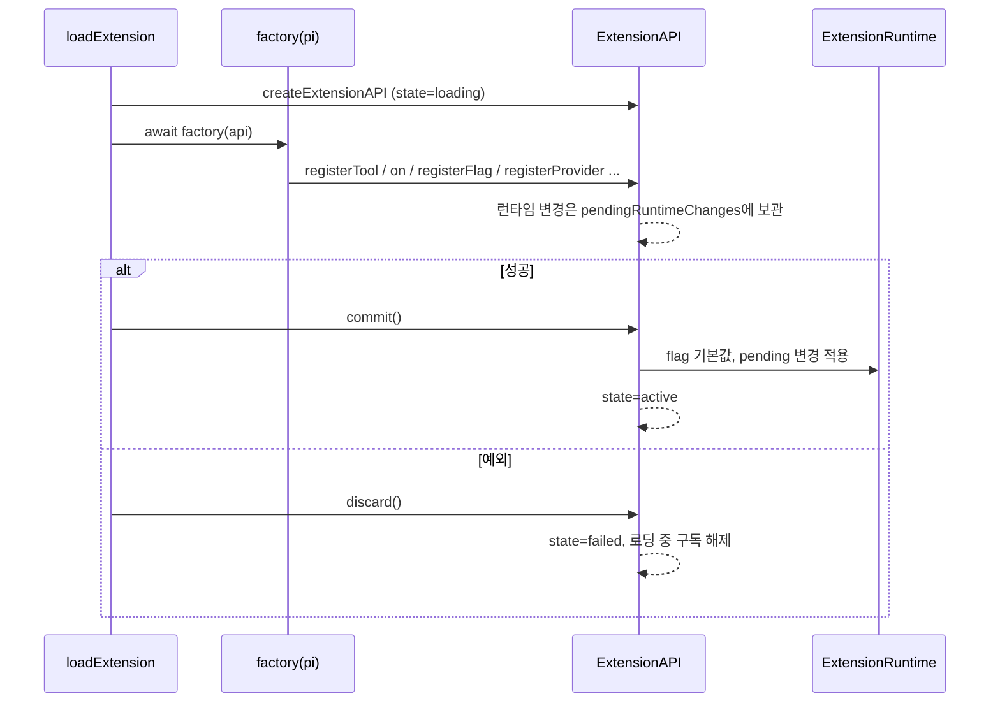
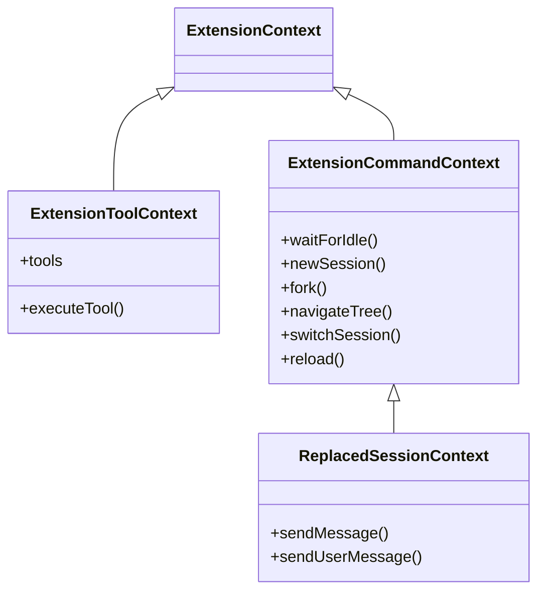
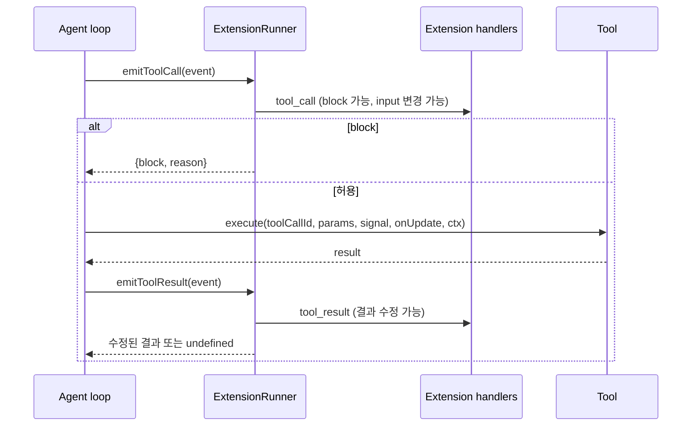

# extension_system 모듈

`extension_system`은 `packages/coding-agent`의 확장(Extension) 인프라입니다. TypeScript/JavaScript 확장 모듈을 **발견·로드**(`loader.ts`)하고, 에이전트 수명주기 이벤트를 확장 핸들러로 **디스패치**(`runner.ts`)하며, 확장이 사용하는 **공개 API·이벤트·컨텍스트 타입**(`types.ts`)과 **MCP 서버 등록소**(`mcp-servers.ts`)를 정의합니다.

확장은 다음을 할 수 있습니다.

- 에이전트 이벤트 구독(`pi.on(...)`)
- LLM이 호출하는 도구 등록(`registerTool`)
- 슬래시 명령·단축키·CLI 플래그 등록
- 프로바이더/가상 모델/MCP 서버 등록
- UI(`ctx.ui`) 조작

> 검증 수준: 아래 내용은 제공된 `loader.ts`, `runner.ts`, `types.ts`, `mcp-servers.ts` 소스를 직접 읽고 작성했습니다(코드 확인). 호출 측(`AgentSession` 등)의 동작은 해당 모듈 문서를 참조하며, 여기서는 추론으로 표시합니다.

## 관련 모듈

| 모듈 | 관계 |
|---|---|
| [agent_session_core](agent_session_core.md) | `AgentSession.extensionRunner`가 `ExtensionRunner`를 보유하고 `bindCore`/`bindCommandContext`로 액션을 주입(추론) |
| [builtin_tools](builtin_tools.md) | 도구 이벤트 타입(`BashToolCallEvent` 등)의 입력/세부 타입 출처 |
| [bundled_extensions](bundled_extensions.md) | `codemode`, `mcp`, `llama`, `tool-search` 등 내장 확장. 같은 API를 사용 |
| [mcp](mcp.md) | `McpServerRegistry`에 등록된 서버를 실제로 연결하는 클라이언트 |
| [codemode](codemode.md) | `ctx.executeTool()`로 다른 도구를 호출하는 샌드박스 |
| [model_and_auth_management](model_and_auth_management.md) | `ModelRegistry.registerProvider`/`registerVirtualModel` 대상 |
| [settings_and_keybindings](settings_and_keybindings.md) | 단축키 충돌 검사에 쓰는 `KeybindingsConfig` |
| [session_persistence_and_compaction](session_persistence_and_compaction.md) | `session_before_compact`, boundary entry draft가 닿는 영역 |
| [tui_core](tui_core.md) / [tui_components](tui_components.md) | `Component`, `TUI`, `OverlayOptions` 등 UI 타입 |
| [pi_dev_extensions](pi_dev_extensions.md) | 이 시스템 위에서 작성된 `.pi/extensions/*` 예제 |

## 아키텍처



핵심 설계: **등록은 `Extension` 객체에, 동작은 공유 `ExtensionRuntime`에** 둡니다. 로드 시점에는 모델 레지스트리·세션이 없으므로 런타임 액션은 "throwing stub"이고, `ExtensionRunner.bindCore()`가 실제 구현으로 교체합니다.

## 1. 로더 (`loader.ts`)

### 발견 규칙 (`discoverAndLoadExtensions`)

우선순위 순서로 경로를 모으고 `path.resolve` 기준으로 중복을 제거합니다.

1. 프로젝트 로컬: `<cwd>/<CONFIG_DIR_NAME>/extensions/`
2. 전역: `<agentDir>/extensions/`
3. 명시 경로(`configuredPaths`): 디렉터리면 `resolveExtensionEntries`, 없으면 디렉터리 내 개별 파일 발견, 파일이면 그대로 추가

`discoverExtensionsInDir`의 규칙(한 단계까지만 탐색):

- 직접 파일 `*.ts` / `*.js`
- 하위 디렉터리의 `index.ts` / `index.js`
- 하위 디렉터리 `package.json`의 `pi.extensions` 매니페스트(`readPiManifest`)

### 모듈 로딩 (`loadExtensionModule`)

`jiti`로 TS를 직접 import하며, 실행 환경에 따라 해석 방식이 다릅니다.

| 환경 | 해석 옵션 |
|---|---|
| Bun 바이너리 / Node SEA / bundled node | `virtualModules`, `tryNative: false` + `jiti-static-loader` |
| TS 소스 실행 | `virtualModules` + `tsconfigPaths: true` |
| 빌드된 Node(dist) | `alias: getAliases()` |

`getAliases()`는 `@earendil-works/pi-*`와 구 스코프 `@mariozechner/pi-*`, `typebox`, `@sinclair/typebox`를 호스트 모듈로 매핑합니다. 확장이 `pi-ai` 루트를 import하면 `compat` 엔트리(코어의 상위 집합)로 해석되어 구 전역 API 확장이 계속 동작합니다.

`loadExtensionsCached`는 cwd·세대(generation) 토큰으로 팩토리를 캐시하고, cwd가 바뀌면 `clearExtensionCache()`로 비웁니다.

### 로드 트랜잭션 (`createExtensionAPI`)

API는 `loading → active | failed` 상태를 가집니다.



- 로드 중 실패한 확장의 provider/MCP/flag 등 **런타임 부수효과는 적용되지 않습니다**(`applyRuntimeChange`).
- `registerTool`은 `parameters`가 객체 스키마가 아니면 예외를 던집니다.
- `registerMcpServer`는 `validateMcpServerConfig` 검증, 다른 확장이 소유한 이름 거부, `-`/`_`만 다른 이름의 namespace 충돌 거부를 수행합니다.
- 로드 오류는 `LoadExtensionsResult.errors`에 모이고 나머지 확장은 계속 로드됩니다.

### 런타임 stale 처리

`ExtensionRuntime.invalidate()`는 세션 교체/리로드 후 캡처된 `pi`/`ctx` 사용을 막기 위해 stale 메시지를 설정하고 이벤트 버스 구독을 모두 해제합니다. 이후 모든 API 호출은 `assertActive()`에서 예외가 됩니다.

## 2. 러너 (`runner.ts`)

### 바인딩

| 메서드 | 역할 |
|---|---|
| `bindCore(actions, contextActions, providerActions?)` | 액션을 공유 런타임에 복사, 로드 중 큐잉된 provider/native provider/virtual model 등록을 flush(오류는 `emitError`), 이후 등록은 즉시 반영. MCP 변경 리스너 설정 |
| `bindCommandContext(actions?)` | `waitForIdle`, `newSession`, `fork`, `navigateTree`, `switchSession`, `reload` 연결. 없으면 no-op |
| `setUIContext(ui?, mode)` | UI 주입. 프롬프트류(`select/confirm/input/editor/custom`)는 `withUIPrompt`로 감싸 `ui_prompt_start/end` 이벤트 발행. UI가 없으면 `noOpUIContext` |

### 컨텍스트 계층



- `createContext()`는 getter마다 `assertActive()`를 호출합니다. `createCommandContext()`는 spread 대신 `Object.defineProperties`로 getter를 lazy하게 유지해 stale 검사를 우회하지 못하게 합니다.
- `createToolContext(toolCallId, signal)`의 `executeTool`은 도구 실패를 reject하지 않고 `isError: true` 결과로 돌려줍니다.

### 이벤트 디스패치 의미론

핸들러는 `snapshotEventHandlers`로 **디스패치 시점에 복사**되어, 실행 중 구독 변경이 순회에 영향을 주지 않습니다. 확장 순서는 로드 순서이며, 확장 내부는 등록 순서입니다. 핸들러 예외는 대부분 `emitError`로 격리됩니다.

| 메서드 | 이벤트 | 결합 방식 |
|---|---|---|
| `emit` | 일반 이벤트, `session_before_*` | `session_before_*`는 마지막 결과 유지, `cancel`이면 즉시 반환 |
| `emitToolCall` | `tool_call` | `block` 결과 시 즉시 중단. **예외를 격리하지 않음**(핸들러 throw가 전파됨). `event.input` 변경은 이후 핸들러에 보임 |
| `emitToolResult` | `tool_result` | 필드별 체이닝(`content`, `details`, `structuredContent`, `isError`, `usage`). `content`만 바꾸면 `structuredContent` 삭제 |
| `emitContext` | `context` → `context_with_system` | 1단계는 system 메시지 제외 후 `restoreSystemMessages`로 프롬프트/도구 상태 복원, 2단계는 전체 transcript를 그대로 사용 |
| `emitBeforeProviderRequest` | `before_provider_request` | payload 교체 체이닝 |
| `emitBeforeProviderHeaders` | `before_provider_headers` | 핸들러가 headers를 in-place 변경 |
| `emitBeforeAgentStart` | `before_agent_start` | 메시지 누적, `systemPrompt` 덮어쓰기(`forceSystemPrompt`) |
| `emitMessageEnd` | `message_end` | 같은 role의 메시지로만 교체 허용 |
| `emitInput` | `input` | `transform` 체이닝, `handled`는 단락 |
| `emitUserBash` | `user_bash` | 첫 유효 결과 반환. 잘못된 형태는 오류 후 throw |
| `emitBoundary` | `turn_end`, `agent_before_settle` | `entries`/`continue`를 누적하고 매번 `buildContext`로 검증. 무효 시 `entries: []`로 폐기 |
| `emitCacheWarmingDecision` | `cache_warming_decision` | 마지막 override 우선 |
| `emitResourcesDiscover` | `resources_discover` | skill/prompt/theme 경로 수집 |
| `emitProjectTrustEvent` (함수) | `project_trust` | 첫 `yes`/`no` 승리, `undecided`는 다음으로 |

### 이벤트 흐름 예: 도구 호출



### 조회/충돌 해결

- 도구: `getAllRegisteredTools`, `getToolDefinition` — 이름 중복 시 **먼저 로드된 확장이 우선**.
- 플래그: `getFlags` 첫 등록 우선, `setFlagValue`는 런타임 맵에 기록.
- 명령: `resolveRegisteredCommands`가 중복 이름에 `name:1`, `name:2` 접미사를 부여(`invocationName`).
- 단축키: `getShortcuts`가 내장 키바인딩과 비교. `RESERVED_KEYBINDINGS_FOR_EXTENSION_CONFLICTS`(예: `app.interrupt`, `app.exit`, `tui.input.submit`)와 충돌하면 확장 단축키를 건너뛰고, 예약되지 않은 내장과 충돌하면 확장이 덮어씁니다. 확장끼리 충돌하면 나중 것이 이깁니다. 결과는 `getShortcutDiagnostics`로 확인합니다.
- 렌더러: `getMessageRenderer`, `getEntryRenderer`(첫 일치), `getMarkdownTransformers`(확장당 1개, 모두 반환).
- `reportUnhandledMcpServers`: `mcp_servers_change` 핸들러가 없으면(내장 MCP가 다른 확장으로 대체된 경우) 등록된 서버를 `register_mcp_server` 오류로 보고합니다.

## 3. 타입 (`types.ts`)

### 이벤트 분류

| 범주 | 이벤트 |
|---|---|
| 시작/리소스 | `project_trust`, `resources_discover`, `mcp_servers_change` |
| 세션 | `session_start`, `session_info_changed`, `session_before_switch/fork/compact/tree`, `session_compact`, `session_compact_failed`, `session_tree`, `session_shutdown` |
| 에이전트 | `before_agent_start`, `agent_start`, `agent_end`, `agent_before_settle`, `agent_settled`, `turn_start`, `turn_end`, `message_start/update/end` |
| LLM 요청 | `context`, `context_with_system`, `before_provider_request`, `before_provider_headers`, `after_provider_response`, `provider_stream_event`, `cache_warming_decision` |
| 도구 | `tool_call`, `tool_result`, `tool_execution_start/update/end` |
| 모델/입력/UI | `model_select`, `thinking_level_select`, `input`, `user_bash`, `ui_prompt_start/end` |

### 도구 이벤트 타입과 가드

`ToolCallEvent`/`ToolResultEvent`는 내장 도구(`bash`, `powershell`, `read`, `edit`, `write`, `grep`, `find`, `ls`)별 판별 유니온에 `Custom*` 이벤트를 더한 형태입니다. `Custom*.toolName`이 `string`이라 `event.toolName === "bash"`로는 좁혀지지 않으므로 `isToolCallEventType("bash", event)`와 `isBashToolResult` 등 가드를 제공합니다. 커스텀 도구는 `isToolCallEventType<"my_tool", Input>(...)`로 타입 인자를 직접 지정합니다.

중첩 호출(`ctx.executeTool`)은 `parentToolCallId`와 `<parent id>/<n>` id를 가지며 transcript에는 나타나지 않고 부모 결과의 `nestedCalls`에만 기록됩니다.

### 경계(Boundary) 타입

`turn_end`, `agent_before_settle`은 `BoundaryState`(`entries`, `continue`, `context`, `outcome`)를 받습니다. 핸들러는 `BoundaryResult`로 `SessionBoundaryDraft`(`CustomEntryDraft`, `CustomMessageEntryDraft`, `ContextEditEntryDraft`, `CompactionEntryDraft`)를 추가하고 다음 provider 요청 1회를 보장(`continue`)할 수 있습니다.

### ToolDefinition과 노출(exposure)

| `exposure` | 모델에 선언 | 다른 도구에서 호출(`executeTool`) |
|---|---|---|
| `direct` (기본) | 활성 시 | 활성 시 |
| `model-only` | 활성 시 | 불가 |
| `codemode` | 명시적 활성화 시에만 | 등록되면 가능, codemode 설명에 나열 |
| `deferred` | 명시적 활성화 시에만 | 가능, tool search로 발견 |
| `hidden` | 불가 | 불가 |

기타 필드: `promptSnippet`/`promptGuidelines`(기본 시스템 프롬프트 반영), `prepareArguments`(검증 전 호환 shim), `outputSchema`, `namespace`, `annotations`(MCP 힌트), `prepareLoadout`, `executionMode`, `renderCall`/`renderResult`, `renderShell`. `defineTool()`은 타입 추론 보존용 헬퍼입니다.

### 등록 타입

- `ProviderConfig`: `baseUrl`, `apiKey`, `api`, `streamSimple`, `images`, `classifiers`, `models`, `refreshModels`, `oauth`. 모델 설정은 `ProviderChatModelConfig` / `ProviderImageModelConfig` / `ProviderClassifierModelConfig`(`ProviderModelConfigBase` 상속)의 유니온입니다. 자세한 모델 구조는 [model_and_auth_management](model_and_auth_management.md) 참조.
- `ExtensionVirtualModel`: `VirtualModelDefinition.route`에 `ExtensionContext`를 더한 라우터.
- `InlineExtension`: `name`, `hidden`, `replaceable`(다른 확장이 같은 이름을 등록하면 제외), `builtin`(`builtin:<name>` 리소스).
- `ExtensionRuntime = ExtensionRuntimeState + ExtensionActions`.

### UI 컨텍스트 (`ExtensionUIContext`)

모드(`tui`/`rpc`/`json`/`print`)별로 구현이 다릅니다. 다이얼로그(`select`, `confirm`, `input`, `editor`), 상태/위젯/헤더/푸터, 커스텀 컴포넌트/오버레이(`custom`), 에디터 교체(`setEditorComponent`), 테마, 터미널 입력 후킹 등을 제공합니다. `ctx.mode === "tui"`로 터미널 전용 UI를 보호하세요.

## 4. MCP 서버 등록소 (`mcp-servers.ts`)

코어는 **검증과 저장만** 합니다. 연결은 [bundled_extensions](bundled_extensions.md)의 MCP 확장(또는 `mcp_servers_change`를 처리하는 다른 확장)이 담당하고, 프로토콜 구현은 [mcp](mcp.md)에 있습니다.

- 설정 타입: `McpStdioServerConfig`(`command`, `args`, `env`, `cwd`), `McpHttpServerConfig`(`url`, `headers`, `oauth`, `auth.provider`). 공통 필드는 `McpServerConfigBase`(`exposure`, `description`, `toolExposure`, `enabled`, `timeout`).
- `McpExposure`: `codemode`(기본), `deferred`, `direct`, `hidden`. `codemode-deferred`는 `codemode`의 별칭.
- `getMcpToolExposure`: 정확한 이름 > `*` 패턴(객체 순서 첫 일치) > 서버 `exposure`.
- `validateMcpServerConfig`: 이름 정규식 `^[A-Za-z0-9_-]+$`, SSE 전송 거부, OAuth 콜백은 loopback `http`만, `auth.provider`는 https 또는 loopback 요구(자격증명을 `url`로 보내기 때문).
- `mcpNamespace(server)` = `mcp__<server>` (`-` → `_`).
- `McpServerRegistry`: `register`(교체 가능, 소유권은 호출자가 확인), `unregister`(소유 확장만), `get`, `list`(구조적 복사본), `setChangeListener`. 변경 시 러너가 `mcp_servers_change`를 발행합니다.

## 사용 예 (확장 작성)

```ts
import type { ExtensionFactory } from "@earendil-works/pi-coding-agent";

const ext: ExtensionFactory = (pi) => {
  pi.on("tool_call", (event) => {
    if (event.toolName === "bash" && String((event.input as any).command).includes("rm -rf"))
      return { block: true, reason: "blocked" };
  });
  pi.registerCommand("hello", { description: "greet", handler: async (_a, ctx) => ctx.ui.notify("hi") });
};
export default ext;
```

## 운영상 주의점

- `pi`/`ctx`를 캡처해 `newSession`/`fork`/`switchSession`/`reload` 이후에 쓰면 예외입니다. 교체 후 작업은 `withSession` 콜백의 ctx를 사용합니다.
- 팩토리는 로드 중 액션 메서드(`sendMessage` 등)를 호출할 수 없습니다(stub이 throw). `registerTool`/`registerProvider`/`registerFlag`/`on`만 안전합니다.
- `tool_call` 핸들러의 예외는 격리되지 않으므로 방어적으로 작성해야 합니다(코드 확인).
- 키 단축키는 하드코딩하지 말고 `DEFAULT_*_KEYBINDINGS` 기본값을 사용하라는 저장소 규칙이 있습니다(`AGENTS.md`).
