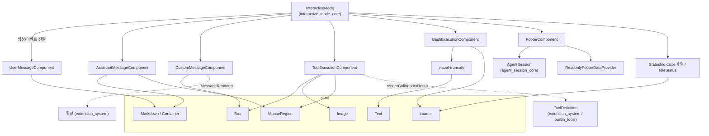
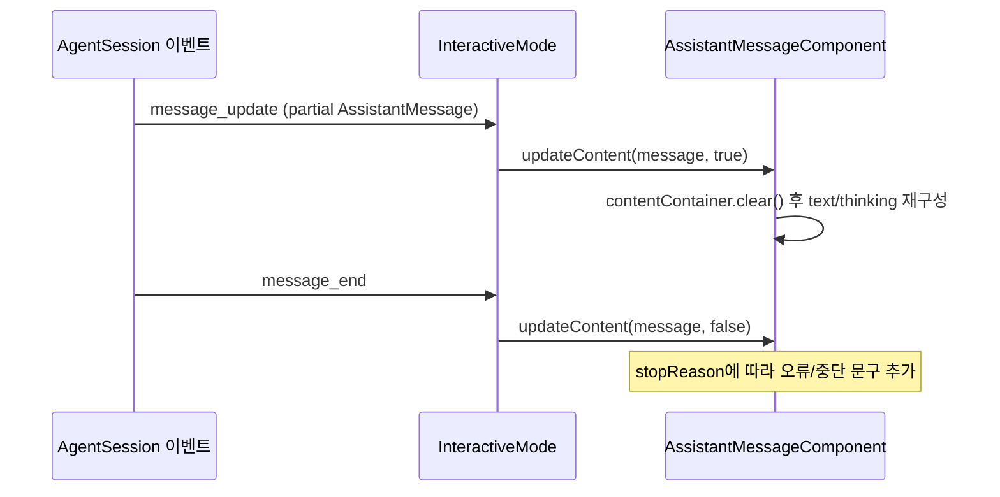
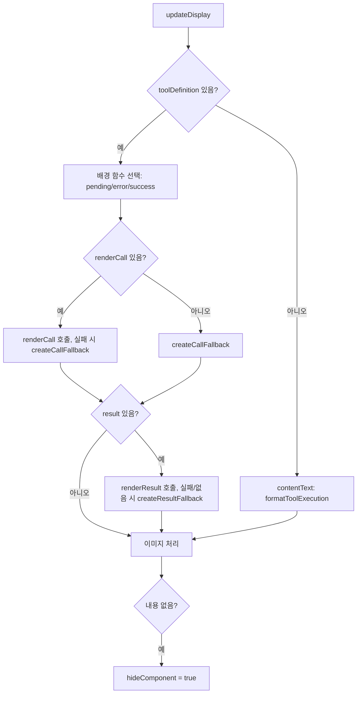
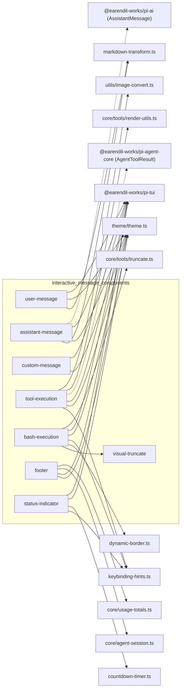

# interactive_message_components 모듈

## 개요

`interactive_message_components`는 `packages/coding-agent`의 Interactive 모드에서 **대화 transcript와 하단 상태 영역을 그리는 TUI 컴포넌트 모음**이다. 사용자 메시지, 어시스턴트 메시지(텍스트/thinking), 커스텀(확장) 메시지, 도구 실행 결과, 사용자 `!` bash 실행, 푸터, 상태 표시(spinner)를 담당한다.

모든 컴포넌트는 [Terminal_UI_Framework](Terminal_UI_Framework.md)(`@earendil-works/pi-tui`)의 `Container` / `Component`를 상속하거나 구현하며, 테마는 `../theme/theme.ts`([interactive_theme](interactive_theme.md))를 사용한다. 컴포넌트를 생성하고 이벤트를 연결하는 쪽은 [interactive_mode_core](interactive_mode_core.md)의 `InteractiveMode`다. 선택기/다이얼로그류는 [interactive_selectors_and_dialogs](interactive_selectors_and_dialogs.md)에서 다룬다.

소스 위치: `packages/coding-agent/src/modes/interactive/components/`

| 파일 | 클래스 | 역할 |
|---|---|---|
| `user-message.ts` | `UserMessageComponent` | 사용자 입력을 Markdown으로 렌더링 |
| `assistant-message.ts` | `AssistantMessageComponent` | 어시스턴트 text/thinking/오류·중단 표시 |
| `custom-message.ts` | `CustomMessageComponent` | 확장이 만든 `CustomMessage` 렌더링 |
| `tool-execution.ts` | `ToolExecutionComponent` | 도구 호출/결과 렌더링, 이미지, 확장/축소 |
| `bash-execution.ts` | `BashExecutionComponent` | 사용자 bash 명령 스트리밍 출력 |
| `visual-truncate.ts` | `truncateToVisualLines`, `VisualLinePreview` | 시각적 줄 단위 truncation |
| `footer.ts` | `FooterComponent` | cwd, 토큰/비용/컨텍스트 사용량, 모델 표시 |
| `status-indicator.ts` | `StatusIndicator` 계열, `IdleStatus` | 작업/재시도/압축 spinner |

## 아키텍처

### 공통 설계 패턴

- **`Container` 상속 + 재구성(rebuild)**: 대부분의 컴포넌트는 상태가 바뀌면 자식 컴포넌트를 `clear()` 후 다시 구성한다 (`updateContent`, `rebuild`, `updateDisplay`). `invalidate()`(테마 변경 등)도 같은 재구성을 호출한다.
- **setter는 즉시 재렌더 반영**: `setOutputPad`, `setExpanded`, `setShowImages` 등은 값을 저장하고 재구성한다. 설정 값은 [settings_and_keybindings](settings_and_keybindings.md)의 `SettingsManager`에서 오고, `InteractiveMode`가 전달한다.
- **마우스 상호작용**: `MouseRegion`으로 감싸 좌클릭 시 thinking 토글, 도구 결과 확장/축소를 처리한다.
- **오류 격리**: 확장 렌더러(`MessageRenderer`, `renderCall`, `renderResult`)가 throw하면 기본 렌더링으로 fallback한다.

## 컴포넌트 상세

### UserMessageComponent (`user-message.ts`)

- 생성자: `(text, markdownTheme = getMarkdownTheme(), outputPad = 1, markdownTransformers = [])`.
- `rebuild()`가 `Markdown`을 하나만 추가한다. 배경색(`userMessageBg`)과 글자색(`userMessageText`)을 `Markdown` 옵션으로 직접 지정하며, 별도 `Box`를 두지 않는다(전체 폭 줄을 중복 보관하지 않기 위함 — 코드 주석).
- 옵션 `preserveOrderedListMarkers`, `preserveBackslashEscapes`로 사용자가 입력한 원문 형태를 유지한다.
- `render()`는 첫 줄/마지막 줄에 OSC 133 시맨틱 프롬프트 마커(`OSC133_ZONE_START`, `OSC133_ZONE_END`, `OSC133_ZONE_FINAL`)를 붙인다. 터미널이 메시지 구간을 인식(점프 등)할 수 있게 한다.
- `setOutputPad(padding)`: 가로 패딩 변경 후 rebuild.

### AssistantMessageComponent (`assistant-message.ts`)

`AssistantMessage`(`@earendil-works/pi-ai`)를 받아 `updateContent(message, isStreaming)`으로 내용을 다시 그린다. 스트리밍 중 반복 호출된다.

렌더링 규칙:
1. 보이는 text/thinking이 있으면 앞에 `Spacer(1)`.
2. `text` 블록 → `Markdown` (`createMarkdownTransform("assistant", isStreaming, transformers)`).
3. 연속된 `thinking` 블록은 하나의 "run"으로 합쳐 `\n\n`으로 이어 붙인다. `hideThinkingBlock`이 true면 `hiddenThinkingLabel`(기본 `"Thinking..."`)을 이탤릭 `Text`로 표시, 아니면 이탤릭 `Markdown`(`thinkingText` 색).
4. 각 thinking run은 `MouseRegion`으로 감싸져 **좌클릭 시 run 단위로 토글**된다(`thinkingVisibilityOverrides: Map<number, boolean>`). `setHideThinkingBlock()`은 이 override를 모두 초기화한다.
5. 종료 사유 처리: `stopReason === "length"`이면 "Response was truncated before completion."을 항상 표시. 도구 호출이 없을 때만 `aborted`(`errorMessage` 또는 "Operation aborted")와 `error`("Error: ...")를 표시한다. 도구 호출이 있으면 오류는 `ToolExecutionComponent`가 보여준다.
6. `hasToolCalls`가 true면 `render()`에서 OSC 133 마커를 붙이지 않는다(메시지 구간이 도구 컴포넌트와 이어지므로).

공개 setter: `setHideThinkingBlock(hide)`, `setHiddenThinkingLabel(label)`, `setOutputPad(padding)` — 모두 `lastMessage`가 있으면 재렌더.

> 이벤트 연결 세부(호출 주체)는 `InteractiveMode` 쪽 코드에서 확인해야 하며, 위 시퀀스는 컴포넌트 API 형태에서 추론한 것이다(추론).

### CustomMessageComponent (`custom-message.ts`)

- 확장이 세션에 넣은 `CustomMessage`를 표시한다. 생성자: `(message, customRenderer?, markdownTheme, outputPad = 1)`.
- `rebuild()` 우선순위: ① `customRenderer(message, { expanded, outputPad }, theme)`가 컴포넌트를 반환하면 그것을 사용, ② throw되거나 반환값이 없으면 기본 `Box`(`customMessageBg` 배경) + `[customType]` 라벨 + `Markdown` 본문. 본문은 `content`가 문자열이면 그대로, 배열이면 `text` 블록을 `\n`으로 합친다.
- `setExpanded`, `setOutputPad`는 값이 바뀐 경우에만 rebuild.
- `MessageRenderer` 타입은 [extension_system](extension_system.md)의 `core/extensions/types.ts`에 있다.

### ToolExecutionComponent (`tool-execution.ts`)

도구 호출과 결과를 표시하는 가장 복잡한 컴포넌트. 도구를 **실행하지 않고 그리기만 한다**.

- `ToolRenderers` 인터페이스: `renderShell?: "default" | "self"`, `renderCall?`, `renderResult?`. `ToolDefinition`도 그대로 전달 가능(내장 도구 렌더러는 [builtin_tools](builtin_tools.md)의 `core/tools/renderers/*.ts`).
- 생명주기 메서드: `updateArgs`(스트리밍 중 인자 갱신), `markExecutionStarted`, `setArgsComplete`, `updateResult(result, isPartial)`, `setExpanded`, `setShowImages`, `setImageWidthCells`.
- **Shell 방식**
  - `"default"`: `Box`가 배경을 제공. 배경은 상태에 따라 `toolPendingBg`(partial) / `toolErrorBg`(`isError`) / `toolSuccessBg`.
  - `"self"`: 도구가 자체 프레이밍을 그리며 `selfRenderContainer`에 렌더링. `handleMouse`에서 y 좌표를 1 보정한다.
  - 정의가 없으면 `contentText`로 `formatToolExecution()` fallback(도구명 + JSON 인자 + 출력).
- **렌더러 호출**: `getRenderContext()`가 `ToolRenderContext`(args, toolCallId, `invalidate`, `lastComponent`, `state`, `cwd`, `executionStarted`, `argsComplete`, `isPartial`, `expanded`, `showImages`, `isError`)를 만든다. `lastComponent`와 `rendererState`로 렌더러가 호출 간 컴포넌트/상태를 재사용할 수 있다. 렌더러가 throw하면 `createCallFallback()` / `createResultFallback()`(기본 10줄 미리보기 + 확장 힌트)로 대체.
- **확장/축소**: 모든 렌더 영역이 `createResultRegion()`의 `MouseRegion`으로 감싸져, 결과가 있을 때 좌클릭하면 `setExpanded(!expanded)`.
- **이미지**: `getCapabilities().images`가 있고 `showImages`면 `Image` + `Spacer`를 추가. kitty 프로토콜은 PNG만 지원하므로 `maybeConvertImagesForKitty()`가 `convertToPng`(`utils/image-convert.ts`)를 비동기 호출하고 `convertedImages`에 캐시한다. 변환 완료 시점에 결과가 바뀌었다면 반영하지 않는다(원본 data/mimeType 비교).
- 렌더러 정의가 있는데 내용도 이미지도 없으면 `hideComponent = true`로 아무것도 그리지 않는다.

### BashExecutionComponent (`bash-execution.ts`)

사용자 `!command` / `!!command` 실행을 표시한다(`!!`는 컨텍스트 제외 → `dim` 테두리, 그 외 `bashMode` 색).

- 구성: `Spacer` → `DynamicBorder` → `contentContainer`(헤더 `$ command`, 출력, `Loader` 또는 상태) → `DynamicBorder`.
- `appendOutput(chunk)`: `stripAnsi` 후 `\r\n`/`\r`를 `\n`으로 정규화, 마지막 불완전 줄에 이어 붙임.
- `setComplete(exitCode, cancelled, truncationResult?, fullOutputPath?)`: status를 `cancelled` / `error`(0이 아닌 exit) / `complete`로 결정하고 loader를 정지.
- `updateDisplay()`: 먼저 LLM 컨텍스트 한도(`DEFAULT_MAX_LINES`, `DEFAULT_MAX_BYTES`, `truncateTail`)를 적용 → 접힘 상태에서는 마지막 `PREVIEW_LINES = 20` 논리 줄만 표시하고 `truncateToVisualLines`로 폭 기준 시각적 줄 수를 맞춘다(폭별 캐시). 숨겨진 줄 수와 `app.tools.expand` 키 힌트, `(cancelled)`, `(exit N)`, 잘림 경고 및 `fullOutputPath`를 표시.
- `getCommand()`, `getOutput()`: `BashExecutionMessage`를 만들 때 쓰는 원시 값(코드 주석).
- `setExpanded(expanded)`로 전체 출력 표시.

### visual-truncate (`visual-truncate.ts`)

- `truncateToVisualLines(text, maxVisualLines, width, paddingX = 0, keep = "end")`: 임시 `Text`를 렌더해 **줄바꿈이 반영된 시각적 줄** 기준으로 자른다. 논리 줄 기준으로 자르면 minified JSON 같은 긴 한 줄이 화면을 채우기 때문(코드 주석).
- `VisualLinePreview`: `Component` 구현. 폭별로 결과를 캐시하고, 숨겨진 줄이 있으면 `formatHint(hidden)`를 `keep`에 따라 앞/뒤에 추가한다. `invalidate()`가 캐시를 비운다. 도구 렌더러와 bash 컴포넌트가 공유한다.

### FooterComponent (`footer.ts`)

`AgentSession`과 `ReadonlyFooterDataProvider`로부터 하단 2~3줄을 만든다.

1. **pwd 줄**: `formatCwdForFooter`(홈은 `~`로 축약) + git branch + 세션 이름.
2. **통계 줄**: 왼쪽에 `↑input ↓output R(cacheRead) W(cacheWrite) CH(캐시 적중률)`, 비용(`$x.xxx`, 구독이면 ` (sub)`), 컨텍스트 `%/window (auto)`(70% 초과 `warning`, 90% 초과 `error`), 실험 기능 활성 시 `xp` 표시. 오른쪽에 모델 id, thinking level, 가상 모델 라우팅(`→ routed.model.id`), provider가 2개 이상이고 폭이 충분하면 `(provider)` 접두. 폭 부족 시 왼쪽 → 오른쪽 순으로 `truncateToWidth`.
3. **확장 상태 줄**: `getExtensionStatuses()`를 key 알파벳순으로 이어 한 줄.

성능 포인트: `getSessionStats()`는 전체 entry를 순회해 사용량을 합산하므로, `session`, `sessionId`, `leafId`, `entryCount`, `limitsModel`이 같으면 캐시를 재사용한다(매 프레임 렌더되기 때문). `invalidate()`와 `dispose()`는 no-op이며(git branch 캐시/감시는 provider 담당) 기존 호출부 호환용이다. `formatTokens`와 `formatCwdForFooter`는 export된 순수 함수다.

### StatusIndicator 계열 / IdleStatus (`status-indicator.ts`)

`Loader`(pi-tui)를 상속한 `StatusIndicator`가 `kind: "working" | "retry" | "compaction" | "branchSummary"`를 가진다.

| 클래스 | 용도 |
|---|---|
| `WorkingStatusIndicator` | 일반 작업 중(`accent` spinner). `WorkingIndicatorOptions`로 확장이 인디케이터 변경 가능 |
| `RetryStatusIndicator` | 자동 재시도 카운트다운(`CountdownTimer`로 초 단위 메시지 갱신), `dispose()`에서 타이머 정리 |
| `CompactionStatusIndicator` | `manual` / `threshold` / `overflow`별 메시지 |
| `BranchSummaryStatusIndicator` | 브랜치 요약 중 |
| `IdleStatus` | 비어 있는 2줄(공백)을 렌더해 높이를 유지하는 `Component` |

`renderInBorder(width)`와 `renderSpinnerInBorder(width)`는 테두리 안에 spinner를 그리기 위한 보조 메서드다. `dispose()`는 `stop()`을 호출한다.

## 의존성

관련 모듈:
- [ai_models_and_providers](ai_models_and_providers.md): `AssistantMessage`, usage 타입의 출처 (`packages/ai`).
- [agent_runtime](agent_runtime.md): `AgentToolResult`, 이벤트 스트림.
- [agent_session_core](agent_session_core.md): `AgentSession`(푸터 데이터, 모델, 컨텍스트 사용량).
- [tui_components](tui_components.md), [tui_core](tui_core.md): `Container`, `Markdown`, `Box`, `Loader`, `MouseRegion`, `Image`.
- [extension_system](extension_system.md): `MessageRenderer`, `ToolDefinition`, `WorkingIndicatorOptions`.

## 수정 시 유의점

- 위 컴포넌트는 `setX` 후 **즉시 rebuild**하므로, 스트리밍 중 `updateContent`를 자주 호출해도 되도록 가볍게 유지해야 한다. `FooterComponent`처럼 매 프레임 호출되는 경로에는 캐시가 필요하다.
- 키 힌트는 `keyHint("app.tools.expand", ...)`, `keyText("tui.select.cancel")`처럼 설정 가능한 keybinding id를 통해 얻는다. 키를 하드코딩하지 않는다(`AGENTS.md` 규칙, [settings_and_keybindings](settings_and_keybindings.md)).
- 검증 수준: 본 문서의 컴포넌트 동작은 제공된 소스 코드를 기준으로 한 **코드 확인**이며, `InteractiveMode`와의 호출 관계는 **추론**이다.
