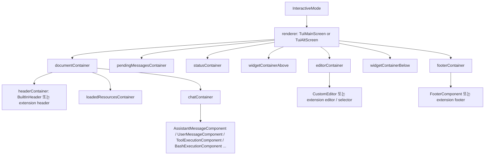
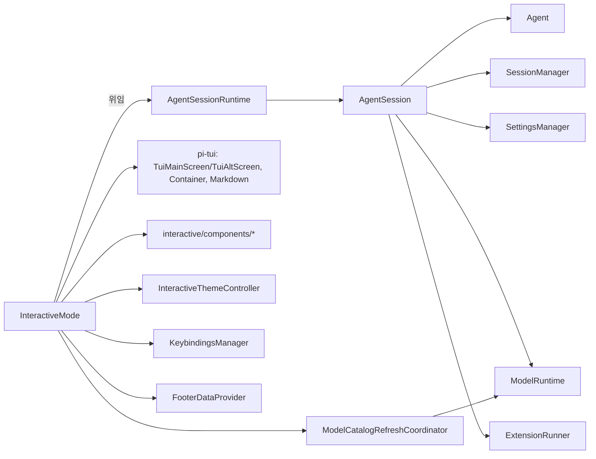
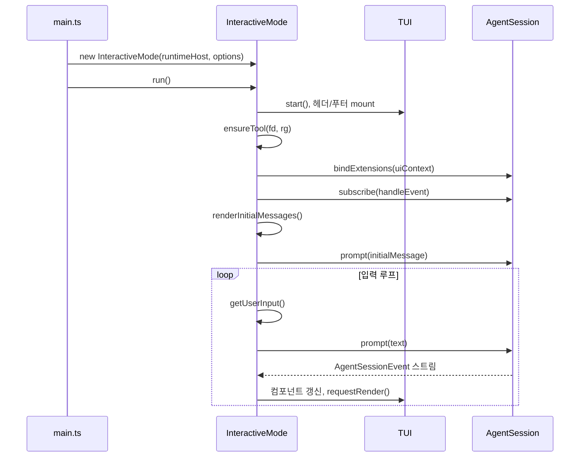
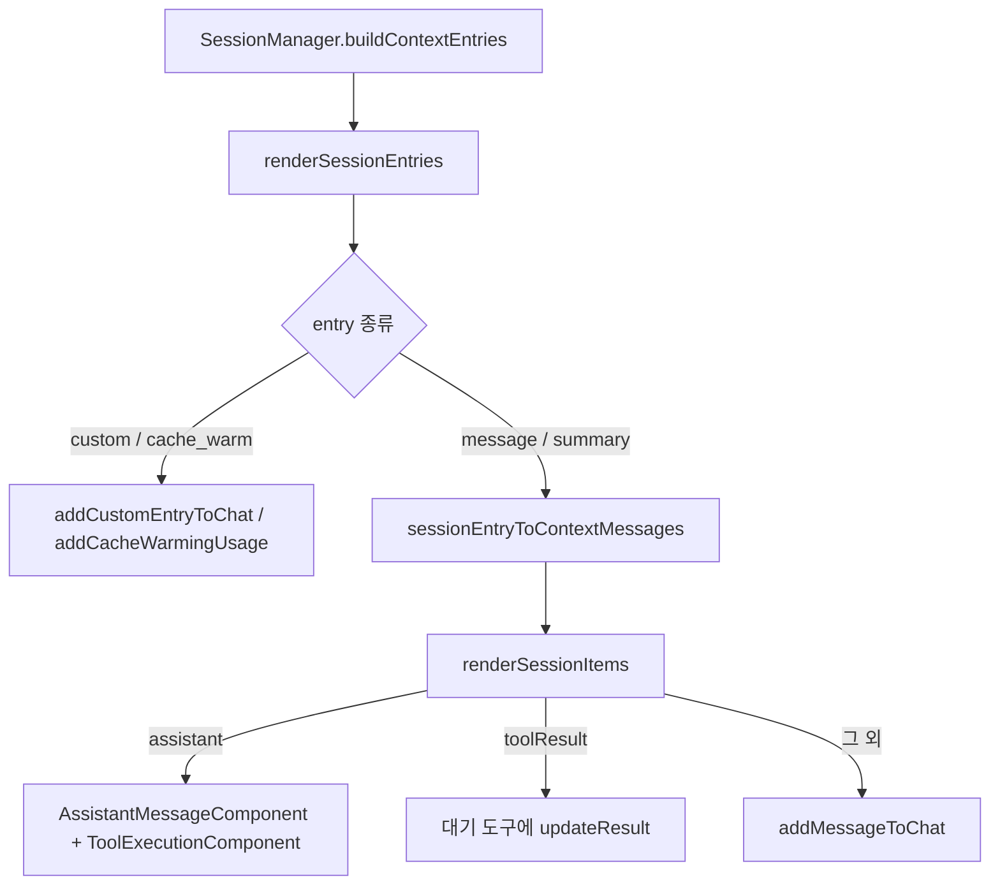
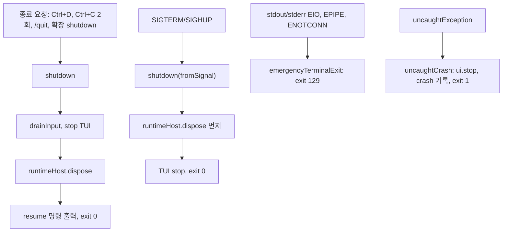
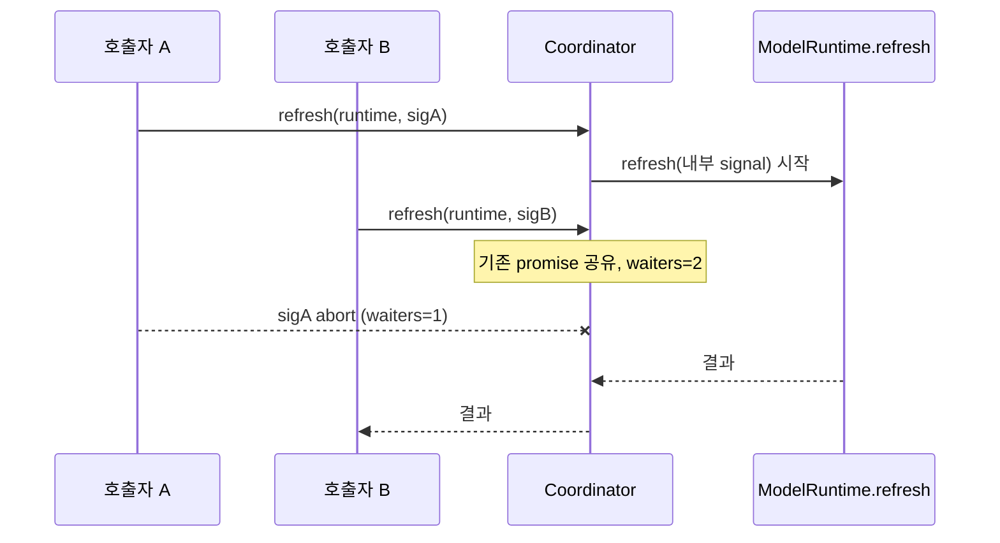

# interactive_mode_core

`packages/coding-agent/src/modes/interactive/interactive-mode.ts`의 `InteractiveMode`와 `model-catalog-refresh.ts`의 `ModelCatalogRefreshCoordinator`로 구성된 모듈이다. 터미널 TUI에서 사용자 입력을 받고, `AgentSession`의 이벤트를 화면 컴포넌트로 바꿔 그리는 interactive 모드의 중심이다. 비즈니스 로직(프롬프트 실행, 압축, 재시도, 모델 전환, 세션 트리)은 `AgentSession`/`AgentSessionRuntime`에 위임하고, 이 모듈은 렌더링과 입력 처리, 수명주기만 맡는다.

관련 모듈:
- 세션/에이전트 코어: [Agent_Loop_and_Session_Core](Agent_Loop_and_Session_Core.md) (`AgentSession`, `AgentSessionRuntime`, `SessionManager`)
- 메시지 컴포넌트: [interactive_message_components](interactive_message_components.md)
- 선택기/다이얼로그: [interactive_selectors_and_dialogs](interactive_selectors_and_dialogs.md)
- 테마: [interactive_theme](interactive_theme.md)
- TUI 프레임워크: [Terminal_UI_Framework](Terminal_UI_Framework.md)
- 모델/인증/설정: [Model,_Credential_and_Settings_Management](Model,_Credential_and_Settings_Management.md)
- 확장 시스템: [Extensibility,_Tools_and_Integrations](Extensibility,_Tools_and_Integrations.md)
- LLM 계층: [LLM_Provider_Abstraction_and_Auth](LLM_Provider_Abstraction_and_Auth.md)
- 비-TUI 모드: [rpc_mode](rpc_mode.md)

> 검증 수준: 아래 내용은 제공된 소스(`interactive-mode.ts`, `model-catalog-refresh.ts`)를 읽고 작성했다(코드 확인). 다른 파일의 내부 동작은 import와 호출 형태에서만 확인했다(추론).

---

## 1. 핵심 컴포넌트

| 컴포넌트 | 위치 | 역할 |
|---|---|---|
| `InteractiveMode` | `interactive-mode.ts` | TUI 구성, 입력 루프, 이벤트 렌더링, 슬래시 명령, 종료 처리의 오케스트레이터 |
| `InteractiveMode.session/agent/sessionManager/settingsManager` | 같음 | `runtimeHost.session`에서 파생되는 getter. 세션이 교체되어도 항상 현재 세션을 가리킨다 |
| `ExpandableText` | 같음 | collapsed/expanded 두 텍스트를 가진 `ThemedText`. `setExpanded()`로 전환하고 `invalidate()` 호출 |
| `BuiltInHeader` | 같음 | `ExpandableText` 상속. 로고 영역(처음 두 줄, x 1~4) 클릭 시 `onLogoClick`으로 3D 이스터에그 실행. `handleMouse()` |
| `WorkingStatusEditor` | 같음 | 에디터가 작업 상태 표시기를 내장할 수 있음을 나타내는 인터페이스(`embedWorkingStatus`, `setWorkingStatusIndicator`). `isWorkingStatusEditor()`로 duck typing |
| `getLoginProviderSearchText` | 같음 | `/login` 자동완성의 fuzzy 검색 문자열(id, name, auth type) 생성 |
| `ModelCatalogRefreshCoordinator` | `model-catalog-refresh.ts` | 동시에 들어온 모델 카탈로그 refresh를 하나로 합치면서 호출자별 취소는 독립 유지 |

---

## 2. 아키텍처

### 2.1 컴포넌트 트리

`InteractiveMode`는 하나의 컴포넌트 트리를 유지하고, 렌더러(`TuiMainScreen` 일반 / `TuiAltScreen` 전체화면)를 바꿀 때 같은 트리를 다시 mount한다(`switchTuiMode`, `mountInteractiveTui`).

전체화면 모드에서는 `createChatViewport()`가 `transcript` ScrollView와 layout root를 만들어 `fullscreenLayoutRoot`로 사용한다.

### 2.2 의존 관계

---

## 3. InteractiveMode 상세

### 3.1 생성과 초기화

생성자(`constructor`)가 하는 일:
- `runtimeHost.setBeforeSessionInvalidate(resetExtensionUI)`와 `setRebindSession(rebindCurrentSession + theme 재적용)`을 등록. 세션이 교체(new/fork/resume/import)될 때 UI를 정리하고 새 세션에 다시 바인딩한다.
- `createInteractiveTui()`로 렌더러 생성, `createInteractiveTuiReference(() => this.renderer)`로 렌더러 교체에도 유지되는 `ui` 참조를 만든다.
- 컨테이너, `CustomEditor`, `FooterComponent`, `FooterDataProvider`, `InteractiveThemeController` 생성. 키바인딩은 `KeybindingsManager.create()` 후 `setKeybindings()`로 전역 등록.

`init()`:
1. 시그널 핸들러 등록, changelog 계산(`getChangelogForDisplay`)
2. viewport 구성 후 컨테이너 mount
3. 시작 중에는 `app.clear`, Ctrl+D, 제출(`handleStartupSubmit`)만 활성화
4. `ui.start()` → 테마 적용 → 터미널 색 응답 대기(`waitForTerminalColors`) → 헤더 구성
5. `fd`, `rg`를 `ensureTool`로 확보(느린 다운로드가 시작을 멈춘 것처럼 보이지 않도록 TUI mount 이후)
6. `setupKeyHandlers()`, `setupEditorSubmitHandler()`로 나머지 입력 활성화
7. `rebindCurrentSession()` → `renderInitialMessages()` → 테마/브랜치 watcher → 구문 강조 언어 비동기 로드

`run()`은 `init()` 후 백그라운드 작업(모델 카탈로그 refresh, 버전/패키지 업데이트 확인, tmux `extended-keys` 점검)을 시작하고, 시작 진단·경고를 표시하며, 초기 메시지를 `session.prompt()`로 보낸 뒤 `getUserInput()` → `session.prompt()` 무한 루프로 들어간다. `PI_OFFLINE`이 설정되면 네트워크 확인을 건너뛴다.

### 3.2 입력 처리

`setupEditorSubmitHandler()`의 `onSubmit` 분기 순서:

1. 정확히 일치하는 슬래시 명령(`/settings`, `/model`, `/thinking`, `/export`, `/import`, `/share`, `/bug`, `/copy`, `/name`, `/session`, `/changelog`, `/hotkeys`, `/fork`, `/clone`, `/tree`, `/trust`, `/login`, `/logout`, `/new`, `/compact`, `/reload`, `/debug`, `/resume`, `/quit` 등)
2. `!cmd`(컨텍스트 포함) / `!!cmd`(컨텍스트 제외) bash 실행(`handleBashCommand`)
3. 압축 중(`isCompacting`)이면 확장 명령은 즉시 실행, 그 외는 `compactionQueuedMessages`에 큐잉
4. 스트리밍 중이면 `session.prompt(text, { streamingBehavior: "steer" })`
5. 그 외에는 `flushPendingBashComponents()` 후 `onInputCallback`(대기 중인 `getUserInput`) 또는 `pendingUserInputs`에 전달

Alt+Enter(`app.message.followUp`)는 `handleFollowUp()`이 `streamingBehavior: "followUp"`으로 처리한다. `app.message.dequeue`는 큐를 에디터로 복원한다(`restoreQueuedMessagesToEditor`).

Esc 동작(`onEscape`)은 상태 우선순위로 결정된다: 스트리밍 중 abort → bash 실행 중 abort → bash 모드 해제 → 빈 에디터에서 500ms 내 더블 Esc는 `doubleEscapeAction` 설정에 따라 `/tree` 또는 fork 선택기.

키 액션은 하드코딩하지 않고 `defaultEditor.onAction("app.*")`로 등록한다(저장소 규칙: 키는 설정 가능해야 함).

### 3.3 이벤트 → UI 매핑 (`handleEvent`)

`subscribeToAgent()`가 `session.subscribe()`로 받은 `AgentSessionEvent`를 처리한다.

| 이벤트 | UI 동작 |
|---|---|
| `agent_start` | `pendingTools` 초기화, retry용 Esc 핸들러 복원 |
| `turn_start` | 터미널 progress 표시, `WorkingStatusIndicator` 표시 |
| `message_start` (assistant) | `AssistantMessageComponent` 생성 → `streamingComponent` |
| `message_update` | 내용 갱신, `toolCall`마다 `ToolExecutionComponent` 생성/인자 갱신 |
| `message_end` | 최종 내용 반영. aborted/error면 대기 중 도구에 에러 결과 기록 + `/bug` 힌트, 정상이면 `setArgsComplete()`, thinking drop/cache miss 알림 |
| `tool_execution_start/update/end` | 컴포넌트 시작/부분 결과/최종 결과. `parentToolCallId`가 있는 중첩 호출(codemode)은 부모 행 안에 표시하므로 건너뜀 |
| `entry_appended` | custom 엔트리, cache warm usage, custom_message, compaction 반영 |
| `compaction_start/end` | 상태 표시기, Esc를 `abortCompaction`으로 교체, 완료 시 채팅 재구성 + 요약 메시지 + 비용 알림, 이후 `flushCompactionQueue` |
| `auto_retry_start/end` | `RetryStatusIndicator`, Esc를 `abortRetry`로 교체, 최종 실패 시에만 에러 표시 |
| `summarization_retry_*` | 요약 재시도 상태 표시 |
| `queue_update` | `updatePendingMessagesDisplay()` |
| `agent_end` | progress/working 표시 제거, 남은 streaming 컴포넌트 제거 |
| `agent_settled` | `checkShutdownRequested()` |

### 3.4 세션 렌더링

`renderInitialMessages()` → `renderSessionEntries()` → `renderSessionItems()`. `SessionEntry`를 `sessionEntryToContextMessages()`로 메시지로 바꾸고, assistant의 `toolCall`마다 `ToolExecutionComponent`를 만들어 이후 `toolResult`와 `toolCallId`로 매칭한다. 캐시 미스는 영속화되지 않으므로 `collectCacheMisses()`로 재계산해 해당 assistant 메시지 뒤에 삽입한다.

### 3.5 선택기와 다이얼로그

`showSelector(create)`가 공통 패턴이다: 에디터를 선택기로 교체하고 포커스를 이동하며, `done()` 호출 시 에디터를 복원한다. `activeSelectorToken`으로 오래된 `done`이 새 선택기를 지우는 것을 막고, `dispose`를 보장한다. 이 패턴을 쓰는 곳: 설정(`showSettingsSelector`), 모델(`showModelSelector`, `showModelsSelector`), thinking, 트리(`showTreeSelector`), 세션(`showSessionSelector`), fork, trust, 로그인/로그아웃. 각 컴포넌트 자체는 [interactive_selectors_and_dialogs](interactive_selectors_and_dialogs.md)를 참고한다.

주요 흐름:
- **트리 이동**: 선택 → 요약 여부 질문(`showExtensionSelector`) → 스트리밍 중이면 큐 복원 후 abort → `session.navigateTree()` → 채팅 재렌더. Esc 시 같은 선택으로 트리 선택기 재표시.
- **로그인**: `/login [provider]` → auth type 선택 → `LoginDialogComponent` → `modelRuntime.login()`(prompt/notify 콜백으로 `AuthPrompt`, `AuthEvent`를 다이얼로그에 연결) → `completeProviderAuthentication()`이 필요하면 기본 모델 선택, 카탈로그 refresh(15초 타임아웃). Radius 로그인 후에는 MCP 서버 설정을 제안(`offerRadiusMcpServer`).
- **세션 재개**: `runtimeHost.switchSession()`. 세션 cwd가 없으면(`MissingSessionCwdError`) 대체 cwd 확인 후 재시도, 그 외 실패는 `handleFatalRuntimeError`.

### 3.6 확장 UI 통합

`bindCurrentSessionExtensions()`가 `createExtensionUIContext()`로 만든 `ExtensionUIContext`를 `session.bindExtensions()`에 넘긴다. 제공 기능:

- 다이얼로그: `select`, `confirm`, `input`, `editor`, `custom`(오버레이 가능), `notify`
- 표시 영역: `setWidget`(위/아래, 최대 `MAX_WIDGET_LINES = 10`줄), `setFooter`, `setHeader`, `setStatus`, `setTitle`, `setWorkingMessage/Visible/Indicator`, `setHiddenThinkingLabel`
- 입력: `onTerminalInput`, `setEditorComponent`(기본 에디터의 핸들러·텍스트·자동완성 복사), `addAutocompleteProvider`, 단축키(`setupExtensionShortcuts`)
- 테마: `getAllThemes`, `setTheme`, `setToolsExpanded`

`resetExtensionUI()`는 세션 교체/reload 시 이 모든 것을 원복한다. 자동완성은 기본 명령 + 프롬프트 템플릿 + 확장 명령 + skill 명령을 `CombinedAutocompleteProvider`로 묶고 확장이 제공한 wrapper를 차례로 적용한다.

### 3.7 종료와 장애 처리

- 시그널 종료는 확장 정리(`session_shutdown`)를 터미널 복원보다 먼저 수행한다. 터미널이 죽었어도 확장 정리가 생략되지 않게 하기 위함이다(코드 주석).
- 크래시는 `recordCrash()`로 저장되어 다음 시작 때 `/bug` 안내가 나온다. 스택에 로드된 확장이 있으면 힌트를 붙인다(`formatCrashExtensionHint`).
- `Ctrl+Z`는 TUI를 중단하고 `SIGTSTP`를 보내며 `SIGCONT`에서 재개한다(Windows 미지원).

### 3.8 모드 전환과 설정 적용

`switchTuiMode()`는 overlay가 열려 있으면 거부하고, 기존 렌더러의 자식·포커스·터미널을 새 렌더러로 이관한다. `applyRuntimeSettings()`는 세션 rebind/reload 때 터미널 capability, HTTP idle timeout, 스크롤바, 커서, 에디터 padding, 푸터 등을 `SettingsManager` 값으로 다시 적용한다.

---

## 4. ModelCatalogRefreshCoordinator

`refreshModelCatalogs(modelRuntime, signal)`의 구현체. 문제: `/model`, `/scoped-models`, 로그인, 시작 시 refresh가 겹치면 같은 네트워크 요청이 중복되고, 한 호출자의 취소가 다른 호출자에게 번지면 안 된다.

동작:
- `WeakMap<ModelRuntime, ActiveModelCatalogRefresh>`로 런타임별 진행 중 refresh를 하나만 유지한다.
- 첫 호출자가 내부 `AbortController`로 `modelRuntime.refresh()`를 시작하고, 이후 호출자는 같은 `promise`를 공유한다.
- 각 호출자는 `raceWithAbortSignal(active.promise, signal)`로 자기 `signal`에만 반응한다.
- `waiters`가 0이 되면(모두 취소/완료) 내부 controller를 abort한다. 완료 시 맵에서 제거한다.

호출 위치: `run()`(시작 시, 15초 타임아웃), `findExactModelMatch`, `showModelsSelector`. 이 모듈의 `completeProviderAuthentication`은 특정 provider만 갱신하므로 `modelRuntime.refresh({ providers })`를 직접 호출한다.

---

## 5. 설계 포인트

- **얇은 UI 계층**: 상태 변경은 `session.*`/`runtimeHost.*` 호출로 끝나고, 화면은 이벤트에 반응해 갱신한다. RPC 모드([rpc_mode](rpc_mode.md))와 같은 `AgentSession`을 공유한다.
- **세션 교체 내성**: `session` 등 getter가 매번 `runtimeHost.session`을 읽고, `rebindCurrentSession()`이 구독·확장·UI를 재연결한다.
- **지연 렌더링**: 헤더·리소스 목록은 텍스트를 함수로 받아 테마 변경을 따른다(`ThemedText`, `ExpandableText`).
- **중복 알림 억제**: `showStatus()`는 연속 상태 메시지를 한 줄로 갱신하고, `/bug` 힌트는 세션당 한 번만 표시한다.
- **관련 설정/빌드**: 키 기본값은 `core/keybindings.ts`([settings_and_keybindings](settings_and_keybindings.md)), 패키지 자산 경로는 `src/config.ts` 헬퍼를 사용한다.

## 6. 미확인 / 한계

- `createInteractiveTui`, `createChatViewport`의 내부 구현은 제공되지 않아 확인하지 못했다.
- `AgentSession` 이벤트의 전체 타입 정의는 import 형태로만 확인했다(`handleEvent`에서 처리하는 타입만 표에 반영).
