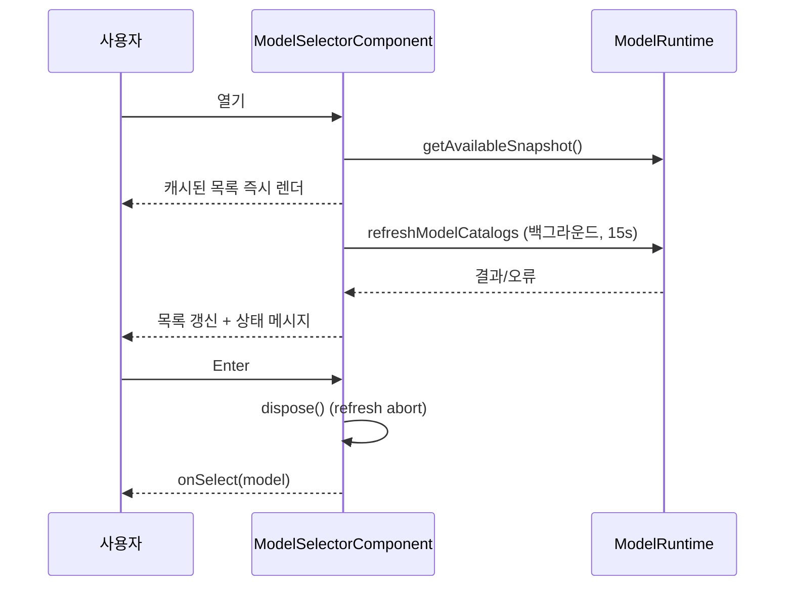

# interactive_selectors_and_dialogs

`packages/coding-agent/src/modes/interactive/components/` 아래의 **선택기(selector)와 대화상자(dialog) TUI 컴포넌트** 모음이다. 인터랙티브 모드에서 에디터 영역을 임시로 대체해 사용자에게 선택·입력·확인을 받는다. 모든 컴포넌트는 `@earendil-works/pi-tui`의 `Container`(일부는 `Component`)를 기반으로 하며, 키 입력은 `getKeybindings().matches(data, "tui.select.*" | "app.*")`로 처리한다(키 하드코딩 금지 규칙은 `packages/coding-agent`의 `keybindings.ts`가 관리). 상위 모듈은 [interactive_mode_core](interactive_mode_core.md), 형제 모듈은 [interactive_message_components](interactive_message_components.md), [interactive_theme](interactive_theme.md)이다. 하위 TUI 프리미티브는 [tui_components](tui_components.md), [tui_core](tui_core.md)를 참조.

## 아키텍처

```mermaid
graph TD
    IM[InteractiveMode] -->|표시/포커스| SEL[Selectors & Dialogs]
    SEL --> TUI[pi-tui: Container, Input, SelectList, SettingsList]
    SEL --> TH[theme/theme.ts]
    SEL --> KB[keybinding-hints / getKeybindings]
    subgraph SEL[interactive_selectors_and_dialogs]
        A[모델/Thinking] --> A1[ModelSelectorComponent]
        A --> A2[ScopedModelsSelectorComponent]
        A --> A3[ThinkingSelectorComponent]
        B[인증] --> B1[OAuthSelectorComponent]
        B --> B2[LoginDialogComponent]
        C[세션] --> C1[SessionSelectorComponent]
        C --> C2[TreeSelectorComponent]
        C --> C3[UserMessageSelectorComponent]
        D[설정] --> D1[SettingsSelectorComponent]
        D --> D2[SettingsSubmenu: SelectSubmenu/SteppedSubmenu]
        D --> D3[Theme/ShowImages Selector]
        D --> D4[ConfigSelectorComponent]
        E[확장/온보딩] --> E1[ExtensionSelector/Input/Editor]
        E --> E2[FirstTimeSetupComponent]
        E --> E3[TrustSelectorComponent]
    end
    A1 --> MR[ModelRuntime]
    D4 --> SM[SettingsManager]
    C1 --> SESM[SessionManager]
    C2 --> SESM
```

## 공통 패턴

- **레이아웃**: `DynamicBorder` + `Spacer` + 제목/힌트 `Text` + 목록 + 하단 `DynamicBorder`.
- **콜백 기반**: 생성자가 `onSelect`/`onCancel` 등을 받고, 컴포넌트는 결과만 통지한다. 닫기는 호출자(`InteractiveMode`)가 담당.
- **Focusable**: `focused` setter가 내부 `Input`으로 전파되어 IME 커서 위치를 맞춘다 (`ModelSelectorComponent`, `OAuthSelectorComponent`, `LoginDialogComponent`, `SessionSelectorComponent` 등).
- **퍼지 검색 + 스크롤 창**: `fuzzyFilter`로 필터링, `selectedIndex` 중심으로 `maxVisible` 개만 렌더, 넘치면 `(n/total)` 표시.
- **타임아웃 카운트다운**: `ExtensionSelectorComponent`, `ExtensionInputComponent`는 `CountdownTimer`로 시간 초과 시 `onCancel`.

## 컴포넌트별 기능

### 모델 / Thinking
- `model-selector.ts` — `ModelSelectorComponent`: `ModelRuntime.getAvailableSnapshot()`로 즉시 렌더 후 `refreshModelCatalogs`를 백그라운드(15초 타임아웃)로 실행. 현재 모델 → 기본 모델 → provider 순 정렬. `tui.input.tab`으로 all/scoped 전환, `app.models.save`로 기본 모델 저장. `dispose()`가 refresh를 abort한다.
- `scoped-models-selector.ts` — `ScopedModelsSelectorComponent`: Ctrl+P 순환 대상 모델 집합 편집. `EnabledIds = string[] | null`(null=전체 활성) 불변 헬퍼(`toggle`, `enableAll`, `clearAll`, `move`)로 상태를 계산. 변경은 세션 한정(`onChange`), `app.models.save`에서만 `onPersist`.
- `thinking-selector.ts` — `ThinkingSelectorComponent`: 사용 가능한 `ThinkingLevel` 검색형 선택, 기본값 저장(`app.thinking.save`).

### 인증
- `oauth-selector.ts` — `OAuthSelectorComponent`: login/logout 모드의 provider 선택기. `formatAuthSelectorProviderStatus`가 설정 상태(✓ configured, env 출처 등)를 표시. 타입은 `@earendil-works/pi-ai`의 `ApiKeyAuth`, `OAuthAuth`, `AuthCheck`.
- `login-dialog.ts` — `LoginDialogComponent`: OAuth 로그인 중 에디터를 대체. `showAuth`(URL+브라우저 열기), `showDeviceCode`, `showManualInput`, `showPrompt`, `showWaiting`, `showProgress`가 provider 로그인 콜백에 대응한다. `signal`(AbortSignal)로 취소를 전파하고, 입력 대기는 Promise(`inputResolver`/`inputRejecter`)로 구현.

### 세션
- `session-selector.ts` — `SessionSelectorComponent`(+`SessionList`, `SessionSelectorHeader`): current/all 범위, threaded/recent/relevance 정렬, named 필터, 이름 변경(rename 모드), 삭제 확인(`trash` CLI 우선, 실패 시 `unlink`). 로딩은 진행률 콜백과 `AbortController`로 취소 가능. 현재 활성 세션은 삭제 차단.
- `tree-selector.ts` — `TreeSelectorComponent`(+`TreeList`, `SearchLine`, `TreeHelp`, `LabelInput`): 세션 엔트리 트리 탐색. 필터 모드(`default/no-tools/user-only/labeled-only/all`), 접기/펼치기, 라벨 편집, 활성 경로 표시, 가로 뷰포트 팬(`renderHorizontalViewport`), 선택 복사.
- `user-message-selector.ts` — `UserMessageSelectorComponent`: fork 시 사용자 메시지를 골라 해당 지점까지의 활성 경로를 새 세션으로 복사.

### 설정
- `settings-selector.ts` — `SettingsSelectorComponent`: `SettingsConfig`/`SettingsCallbacks`로 모든 설정 항목을 `SettingsList`에 매핑. 터미널의 이미지 지원 여부에 따라 항목을 조건부 삽입. 하위 메뉴: `WarningSettingsSubmenu`, `ThemeSubmenu`(single/automatic 라이트·다크 모드), 모델별 thinking 오버라이드(`SteppedSubmenu`).
- `settings-submenu.ts` — `SelectSubmenu`(단일 단계, 선택적 퍼지 검색)와 `SteppedSubmenu`(N단계, 이전 선택을 context로 공유, Esc=이전 단계, `loop` 옵션).
- `theme-selector.ts`, `show-images-selector.ts` — `SelectList` 기반 단순 선택기. `getSelectList()`로 외부(테스트/호출자)가 목록에 접근. 테마는 선택 변경 시 `onPreview` 호출.
- `config-selector.ts` — `ConfigSelectorComponent`(+`ResourceList`, `ConfigSelectorHeader`): extensions/skills/prompts/themes 리소스를 패키지/top-level 그룹별로 표시하고 활성/비활성 토글. global 모드는 `+pattern`/`-pattern`을 `SettingsManager`에 기록하고, project 모드는 inherit → load(`+`) → unload(`-`) 순환 오버라이드를 `.pi` 설정에 기록한다.

### 확장 / 온보딩 / 신뢰
- `extension-selector.ts`, `extension-input.ts`, `extension-editor.ts`: 확장이 UI 컨텍스트를 통해 호출하는 문자열 선택, 한 줄 입력, 멀티라인 에디터. 에디터는 `app.editor.external`로 `$VISUAL`/`$EDITOR`(없으면 notepad/nano)를 열며, 이때 `tui.stop()` → 편집 → `tui.start()`로 터미널을 넘겨준다.
- `first-time-setup.ts` — `FirstTimeSetupComponent`: 테마 선택 → 분석 동의 2단계. 이동 시 `onThemePreview`로 즉시 미리보기하고 매 변경마다 전체를 재구성한다.
- `trust-selector.ts` — `TrustSelectorComponent`: `getProjectTrustOptions(cwd)` 기반 프로젝트 신뢰 결정(저장된 결정 표시 포함).

## 대표 흐름: 모델 선택

## 의존성
- `@earendil-works/pi-tui`: [tui_components](tui_components.md)의 `Input`, `SelectList`, `SettingsList`, `Text`, `Spacer`, `Container`.
- `core/model-runtime.ts`: [model_and_auth_management](model_and_auth_management.md)
- `core/settings-manager.ts`, `core/keybindings.ts`: [settings_and_keybindings](settings_and_keybindings.md)
- `core/session-manager.ts`: [session_persistence_and_compaction](session_persistence_and_compaction.md)
- 인증 타입: [ai_auth](ai_auth.md)

## 검증 수준
위 내용은 제공된 소스 코드를 직접 읽고 작성했다(코드 확인). 호출자(`InteractiveMode`)의 실제 사용 방식은 이 문서 범위에서 미확인이다.
