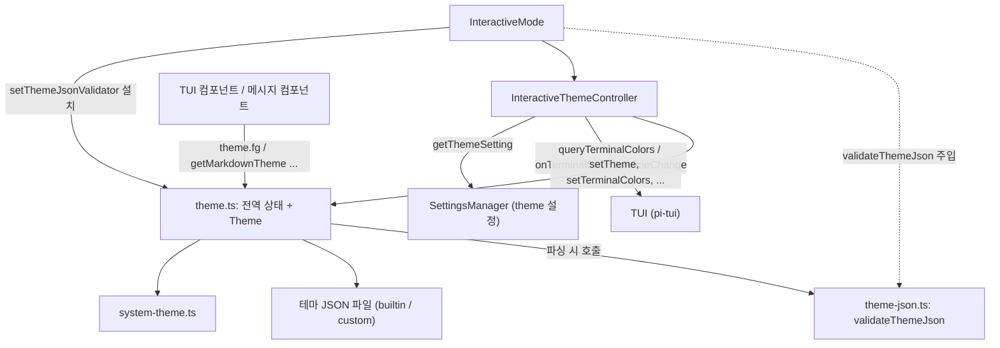
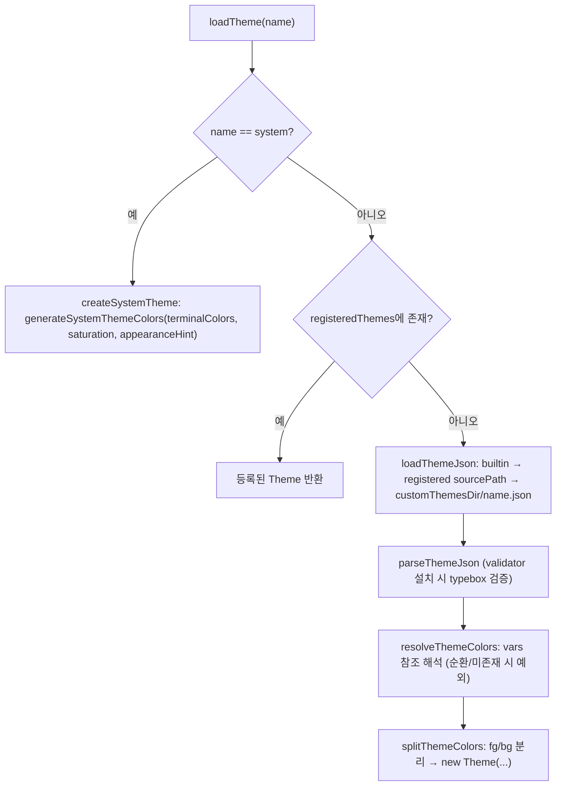
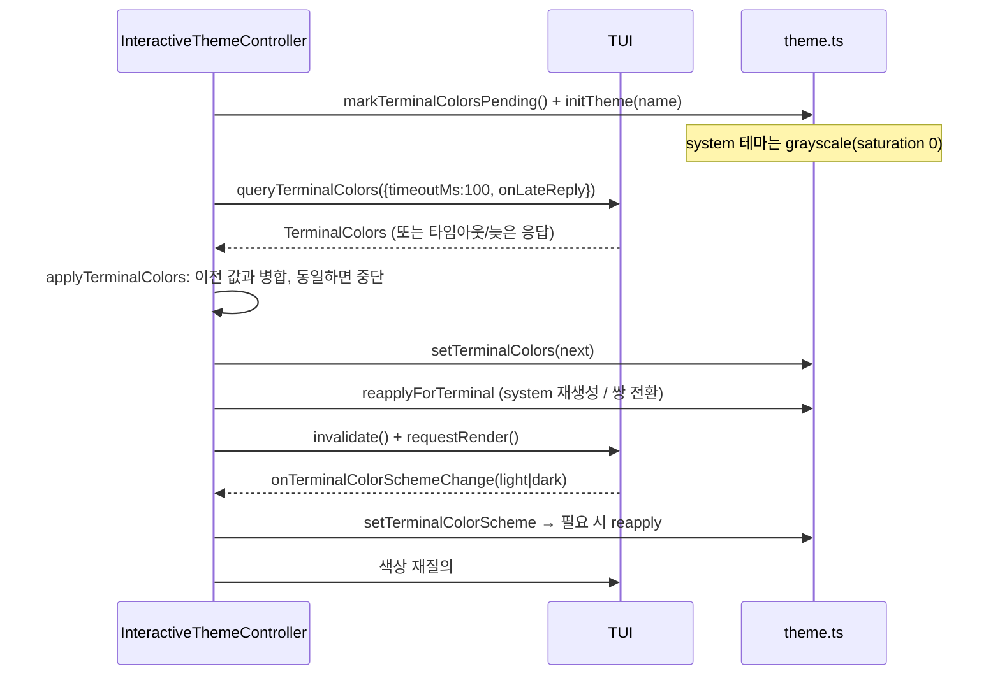
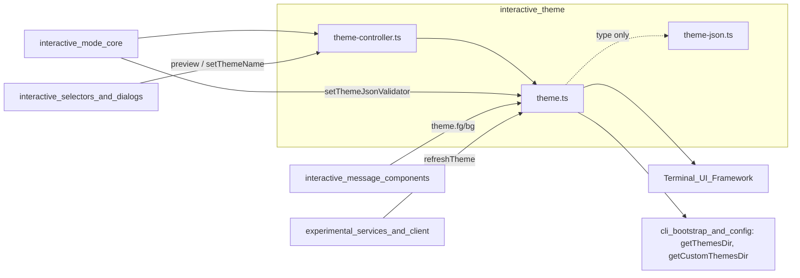

# interactive_theme 모듈

`interactive_theme`는 `packages/coding-agent`의 Interactive 모드가 사용하는 **색상 테마 시스템**이다. 테마 JSON을 검증·로드하고, 터미널이 보고하는 색상(전경/배경/팔레트)과 라이트/다크 외관에 맞춰 테마를 동기화하며, TUI 컴포넌트가 쓰는 ANSI 스타일링 API(`theme.fg`, `theme.bg`, `theme.style` 등)를 제공한다.

| 파일 | 역할 |
|---|---|
| `packages/coding-agent/src/modes/interactive/theme/theme.ts` | `Theme` 클래스, 테마 로딩, 전역 테마 인스턴스, 터미널 색상 상태, 파일 watcher, 마크다운/에디터/셀렉트 리스트 테마 어댑터 |
| `packages/coding-agent/src/modes/interactive/theme/theme-controller.ts` | `InteractiveThemeController`: 설정 ↔ 터미널 색상/외관 동기화 오케스트레이션 |
| `packages/coding-agent/src/modes/interactive/theme/theme-json.ts` | `validateThemeJson`: typebox 기반 테마 JSON 스키마 검증 (지연 설치) |

> 참고: 시스템 테마 생성은 `./system-theme.ts`(`generateSystemThemeColors`, `terminalAppearance`)에 있으며 이번 핵심 컴포넌트에는 포함되지 않는다. 이 문서는 해당 파일의 호출 지점만 설명하고 내부 알고리즘은 다루지 않는다(미확인).

상위 모듈 문서: [User-Facing_Modes_(Interactive_and_RPC)](User-Facing_Modes_(Interactive_and_RPC).md). 형제 모듈: [interactive_mode_core](interactive_mode_core.md), [interactive_selectors_and_dialogs](interactive_selectors_and_dialogs.md)(`ThemeSelectorComponent`, `ThemeSubmenu`), [interactive_message_components](interactive_message_components.md). 하위 의존: [Terminal_UI_Framework](Terminal_UI_Framework.md)(`TUI`, `parseColor`, `styleTextWithAnsi` 등), [settings_and_keybindings](settings_and_keybindings.md)(`SettingsManager.getThemeSetting`, `getThemePaths`).

---

## 1. 아키텍처

핵심 설계 포인트 (코드 확인):

- **전역 싱글턴 + Proxy**: `theme`은 `globalThis[Symbol.for("@earendil-works/pi-coding-agent:theme")]`를 읽는 `Proxy`다. node와 jiti(개발 모드)처럼 모듈 로더가 달라도 같은 테마를 본다. `initTheme()` 이전 접근은 예외를 던진다. 구 패키지명 심볼(`@mariozechner/...`)에도 함께 기록한다.
- **검증 분리**: typebox 임포트는 약 17 MB의 모듈 그래프 비용이 있어 `theme-json.ts`로 분리했고, `theme.ts`는 타입만 임포트한다. `interactive-mode.ts`가 `setThemeJsonValidator()`로 설치하며, 미설치 시 `parseThemeJson`은 `colors` 맵 존재만 확인한다. 내장 테마(`dark.json`, `light.json`)는 검증하지 않는다.
- **토큰 슬롯 분리**: `ThemeColor`(전경)와 `ThemeBg`(배경)는 각자 슬롯에서만 허용된다. `""`는 슬롯에 따라 기본 전경/배경을 의미하기 때문이다.

---

## 2. 컴포넌트 상세

### 2.1 `Theme` (theme.ts)

생성 시 모든 토큰의 ANSI 시퀀스를 `fgAnsi`/`bgAnsi` Map에 미리 계산해 렌더링 핫패스를 조회+문자열 결합으로 줄인다.

| 멤버 | 동작 |
|---|---|
| `appearance` | 테마 JSON의 `appearance` 선언 → 구체 색상의 OKLCH 명도로 감지(`detectAppearance`) → 둘 다 없으면 `getTerminalTheme()` |
| `colors` | 모든 토큰의 구체 `Color`. `""` 토큰은 터미널 보고 기본색(없으면 `GUESSED_DEFAULT_COLORS[appearance]`)으로 채움. dim 토큰은 배경 쪽으로 `mixColors(..., 0.4)`. `terminalColors` 객체 동일성으로 캐시 |
| `style(text, {fg,bg,...})` | 토큰명 또는 `Color`를 받아 `styleTextWithAnsi`로 스타일링. dim 토큰은 자동으로 `dim: true` |
| `fg()/bg()` | 토큰 ANSI + 텍스트 + 리셋(`\x1b[39m`/`\x1b[49m`). dim 전경은 SGR 2 포함 |
| `getFgAnsi()/getBgAnsi()` | 여는 시퀀스만 반환 (알 수 없는 토큰은 `Unknown theme color` 예외) |
| `getThinkingBorderColor(level)` | `ThinkingLevel`(`off`~`max`) → `thinking*` 토큰 매핑 |
| `getBashModeBorderColor()` | `bashMode` 토큰 |

선택 토큰 폴백(`scrollbarTrack→muted`, `scrollbarThumb→text`, `thinkingMax→thinkingXhigh`, `searchMatchBg→selectedBg`, `searchMatchText→text`)은 생성자와 `withThemeColorFallbacks`에서 적용된다.

### 2.2 테마 로딩 (theme.ts)

- 색상 값 형식: hex, `oklch(...)`, `okhsl(...)`, `vars` 참조, `""`(터미널 기본), 0–255 정수(256색 인덱스).
- `system` 이름은 예약어이며 동일 이름의 커스텀 테마보다 우선한다.
- 테마 이름에 `/`를 쓸 수 없다(자동 라이트/다크 설정 구문 `light/dark`에 예약). `assertThemeNameIsValid`와 `validateThemeJson` 양쪽에서 검사한다.
- `getAvailableThemesWithPaths()`: system → builtin → 커스텀 디렉터리 → 등록 테마 순으로 수집·중복 제거 후, system을 맨 앞으로 정렬한다.

### 2.3 `validateThemeJson` (theme-json.ts)

- `ThemeJsonSchema`: `name`, 선택 `appearance`(`"dark"|"light"`), 선택 `vars`, 필수 `colors`(핵심 UI, 배경, 마크다운, diff, 구문 강조, thinking 단계, `bashMode`), 선택 `export`(`pageBg/cardBg/infoBg`).
- `Compile`로 컴파일한 검사기를 모듈 로드 시 1회 생성한다.
- 실패 시 `/colors`의 `required` 오류를 모아 **누락된 색상 토큰 목록**을 정렬해 보여 주고, 기타 오류는 경로별로 나열하는 `Error`를 던진다. 내장 `dark.json`/`light.json`을 참고하라는 안내가 포함된다.

### 2.4 `InteractiveThemeController` (theme-controller.ts)

설정을 즉시 적용하고, 터미널 색상 응답이 도착하면 테마를 갱신하는 컨트롤러다.

| 메서드 | 동작 |
|---|---|
| 생성자 | 초기 테마명 해석 → `markTerminalColorsPending()` → `initTheme(name, true)` → 색상 스킴 리스너 바인딩 |
| `applyFromSettings()` | 설정 해석, 자동 동기화 여부 결정(`light/dark` 쌍 또는 system), 테마 적용, 터미널 색상 질의 |
| `waitForTerminalColors()` | 최신 색상 질의가 완료/타임아웃될 때까지 대기 (시작 헤더처럼 색을 문자열에 굽는 콘텐츠용) |
| `setThemeName / setThemeSetting` | 테마명 직접 적용 / 설정 문자열 갱신 후 `applyFromSettings` |
| `setThemeInstance(theme)` | 확장이 넘긴 인메모리 테마 적용. 자동 동기화 해제, `activeThemeName = "<in-memory>"` |
| `preview(...)` | 설정 변경 없이 미리보기(`setTheme` 후 `invalidate` + `requestRender`) |
| `getTerminalTheme()` | `theme.ts`의 `getTerminalTheme()` 위임 |
| `rebindTui()` / `dispose()` / `disableAutoSync()` | 리스너·알림 구독 관리 |

#### 터미널 색상 동기화 흐름

- `TERMINAL_QUERY_TIMEOUT_MS = 100`. DA1 응답이 색상 응답 직후 오므로 응답 없는 터미널에서만 전체 타임아웃을 기다린다. 늦은 응답은 `onLateReply`로 다시 적용된다. 질의 실패는 "색상을 보고하지 않는 터미널"로 취급(`{}`)한다.
- `applyTerminalColors`는 이전 보고값과 필드별로 병합(`??`)하고 `sameTerminalColors`로 비교해, 변화가 없으면(타임아웃 포함) 전체 재렌더링을 생략한다.
- `reapplyForTerminal`은 `<in-memory>` 테마(확장/미리보기)는 건드리지 않는다.

### 2.5 외관(라이트/다크) 판정

`getTerminalTheme()` → `detectTerminalTheme(terminalColors, terminalColorScheme)` 우선순위:

1. 터미널이 보고한 배경색 → `terminalAppearance(background, foreground)` (system-theme.ts)
2. 터미널의 light/dark 보고(모드 2031)
3. `COLORFGBG` 환경변수(`detectColorFgBgTheme`: 인덱스 0–6, 8은 dark, 7·9–15는 light, 16 이상/비정상은 무시)
4. 기본 `dark`

`resolveThemeSetting` / `parseAutoThemeSetting`: `"light이름/dark이름"` 형태(슬래시 정확히 1개, 양쪽 비어 있지 않음)면 현재 터미널 외관에 맞는 테마명을 선택한다. 슬래시가 있으나 형식이 잘못되면 `undefined` → 컨트롤러가 system 테마로 폴백한다.

### 2.6 파일 감시 (hot reload)

`startThemeWatcher()`는 **커스텀 테마**(`dark`/`light`/system 제외)이고 파일이 존재할 때만 `customThemesDir`를 감시한다. 변경 이벤트는 100 ms 디바운스 후 `loadThemeFromPath` → `registeredThemes` 갱신 → `setGlobalTheme` → `onThemeChangeCallback`을 호출한다. 편집 중 파일이 일시적으로 없거나 깨져도 마지막 정상 테마를 유지하며, 테마 전환 후의 낡은 타이머는 무시한다. `setThemeInstance`는 watcher를 중지한다.

### 2.7 TUI 어댑터와 export 헬퍼

- `getMarkdownTheme()`, `getSelectListTheme()`, `getEditorTheme()`, `getSettingsListTheme()`: pi-tui 컴포넌트 인터페이스에 테마 토큰을 연결한다.
- `highlightCode(code, lang)`: 유효 언어(`supportsLanguage`)일 때만 `cli-highlight` 사용(자동 감지는 산문을 오탐하므로 생략). 하이라이트 테마는 `Theme` 인스턴스별로 캐시한다. `getLanguageFromPath`는 확장자→언어 매핑.
- HTML export: `getResolvedThemeColors`(토큰→hex), `isLightTheme(name?)`(`appearance === "light"`), `getThemeExportColors`(JSON의 `export` 섹션; system 테마는 `{}`, `okhsl()`은 hex로 변환).

---

## 3. 다른 모듈과의 관계

- 에셋 경로(`getThemesDir`, `getCustomThemesDir`)는 저장소 규칙에 따라 `src/config.ts` 헬퍼로만 해석한다([cli_bootstrap_and_config](cli_bootstrap_and_config.md)).
- 확장 API가 `theme`을 노출하므로([extension_system](extension_system.md)의 `ExtensionRunner`), 확장은 `setThemeInstance` 경로로 인메모리 테마를 주입할 수 있다.

## 4. 유지보수 참고

- 새 색상 토큰 추가 시: `ThemeColor`/`ThemeBg` 유니온, `theme-json.ts` 스키마, `BACKGROUND_TOKENS`(배경인 경우), 내장 `dark.json`/`light.json`, 선택 토큰이면 폴백 로직을 함께 수정해야 한다.
- `theme.ts`에서 typebox를 임포트하면 지연 로딩 설계가 깨진다. 검증 로직은 `theme-json.ts`에만 둔다.
- 색상 캐시(`Theme.colors`)는 `terminalColors`를 **변경하지 않고 교체**하는 전제에 의존한다(`setTerminalColors`는 항상 복사본 대입).
- 검증 수준: 위 내용은 제공된 소스 3개 파일 기준 `코드 확인`이며, `system-theme.ts` 내부와 호출자(`interactive-mode.ts`)의 세부 동작은 `미확인`/`추론`이다.
