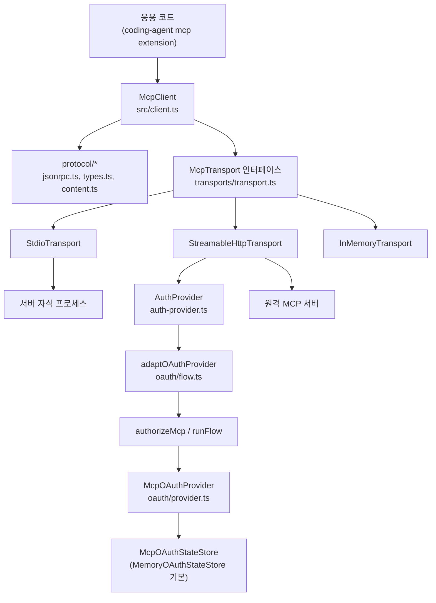
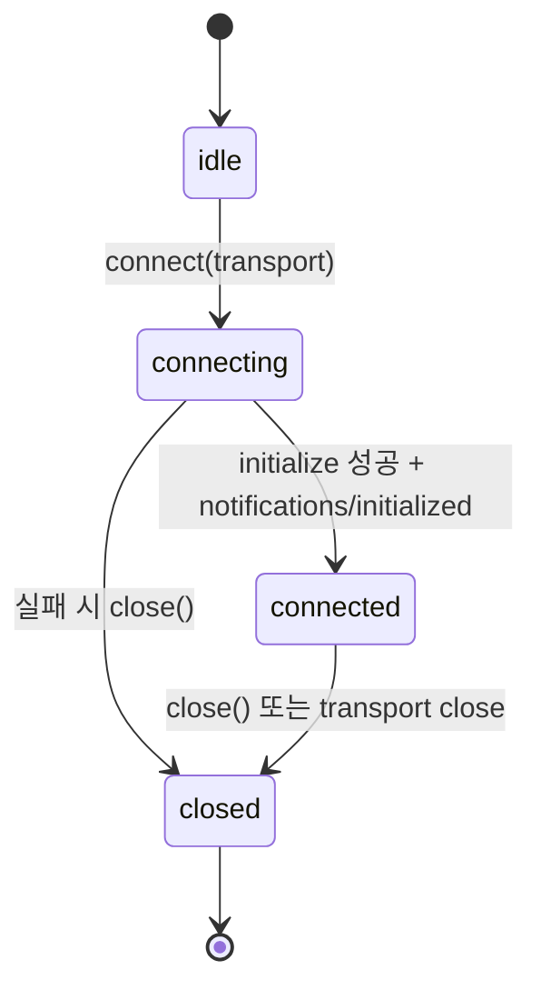
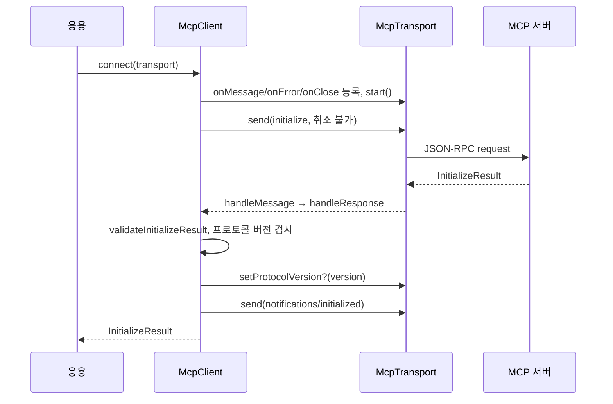
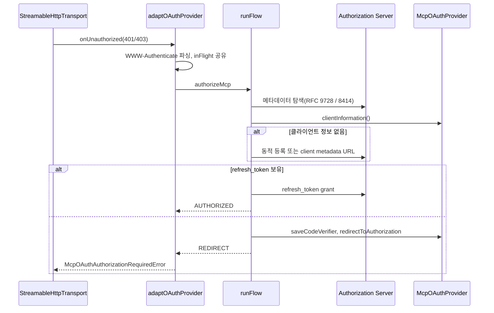

# mcp 모듈 (`packages/mcp`, `@earendil-works/pi-mcp`)

`packages/mcp`는 pi와 다른 애플리케이션이 공유하는 **독립형 Model Context Protocol(MCP) 클라이언트 라이브러리**다. 공식 SDK나 Zod에 의존하지 않고, JSON-RPC 2.0 메시지 처리, 세 가지 transport(stdio / Streamable HTTP / in-memory), OAuth 2.x 인증 흐름을 직접 구현한다. 런타임 의존성은 `cross-spawn` 하나뿐이다(`packages/mcp/package.json`).

> 이 모듈은 라이브러리다. 사용자에게 보이는 MCP 기능(서버 설정 로딩, 도구 등록, UI)은 `packages/coding-agent/src/extensions/mcp/*`의 번들 확장이 담당한다. 자세한 내용은 [Extensibility, Tools and Integrations](Extensibility,_Tools_and_Integrations.md)를 참고한다.

## 1. 패키지 구성

`package.json`의 `exports`는 세 진입점을 노출한다.

| 진입점 | 소스 | 용도 |
|---|---|---|
| `.` | `src/index.ts` | `McpClient`, transports, 프로토콜 타입 |
| `./oauth` | `src/oauth/index.ts` | OAuth 흐름과 provider |
| `./testing` | `src/testing/index.ts` | 테스트 유틸 |

- 스크립트: `build`(`tsc -p tsconfig.build.json`), `clean`(`shx rm -rf dist`), `test`(`vitest --run`), `prepublishOnly`(clean + build).
- `engines.node >= 22.19.0`, `sideEffects: false`.
- `vitest.config.ts`는 `resolve.conditions: ["source"]`로 `exports.source`를 가리켜 빌드 없이 소스를 테스트한다.
- `tsconfig.build.json`은 `../../tsconfig.base.json`을 확장하고 `src/**/*.ts`만 `dist`로 컴파일한다.
- CI의 `mcp-conformance` 잡(`.github/workflows/ci.yml`)이 프로토콜 적합성을 검증한다. 상세는 [Build, Release, CI and Quality Infrastructure](Build,_Release,_CI_and_Quality_Infrastructure.md) 참조.

## 2. 아키텍처

핵심 설계: **클라이언트(요청/응답 상관관계)와 transport(바이트/메시지 운반)를 분리**한다. `McpClient`는 `McpTransport` 인터페이스(`start`, `send`, `close`, `onMessage`, `onError`, `onClose`, 선택적 `setProtocolVersion`)만 안다.

## 3. 프로토콜 계층 (`src/protocol`)

| 파일 | 역할 |
|---|---|
| `jsonrpc.ts` | JSON-RPC 타입(`JsonRpcRequest`/`Notification`/`SuccessResponse`/`ErrorResponse`), 타입 가드, `parseJsonRpcMessage`, 오류 클래스(`McpError`, `McpConnectionClosedError`, `McpTimeoutError`, `McpAbortError`), `toError` |
| `types.ts` | `LATEST_PROTOCOL_VERSION = "2025-11-25"`, `SUPPORTED_PROTOCOL_VERSIONS`(2025-11-25, 2025-06-18, 2025-03-26, 2024-11-05), `Tool`, `Resource`, `ResourceTemplate`, `InitializeParams`, `CancelledNotification`, `ListToolsResult` 등 |
| `content.ts` | `TextContent`, `ImageContent`, `AudioContent`, `ResourceLinkContent`, `EmbeddedResourceContent`, `CallToolResult`, `toLlmContent` |

### `toLlmContent` 변환 규칙 (`blockToLlmContent`)

- text, image → 그대로 통과
- audio → `[audio <mime> omitted]` 텍스트
- resource_link → `이름: uri`
- 임베디드 text resource → 텍스트, image blob → 이미지, 그 외 binary → 생략 안내 텍스트
- `content`가 비고 `structuredContent`만 있으면 JSON 문자열로 변환

반환 형태(`LlmContent`)는 `@earendil-works/pi-ai`의 `TextContent`/`ImageContent`와 호환된다. 관련 모듈: [LLM Provider Abstraction and Auth](LLM_Provider_Abstraction_and_Auth.md).

## 4. McpClient (`src/client.ts`)

### 상태 머신

`connect()`는 `idle` 상태에서만 허용된다. 이후 `connectionState`로 상태를 읽는다.

### 연결 시퀀스

서버가 `SUPPORTED_PROTOCOL_VERSIONS`에 없는 버전을 고르면 연결이 실패하고 `close()`된다. 결과는 `serverInfo`, `serverCapabilities`, `instructions`, `protocolVersion` getter로 노출된다.

### 요청 처리 (`requestInternal`)

- 정수 ID를 증가시키며 `pending` 맵에 `PendingRequest`(resolve/reject, timer, signal, onProgress, progressToken)를 보관한다.
- **타임아웃**: `options.timeoutMs` → `requestTimeoutMs` → 기본 30,000ms. 진행(progress) 알림이 오면 타이머를 재설정한다.
- **취소**: `AbortSignal` 또는 타임아웃 시 pending을 reject하고, `initialize`가 아니면 서버에 `notifications/cancelled`를 보낸다(스펙상 initialize는 취소 금지).
- **진행 알림**: `onProgress`가 있으면 `_meta.progressToken`을 요청 ID로 주입한다.
- **서버→클라이언트 요청**: `setRequestHandler`로 등록한다. 기본 핸들러는 `ping`, 그리고 `roots` 옵션이 있으면 `roots/list`. 미등록 메서드는 `methodNotFound` 오류로 응답한다. 서버의 `notifications/cancelled`는 해당 핸들러의 `AbortController`를 abort한다.
- **종료**: `markClosed`는 멱등이며, 진행 중 요청을 reject하고 `onClose` 리스너를 한 번만 호출한다. transport 오류는 보고만 하고, pending은 transport가 닫힐 때 실패한다.

### 공개 API

| 메서드 | 설명 |
|---|---|
| `connect`, `close` | 수명주기 |
| `request`, `notify` | 임의 메서드 호출 |
| `ping` | `ping` 요청 |
| `listTools` | `tools/list`를 모든 페이지에 걸쳐 수집 |
| `listResources` / `listResourcesPage` | 전체 또는 한 페이지 |
| `listResourceTemplates` / `listResourceTemplatesPage` | 위와 동일 |
| `readResource(uri)` | `resources/read` |
| `callTool(name, args)` | `tools/call` |
| `setRequestHandler`, `onNotification`, `onError`, `onClose` | 해제 함수를 반환하는 구독 API |

### 방어적 검증과 서버 호환성

- 페이지네이션: `MAX_LIST_PAGES = 1000`, 중복 cursor는 오류. `nextCursor`가 `null`/`""`이면 종료로 간주한다.
- `isTool`은 `name`과 `inputSchema`를, `isResource`/`isResourceTemplate`는 `uri`/`uriTemplate`을 요구한다. `name`이 없는 서버를 위해 `toResource`/`toResourceTemplate`가 URI로 대체한다.
- `validateCallToolResult`는 `content`가 없고 `structuredContent`만 있는 결과를 `content: []`로 보정한다.

## 5. Transport (`src/transports`)

`TransportEvents`(`transport.ts`)는 리스너 관리를 공유하는 추상 기반 클래스이며 `emitClose`는 transport당 최대 한 번만 발생한다. 기본 최대 메시지 크기는 `DEFAULT_MAX_MESSAGE_BYTES = 16MiB`.

### 5.1 StdioTransport

- `cross-spawn`으로 서버를 실행하고 stdin/stdout으로 **줄바꿈 구분 JSON**을 주고받는다. stderr는 최대 64KiB 링버퍼(`stderr` getter)에 보관하거나 `onStderr`로 전달한다.
- 환경변수: 기본은 `process.env`와 병합, `inheritEnv: false`면 지정한 `env`만 사용.
- **프로세스 그룹**: POSIX에서는 `detached`로 별도 그룹을 만들어 `npx`/`uvx` 래퍼의 자손까지 종료한다. 호스트가 종료되면 `exit` 훅이 남은 그룹에 SIGTERM을 보낸다. Windows는 `taskkill /T /F`를 쓴다.
- **종료 절차**(스펙 준수): stdin 닫기 → 500ms 유예 후 SIGTERM → `closeTimeoutMs`(기본 2000ms) 후 SIGKILL.
- 불완전 메시지로 종료, 과대 메시지, 잘못된 JSON은 `onError`로 보고한다.

### 5.2 StreamableHttpTransport

- 모든 메시지는 POST로 보낸다(`Accept: application/json, text/event-stream`). 응답은 `application/json` 또는 SSE 스트림이다. 알림/응답은 202를 받고 본문은 버린다.
- `Mcp-Session-Id`는 응답에서 캡처해 이후 요청에 붙이고(`sessionId`), `MCP-Protocol-Version`은 `setProtocolVersion` 뒤에 붙인다. `close()`는 세션이 있으면 DELETE를 시도한다(1초 타임아웃).
- `notifications/initialized` 전송 후 **서버→클라이언트 GET SSE 스트림**을 연다(`openGetStream: false`로 끌 수 있고, 405면 미지원으로 간주).
- **재연결**(`reconnect`): 초기 1000ms, 최대 30,000ms, 최대 5회 지수 백오프. 서버가 보낸 `retry` 필드를 우선하며 `Last-Event-ID`로 재개한다. 응답 스트림이 응답 전에 끊기고 이벤트 ID가 없으면 해당 요청만 `internalError` 응답으로 실패시킨다.
- **인증**: `authProvider.token()`으로 Bearer 헤더를 붙인다. 401, 또는 `insufficient_scope`인 403이면 `onUnauthorized`를 한 번 호출한 뒤 재시도한다.
- 오류 클래스: `McpHttpError`, `McpAuthRequiredError`(401), `McpSessionExpiredError`(세션 있는 404).
- `consumeSseStream`은 SSE 파서이며, 이벤트 크기 상한을 데이터 줄 누적 단계에서도 검사한다.
- `fetch`는 수신자 없이 호출한다(Cloudflare Workers "Illegal invocation" 방지).

### 5.3 InMemoryTransport

`createInMemoryTransportPair()`가 서로 연결된 client/server 쌍을 만든다. 메시지는 `structuredClone` 후 `queueMicrotask`로 전달되며 한쪽을 닫으면 상대도 닫힌다. 주로 테스트용이다.

## 6. OAuth (`src/oauth`)

MCP TypeScript SDK v1.29.0의 `auth.ts`를 기반으로 하되 SDK/Zod 의존을 제거하고 PKCE에 WebCrypto를 쓴다(`packages/mcp/LICENSES/` 참조).

### 구성 요소

- `flow.ts`
  - `OAuthClientProvider`: 토큰, 클라이언트 정보, code verifier, 리다이렉트를 추상화한 인터페이스.
  - `authorizeMcp(provider, options)`: `"AUTHORIZED"` 또는 `"REDIRECT"` 반환. `invalid_client`/`unauthorized_client`면 자격증명 전체, `invalid_grant`면 토큰만 무효화하고 한 번 재시도한다.
  - `adaptOAuthProvider(provider)`: `StreamableHttpTransport`용 `AuthProvider`로 변환.
- `provider.ts`: `McpOAuthProvider`(정확히 한 서버 URL 전용 기본 구현), `McpOAuthStateStore`, `MemoryOAuthStateStore`.
- `discovery.ts`, `errors.ts`, `types.ts`: 메타데이터 탐색, 오류 클래스, 토큰/클라이언트 파싱 (이 문서의 제공 컴포넌트 밖이며, 호출 관계는 `flow.ts`의 import로 확인).

### 인증 흐름

주요 동작:

- **PKCE S256** 필수. 서버가 S256을 지원하지 않으면 실패한다.
- **엔드포인트 보안**: 토큰 엔드포인트와 메타데이터 URL은 https여야 한다(loopback 제외). 위반 시 `OAuthInsecureEndpointError`.
- **RFC 9207**: 인가 코드 교환 전에 `iss`가 메타데이터의 `issuer`와 일치하는지 확인한다(`OAuthIssuerMismatchError`).
- **클라이언트 인증 방식**: `client_secret_basic` → `client_secret_post` → `none` 순으로 서버 지원 목록과 맞춰 선택한다.
- **Step-up**: `insufficient_scope`이면 `stepUpScope`로 기존 scope와 요구 scope를 합치고 refresh를 건너뛴다(`skipRefresh`).
- **동시 401 병합**: `inFlight` 프라미스를 공유하고, 이미 토큰이 교체된 요청은 재시도만 한다. 회전(rotating) refresh token의 이중 사용을 막기 위해서다.
- **McpOAuthProvider**: 상태 변경을 `writes` 체인으로 직렬화하고, 다른 `serverUrl`의 저장 상태는 무시해 자격증명이 서버 간 새지 않게 한다. 영속 저장이 필요하면 `store`를 주입한다(기본은 메모리). `saveTokens`는 `expires_in`으로 `tokensExpireAt`을 기록한다.

## 7. coding-agent와의 통합

`packages/coding-agent/src/extensions/mcp/*`가 이 라이브러리를 사용한다.

| 확장 파일 | 사용 방식 |
|---|---|
| `runtime.ts` | `McpServerConnection`이 `McpClient`를 감싸 `callTool`/`readResource` 제공, `createDefaultTransport`가 stdio/HTTP 선택 |
| `oauth.ts` | `McpOAuthCredentialStore`가 `McpOAuthStateStore`를 구현해 자격증명 영속화 |
| `tools.ts`, `resources.ts` | MCP 도구/리소스를 pi 도구로 노출 |
| `index.ts`, `log.ts`, `ui.ts` | 설정 로드, 서버 로그, 관리 UI(`McpManagerView`) |

서버 설정 레지스트리(`McpServerRegistry`, `McpStdioServerConfig`)는 `packages/coding-agent/src/core/mcp-servers.ts`에 있다. 도구 결과는 `toLlmContent`로 변환되어 에이전트 루프로 들어간다. 관련 모듈: [Agent Loop and Session Core](Agent_Loop_and_Session_Core.md), 코드 실행 샌드박스 [codemode](codemode.md).

## 8. 유지보수 시 참고

- 새 transport는 `McpTransport`를 구현하고 `TransportEvents`를 상속하면 된다. `emitClose`의 1회 보장은 기반 클래스가 제공한다.
- 새 프로토콜 버전은 `SUPPORTED_PROTOCOL_VERSIONS`와 `LATEST_PROTOCOL_VERSION`을 함께 갱신한다.
- 검증 수준: 위 내용은 제공된 소스(`client.ts`, `transports/*`, `oauth/flow.ts`, `oauth/provider.ts`, `protocol/*`)를 직접 읽은 **코드 확인**이다. `discovery.ts`, `errors.ts`, `types.ts`, `auth-provider.ts`, `index.ts`의 내부와 coding-agent 확장의 세부 호출 관계는 **미확인**(import 이름에서 **추론**)이다.
