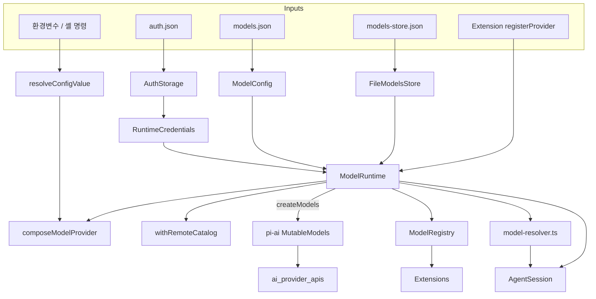
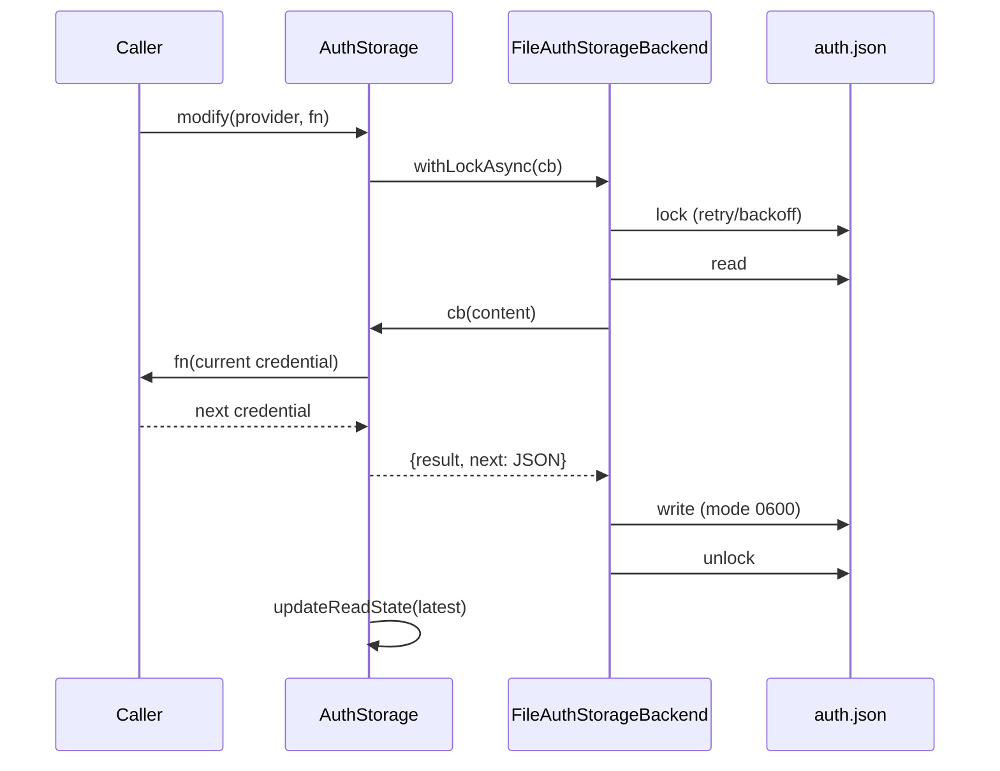
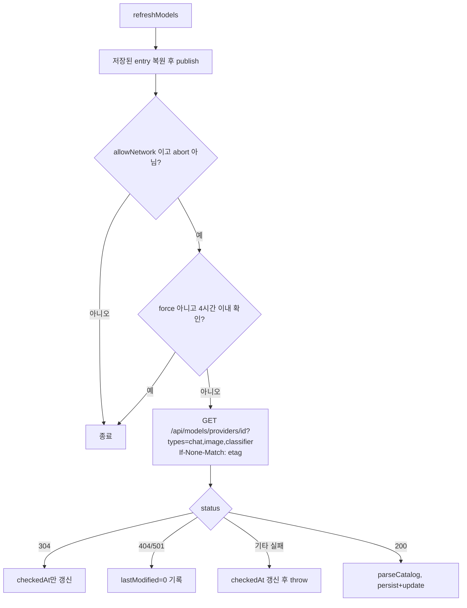
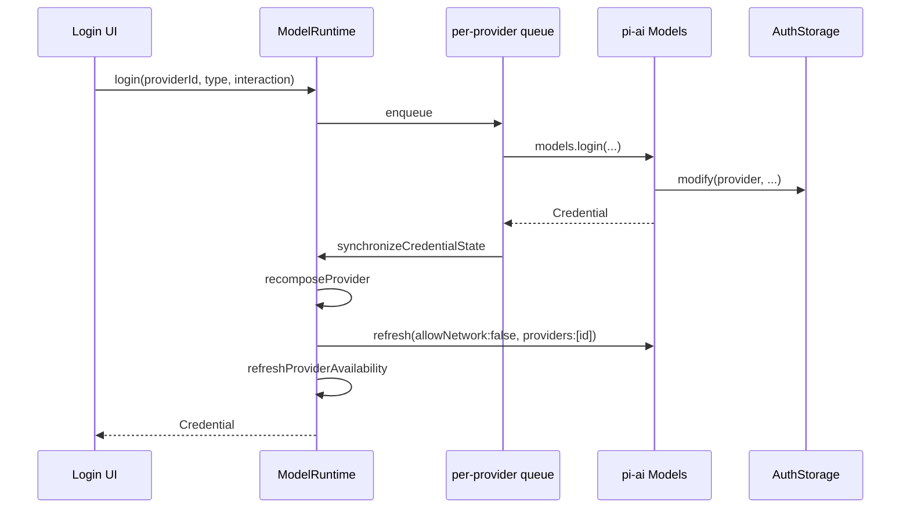
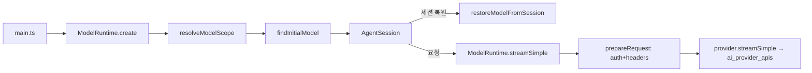

# model_and_auth_management

`packages/coding-agent/src/core`의 모델·자격 증명 계층이다. `@earendil-works/pi-ai`의 `Models`/`Provider`/`CredentialStore` 추상화([LLM_Provider_Abstraction_and_Auth](LLM_Provider_Abstraction_and_Auth.md), 특히 `ai_models_and_providers`, `ai_auth`)를 coding-agent 환경(`auth.json`, `models.json`, 확장 provider, 가상 모델)에 맞게 조립한다.

상위 모듈 [Model,_Credential_and_Settings_Management](Model,_Credential_and_Settings_Management.md)의 하위 모듈이며, 형제 모듈은 [settings_and_keybindings](settings_and_keybindings.md)이다. 소비자는 [agent_session_core](agent_session_core.md)(`AgentSession.modelRuntime`), [cli_bootstrap_and_config](cli_bootstrap_and_config.md), [extension_system](extension_system.md), [interactive_selectors_and_dialogs](interactive_selectors_and_dialogs.md)(로그인/모델 선택 UI)이다.

> 검증 수준: 아래 내용은 제공된 소스 코드를 직접 읽고 작성했다(코드 확인). 개발자 의도는 `추론`으로 표기한다.

## 1. 구성 요소 한눈에 보기

| 파일 | 핵심 심볼 | 역할 |
|---|---|---|
| `auth-storage.ts` | `AuthStorage`, `FileAuthStorageBackend`, `InMemoryAuthStorageBackend`, `ReadOnlyAuthStorage`, `readStoredCredential` | `auth.json` 기반 `CredentialStore` (파일 락, 변경 감지 캐시) |
| `runtime-credentials.ts` | `RuntimeCredentials` | 비영속 API 키 오버레이 (`--api-key` 등) |
| `resolve-config-value.ts` | `resolveConfigValue`, `resolveHeaders`, `clearConfigValueCache` | `!command`, `$ENV`, 리터럴 값 해석 |
| `http-dispatcher.ts` | `configureHttpDispatcher`, `createUndiciOriginDispatcher`, `ignoreUndiciDispatcherError` | undici 전역 dispatcher, 프록시, idle timeout |
| `model-config.ts` | `ModelConfig` | `models.json`의 불변·credential-blind 스냅샷 (TypeBox 검증) |
| `models-store.ts` | `FileModelsStore`, `InMemoryCodingAgentModelsStore` | 원격 카탈로그 등 동적 모델 목록 영속화 |
| `remote-catalog-provider.ts` | `withRemoteCatalog`, `isSupportedModelType` | pi.dev 카탈로그 오버레이 (ETag/304) |
| `provider-composer.ts` | `composeModelProvider`, `ProviderConfigInput`, `ProviderChatModelConfig` 등 | builtin + `models.json` + 확장 레이어 합성 |
| `model-runtime.ts` | `ModelRuntime` | 모든 것을 묶는 중심 클래스 (`Models` 구현) |
| `model-registry.ts` | `ModelRegistry` | 확장에 노출하는 동기식 호환 facade |
| `model-resolver.ts` | `findInitialModel`, `resolveCliModel`, `resolveModelScope`, `restoreModelFromSession` | 모델 패턴/CLI/세션 복원 해석 |

## 2. 아키텍처

핵심 설계: **`ModelRuntime`이 유일한 상태 보유자**이고, `ModelRegistry`는 하위 호환용 얇은 위임 계층이다(소스 주석: "Coding-agent internals use ModelRuntime directly").

## 3. 자격 증명 계층

### 3.1 `AuthStorage` / 백엔드

- `AuthStorageBackend`는 `withLock`(동기)·`withLockAsync`(비동기) 두 메서드만 가진 락 추상화다. 구현은 3가지:
  - `FileAuthStorageBackend`: `proper-lockfile` 사용. 동기 경로는 최대 10회, 20ms 간격 재시도(busy-wait). 비동기 경로는 stale 30초, 지수 백오프+지터(최대 2초), `AbortSignal` 지원, lock compromised 감지. 파일은 `0o600`, 디렉터리는 `0o700`으로 생성.
  - `InMemoryAuthStorageBackend`: Promise 체인으로 직렬화.
  - `ReadOnlyAuthStorage`(별도 `CredentialStore`): 스키마를 검증하며 로드하고 `modify`/`delete`는 예외를 던짐.
- `AuthStorage`는 `CredentialStore`(`read/list/modify/delete`)를 구현. 파일 revision(`getFileRevision`)이 같으면 캐시를 재사용하고, 동시 reload는 하나로 합쳐(`AuthFileReload.readers` 참조 카운트) 모든 reader가 취소되면 reload도 abort한다.
- `read()`는 `api_key`의 `key`를 `resolveConfigValue(key, env)`로 해석해 반환하지만 `list()`는 해석하지 않는다(메타데이터만).
- `modify()`는 락 안에서 현재값→`fn`→병합 저장하는 read-modify-write이다. `undefined`를 반환하면 쓰기를 건너뛴다.

### 3.2 `RuntimeCredentials`

`CredentialStore`를 감싸는 오버레이. `setRuntimeApiKey`로 설정한 키가 `read`에서 저장소보다 우선하고 `list`에는 `api_key`로 합류한다. `modify`는 하부 저장소로 위임, `delete`는 저장소와 오버라이드 모두 제거한다. 디스크에는 쓰지 않는다.

### 3.3 `resolve-config-value.ts`

설정값(API 키, 헤더 값) 해석 규칙:

| 형태 | 동작 |
|---|---|
| `!cmd` | 셸에서 실행, stdout trim. 10초 timeout, 결과는 프로세스 수명 동안 캐시(`commandResultCache`). Windows는 `getShellConfig()` 사용 후 실패 시 기본 셸 |
| `$VAR`, `${VAR}` | `env` 인자 → `process.env` 순으로 보간. 하나라도 없으면 `undefined` |
| `$$`, `$!` | 리터럴 `$`, `!` 이스케이프 |
| 그 외 | 리터럴 |

`resolveConfigValueOrThrow`/`resolveHeadersOrThrow`는 캐시를 쓰지 않고 누락된 환경변수명을 오류 메시지에 담는다. `resolveHeaders`는 값이 비면 해당 헤더를 조용히 제외한다.

### 3.4 `http-dispatcher.ts`

`configureHttpDispatcher(timeoutMs)`가 `EnvHttpProxyAgent`를 전역 dispatcher로 설정한다(`bodyTimeout`/`headersTimeout` = idle timeout, 기본 300초, `0`=비활성). `ignoreUndiciDispatcherError`는 undici Client가 스트림 중단 시 내는 `error` 이벤트가 EventEmitter 미처리 예외로 프로세스를 죽이는 것을 막는 no-op 리스너이다(본문은 `reader.read()`로 이미 reject됨). 전역 `fetch`가 원본이거나 이전에 설치한 것일 때만 `undici.install()`로 교체한다.

## 4. 모델 설정 계층

### 4.1 `ModelConfig`

`models.json`을 JSONC(주석 허용)+BOM 제거 후 TypeBox `Compile`로 검증하고 `deepFreeze(structuredClone())`한 불변 스냅샷. 실패 시 던지지 않고 빈 맵 + `getError()` 문자열을 보관한다(파일 없음 `ENOENT`는 오류 아님). 스키마에는 `compat`(openai-completions/responses/anthropic-messages), `thinkingLevelMap`, `cost.tiers`, `inputLimits`, `modelOverrides`, `oauth: "radius"` 등이 있다.

### 4.2 `ModelsStore`

`FileModelsStore`는 `FileAuthStorageBackend`를 재사용해 `models-store.json`을 락과 revision 캐시로 읽고 쓴다(`AuthStorage`와 동일한 reload 합치기 패턴). 테스트/무파일 모드는 `InMemoryCodingAgentModelsStore`.

### 4.3 `withRemoteCatalog`

builtin provider에 pi.dev 카탈로그 오버레이를 덧씌운다.

로컬 빌드의 `generatedAt`보다 오래된 저장 항목은 무시된다(`remoteModels`). 모델은 `type\0id` 키로 병합되어 동적 항목이 정적 항목을 덮어쓴다.

## 5. Provider 합성: `composeModelProvider`

레이어 순서(아래로 갈수록 우선):

1. builtin/native provider (`base`)
2. `models.json` (`applyModelsJson`: baseUrl/compat 적용, `models` upsert)
3. 확장 `ProviderConfigInput` (`applyExtension`: `models`가 있으면 **교체**)
4. OAuth `modifyModels` 훅(chat 전용)
5. `models.json`의 `modelOverrides` (최상위, chat 전용)

인증 합성:
- `composeApiKeyAuth`: `check`(자격 유무만 판단, 명령 실행 안 함)와 `resolve`(실제 키 해석)를 분리. 저장 자격 > 설정된 `apiKey` > 상속(builtin) 순. 헤더는 `resolveHeadersOrThrow`, `authHeader: true`면 `Authorization: Bearer`를 추가(키 없으면 오류).
- `composeOAuthAuth`: 확장 `oauth`는 `adaptOAuth`로 pi-ai `OAuthAuth`에 맞춘다(콜백을 `notify`/`prompt`로 변환).
- API 키·OAuth 둘 다 없으면 오류. OAuth만 있는 provider에는 API 키 로그인을 만들지 않는다.

스트리밍 선택(`streamWith`): 확장 `streamSimple`(api 일치) → base provider가 해당 api 지원 시 base → 전역 `getApiProvider(model.api)` 순. 이미지/분류기/deferred 호출은 확장 구현 → base 순으로 위임하고 없으면 오류 결과를 반환한다.

타입 가이드: `ProviderChatModelConfig`(`type?: "chat"`), `ProviderImageModelConfig`(`type: "image"`), `ProviderClassifierModelConfig`(`type: "classifier"`)가 `ProviderModelConfigBase`를 공유한다.

## 6. `ModelRuntime`

### 6.1 생성

`ModelRuntime.create(options)`:
1. `RuntimeCredentials(options.credentials ?? AuthStorage.create(authPath))`
2. `ModelConfig.load(modelsPath)` (`modelsPath: null`이면 비활성)
3. `ModelsStore` 선택(파일/메모리)
4. builtin provider들에 `withRemoteCatalog` 적용(`radius` 제외)
5. `configureRadiusProviders()`: `oauth: "radius"`인 `models.json` provider를 radius provider로 교체
6. `refreshOnCreate !== false`이면 `refresh()`. 네트워크는 `allowModelNetwork === true`이고 `PI_OFFLINE`이 없을 때만, 타임아웃은 `modelRefreshTimeoutMs`.

### 6.2 상태 스냅샷

`ModelRuntimeSnapshot { all, available, configuredProviders, storedProviders, auth }`를 메모리에 두어 동기 조회(`hasConfiguredAuth`, `getAvailableSnapshot`, `isUsingOAuth`, `getProviderAuthStatus`)를 지원한다. 비동기 가용성 갱신은 시퀀스 번호(`availabilityRefreshSeq`, `providerAvailabilitySeq`, `availabilityErrorSeq`)로 오래된 결과를 버린다. 확장이 provider를 등록하면 `markProvisionallyConfigured`로 즉시 "구성됨" 처리하고 이후 실제 검사가 대체한다(초기 모델 선택이 갱신보다 먼저 실행되기 때문).

### 6.3 자격 변경 직렬화

`login`, `logout`, `setRuntimeApiKey`, `removeRuntimeApiKey`는 `enqueueCredentialOperation`으로 provider별 직렬 큐에 들어간다. 변경 후 `synchronizeCredentialState`가 provider 재합성 → 오프라인 refresh → 가용성 갱신을 수행하고, 실패하면 `CredentialSynchronizationError`(자격은 이미 커밋됨)를 던진다.

### 6.4 요청 처리

`prepareRequest`: provider 조회 → `getAuth(model, {apiKey, env, signal})`(없으면 `ModelsError("auth")`) → 헤더 병합(인증 헤더 < 호출자 헤더, 대소문자 무시, `transformHeaders` 적용) → 인증이 `baseUrl`을 주면 모델에 반영. `stream`/`streamSimple`/`streamDeferred`는 `lazyStream`으로 감싸 인증 해석을 스트림 시작 시점으로 미룬다. `generateImages`/`classify`는 **절대 reject하지 않고** `imageErrorResult`/`classifierErrorResult`를 반환한다.

### 6.5 가상 모델

`registerVirtualModel(definition)`은 `route()` 콜백을 가진 모델을 등록한다(물리 모델과 id 충돌 시 오류). `streamSimple`에서 가상 모델이면 `resolveModel`로 실제 모델과 thinking level을 결정하고(`clampThinkingLevel`), `maxTokens`를 대상 모델 한도로 제한한다. 라우팅 대상은 카탈로그의 물리 모델이어야 하며 자격이 구성되어 있어야 한다. 다른 provider로 라우팅되면 호출자의 `apiKey/headers/env`는 전달하지 않는다(키 유출 방지).

### 6.6 provider 등록 API

| 메서드 | 의미 |
|---|---|
| `registerProvider(id, config)` | `validateExtensionProvider`로 사전 검증 후 이전 등록과 병합(정의된 값만 덮어씀) |
| `registerNativeProvider(provider)` | 완성된 pi-ai `Provider` 직접 등록 |
| `unregisterProvider(id)` | 둘 다 제거 후 재합성 |
| `refresh(options)` | `models.json` 재로드 → 재합성 → pi-ai refresh → 가용성 갱신 |

오류는 `getError()`에서 `models.json` 오류, provider별 합성 오류, 가용성 오류를 합쳐 반환한다. 합성 실패 시 base provider로 폴백한다.

## 7. `ModelRegistry` (호환 facade)

`ModelRuntime`에 위임하는 동기 중심 API: `getAll`, `getAvailable`(스냅샷), `find`, `findOfType`, `hasConfiguredAuth`, `getApiKeyAndHeaders`(`ResolvedRequestAuth`로 오류를 값으로 반환), `stream`/`streamSimple`/`complete`, `classify`, `generateImages`, `registerProvider`(이름+설정 또는 `Provider` 객체 오버로드), `registerVirtualModel` 등. 주의: 동기 읽기 전에 `await refresh()`가 필요하다(소스 주석). 인증이 구성되지 않았으면 `getCompatibilityRequestConfig`로 `headers`만 반환하되 `authHeader`가 켜져 있으면 "No API key found" 오류를 낸다.

## 8. `model-resolver.ts`

- `defaultModelPerProvider`: provider별 기본 chat 모델 ID 표.
- `parseModelPattern`: 정확/부분 일치(별칭 `-latest`·날짜 없는 ID 우선, 없으면 가장 최신 날짜 버전) 후, 마지막 `:`를 thinking level 접미사로 해석(OpenRouter `:exacto` 같은 ID도 지원). `allowInvalidThinkingLevelFallback: false`(CLI)면 잘못된 접미사를 모델 ID의 일부로 보고 실패 처리.
- `resolveModelScopeFromModels`: glob(`*`,`?`,`[`) 패턴과 `provider/id` 매칭, 중복 제거, `diagnostics` 반환.
- `resolveCliModel`: `--provider/--model`. **모든 모델**(인증 여부 무관)에서 찾아 `--api-key` 최초 설정을 허용한다. 모호한 bare ID는 인증된 provider가 단 하나일 때만 선택. 못 찾으면 provider의 기본 모델을 기반으로 사용자 지정 ID 모델을 생성(`buildFallbackModel`).
- `findInitialModel` 우선순위: CLI → scoped 첫 모델(이어하기 아님) → 저장된 기본값(인증 필요) → 기본 모델 표의 첫 가용 모델 → 가용 모델 첫 번째.
- `restoreModelFromSession`: 저장된 모델이 존재하고 인증이 있으면 복원, 아니면 현재 모델 → 가용 기본 모델로 폴백하며 `fallbackMessage`를 반환(`AgentSessionRuntime.modelFallbackMessage`로 표시).

## 9. 사용 흐름 예: 시작 시 모델 결정

## 10. 유의점 / 확장 지점

- 새 provider 추가: 확장에서 `registerProvider`(설정형) 또는 `registerNativeProvider`(완성형). 설정형은 `models` 정의 시 `baseUrl`과 `api`가 필수.
- 비밀값은 `auth.json` 또는 `!cmd`/`$ENV` 참조로 두고 `models.json`에는 참조만 둔다(`ModelConfig`는 credential-blind).
- 동기 `withLock`의 busy-wait는 호출자를 async로 바꾸지 않기 위한 타협이다(소스 주석 근거).
- 가용 모델 목록은 기본값이 스냅샷이므로 로그인/로그아웃 직후에는 `ModelRuntime`의 동기화가 끝난 뒤 읽어야 한다.
- 모델 카탈로그 생성·배포는 [ai_build_and_model_generation](ai_build_and_model_generation.md)와 `.github/workflows/publish-model-catalog.yml`을 참고한다(본 문서에서는 미확인 영역).
