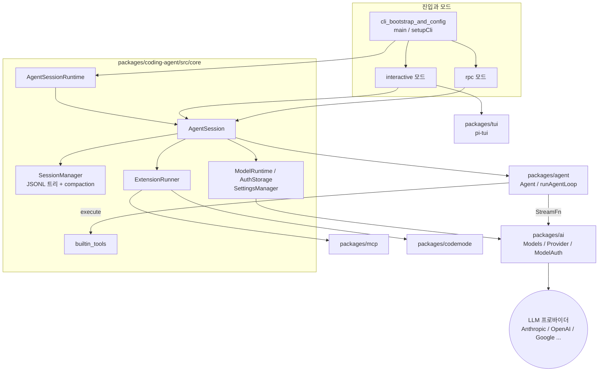
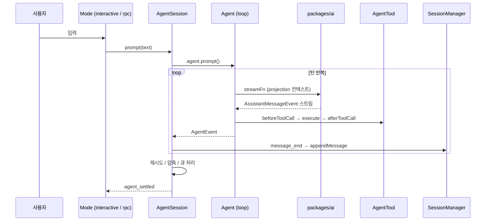
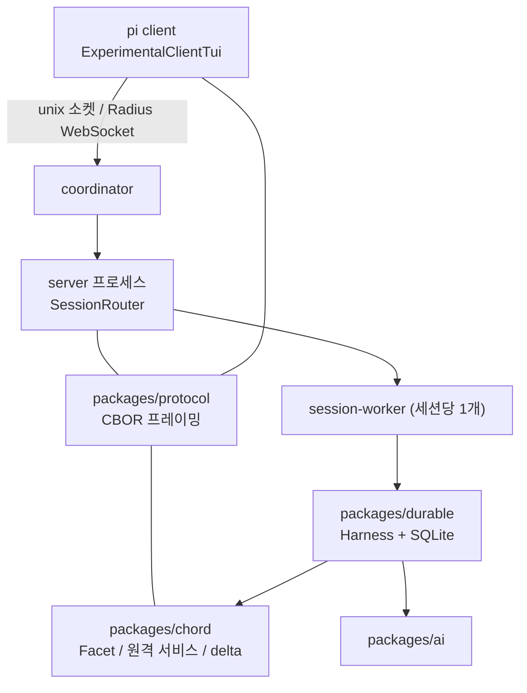

# pi 저장소 개요

> 검증 수준: 이 개요는 `codewiki-d4`의 모듈 문서 10개를 읽고 종합한 것이다. 소스 코드를 다시 열어 대조하지는 않았다(문서 기반). 개별 항목의 검증 수준(코드 확인 / 추론 / 미확인)은 각 모듈 문서를 따른다.

## 1. 목적

`pi`는 `@earendil-works` 스코프로 배포되는 TypeScript 모노레포다. 터미널에서 쓰는 **코딩 에이전트(`packages/coding-agent`)** 가 중심이다. 이 에이전트를 받치는 구성 요소도 같은 저장소에 있다.

- 여러 LLM 프로바이더를 하나의 모델·스트리밍 계약으로 묶는 계층 (`packages/ai`)
- 프로바이더와 UI에 의존하지 않는 범용 에이전트 루프 (`packages/agent`)
- 터미널 UI 프레임워크 (`packages/tui`)
- 확장 시스템, MCP 클라이언트, 코드 실행 샌드박스 (`packages/mcp`, `packages/codemode`)
- 원격 세션을 위한 분산 런타임과 내구성(durable) 하네스 (`packages/chord`, `packages/protocol`, `packages/server`, `packages/client`, `packages/durable`)
- 빌드, 릴리스, CI, 평가 인프라 (`.github/workflows`, `packages/evals`, `packages/telemetry`)

사용자는 한 가지 에이전트 세션(`AgentSession`)을 interactive TUI, print/json, RPC 모드 중 하나로 쓴다. 서버/클라이언트와 durable 하네스는 개발 전용(experimental) 기능이며 `areExperimentalFeaturesEnabled()`가 참일 때만 동작한다.

## 2. 전체 아키텍처

### 2.1 패키지 의존 구조

`packages/agent`는 `StreamFn`을 호스트가 주입받기 때문에 프로바이더 카탈로그에 직접 의존하지 않는다. `AgentSession`은 이 루프 위에 모델 선택, 압축, 재시도, 큐, 확장 훅을 얹는다.

### 2.2 대표 실행 흐름: 프롬프트 한 번

모델에 보내는 컨텍스트는 `buildSessionProjection`이 JSONL 이력에서 매번 재구성한다. 압축과 편집도 이력을 지우지 않고 새 엔트리를 append한다.

### 2.3 분산 및 durable 계층 (experimental)

하나의 논리 서버를 coordinator, server, session-worker 프로세스로 나눈다. 그래서 서버 본체를 교체해도 세션 worker는 유지된다. 클라이언트는 도메인 로직 없이 복제된 상태를 화면에 그리기만 한다.

## 3. 핵심 모듈 문서

아래 세 모듈(`packages/ai`, `packages/agent`, `packages/coding-agent`)을 중점 모듈로 본다. `coding-agent`는 여러 모듈 문서에 걸쳐 있다.

### 3.1 중점 모듈

| 모듈 | 경로 | 핵심 내용 | 문서 |
|---|---|---|---|
| LLM 프로바이더 추상화와 인증 | `packages/ai` | `stream`/`streamSimple` 이벤트 정규화, 모델 카탈로그, OAuth/API 키 인증, `models.generated.ts` 생성 | [LLM_Provider_Abstraction_and_Auth](LLM_Provider_Abstraction_and_Auth.md) |
| 에이전트 루프와 세션 코어 | `packages/agent`, `packages/coding-agent/src/core`, `src` | `Agent`, `runAgentLoop`, `AgentSession`, `SessionManager`, 압축, CLI 부트스트랩 | [Agent_Loop_and_Session_Core](Agent_Loop_and_Session_Core.md) |
| 모델·자격 증명·설정 관리 | `packages/coding-agent/src/core` | `ModelRuntime`, `AuthStorage`, `SettingsManager`, `KeybindingsManager` | [Model,_Credential_and_Settings_Management](Model,_Credential_and_Settings_Management.md) |
| 확장, 도구, 통합 | `packages/coding-agent/src/core/{extensions,tools}`, `src/extensions`, `packages/mcp`, `packages/codemode`, `.pi/extensions` | `ExtensionRunner`, 내장 도구, `exposure` 모델, MCP, QuickJS 샌드박스 | [Extensibility,_Tools_and_Integrations](Extensibility,_Tools_and_Integrations.md) |
| 사용자 모드 | `packages/coding-agent/src/modes` | `InteractiveMode`, `runRpcMode`, `RpcClient`, 테마 | [User-Facing_Modes_(Interactive_and_RPC)](User-Facing_Modes_(Interactive_and_RPC).md) |

### 3.2 기반 및 실험 모듈

| 모듈 | 경로 | 핵심 내용 | 문서 |
|---|---|---|---|
| 터미널 UI 프레임워크 | `packages/tui` | 차등 렌더링, 키 처리, 위젯, 네이티브 클립보드 애드온 | [Terminal_UI_Framework](Terminal_UI_Framework.md) |
| 분산 런타임 기반 | `packages/chord`, `protocol`, `server`, `client` | Facet 호스트, 복제 상태, CBOR 프로토콜(`PROTOCOL_VERSION = 8`), 서버/클라이언트 | [Distributed_Runtime_Foundation_(Chord,_Protocol,_Transport)](Distributed_Runtime_Foundation_(Chord,_Protocol,_Transport).md) |
| 실험적 서버/클라이언트 | `packages/coding-agent/src/experimental`, `src/cli/experimental` | `server`/`client` 서브커맨드, 프로세스 모델, Radius 릴레이 | [Experimental_Server_and_Client_Runtime](Experimental_Server_and_Client_Runtime.md) |
| Durable 에이전트 하네스 | `packages/durable`, `packages/coding-agent/src/experimental` | 트랜잭션 로그 기반 재개 가능 루프, Memory/JSONL/SQLite 저장소 | [Durable_Agent_Harness](Durable_Agent_Harness.md) |
| 빌드, 릴리스, CI, 품질 | `.github/workflows`, 루트 설정, `packages/evals`, `packages/telemetry` | 빌드 체인, 릴리스 파이프라인, 기여자 게이트, A/B 평가 | [Build,_Release,_CI_and_Quality_Infrastructure](Build,_Release,_CI_and_Quality_Infrastructure.md) |

### 3.3 읽는 순서 제안

1. [LLM_Provider_Abstraction_and_Auth](LLM_Provider_Abstraction_and_Auth.md): 가장 아래 계층인 모델 호출 계약
2. [Agent_Loop_and_Session_Core](Agent_Loop_and_Session_Core.md): 루프, 세션, 압축
3. [Extensibility,_Tools_and_Integrations](Extensibility,_Tools_and_Integrations.md): 도구와 확장 지점
4. [Model,_Credential_and_Settings_Management](Model,_Credential_and_Settings_Management.md)와 [User-Facing_Modes_(Interactive_and_RPC)](User-Facing_Modes_(Interactive_and_RPC).md): 앱 쪽 조립과 표현 계층
5. 필요할 때 TUI, 분산 런타임, durable 하네스 문서

## 4. 핵심 설계 요약

- **오류는 값으로 전달한다.** `packages/ai` 스트림은 예외 대신 `stopReason: "error"` 메시지를 돌려준다.
- **세션은 append-only JSONL 트리다.** 압축과 편집은 새 엔트리를 추가하고, 모델 컨텍스트는 projection으로 재구성한다.
- **코어는 번들 기능을 특별 취급하지 않는다.** `codemode`, `mcp`, `tool-search`, `llama`도 일반 `ExtensionAPI`만 쓴다. MCP 도구는 기본 `codemode` exposure라서 서버가 많아도 프롬프트가 커지지 않고 캐시가 유지된다.
- **비밀값은 `models.json`에 두지 않는다.** `auth.json` 또는 `!cmd`/`$ENV` 참조로 둔다.
- **키 바인딩은 하드코딩하지 않는다.** `DEFAULT_EDITOR_KEYBINDINGS`, `DEFAULT_APP_KEYBINDINGS`에 선언한다(저장소 규칙).
- **생성물은 직접 고치지 않는다.** `packages/ai/src/models.generated.ts`는 `scripts/generate-models.ts`를 고친 뒤 재생성한다.

## 5. How it is built and run

- **빌드**: npm workspaces 모노레포다. 루트 `npm run build`는 의존 순서가 하드코딩된 체인으로 패키지를 차례로 빌드한다(`chord → tui → telemetry → codemode → mcp → ai → durable → agent → protocol → client → server → coding-agent`). `coding-agent`는 `tsc`와 esbuild 번들, 그리고 Bun 단일 바이너리(`build:binary`)로 패키징한다.
- **검사와 테스트**: `npm run check`가 biome, 의존성 핀 검사, 진입 그래프 검사, shrinkwrap 검증, `tsc --noEmit`을 순차 실행한다. 테스트는 vitest이며 `test.sh`가 API 키 없이 격리해 실행한다. 프로바이더 API 대신 `faux` 프로바이더를 쓴다.
- **배포**: `v*` 태그가 `build-binaries.yml`을 트리거해 6개 플랫폼 바이너리를 만들고, smoke test, draft 릴리스, npm 게시를 거친 뒤 공개 릴리스를 가장 마지막에 한다. 모델 카탈로그는 `publish-model-catalog.yml`이 별도로 게시한다.
- **운영**: 기여자와 이슈 게이트 워크플로, `packages/evals`의 Docker A/B 평가, `packages/telemetry`의 관측 계약이 있다.

자세한 내용은 [Build,_Release,_CI_and_Quality_Infrastructure](Build,_Release,_CI_and_Quality_Infrastructure.md)를 참고한다. `packages/ai`의 모델 카탈로그 생성은 [LLM_Provider_Abstraction_and_Auth](LLM_Provider_Abstraction_and_Auth.md), TUI 네이티브 prebuild는 [Terminal_UI_Framework](Terminal_UI_Framework.md)에 있다.

## 6. 미확인 및 주의 사항

- 각 모듈 문서 내부의 미확인 항목(예: `setDefaultStreamFn`의 실제 등록 위치, `AgentTool.replay` 사용처, `telemetry` 소비처)은 이 개요에서도 미확인이다.
- 분산 런타임과 durable 하네스의 연결 방식 일부는 문서상 추론이다.
- `pi-test.sh`와 `pi-test.ps1`은 서로 다른 진입점을 실행한다고 하위 문서에 기록되어 있다.