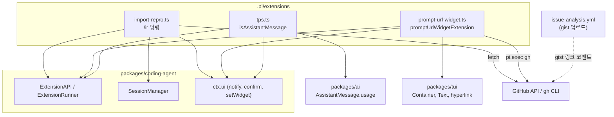
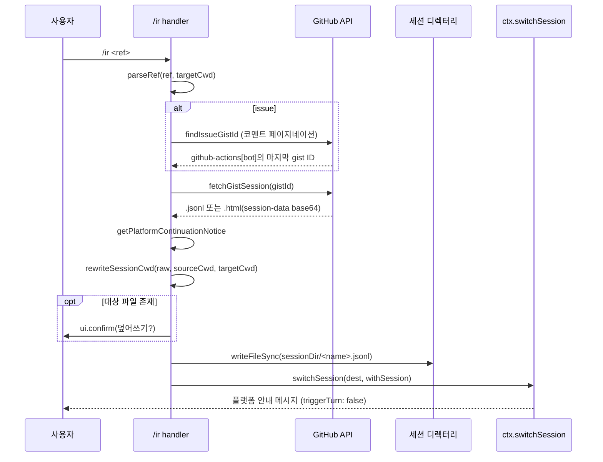
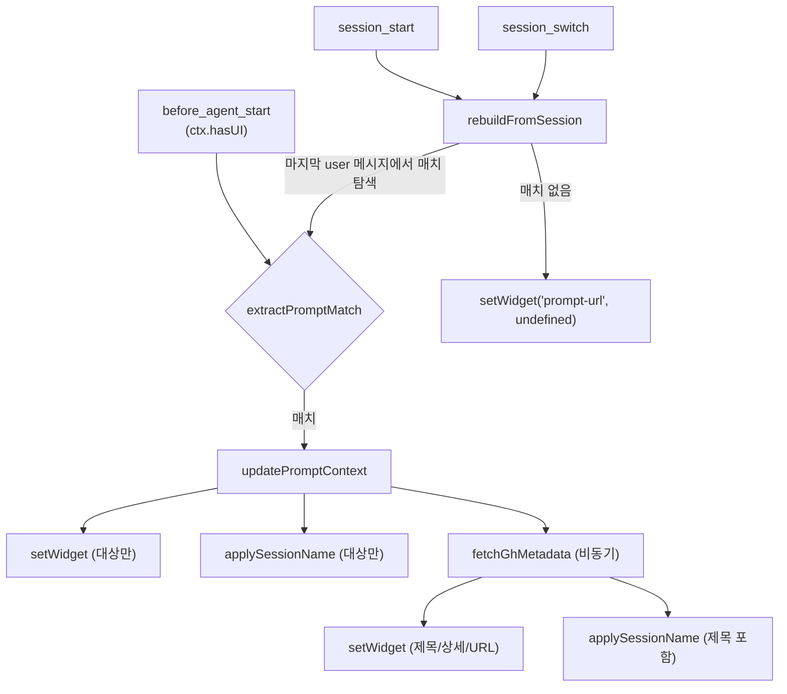
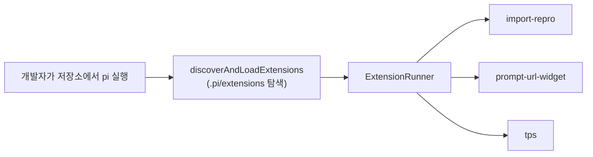

# pi_dev_extensions 모듈

`pi_dev_extensions`는 pi 저장소 자체를 개발·운영하는 메인테이너를 위한 **프로젝트 로컬 확장(extension)** 모음이다. 위치는 `.pi/extensions/`이며, 제품에 배포되는 코드가 아니라 저장소를 `pi`로 열었을 때 자동으로 로드되는 개발 보조 도구다. 모두 `ExtensionAPI`(`@earendil-works/pi-coding-agent`)를 구현하는 기본 export 함수 하나로 구성된다.

| 파일 | 역할 | 사용하는 확장 API |
|---|---|---|
| `.pi/extensions/import-repro.ts` | CI 이슈 분석 세션(gist)을 로컬로 가져와 전환하는 `/ir` 명령 | `registerCommand`, `ctx.ui.confirm/notify`, `ctx.switchSession`, `sendMessage` |
| `.pi/extensions/prompt-url-widget.ts` | PR/Issue/Advisory 프롬프트의 URL·제목을 위젯과 세션 이름으로 표시 | `on("before_agent_start" / "session_start" / "session_switch")`, `ui.setWidget`, `exec`, `setSessionName` |
| `.pi/extensions/tps.ts` | 에이전트 실행 종료 시 tokens/sec 통계 알림 | `on("agent_start" / "agent_end")`, `ui.notify` |

확장 시스템 자체(로더, 러너, 이벤트 타입)는 [extension_system](extension_system.md), 세션 저장 구조는 [session_persistence_and_compaction](session_persistence_and_compaction.md), 에이전트 이벤트 수명주기는 [agent_runtime](agent_runtime.md), 위젯에 쓰이는 `Container`/`Text`는 [tui_core](tui_core.md)·[tui_components](tui_components.md)를 참고한다. 이슈 분석을 생성하는 CI 워크플로(`.github/workflows/issue-analysis.yml`)는 [ci_workflows](ci_workflows.md)에 있다.

## 아키텍처



## import-repro.ts (`/ir`)

CI의 `issue-analysis` 워크플로는 `pi-ci-<32hex>` 같은 고엔트로피 디렉터리에서 실행되고, 세션을 gist로 공유한다. `/ir`은 그 세션을 로컬 체크아웃에서 이어서 작업할 수 있게 변환한다.

### 입력 해석: `parseRef`

| 입력 형태 | 결과 |
|---|---|
| `.html` / `.jsonl` 경로 | `{ type: "file" }` (상대경로는 `cwd` 기준) |
| `https://pi.dev/session/#<id>` | `{ type: "gist" }` |
| `https://gist.github.com/<user>/<id>` | `{ type: "gist" }` |
| `https://github.com/<owner>/<repo>/issues/<n>` | `{ type: "issue" }` |
| 20자 이상 hex | `{ type: "gist" }` |
| 그 외 | 오류 throw |

### 처리 흐름



### 핵심 함수

- **`findIssueGistId(owner, repo, issue)`**: 이슈 코멘트를 100개씩 페이지네이션하며 `user.login === "github-actions[bot]"`인 코멘트의 gist URL(`GIST_URL_IN_TEXT_RE`)을 수집하고 **가장 마지막** ID를 사용한다. 없으면 오류.
- **`fetchGistSession(gistId)`**: `GET /gists/{id}`로 파일 목록을 얻어 `.jsonl`을 우선, 없으면 `.html`을 선택한다. `content`가 잘렸거나(`truncated`) 없으면 `raw_url`로 재요청(`readGistFile`). 두 형식 모두 없으면 오류.
- **`decodeExportedHtml`**: `<script id="session-data">`의 base64 JSON에서 `header`와 `entries`를 복원해 JSONL로 재구성한다.
- **`parseSessionJsonl`**: 첫 줄이 `type: "session"`, `id`, 비어 있지 않은 `cwd`를 가진 헤더인지 검증.
- **`rewriteSessionCwd(raw, sourceCwd, targetCwd)`**: 원본 `cwd`의 JSON 이스케이프 문자열을 대상 `cwd`로 치환한다. Windows 경로(`C:\`, `C:/`, MSYS `/c/`)의 변형을 `getCwdRewriteVariants`로 모두 만들고 긴 것부터 치환한다. 원본이 `pi-ci-<32hex>` 형태이면 `getCiWorkdirName`으로 이름을 추출해, 경로 앞부분이 다른 Windows형 경로도 정규식으로 치환한다.
- **`getPlatformContinuationNotice(sourceCwd)`**: 원본/로컬 플랫폼(`windows`/`unix`)이 다르면 "경로 스타일이 바뀌었다"는 안내 문구를 반환하고, 같거나 알 수 없으면 `undefined`.

### 동작상 주의점

- 대상 파일명은 `<gistId>.jsonl` 고정이라 같은 gist를 다시 가져오면 덮어쓰기 확인을 거친다. 로컬에서 이어 작업한 내용은 덮어쓰면 사라진다.
- 안내 메시지는 `customType: "import-repro"`, `display: true`, `triggerTurn: false`로 전송되어 LLM 턴을 유발하지 않는다.
- 모든 오류는 `ir: <message>`로 `ui.notify(..., "error")` 처리된다.

## prompt-url-widget.ts

이슈/PR/보안 권고 분석용 프롬프트가 시작될 때 대상 URL, 제목, 작성자를 위젯으로 보여 주고 세션 이름을 자동 설정한다.

### 프롬프트 패턴

| kind | 정규식이 찾는 첫 줄 |
|---|---|
| `pr` | `You are given one or more GitHub PR URLs: <target>` |
| `issue` | `Analyze GitHub issue(s): <target>` |
| `advisory` | `Update a GitHub security advisory for publication: <target>` |

`extractPromptMatch`는 이 순서로 검사해 첫 매치를 반환한다.

### 이벤트 흐름



먼저 메타데이터 없이 즉시 위젯을 그린 뒤 `gh` 호출이 끝나면 다시 그리는 2단계 갱신이므로, `gh` 실패나 지연이 UI를 막지 않는다.

### 메타데이터 조회 (`fetchGhMetadata`)

- `pr`/`issue`: `pi.exec("gh", ["pr"|"issue", "view", target, "--json", "title,author"])`. 실패 시 `undefined`.
- `advisory`: `fetchAdvisoryMetadata`가 대상이 URL이면 `parseAdvisoryUrl`로, 아니면 로컬 draft 파일(`resolveDraftPath`, `~` 확장 지원)의 frontmatter `advisory_url:`에서 `AdvisoryRef`를 얻고 `gh api repos/{owner}/{repo}/security-advisories/{ghsa}`를 호출한다. 실패해도 `displayUrl`은 유지한다. 상세 줄은 `formatAdvisoryDetail`이 `GHSA · CVE · severity · state`로 구성한다.

### 세션 이름 (`applySessionName`)

현재 이름이 없거나, 대상 문자열/폴백 이름과 같을 때만 `"<Label>: <title> (<url>)"`로 덮어쓴다. 사용자가 직접 지은 이름은 보존된다.

### 위젯 렌더링

`ctx.ui.setWidget("prompt-url", ...)`에 `Container`를 반환한다: `DynamicBorder` + `Text`(제목 `accent`, 상세 `muted`, URL `dim`, `hyperlink`로 클릭 가능). `ctx.hasUI`가 false(비대화형/RPC)이면 아무 것도 하지 않는다.

## tps.ts

`agent_start`에서 `Date.now()`를 기록하고 `agent_end`에서 경과 시간과 `event.messages` 중 `isAssistantMessage`(role이 `"assistant"`인 `AssistantMessage` 타입 가드)의 `usage`(`input`, `output`, `cacheRead`, `cacheWrite`, `totalTokens`)를 합산한다.

```
TPS = output / 경과초
```

`output <= 0`, 경과 시간 `<= 0`, `hasUI` 없음, 시작 시각 없음이면 출력하지 않는다. 결과는 `ctx.ui.notify(..., "info")` 한 줄(예: `TPS 42.3 tok/s. out ..., in ..., cache r/w .../..., total ..., 12.3s`)이다. 경과 시간에는 도구 실행·대기 시간이 포함되므로 순수 모델 생성 속도가 아니라 **에이전트 실행 전체 기준 처리율**이다. (`usage` 구조는 [ai_provider_apis](ai_provider_apis.md)의 메시지 타입 정의 참고)

## 시스템 내 위치와 확장 방법



- 로드 경로 탐색과 이벤트 디스패치는 [extension_system](extension_system.md)의 `discoverAndLoadExtensions`, `ExtensionRunner`가 담당한다. 이 모듈 파일들은 로직을 내보내지 않고 기본 export 함수만 제공한다.
- 새 개발용 확장을 추가하려면 `.pi/extensions/<name>.ts`에 `export default function (pi: ExtensionAPI)`를 작성한다. 패키지 자산 해석, 인라인 import 금지 등 저장소 규칙은 저장소 루트 `AGENTS.md`를 따른다.
- 테스트 가능한 순수 함수(`parseRef`, `rewriteSessionCwd`, `getPlatformContinuationNotice`, `extractPromptMatch`)와 부수효과(네트워크, 파일 쓰기, `gh`)가 분리되어 있어 단위 테스트가 쉽다. 단, 현재 이 파일들에서 export되는 것은 기본 확장 함수뿐이다(미확인: 별도 테스트 존재 여부).
