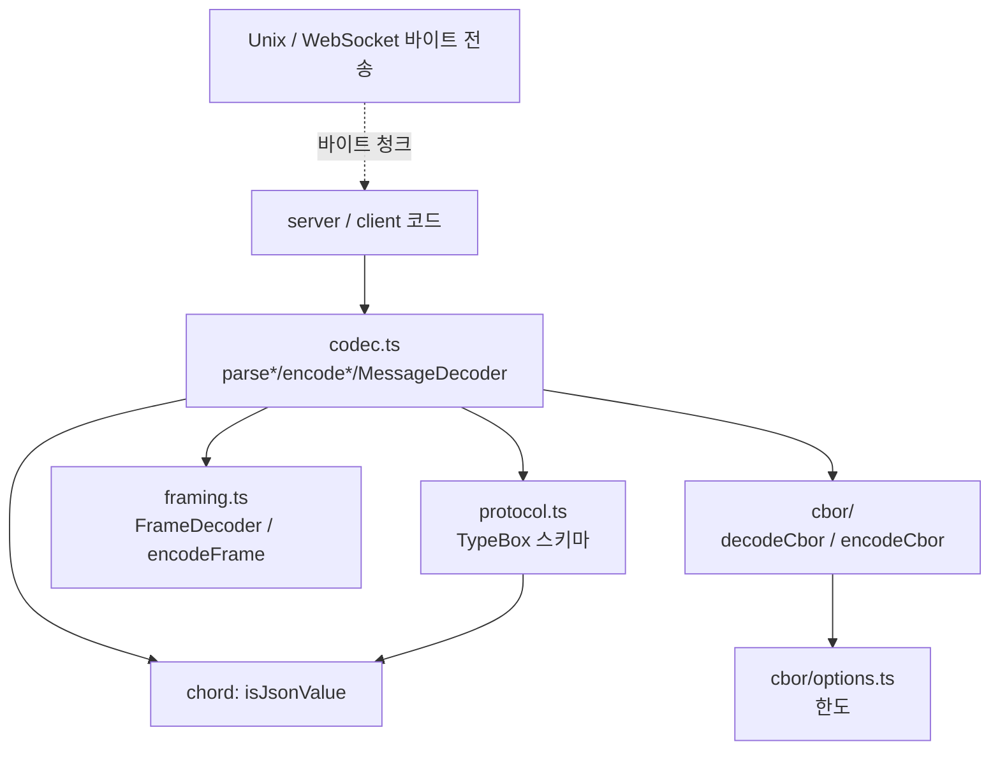
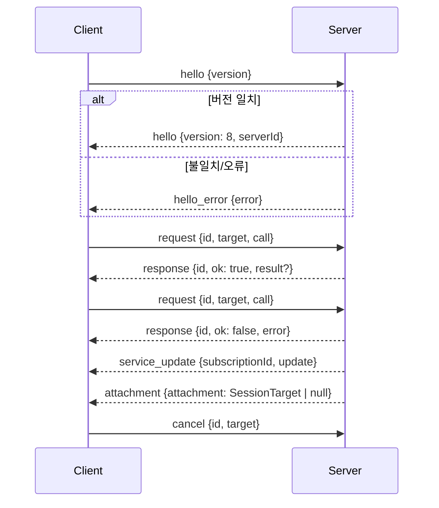
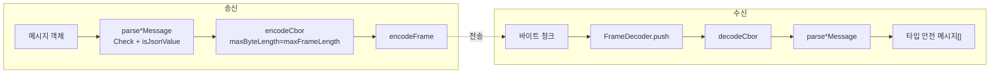

# protocol 모듈 (`@earendil-works/pi-protocol`)

`packages/protocol`은 원격 pi 세션을 위한 **전송 계층 중립(transport-neutral) CBOR 프로토콜**이다. 클라이언트와 서버 사이에 오가는 메시지의 (1) 스키마, (2) 길이 접두 프레이밍, (3) 엄격한 CBOR 인코딩/디코딩, (4) 검증이 포함된 증분 디코더를 제공한다. 소켓·WebSocket 같은 실제 전송은 이 모듈이 알지 못한다. 바이트 스트림만 받는다.

관련 모듈:
- [chord_core](chord_core.md), [chord_delta](chord_delta.md), [chord_services](chord_services.md): `JsonValue`, `isJsonValue`를 제공하고, `call`/`update` 페이로드(opaque JSON)의 의미를 정의한다.
- [server](server.md): `ClientMessageDecoder`로 수신하고 서버 메시지를 인코딩한다 (Unix 소켓 리스너, `SessionRouter`).
- [client](client.md): `ServerMessageDecoder`로 수신하고 클라이언트 메시지를 인코딩한다 (`Connection`, `Client`).
- [experimental_radius_relay](experimental_radius_relay.md): 같은 프로토콜 바이트를 WebSocket 릴레이 위에서 운반한다.

## 1. 구성 요소

| 파일 | 역할 |
|---|---|
| `src/protocol.ts` | `PROTOCOL_VERSION = 8`, TypeBox 스키마(`ClientMessageSchema`, `ServerMessageSchema`), `StrictObject` 헬퍼, `isServerId` |
| `src/framing.ts` | `encodeFrame`, `FrameDecoder` (4바이트 big-endian 길이 접두), `DEFAULT_MAX_FRAME_LENGTH` = 16 MiB |
| `src/cbor/options.ts` | `CborOptions` 한도(바이트 16 MiB, 컨테이너 1,000,000, 깊이 64, 깊이 상한 512), `CborError` |
| `src/cbor/decoder.ts` | `decodeCbor` / `CborReader.decode` — RFC 8949의 엄격한 부분집합 디코더 |
| `src/cbor/encoder.ts`, `src/cbor/index.ts` | `encodeCbor` 및 재노출 (이 문서의 제공 코드에는 미포함; `codec.ts` 사용 방식으로만 확인) |
| `src/codec.ts` | `parseClientMessage`/`parseServerMessage`, `encodeClientMessage`/`encodeServerMessage`, `ClientMessageDecoder`/`ServerMessageDecoder`, `ProtocolValidationError`, `isSupportedProtocolVersion` |

빌드/테스트 산출물: `package.json`(ESM, `exports["."]` → `dist/index.js`, `engines.node >=22.19.0`, 의존성은 `@earendil-works/chord`와 `typebox 1.3.27`), `tsconfig.build.json`(`src` → `dist`), `tsconfig.test.json`(noEmit, NodeNext), `vitest.config.ts`(`source` 조건으로 워크스페이스 소스를 직접 해석). 스크립트: `clean`, `build`(`tsc -p tsconfig.build.json`), `test`(`vitest --run`), `prepublishOnly`.

## 2. 계층 구조



## 3. 메시지 모델 (`protocol.ts`)

모든 객체는 `StrictObject`(`additionalProperties: false`)이므로 알 수 없는 필드는 거부된다.



- **ClientMessage**: `hello`(첫 프레임이어야 함), `request`, `cancel`.
- **ServerMessage**: `hello`(`version`은 리터럴 `PROTOCOL_VERSION`, `serverId`는 UUID v4 패턴), `hello_error`, `response`(`ok`로 판별되는 union), `service_update`, `attachment`.
- **RpcTarget**: `{serverId}`(서버 전체 호출) 또는 `{serverId, sessionId, attachmentId}`(특정 서버·세션·라이브 attachment로 펜싱된 호출).
- `call`, `result`, `update`는 `OpaqueJsonValueSchema`(`Type.Unsafe<JsonValue>(Type.Unknown())`)로, 프로토콜은 내용을 해석하지 않는다. 서비스 의미는 [chord_services](chord_services.md)가 정한다.
- `isSupportedProtocolVersion`은 정수이면서 `PROTOCOL_VERSION`(현재 8)과 정확히 같은 경우만 허용한다.

## 4. 프레이밍 (`framing.ts`)

프레임 = `[uint32 big-endian 길이][CBOR 페이로드]`.

- `encodeFrame(payload)`: 페이로드가 `Uint8Array`인지, 2^32-1 이하인지 확인한 뒤 헤더를 붙인다.
- `FrameDecoder.push(chunk)`: 임의로 쪼개진 청크를 받아 완성된 프레임 배열을 반환한다. 헤더가 청크 경계에 걸쳐도 `headerLength`로 누적한다. 페이로드는 64 KiB 블록 단위로 할당하며 길이가 한도를 넘으면 **선언 길이만으로** 즉시 실패시켜(`fail`) 메모리 선점 공격을 막는다.
- 길이 0 프레임은 빈 `Uint8Array`로 반환된다.
- `end()`: 헤더/페이로드가 중간에 끊겨 있으면 `Truncated frame at end of stream`.
- 상태는 `open → ended | failed`이며 실패/종료 후 호출은 `FrameError`.

## 5. 엄격한 CBOR (`cbor/decoder.ts`)

`decodeCbor(bytes, options?)`는 정확히 하나의 항목만 디코딩하며 뒤에 남는 바이트가 있으면 거부한다.

| 항목 | 처리 |
|---|---|
| major 0/1 정수 | 안전 정수 범위만 허용 |
| major 2 바이트열 | `Uint8Array` 복사본, `maxByteLength` 적용 |
| major 3 텍스트 | fatal UTF-8 디코딩, 오류 시 `CborError` |
| major 4 배열 / 5 맵 | `maxContainerLength`, `maxDepth` 적용. **맵 키는 문자열만**, 중복 키 거부. `Object.defineProperty`로 대입해 `__proto__` 키 오염을 방지 |
| major 6 태그 | 거부 |
| major 7 | `false`/`true`/`null`과 float64(0xfb)만 허용. 비유한 값, 안전하지 않은 정수형 float 거부 |
| 무한 길이, break | 거부 |

핵심 설계는 "신뢰할 수 없는 입력에 대한 방어"다: 총 바이트·컨테이너 길이·깊이 한도와 결정적 서브셋.

## 6. 코덱 (`codec.ts`)



- `parseClientMessage` / `parseServerMessage`: TypeBox `Check`와 `isJsonValue`를 모두 통과해야 하며 아니면 `ProtocolValidationError`.
- `encodeClientMessage` / `encodeServerMessage`: 송신 전에도 검증하므로 잘못된 메시지는 네트워크에 나가지 않는다. 오류 메시지는 `boundedErrorMessage`로 500자로 잘린다.
- `ValidatedMessageDecoder<T>` (내부 공통 구현) 위의 `ClientMessageDecoder`, `ServerMessageDecoder`:
  - `push(chunk)`는 프레임 → CBOR → 스키마 검증을 거쳐 메시지 배열을 반환한다.
  - **한 번 실패하면 `failed`로 고정**되어 이후 `push`/`end`는 모두 오류다. 스트림 동기가 깨진 연결은 복구하지 않고 닫는 것이 전제다.
  - `end()`는 스트림 종료 시 잘린 프레임을 감지한다.

## 7. 사용 예와 에러 처리

```ts
const decoder = new ClientMessageDecoder({ maxFrameLength: 1 << 20 });
socket.on("data", (chunk) => {
  try {
    for (const msg of decoder.push(chunk)) handle(msg);
  } catch (e) {
    // ProtocolValidationError: 연결 종료
    socket.destroy();
  }
});
socket.on("end", () => decoder.end());
```

오류 계층: `FrameError`(프레임), `CborError`(CBOR), `ProtocolValidationError`(스키마·전체 래핑). 디코더는 하위 오류를 `ProtocolValidationError`로 감싸서 호출자는 한 종류만 처리하면 된다.

## 8. 시스템 내 위치

`chord`(서비스/상태 복제 추상) 위에서, 실제 전송 구현(`server`의 Unix 리스너, `client`의 `UnixByteTransport`, 실험적 Radius 릴레이)과 분리된 **와이어 포맷 경계**를 이룬다. 전송 중립이므로 새 전송을 추가해도 이 모듈은 바뀌지 않는다. 이 모듈의 테스트는 `packages/server/src/testing/client.ts`의 `ProtocolTestClient`(조각난 메시지 전송 `sendFragmentedMessage` 등)와도 연계된다.

> 검증 수준: 위 내용은 제공된 `packages/protocol` 소스(`protocol.ts`, `framing.ts`, `codec.ts`, `cbor/decoder.ts`, `cbor/options.ts`)와 `package.json` 코드 확인에 근거한다. `cbor/encoder.ts` 내부 동작과 다른 모듈의 사용 방식은 미확인/추론이다.
