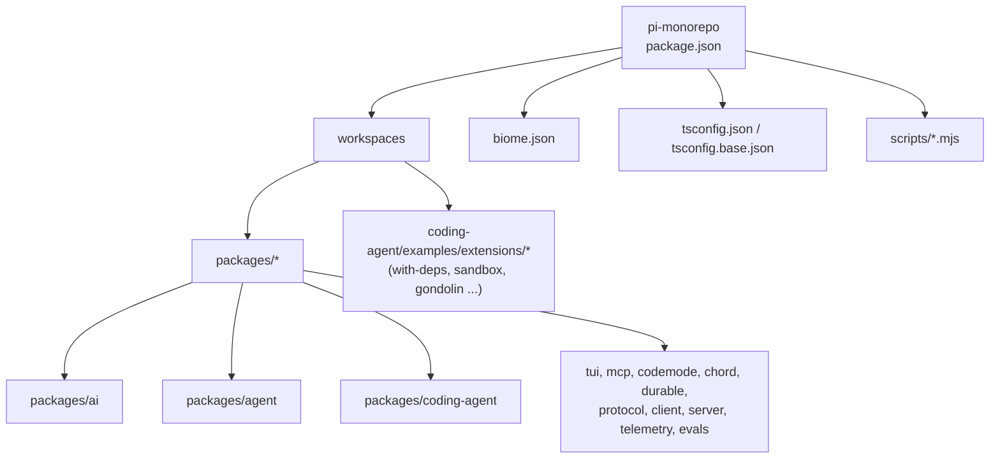
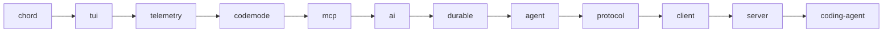
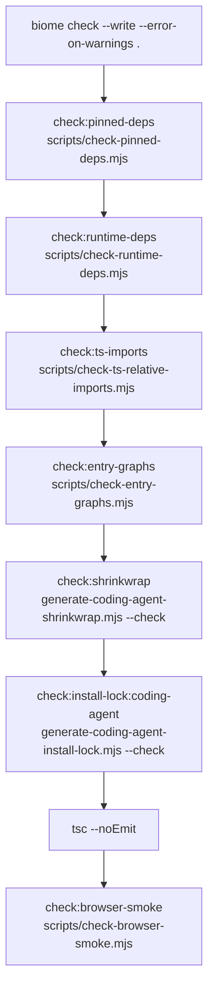
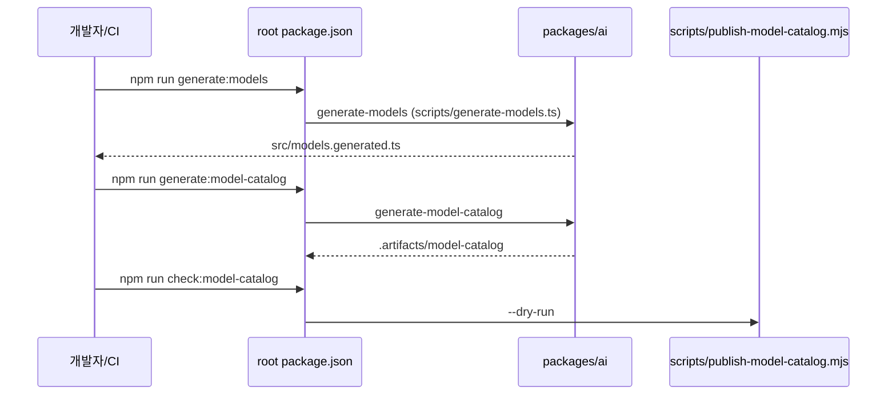
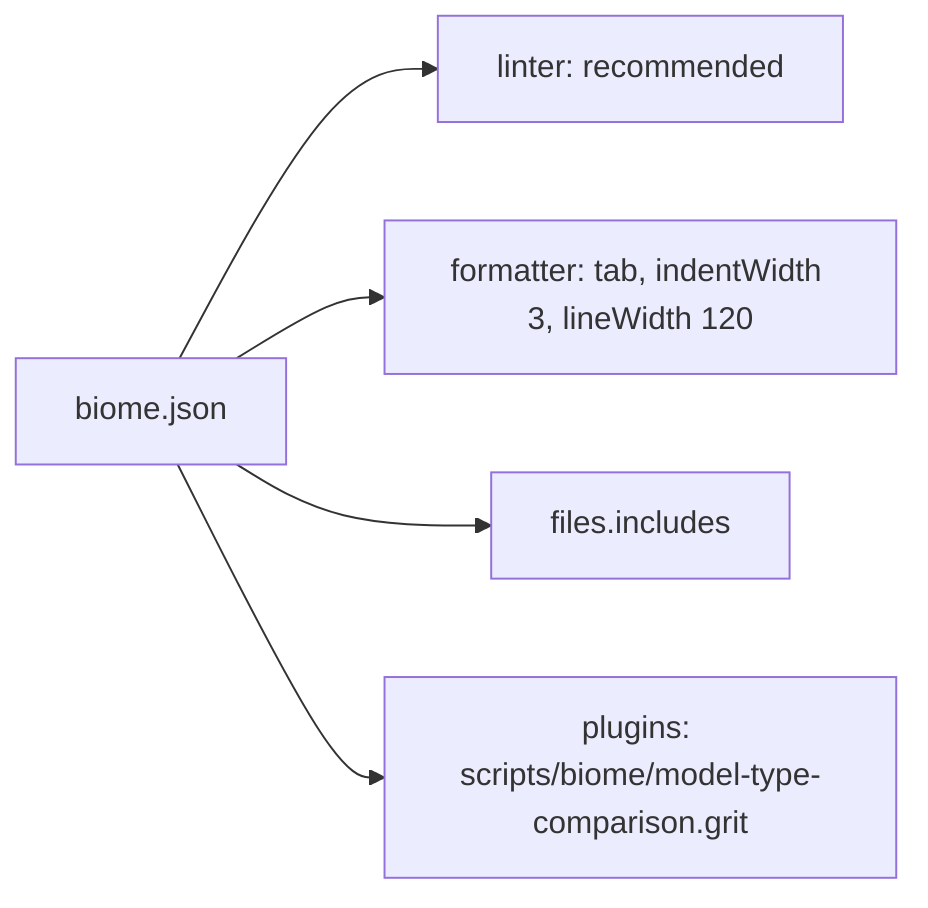
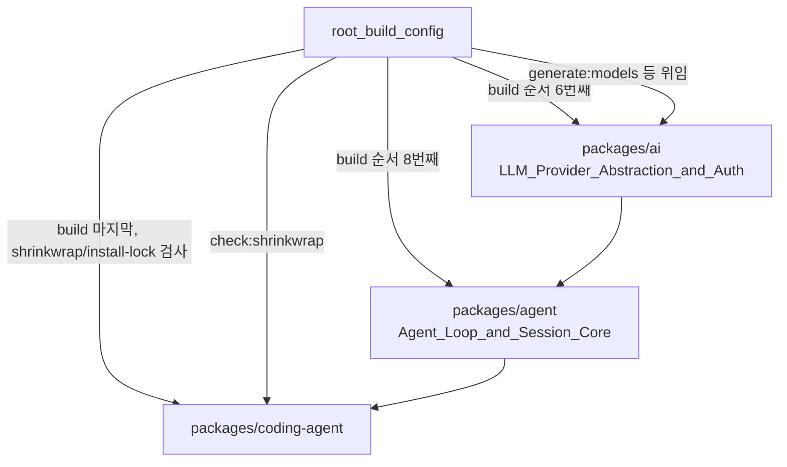

# root_build_config 모듈

`root_build_config`는 `pi-monorepo` 루트의 **빌드·검사·포맷 설정**을 담당하는 모듈이다. 구성 파일은 두 개다.

- `package.json`: npm workspaces 정의, 패키지 빌드 순서, `check`/모델 카탈로그/eval 스크립트 진입점
- `biome.json`: Biome 린터·포매터 규칙과 적용 대상 파일

루트 `tsconfig.json`, `tsconfig.base.json`은 같은 부모 모듈의 [workspace_build_and_scripts](workspace_build_and_scripts.md)에 속하지만, `check` 파이프라인이 `tsc --noEmit`으로 사용하므로 아래에서 함께 설명한다. (검증 수준: 코드 확인)

상위 모듈: [Build,_Release,_CI_and_Quality_Infrastructure](Build,_Release,_CI_and_Quality_Infrastructure.md)
관련 모듈: [ci_workflows](ci_workflows.md), [coding_agent_packaging](coding_agent_packaging.md), [workspace_build_and_scripts](workspace_build_and_scripts.md), [ai_build_and_model_generation](ai_build_and_model_generation.md), [evals](evals.md)

---

## 1. 워크스페이스 구성

`package.json`은 `private: true`, `type: "module"`, `engines.node >= 22.19.0`이다. `workspaces`는 다음과 같다.

- `packages/*` 전체
- `packages/coding-agent/examples/extensions/` 하위 예제 5개: `with-deps`, `custom-provider-anthropic`, `custom-provider-gitlab-duo`, `sandbox`, `gondolin`

devDependencies(모두 exact 버전 고정): `@biomejs/biome 2.3.5`, `typescript 7.0.2`, `esbuild 0.28.2`, `husky 9.1.7`, `shx`, `@types/node`, `@anthropic-ai/sandbox-runtime`. `overrides`로 `protobufjs`를 7.6.6으로 고정한다. 의존성은 정확한 버전으로 핀하는 규칙이며 `check:pinned-deps`가 이를 검사한다.

---

## 2. 빌드 파이프라인

`build` 스크립트는 워크스페이스 병렬 빌드가 아니라 **하드코딩된 순차 체인**이다. 순서가 곧 의존 순서다.

| 스크립트 | 동작 |
|---|---|
| `build` | 위 순서로 각 패키지에서 `npm run build` 실행 |
| `build:offline` | `build`와 동일하나 `ai`만 `build:offline`(네트워크 없이 모델 데이터 사용) |
| `build:native:{darwin,linux,win32}` | `packages/tui`의 네이티브 클립보드 모듈 빌드 위임 ([tui_native_and_build](tui_native_and_build.md)) |
| `clean` | `npm run clean --workspaces` |
| `prepublishOnly` | `clean` → `build` → `check` |

핵심 의존 관계: `ai`([ai_build_and_model_generation](ai_build_and_model_generation.md))는 `mcp`/`codemode` 뒤, `durable`/`agent` 앞에 온다. `coding-agent`가 모든 패키지에 의존하므로 마지막이다. 새 패키지를 추가하면 이 체인에 직접 넣어야 한다. 누락 시 빌드가 조용히 빠지므로 주의. (검증 수준: 코드 확인)

---

## 3. `check` 파이프라인 (품질 게이트)

`npm run check`는 `&&`로 연결된 순차 검사다. 하나라도 실패하면 중단된다.

각 단계의 역할:

- **biome**: `--write`로 자동 수정까지 수행하고 경고도 오류 처리.
- **pinned-deps / runtime-deps**: 직접 의존성의 exact 버전 고정과 런타임 의존성 선언 일치 검사.
- **ts-imports**: 상대 import가 `.ts` 확장자를 쓰는지 검사. `tsconfig.base.json`의 `allowImportingTsExtensions` + `rewriteRelativeImportExtensions`와 맞물린다. 일괄 변환용으로 `scripts/update-source-imports-to-ts.sh`가 있다.
- **entry-graphs**: 패키지 진입점의 import 그래프 검증.
- **shrinkwrap / install-lock**: `packages/coding-agent`의 `npm-shrinkwrap.json`과 `install-lock/package.json`이 생성물과 일치하는지 `--check`. 재생성은 `shrinkwrap:coding-agent`, `install-lock:coding-agent` 스크립트. ([coding_agent_packaging](coding_agent_packaging.md))
- **tsc --noEmit**: 루트 `tsconfig.json`으로 전체 타입 검사.
- **browser-smoke**: 브라우저 호환 번들 스모크 테스트.

`check`에는 테스트가 포함되지 않는다. 테스트는 `npm test`(= `test:scripts` + 각 workspace의 `test`)이며, 저장소 규칙상 e2e를 피하려면 루트 `test.sh`를 쓴다. ([workspace_build_and_scripts](workspace_build_and_scripts.md))

---

## 4. 모델 카탈로그 / 데이터 스크립트

`packages/ai`의 모델 메타데이터 생성 흐름을 루트에서 호출하는 래퍼다. 상세는 [ai_build_and_model_generation](ai_build_and_model_generation.md)과 [ai_models_and_providers](ai_models_and_providers.md) 참조.

| 루트 스크립트 | 실제 실행 |
|---|---|
| `generate:models` | `npm --prefix packages/ai run generate-models` (`models.generated.ts` 생성) |
| `hydrate:model-data` | `packages/ai`의 `hydrate-model-data` |
| `check:model-data` | `packages/ai`의 `check:model-data` |
| `generate:model-catalog` | `packages/ai`의 `generate-model-catalog` |
| `diff:model-catalog` | `scripts/diff-model-catalog.mjs` |
| `check:model-catalog` | `scripts/publish-model-catalog.mjs --input .artifacts/model-catalog --dry-run` |

`models.generated.ts`는 직접 수정하지 않고 생성 스크립트를 수정해야 한다(저장소 규칙). 카탈로그 게시는 `.github/workflows/publish-model-catalog.yml`이 수행한다 ([ci_workflows](ci_workflows.md)).

---

## 5. 릴리스·버전·기타 스크립트

- 버전: `version:patch|minor|major|set`은 workspace 버전을 올리고 `scripts/sync-versions.js` 실행 후 `npm install --package-lock-only --ignore-scripts`로 락파일 갱신.
- 릴리스: `release:patch|minor|major`(`scripts/release.mjs`), `release:local`, `release:fix-links`, `publish`/`publish:dry`(`prepublishOnly` 선행 후 `scripts/publish.mjs`).
- 테스트: `test`, `test:scripts`(`node --test scripts/*.test.mjs scripts/*.test.ts`), `test:mcp-conformance`.
- 프로파일링: `profile:tui`, `profile:rpc`(`scripts/profile-coding-agent-node.mjs --mode tui|rpc`).
- 평가: `eval`은 `@earendil-works/pi-evals` workspace로 위임 ([evals](evals.md)).
- `check:package-install`: `scripts/coding-agent-consumer.mjs`로 패키지 설치 소비자 시나리오 검증.
- `prepare`: `husky`로 git hook 설치 (pre-commit이 락파일 변경을 차단하는 것은 저장소 규칙에 명시됨).

---

## 6. `biome.json`

- **린터**: `recommended` 활성. 완화: `noNonNullAssertion`, `noExplicitAny`, `noControlCharactersInRegex`, `noEmptyInterface`, `useNodejsImportProtocol`은 off. `useConst`는 error.
- **포매터**: 탭 들여쓰기, `indentWidth` 3, `lineWidth` 120, `formatWithErrors: false`.
- **대상 파일**: `scripts/model-catalog-protocol.ts`(+테스트), `packages/*/src/**/*.ts`, `packages/*/test/**/*.ts`, `packages/coding-agent/examples/**`, `packages/agent/examples/**`. 제외: `node_modules`, `test-sessions.ts`, `models.generated.ts`, `*.models.ts`, `packages/mom/data`.
- **플러그인**: GritQL 규칙 `scripts/biome/model-type-comparison.grit`로 모델 타입 비교 패턴을 강제한다. 규칙 내용은 이 문서 작성 시 직접 읽지 않았다 (미확인).

---

## 7. TypeScript 설정과의 관계

`check`의 `tsc --noEmit`이 사용하는 루트 `tsconfig.json`의 핵심(코드 확인):

- `tsconfig.base.json` 확장: `target ES2024`, `strict`, **`erasableSyntaxOnly`**(enum/namespace/parameter property 금지), `verbatimModuleSyntax`, `allowImportingTsExtensions`, `rewriteRelativeImportExtensions`.
- `module`/`moduleResolution`: `NodeNext`, `noEmit: true`.
- `paths`: `@earendil-works/pi-ai`, `pi-agent-core`, `pi-coding-agent`, `pi-tui`, `pi-mcp`, `pi-codemode`, `pi-durable`, `pi-protocol`, `pi-client`, `pi-server`, `pi-telemetry`, `chord` 등을 각 패키지의 `src/`로 직접 매핑. 따라서 타입 검사는 **빌드 없이 소스 기준**으로 수행된다.
- 참고: `pi-agent-old` 경로가 매핑되어 있으나 모듈 트리에는 해당 패키지가 없다 (잔여 설정일 가능성, 추론).
- `include`: `scripts/model-catalog-protocol.ts`, `packages/*/src|test`, coding-agent/agent examples. `exclude`: `dist`, `gondolin` 예제.

패키지 단위 설정은 각각 `tsconfig.build.json`이며 [build_and_test_config](build_and_test_config.md), [ai_build_and_model_generation](ai_build_and_model_generation.md) 등을 참조.

---

## 8. 핵심 패키지와의 연결 (ai / agent / coding-agent)

- `packages/ai`: 모델 카탈로그 생성·검사 스크립트가 루트에서 호출된다. `build:offline`은 `ai`에만 별도 변형이 있다.
- `packages/agent`: `ai` 이후, `protocol` 이전에 빌드된다. 별도 루트 스크립트는 없다.
- `packages/coding-agent`: 마지막 빌드, 그리고 shrinkwrap/install-lock 정합성 검사, 바이너리 빌드(`build:binary`)는 패키지 자체 스크립트 및 `scripts/build-binaries.sh`가 담당한다 ([coding_agent_packaging](coding_agent_packaging.md)).

---

## 9. 유지보수 체크리스트

1. 새 패키지 추가 → `build`/`build:offline` 체인, `tsconfig.json` `paths`, `biome.json` `files.includes`(필요 시) 갱신.
2. 의존성 변경 → exact 핀 유지, 락파일·shrinkwrap·install-lock 재생성 후 `npm run check`.
3. 코드 변경 후에는 `npm run check`를 실행한다. `npm run build`/`npm test`는 요청이 있을 때만 쓴다(저장소 규칙).
4. 루트 스크립트가 참조하는 `scripts/*.mjs` 파일은 이 모듈의 제공 범위 밖이며, 동작 세부는 [workspace_build_and_scripts](workspace_build_and_scripts.md)에서 확인한다 (이 문서에서는 파일 내용을 읽지 않음, 미확인).
