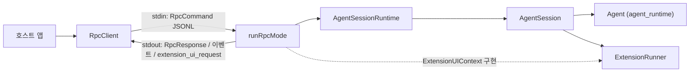
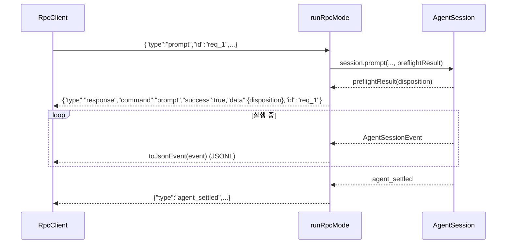
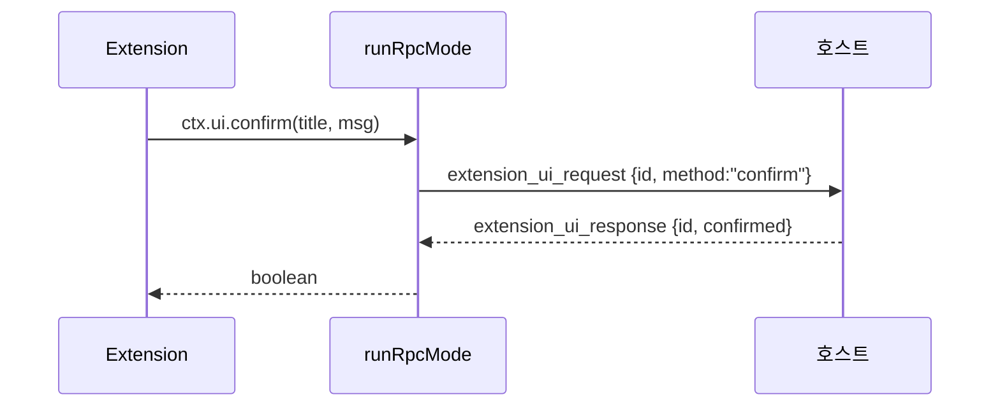
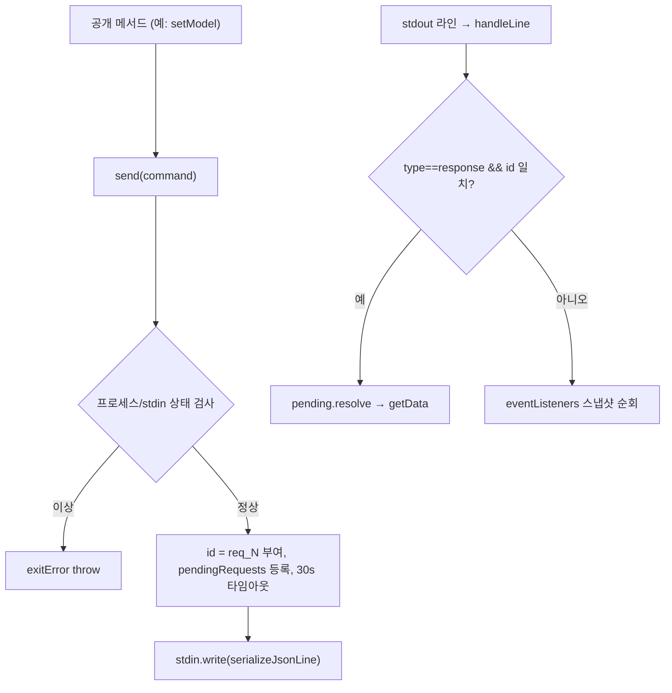

# rpc_mode 모듈

`rpc_mode`는 `packages/coding-agent`의 코딩 에이전트를 **헤드리스(UI 없음)** 로 실행하고, **stdin/stdout JSONL 프로토콜**로 제어하는 모드와 그 TypeScript 클라이언트(`RpcClient`)를 다룬다. 다른 애플리케이션이 에이전트를 자식 프로세스로 띄워 내장(embedding)할 때 사용한다.

> 검증 수준: 아래 내용은 `packages/coding-agent/src/modes/rpc/` 의 `rpc-client.ts`, `rpc-mode.ts`, `rpc-types.ts`, `jsonl.ts`를 직접 읽고 확인했다(코드 확인). 개발자 의도 설명은 `추론`으로 표시한다.

## 1. 구성 파일

| 파일 | 역할 |
|---|---|
| `rpc-mode.ts` | 서버 측. `runRpcMode(runtimeHost)`가 stdin 명령을 처리하고 stdout으로 응답·이벤트를 출력 |
| `rpc-client.ts` | 클라이언트 측. `RpcClient`가 `--mode rpc` 프로세스를 spawn하고 타입 안전 API 제공 (이 모듈의 핵심 컴포넌트) |
| `rpc-types.ts` | `RpcCommand`, `RpcResponse`, `RpcSessionState`, `RpcExtensionUIRequest/Response`, `RpcSlashCommand` 타입 |
| `jsonl.ts` | `serializeJsonLine`, `attachJsonlLineReader` — 엄격한 LF 전용 JSONL 프레이밍 |

## 2. 아키텍처



의존 모듈:
- 세션/런타임: [Agent_Loop_and_Session_Core](Agent_Loop_and_Session_Core.md) (`AgentSession`, `AgentSessionRuntime`, `SessionManager`, compaction)
- 확장 시스템: [Extensibility,_Tools_and_Integrations](Extensibility,_Tools_and_Integrations.md) (`ExtensionUIContext`, `ExtensionRunner`)
- 모델/인증: [Model,_Credential_and_Settings_Management](Model,_Credential_and_Settings_Management.md) (`modelRuntime.getAvailableSnapshot()`)
- 메시지/모델 타입: [LLM_Provider_Abstraction_and_Auth](LLM_Provider_Abstraction_and_Auth.md) (`ImageContent`, `Model`)
- 형제 모드: [User-Facing_Modes_(Interactive_and_RPC)](User-Facing_Modes_(Interactive_and_RPC).md)의 interactive 모드. RPC 모드는 TUI 없이 같은 `AgentSession`을 구동한다.

## 3. 프로토콜

### 3.1 프레이밍 (`jsonl.ts`)
- 레코드 = `JSON.stringify(value) + "\n"`.
- 읽기는 Node `readline`을 **쓰지 않고** `\n`으로만 분리한다. `readline`은 U+2028/U+2029에서도 분리해 JSON 문자열 내부 값을 깨뜨리기 때문이다. 끝의 `\r`은 제거한다.
- `StringDecoder("utf8")`로 멀티바이트 문자가 청크 경계에서 잘리는 문제를 막는다.

### 3.2 메시지 종류

| 방향 | 형태 | 설명 |
|---|---|---|
| stdin | `RpcCommand` (`type`, 선택적 `id`) | 명령 |
| stdin | `extension_ui_response` | 확장 UI 요청에 대한 응답 (`value` / `confirmed` / `cancelled`) |
| stdout | `{type:"response", command, success, data?/error?, id?}` | 명령 응답 (`id`로 상관) |
| stdout | `toJsonEvent(AgentSessionEvent)` | 스트리밍 이벤트 (`agent_settled` 등) |
| stdout | `extension_ui_request` | 확장이 사용자 입력/알림을 요청 |
| stdout | `extension_error` | 확장 오류 |

### 3.3 명령 목록 (`RpcCommand`)

| 분류 | 명령 | `RpcClient` 메서드 |
|---|---|---|
| 프롬프트 | `prompt`, `steer`, `follow_up`, `abort`, `clear_queue`, `new_session` | `prompt`, `steer`, `followUp`, `abort`, `clearQueue`, `newSession` |
| 상태 | `get_state` | `getState` |
| 모델 | `set_model`, `cycle_model`, `get_available_models` | `setModel`, `cycleModel`, `getAvailableModels` |
| Thinking | `set_thinking_level`, `cycle_thinking_level`, `get_available_thinking_levels` | `setThinkingLevel`, `cycleThinkingLevel`, `getAvailableThinkingLevels` |
| 큐 모드 | `set_steering_mode`, `set_follow_up_mode` | `setSteeringMode`, `setFollowUpMode` |
| Compaction | `compact`, `set_auto_compaction` | `compact`, `setAutoCompaction` |
| Retry | `set_auto_retry`, `abort_retry` | `setAutoRetry`, `abortRetry` |
| Bash | `bash`, `abort_bash` | `bash`, `abortBash` |
| 세션 | `get_session_stats`, `export_html`, `switch_session`, `fork`, `clone`, `get_fork_messages`, `get_entries`, `get_tree`, `get_last_assistant_text`, `set_session_name` | 동명 camelCase 메서드 |
| 메시지/명령 | `get_messages`, `get_commands` | `getMessages`, `getCommands` |

## 4. 서버: `runRpcMode`

### 4.1 시작과 종료
1. `takeOverStdout()`으로 stdout을 프로토콜 전용으로 가로챈다(다른 출력이 JSONL을 오염시키지 않도록, `core/output-guard.ts`).
2. `rebindSession()`으로 확장 바인딩(`mode: "rpc"`)과 이벤트 구독을 설정한다.
3. `SIGTERM`(비 Windows는 `SIGHUP`도) 처리: 추적 중인 분리 자식 프로세스를 정리하고 종료 코드 143/129로 `shutdown`.
4. stdin `end` 또는 확장의 `shutdownHandler` 요청(`agent_settled` 이후/명령 처리 후 확인) 시 `runtimeHost.dispose()` 후 `process.exit`.
5. 반환 타입이 `Promise<never>`: 영원히 pending 상태로 프로세스를 유지한다.

### 4.2 `rebindSession`
`new_session`, `switch_session`, `fork`, `clone`이 성공(비취소)하면 `runtimeHost.session`이 교체되므로 다시 호출된다. 이전 `subscribe`를 해제하고 새 세션에 확장·이벤트 구독·backpressure 구독을 붙인다. `runtimeHost.setRebindSession`에도 등록되어 확장 쪽에서 세션이 바뀌는 경우도 대응한다.

### 4.3 명령 처리 흐름



핵심 동작:
- **`prompt`는 응답이 비동기**: `handleCommand`가 `undefined`를 반환하고, preflight 성공 시점(`preflightResult`)에 응답을 출력한다. 큐잉되거나 즉시 처리된 프롬프트도 성공으로 본다. preflight 전에 예외가 나면 error 응답을 낸다. 이후 진행 상황은 이벤트로 전달된다.
- `steer`/`follow_up`은 `source: "rpc"`와 함께 disposition을 반환한다. `PromptDisposition`이 `"handled"`면 실행이 시작되지 않았으므로 `agent_settled`를 기다리면 안 된다(`RpcClient.prompt` 주석).
- `bash`: 먼저 `extensionRunner.emitUserBash`로 확장이 가로챌 수 있고, 결과가 있으면 `recordBashResult`로 기록, 아니면 `executeBash`.
- `set_model`: `getAvailableSnapshot()`에서 `provider/modelId`를 찾지 못하면 `Model not found` 오류.
- `clone`: 현재 leaf에서 `fork(leafId, {position:"at"})`. leaf가 없으면 오류.
- `get_entries`: `since` id 이후 항목만 반환. 없으면 `Entry not found` 오류.
- `set_session_name`: 공백만 있는 이름은 거부.
- `get_commands`: 확장 명령, 프롬프트 템플릿, `skill:<name>`을 `source`로 구분해 반환.
- 알 수 없는 명령/JSON 파싱 실패는 `success:false` 응답(`command:"parse"` 등).

### 4.4 Backpressure
응답 출력 후와 에이전트 이벤트마다 `waitForRawStdoutBackpressure()`를 await한다. `session.agent.subscribe`에 async 리스너를 달아 stdout이 막히면 에이전트 진행을 늦춘다(코드 확인; 의도는 `추론`: 느린 소비자에서 메모리 폭증 방지).

## 5. 확장 UI 브리지

RPC 모드는 `ExtensionUIContext`를 stdout/stdin 메시지로 구현한다.



- **대화형(응답 대기)**: `select`, `confirm`, `input`, `editor`. `crypto.randomUUID()` id를 `pendingExtensionRequests`에 저장. `createDialogPromise`는 `signal` abort/`timeout` 시 기본값(`undefined`/`false`)으로 해결한다. `editor`는 timeout/signal 지원이 없다.
- **fire-and-forget**: `notify`, `setStatus`, `setWidget`(문자열 배열만), `setTitle`, `setEditorText`(`set_editor_text`).
- **미지원(no-op)**: `setWorkingMessage`, `setFooter`, `setHeader`, 커스텀 컴포넌트, `custom()`, `onTerminalInput`, 테마 변경(`setTheme`는 실패 반환), 자동완성 provider. `getEditorText()`는 동기라 항상 `""`.

호스트는 응답하지 않는 요청이 남을 수 있음을 고려해야 한다(대기 요청은 `timeout`이 없으면 계속 pending).

## 6. 클라이언트: `RpcClient`

### 6.1 옵션과 수명주기
`RpcClientOptions`: `cliPath`(기본 `"dist/cli.js"`), `cwd`, `env`, `provider`, `model`, `args`.

- `start()`: `node <cliPath> --mode rpc [--provider] [--model] [...args]`를 `stdio: pipe`로 spawn. stderr는 수집하며 부모 stderr에도 전달. 100ms 대기 후 이미 종료됐다면 예외. 이미 시작됐으면 `Client already started`.
- `stop()`: stdout 리더 해제, `SIGTERM`, 1초 내 종료되지 않으면 `SIGKILL`.
- `exit`/`error`/stdin `error` 발생 시 `exitError`를 기록하고 대기 중 요청을 모두 reject.

### 6.2 요청-응답 상관



- `getData<T>`: `success:false`면 `Error(error)`를 throw, 성공이면 `data`를 `T`로 단언(타입 신뢰는 메서드별 정의에 의존).
- 비 JSON 라인은 무시한다.
- 리스너는 스냅샷으로 순회하므로 디스패치 중 구독 해제해도 다른 리스너가 이벤트를 놓치지 않는다.

### 6.3 이벤트 헬퍼
- `onEvent(listener)` → 구독 해제 함수 반환.
- `waitForIdle(timeout=60000)`: `agent_settled` 이벤트까지 대기.
- `collectEvents(timeout)`: `agent_settled`까지 이벤트 수집.
- `promptAndWait(message, images?, timeout)`: 수집을 먼저 시작한 뒤 `prompt`를 보내 경합을 피한다.
- `getStderr()`: 디버깅용 stderr 누적.

### 6.4 사용 예

```ts
const client = new RpcClient({ cliPath: "dist/cli.js", provider: "anthropic", model: "..." });
await client.start();
client.onEvent((e) => console.log(e.type));
const events = await client.promptAndWait("README 요약해줘");
console.log(await client.getLastAssistantText());
await client.stop();
```

## 7. 유의점 / 한계

- 요청 타임아웃은 30초 고정이다. 긴 작업(`compact`, `bash`)은 응답 대기가 이 시간을 넘으면 reject될 수 있다(코드 확인; 서버 작업은 계속될 수 있음).
- `RpcClient`에는 `getCommands`가 있으나 core component 목록에는 없다. 반대로 `onEvent`/`collectEvents`도 비목록 헬퍼다.
- `RpcClient.bash`는 `excludeFromContext`를 노출하지 않는다(프로토콜은 지원).
- `extension_ui_request`/`extension_ui_response`는 `RpcClient`가 처리하지 않는다. 일반 이벤트로 전달되므로 호스트가 직접 `onEvent`로 받아 stdin으로 응답해야 한다(`RpcClient`에 응답 메서드 없음, 코드 확인).
- 빌드/실행은 `packages/coding-agent/package.json`의 빌드 결과(`dist/cli.js`)에 의존한다(미확인: 정확한 bin 경로는 manifest 미열람).
