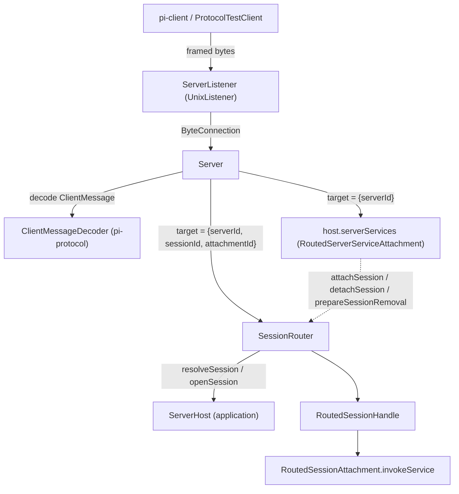
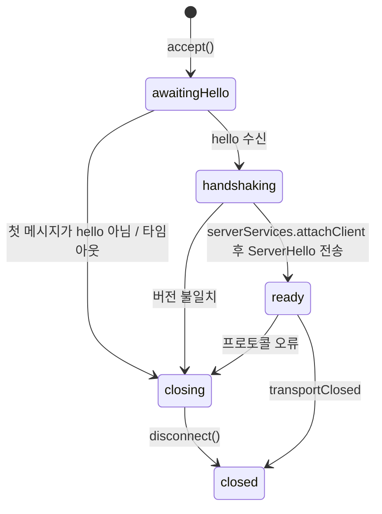
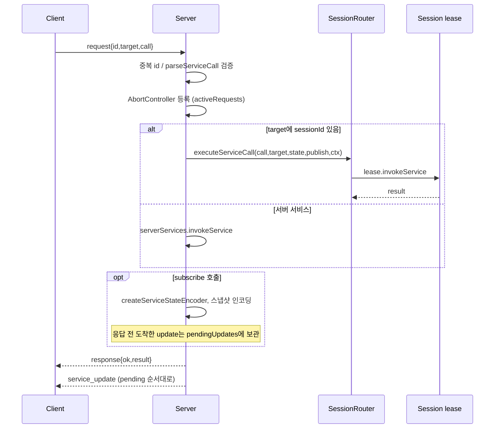
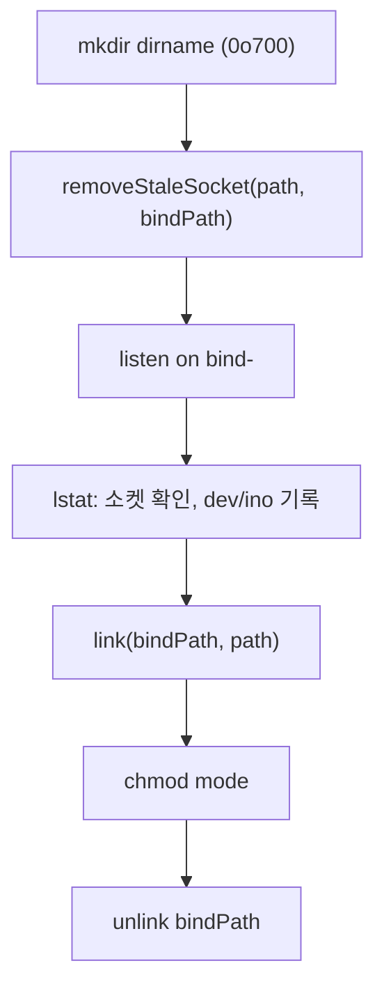

# server 모듈 (`@earendil-works/pi-server`)

`packages/server`는 pi의 **실험적(experimental) 서버 패키지**다. 바이트 스트림 연결(Unix 소켓 등)을 받아 `@earendil-works/pi-protocol` 프레임을 해석하고, 클라이언트의 서비스 호출(RPC)을 서버 범위(server-scoped) 서비스 또는 특정 Session 서비스로 라우팅한다. 서버 자체는 Session의 실체(에이전트 하네스 등)를 모르며, 애플리케이션이 주입하는 `ServerHost` 인터페이스를 통해서만 Session을 해석(resolve)하고 연다(open).

관련 모듈:
- 프로토콜 프레임/메시지: [protocol](protocol.md)
- 서비스 호출/상태 복제 기반: [chord_services](chord_services.md), [chord_core](chord_core.md), [chord_delta](chord_delta.md)
- 클라이언트 측: [client](client.md)
- 실제 호스트 구현(coordinator, session worker, Radius relay): [experimental_server_runtime](experimental_server_runtime.md), [experimental_radius_relay](experimental_radius_relay.md), [experimental_services_and_client](experimental_services_and_client.md)

> 검증 수준: 아래 내용은 제공된 `packages/server` 소스를 직접 읽은 **코드 확인**이다. 타 패키지의 동작은 인터페이스 이름 기준이며 **미확인**.

## 1. 패키지 구성

| 파일 | 역할 |
|---|---|
| `src/server.ts` | `Server` — 연결 수락, 핸드셰이크, 요청 디스패치, 취소, 종료 |
| `src/session-router.ts` | `SessionRouter` — Session 열기/공유, 클라이언트 attachment, 서비스 호출 라우팅 |
| `src/connection.ts` | `ByteConnection`, `ByteConnectionHandler`, `ConnectionState`, `ConnectionStage` |
| `src/types.ts` | `ServerOptions`, `ServerHost`, `RoutedSessionHandle`, `RoutedSessionAttachment`, `RoutedServerPresentation` 등 계약 |
| `src/errors.ts` | `ServerError` 계열 (프로토콜 경계를 넘어도 안전한 오류) |
| `src/transports/unix/listener.ts` | `createUnixListener`, `UnixListener`, `UnixByteConnection` |
| `src/testing/*` | `createTestServer`, `TestServerHost`, `TestHarness`, `ProtocolTestClient` (`./testing` export) |

`package.json` exports: `.`, `./testing`, `./unix`. 의존성은 `@earendil-works/chord`, `@earendil-works/pi-protocol` 둘뿐이며, Node `>=22.19.0`이 필요하다. 스크립트: `build`/`dev`(`tsc -p tsconfig.build.json`, dev는 `--watch`), `test`(`vitest --run`), `typecheck`(`tsc -p tsconfig.test.json`), `clean`, `prepublishOnly`. `vitest.config.ts`는 `source` condition과 워크스페이스 패키지 alias(`pi-ai`, `pi-agent-core`, `pi-telemetry`, `pi-protocol`)를 소스 `.ts`로 연결한다.

## 2. 아키텍처

핵심 설계:
- **Transport 분리**: `Server`는 `ServerListener`(`start(accept)`/`close()`)와 `ByteConnection`만 안다. Unix 소켓 외 전송(예: Radius relay)도 같은 인터페이스로 붙는다.
- **두 종류의 RPC 대상**: `RpcTarget`에 `sessionId`가 없으면 서버 서비스(`pi.session-management`의 `attach`/`detach` 등), 있으면 Session 서비스로 간다.
- **Attachment 모델**: 클라이언트 연결 하나는 동시에 최대 하나의 Session에 attach된다. attach 시 서버가 `attachmentId`(UUID)를 발급하고 `attachment` 메시지로 클라이언트에 알린다. 이후 Session 요청은 이 ID가 일치해야 한다(`SessionNotAttachedError`).

## 3. Server

### 3.1 옵션 (`ServerOptions`, `resolveOptions`)
- `listeners`(배열 필수), `serverId`(소문자 UUIDv4, `isServerId`), `maxFrameLength`(기본 `DEFAULT_MAX_FRAME_LENGTH`, 1..2^32-1), `handshakeTimeoutMs`(기본 5000ms), `onConnectionCountChanged`, `onError`.
- 잘못된 값은 `TypeError`.

### 3.2 연결 상태 머신

- `accept()`: `closing`이면 즉시 연결을 닫는다. 아니면 `ConnectionState`를 만들고 핸드셰이크 타이머(`unref`)를 건다.
- `failProtocol()`: `hello_error` 프레임을 마지막 chunk로 보내며 연결을 닫는다.
- 핸드셰이크 중 도착한 요청은 `state.handshake` 완료 후 처리된다(큐잉 효과).

### 3.3 요청 처리 흐름 (`handleRequest`)

세부 규칙:
- `target.serverId`가 다르면 `WrongServerError`.
- 구독(`subscribe`) 응답 이전의 update는 버퍼링했다가 응답 직후 순서대로 전송한다. 중복 `subscriptionId`는 오류.
- 응답 전송 후 오류가 나면(예: pending update 전송 실패) 오류를 보고하고 연결을 끊는다.
- `cancel` 메시지는 같은 `id`와 `sameTarget`인 활성 요청의 `AbortController`를 abort한다. abort된 요청은 `cancelled` 코드로 응답한다.
- 오류 변환(`toProtocolError`): `ServerError`/`RemoteServiceError`는 code/message 그대로, `ProtocolValidationError`는 `invalid_request`, 그 외는 상세를 숨기고 `internal_error`/`"Internal server error"`로 보낸다(원본은 `onError`로만 보고).

### 3.4 시작/종료
- `start()`: 리스너를 순차 시작. 하나라도 실패하면 이미 시작한 리스너를 닫고 서버 상태를 정리한 뒤, 정리 오류가 있으면 `AggregateError`로 던진다. 중복 start/closing 상태 start는 거절.
- `close()`: 멱등(`closePromise`). 리스너 닫기 → 모든 연결 닫기 → `SessionRouter.close`. `closed` Promise는 종료 후 resolve, 정리 실패 시 reject.
- `disconnect()`: 활성 요청 abort("Client disconnected"), 인코더 정리, `sessions.disconnect`와 `serverServices.release`를 병행 수행하며 실패는 `reportError`.

## 4. SessionRouter

상태:
- `hostedSessions`(sessionId → `HostedSession`), `openingSessions`(동시 open 중복 제거), `attachmentsByClient`, `disconnectedClients`, `clientOperations`(클라이언트별 직렬화 큐).

주요 동작:
- **클라이언트별 직렬화** (`runForClient`): 같은 클라이언트의 attach/detach/서비스 시작은 Promise 체인으로 순서 보장. 앞선 작업이 실패해도 다음은 실행된다.
- **attach** (`attachClientNow`): `acquire`(캐시된 Session 재사용 또는 `resolveSession`→`openSession`) → 기존 attachment 해제 → `handle.attachClient`로 lease 획득 → closing/disconnect 재확인 → `attachment` 메시지 발행(`publishAttachment`). 이미 같은 Session이면 no-op.
- **서비스 호출** (`startServiceCall`): `requireAttachment`가 `sessionId`+`attachmentId`를 검증하고 `lease.invokeService`를 호출한다. 진행 중 작업은 `attachment.operations`에 추적되어 해제 전에 모두 settle될 때까지 기다린다.
- **해제** (`releaseAttachment`): 멱등. 진행 작업 대기 → `lease.release` → `clearAttachment`(필요 시 `attachment: null` 발행). `disconnect`는 발행 없이 해제한다.
- **Session 제거** (`removeSession`): 해당 Session의 모든 attachment 해제 후 `handle.close`. 애플리케이션이 durable 메타데이터를 지우기 전 호출한다(`prepareSessionRemoval`).
- **비정상 종료 감지**: `handle.terminated`가 resolve되면 `invalidate`로 Session을 캐시에서 제거하고 attachment를 백그라운드 컨텍스트로 해제한다.
- **draining**: closing 중 attach/서비스 호출은 `ServerDrainingError`. open 도중 서버가 closing으로 바뀌면 방금 연 handle을 닫는다(닫기 실패 시 `SessionCleanupError`).
- `close()`: 진행 중 작업·open을 기다린 뒤 모든 attachment 해제, 모든 handle 닫기. 오류는 `AggregateError`로 모은다.

## 5. 오류 (`errors.ts`)

`ServerError(code, message)` 하위: `WrongServerError`(`wrong_server`), `SessionNotFoundError`(`session_not_found`), `SessionAmbiguousError`(`session_ambiguous`), `SessionNotAttachedError`(`session_not_attached`), `ServerDrainingError`(`server_draining`). `RemoteServiceErrorCode`([chord_services](chord_services.md))와 합쳐 프로토콜 오류 코드로 노출된다. `SessionAmbiguousError`는 호스트가 `resolveSession`에서 ID가 여러 Session과 일치할 때 던지는 용도(서버 내부에서는 던지지 않음).

## 6. Unix 전송 (`transports/unix/listener.ts`)

`createUnixListener(options)` → `ServerListener`. 옵션: `path`, `mode`(기본 `0o600`), `maxFrameLength`, `maxPendingBytes`(기본 `maxFrameLength*4`), `gracefulCloseTimeoutMs`(기본 5000), `onError`.

시작 절차(경쟁/탈취 방지):

- 오래된 소켓 제거: 소켓이 아니면 거부, 접속 가능(live)하면 "already running" 오류, 아니면 `stale-xxxxxx`로 rename 후 신원 확인하고 삭제.
- 종료 시에는 기록한 `dev/ino`가 일치하는 경우에만 경로를 지운다(다른 프로세스가 교체한 소켓 보호).

`UnixByteConnection`: 쓰기를 `writeTail` Promise 체인으로 직렬화하고, 대기 바이트가 `maxPendingBytes`를 넘으면 reject(backpressure 한계). `close(finalChunk)`는 쓰기 큐를 비운 뒤 `socket.end`, 타임아웃 시 `destroy`.

## 7. 테스트 유틸 (`@earendil-works/pi-server/testing`)

- `createTestServer`: 기본 `serverId` `00000000-0000-4000-8000-000000000001`, 기본 호스트 `TestServerHost`로 미시작 `Server` 생성.
- `TestServerHost`: `seed`로 Session 등록, `openSession`/`gateNextOpenSession`으로 open 지연·실패 주입, `latestHarness`로 마지막 하네스 조회.
- `TestHarness`: `RoutedSessionHandle` 구현. `gateNextServiceCall`/`gateNextClose`로 경쟁 상태 재현, `failClose`/`failAttachmentRelease`/`nextServiceError`로 오류 주입, `terminate`로 비정상 종료 시뮬레이션. `createTestServerServices`는 `pi.session-management`의 `attach`/`detach`만 구현.
- `ProtocolTestClient`/`connectUnixTestClient`: 실제 Unix 소켓에 붙어 `hello`, `attach`, `requestSessionService`, `sendBytes`, `sendFragmentedMessage`(분할 전송 검증), `waitForClose`를 제공.

## 8. 시스템 내 위치

`ServerHost` 구현체는 `packages/coding-agent/src/experimental/`의 coordinator/session worker가 제공한다([experimental_server_runtime](experimental_server_runtime.md)). 클라이언트는 [client](client.md)의 `Client`/`Connection`이며, 서비스 계약과 상태 복제는 [chord_services](chord_services.md)가 정의한다. (연결 관계는 모듈 트리 기준이며 호스트 쪽 세부는 **미확인**.)
