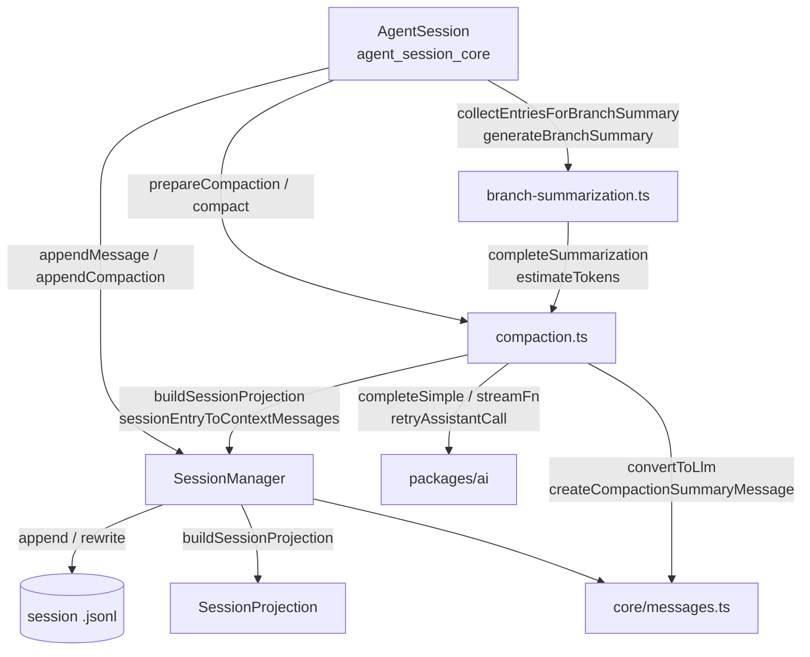
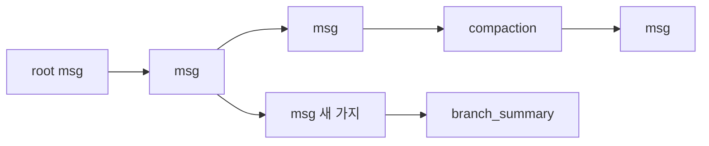
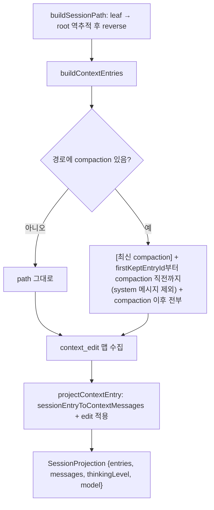
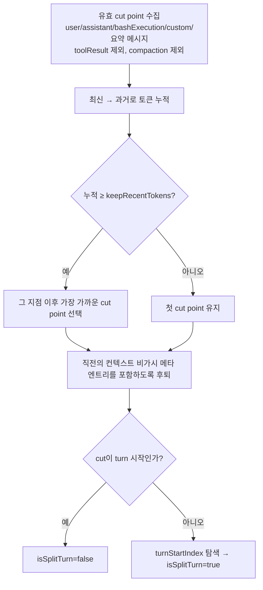
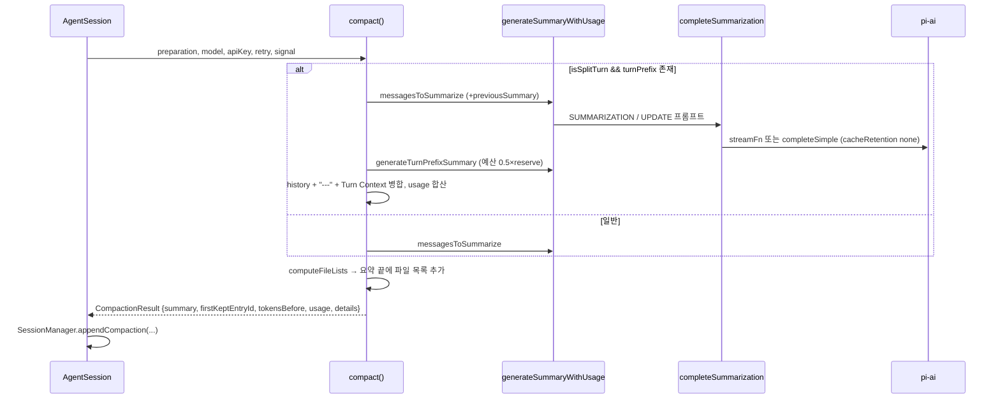
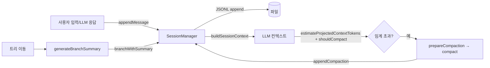

# session_persistence_and_compaction

`packages/coding-agent/src/core/` 아래의 세션 저장(`session-manager.ts`)과 컨텍스트 압축(`compaction/compaction.ts`, `compaction/branch-summarization.ts`)을 다루는 모듈이다. 대화를 **append-only 트리(JSONL)** 로 디스크에 보관하고, 컨텍스트 윈도우가 차면 오래된 부분을 **LLM 요약(compaction)** 으로 대체하며, 트리 이동 시 떠나는 가지를 **branch summary** 로 남긴다.

> 검증 수준: 아래 내용은 제공된 소스 코드(`session-manager.ts`, `compaction.ts`, `branch-summarization.ts`)를 직접 읽고 작성했다(코드 확인). 호출 측(`AgentSession` 등)의 동작은 상위 모듈 문서를 참조하며 여기서는 추론으로 표시한다.

## 1. 모듈 개요

| 파일 | 역할 |
|---|---|
| `core/session-manager.ts` | JSONL 파일 I/O, 엔트리 트리, leaf 포인터, 마이그레이션, 세션 목록/탐색, context projection |
| `core/compaction/compaction.ts` | 토큰 추정, cut point 탐색, 요약 프롬프트 및 LLM 호출, `prepareCompaction` / `compact` |
| `core/compaction/branch-summarization.ts` | 트리 이동 시 버려지는 가지의 엔트리 수집 및 요약 |

설계 원칙: `compaction.ts`의 함수는 대부분 순수 함수이고, 파일 I/O는 `SessionManager`가 담당한다(코드 주석: "The session manager handles I/O").

## 2. 아키텍처

- `SessionManager` ← `AgentSession`: 상위 계층은 [agent_session_core](agent_session_core.md) 참조.
- LLM 호출은 `packages/ai`의 `completeSimple`, `retryAssistantCall`, `normalizeContext`를 사용한다([LLM_Provider_Abstraction_and_Auth](LLM_Provider_Abstraction_and_Auth.md)).
- 에이전트 메시지 타입 `AgentMessage`는 `packages/agent` ([agent_runtime](agent_runtime.md)).
- 모델/키 해석(`apiKey`, `headers`, `env`)은 호출자가 주입한다 ([Model,_Credential_and_Settings_Management](Model,_Credential_and_Settings_Management.md)).

## 3. 세션 파일 형식 (`session-manager.ts`)

### 3.1 JSONL 구조

첫 줄은 `SessionHeader`(`type: "session"`, `version`, `id`, `timestamp`, `cwd`, `parentSession?`), 이후 줄은 `SessionEntry`이다. 모든 엔트리는 `SessionEntryBase`(`type`, `id`, `parentId`, `timestamp`)를 상속해 트리를 구성한다. `CURRENT_SESSION_VERSION = 3`.

| 엔트리 `type` | LLM 컨텍스트 참여 | 설명 |
|---|---|---|
| `message` | 예 | `AgentMessage` (user/assistant/toolResult/system/bashExecution/custom) |
| `thinking_level_change` | 설정만 | 이후 thinking level |
| `model_change` | 설정만 | provider / modelId |
| `usage` | 아니오 | 모델 귀속 사용량(`kind`, 예: `cache_warm`) |
| `compaction` | 예 | `summary`, `firstKeptEntryId`, `tokensBefore`, `details`, `usage`, `fromHook`, `systemMessage` |
| `branch_summary` | 예 | `fromId`, `summary`, `details` |
| `custom` | 아니오 | 확장 상태 저장용 (`customType`, `data`) |
| `custom_message` | 예 | 확장이 컨텍스트에 주입하는 메시지 (`display`로 TUI 표시 제어) |
| `context_edit` | 보정 | 이전 엔트리 내용을 교체(`replacement.content`) 또는 생략(`null`) |
| `label` | 아니오 | 사용자 북마크 |
| `session_info` | 아니오 | 표시 이름 |

### 3.2 트리와 leaf

- 추가는 항상 현재 `leafId`의 자식으로 생성되며(`_appendEntry`), 과거 엔트리는 수정·삭제하지 않는다.
- `branch(id)`는 leaf만 옮긴다. `resetLeaf()`는 leaf를 `null`로 해 새 root를 만든다.
- `branchWithSummary()`는 leaf를 옮기고 `branch_summary` 엔트리를 붙인다. `fromId`는 이동 전 leaf(없으면 `"root"`).
- `getTree()`는 방어적 복사로 `SessionTreeNode[]`를 만들고, 자식은 timestamp 오름차순 정렬(스택 기반 반복으로 깊은 트리의 스택 오버플로 방지). 부모를 찾지 못한 orphan은 root로 취급한다.
- `getChildren`, `getLeafEntry`, `getLabel`, `getBranch(fromId?)` 등 읽기 API는 `ReadonlySessionManager`(Pick 타입)로 외부에 노출된다.
- 라벨은 실제 트리 엔트리이므로 `createBranchedSession`은 경로에서 label을 제거하고 `parentId`를 다시 이어 붙인 뒤 해석된 라벨을 재생성한다. 이때 `compaction.firstKeptEntryId`가 제거된 label을 가리키면 대체 ID로 치환한다.

### 3.3 영속화 규칙

- 세션 파일은 **대화(user/assistant 메시지)가 생기기 전까지 생성되지 않는다**(`_hasConversation`). 설정 엔트리만 있으면 메모리에만 유지.
- 첫 flush는 `openSync(..., "wx")`로 전체 기록, 이후는 `appendFileSync`로 한 줄씩 추가.
- 파일명: `<ISO timestamp, :와 . 를 - 로 치환>_<sessionId>.jsonl`. 기본 디렉터리: `<agentDir>/sessions/--<cwd 인코딩>--/`.
- `loadEntriesFromFile`: 1MiB 청크로 읽고 `StringDecoder`로 UTF-8 경계를 처리, 깨진 줄은 건너뜀. 첫 엔트리가 유효한 session header가 아니면 `[]`을 반환(파일을 수정하지 않음). 마지막 줄에 개행이 없으면 개행을 보충.
- 헤더 탐색(`readSessionHeader`)은 최대 1MiB까지만 동기 스캔하고, 초과하면 `SessionHeaderScanLimitError`. `SessionManager.open`은 이 경우 전체 로드로 폴백한다.
- `_setSessionFile`: 빈 파일은 새 헤더로 초기화, 내용은 있으나 pi 세션이 아니면 예외(파일 보존).

### 3.4 마이그레이션

`migrateToCurrentVersion`이 in-place로 수행하고, 변경 시 `_rewriteFile()`로 파일을 다시 쓴다.

- v1 → v2: `id`/`parentId` 부여(선형 체인), `firstKeptEntryIndex` → `firstKeptEntryId`.
- v2 → v3: `hookMessage` role → `custom`.

`migrateSessionEntries`는 테스트용 export이다.

### 3.5 세션 생성/탐색 팩토리

| 메서드 | 동작 |
|---|---|
| `create(cwd, sessionDir?, options?)` | 새 세션 |
| `open(path, sessionDir?, cwdOverride?)` | 파일 열기, cwd는 헤더에서 복원 |
| `continueRecent(cwd, sessionDir?)` | mtime 최신 세션 이어서 사용, 없으면 새로 생성 |
| `inMemory(cwd, options?, entries?)` | 영속화 없음 |
| `forkFrom(sourcePath, targetCwd, ...)` | 다른 프로젝트로 전체 이력 복제, `parentSession` 기록 |
| `findById(cwd, id, sessionDir?)` | 헤더만 읽어 ID 정확 일치 탐색 |
| `list` / `listAll` | `SessionInfo` 목록, 진행 콜백과 `AbortSignal` 지원 |

목록 생성은 동시성 제한(`MAX_CONCURRENT_SESSION_INFO_LOADS = 10`, 탐색은 64)과 주기적 부분 결과 발행(현재 디렉터리 10개마다, 전체 100개마다)을 사용한다. `session_info`의 최신 이름(빈 문자열은 해제)과 마지막 활동 시간으로 `modified`를 계산한다. 세션 ID는 `uuidv7`, 엔트리 ID는 충돌 검사하는 8자리 hex이다(100회 실패 시 전체 UUID).

## 4. Context Projection

`buildSessionProjection(entries, leafId?, byId?)`가 모델 컨텍스트의 단일 진실 공급원이다.

핵심 규칙:

- `sessionEntryToContextMessages`: `message`는 그대로(단, `content == null`인 손상 데이터는 `""`/`[]`로 보정), `custom_message`/`branch_summary`/`compaction`은 각각 대응 메시지로 변환. `compaction`은 `systemMessage`가 있으면 `[systemMessage, summary]`를 낸다. 그 외(label, usage 등)는 빈 배열.
- 최신 compaction만 index 0에서 요약을 기여한다. 유지 범위 안에 남은 이전 compaction은 `messages: []`.
- `context_edit`는 `replacement === null`이면 해당 엔트리를 컨텍스트에서 제외, 값이 있으면 content만 교체. assistant/toolResult에 문자열이 오면 text block 배열로 정규화한다. 편집 대상은 활성 가지의 user/assistant/toolResult/custom_message 엔트리여야 한다(`appendContextEdit` 검증).
- `thinkingLevel`/`model`은 경로를 순회하며 마지막 `thinking_level_change`, `model_change`, assistant 메시지의 provider/model로 결정한다.
- `appendCompaction`은 시점의 현재 system message(`getCurrentSystemMessage`)를 `systemMessage`로 스냅숏해 경계마다 프롬프트·도구 상태를 재현 가능하게 한다. `firstKeptEntryId`가 `null`이면 자기 자신의 ID를 쓴다.

## 5. Compaction (`compaction.ts`)

### 5.1 설정과 트리거

`CompactionSettings`: `enabled`, `reserveTokens`(기본 16384), `keepRecentTokens`(기본 20000).
`shouldCompact(contextTokens, contextWindow, settings)` = `enabled && contextTokens > contextWindow - reserveTokens`.

### 5.2 토큰 추정

- `estimateTokens`: chars/4 휴리스틱(보수적), 이미지는 4800자로 가정, thinking/toolCall 인자·system `sections`/`toolsAdded` 포함.
- `calculateContextTokens`: `usage.totalTokens` 우선, 없으면 input+output+cacheRead+cacheWrite.
- `estimateContextTokens`: 마지막 유효 assistant usage(aborted/error/0 토큰 제외) + 이후 메시지 추정치.
- `estimateProjectedContextTokens`: usage가 이후의 `context_edit` 또는 `compaction`으로 무효화됐다면 usage를 신뢰하지 않고 전체를 추정치로 재계산한다.

### 5.3 Cut point 탐색

- `findCutPoint`(raw 엔트리 기준)와 `findProjectedCutPoint`(projection 기준, 실제 `prepareCompaction`이 사용)가 있다.
- 턴 시작: user, bashExecution, custom, branchSummary, compactionSummary. assistant/toolResult는 턴 시작이 아니다.
- toolResult에서는 절대 자르지 않는다. 도구 호출을 가진 assistant에서 자르면 뒤따르는 결과는 유지된다.
- projected 버전은 "생략된 assistant 시도(복구 시도) + 그 omission edit"으로 끝나는 닫힌 suffix에서만 cut을 한 칸 앞으로 이동한다. 임의 메타데이터가 전송되지 않은 입력 너머로 cut을 밀지 못하게 하는 방어이다.

### 5.4 준비와 실행

`prepareCompaction(pathEntries, settings)`:
1. 마지막 엔트리가 이미 `compaction`이면 `undefined`.
2. projection 생성, 이전 compaction이 있으면 `previousSummary`와 `boundaryStart` 설정.
3. `findProjectedCutPoint`로 `firstKeptEntryId`, 요약 대상(`messagesToSummarize`)과 split turn의 `turnPrefixMessages` 분리. system 메시지는 요약에서 제외(compaction 엔트리의 `systemMessage`가 재생).
4. 이전 compaction `details`(pi 생성분, `fromHook` 아님) + 메시지의 tool call에서 `FileOperations` 수집.
5. 요약할 내용이 없으면 `undefined`.

`compact(preparation, model, apiKey, ...)`:

- 요약 `maxTokens` = `min(0.8 × reserveTokens, model.maxTokens)`; turn prefix는 0.5배.
- 대화는 `convertToLlm` 후 `serializeConversation`으로 **텍스트화**해 `<conversation>` 태그로 감싼다(모델이 대화를 이어가려 하지 않도록). `previousSummary`가 있으면 `<previous-summary>`와 UPDATE 프롬프트로 병합한다.
- 형식 요약 섹션: Goal / Constraints & Preferences / Progress(Done, In Progress, Blocked) / Key Decisions / Next Steps / Critical Context.
- `completeSummarization`은 모든 요약 호출의 단일 관문이다: `cacheRetention: "none"`, `sessionId`가 없으면 `uuidv7()`, `retryAssistantCall`로 일시적 스트림 끊김 재시도. `streamFn`이 있으면 세션과 동일한 요청 동작(타임아웃, 헤더)을 유지한다.
- `getSummarizationFailure`: `stopReason`이 `error` 또는 `length`이면 실패 처리 — 잘린 요약이 체크포인트로 저장되지 않도록 한다. tool call을 시도한 응답도 예외.
- `reasoning`은 모델이 지원하고 `thinkingLevel !== "off"`일 때만 전달.

`CompactionDetails { readFiles, modifiedFiles }`는 `CompactionEntry.details`에 저장되어 다음 compaction에서 누적된다. 확장 생성 compaction(`fromHook`)의 details는 누적하지 않는다.

## 6. Branch Summarization (`branch-summarization.ts`)

트리 탐색(`/tree` 등)으로 다른 지점에 이동할 때 떠나는 가지의 맥락을 보존한다.

1. `collectEntriesForBranchSummary(session, oldLeafId, targetId)`: 두 경로의 가장 깊은 공통 조상을 찾고, 옛 leaf에서 공통 조상 직전까지 엔트리를 수집(시간순). compaction 경계에서 멈추지 않는다.
2. `prepareBranchEntries(entries, tokenBudget)`: 먼저 모든 `branch_summary`(pi 생성)의 `details`에서 파일 작업 누적 → 최신에서 과거로 메시지를 담되 예산 초과 시 중단. 요약 엔트리는 예산의 90% 미만이면 예외적으로 포함. toolResult 메시지는 건너뛴다(assistant tool call에 맥락이 있음).
3. `generateBranchSummary(entries, options)`: 예산 = `contextWindow(기본 128000) - reserveTokens(16384)`, `maxTokens` ≤ 4096. 결과는 `BranchSummaryResult`(`summary` / `aborted` / `error` 중 하나 + `usage`, `readFiles`, `modifiedFiles`). 요약에 preamble("The user explored a different conversation branch…")을 붙이고 파일 목록을 덧붙인다. `completeSummarization`을 compaction과 공유한다.

`BranchSummaryDetails { readFiles, modifiedFiles }`는 `BranchSummaryEntry.details`에 저장된다.

## 7. 데이터 흐름 요약

## 8. 설계 포인트 및 주의사항

- **불변 이력 + 투영**: 압축·편집·요약 모두 새 엔트리를 append하고, 의미는 `buildSessionProjection`에서 해석한다. 이력 원본은 보존되고 가지 이동이 안전하다.
- **실패 시 데이터 보호**: 비정상 파일은 덮어쓰지 않고 예외, 길이 초과 요약은 저장하지 않으며, 요약 중 도구 호출 시도는 거부한다.
- **토큰 추정은 근사**: chars/4 휴리스틱과 마지막 usage 혼합이라 provider 실제 토큰과 차이가 있을 수 있다.
- `getMessagesFromProjectedEntryForCompaction`, `isCutPointMessage`, `isTurnStartMessage`는 `compaction.ts` 내부 함수이다(모듈 export 목록상 핵심 컴포넌트이나 소스에서 `export` 키워드 없음, 코드 확인).
- 호출 측에서 compaction 시점·자동 재시도·UI 연동은 [agent_session_core](agent_session_core.md)에서 다루며, 본 문서에서는 추론 범위를 넘지 않는다.
- 실험적 durable 하네스에도 별도의 compaction 구현(`packages/durable/src/harness/compaction.ts`)이 있다. 저장 모델이 다르므로 [Durable_Agent_Harness](Durable_Agent_Harness.md)를 참조.
- RPC/Interactive 모드의 `compact`, `getTree`, `fork`, 세션 선택 UI는 [User-Facing_Modes_(Interactive_and_RPC)](User-Facing_Modes_(Interactive_and_RPC).md)에서 이 모듈을 소비한다.
- 세션 파일 일괄 변환은 `packages/coding-agent/scripts/migrate-sessions.sh`(미검토, 미확인)에 관련 스크립트가 있다.
