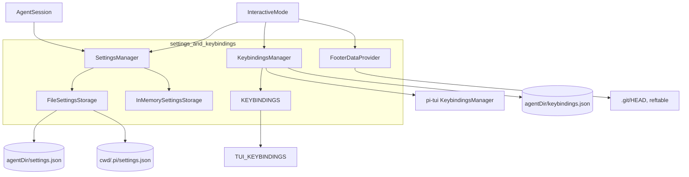
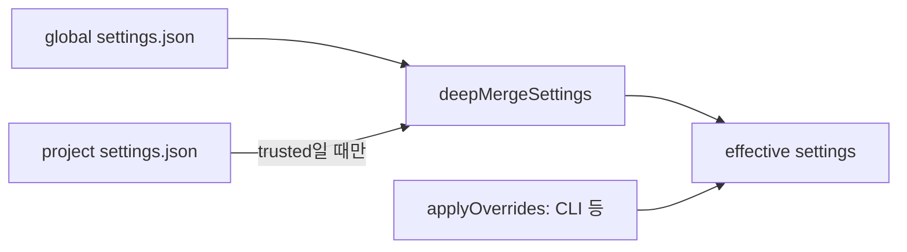
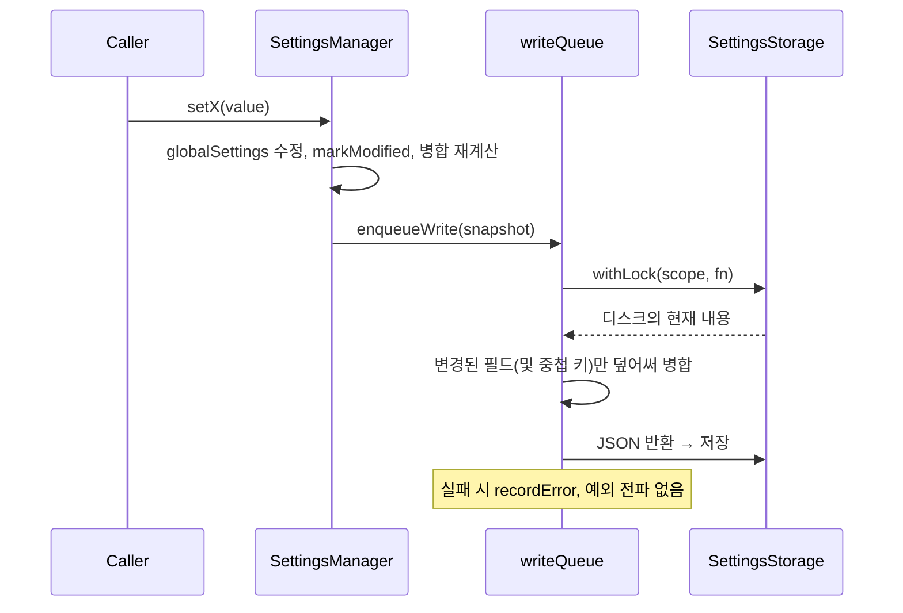
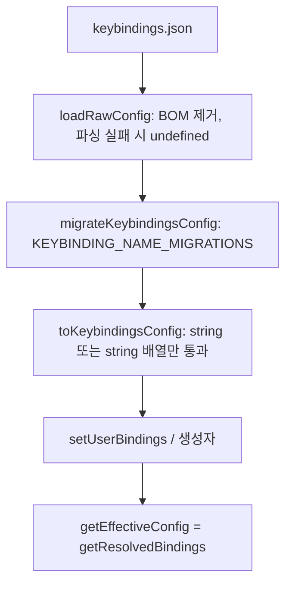

# settings_and_keybindings 모듈

`settings_and_keybindings`는 `packages/coding-agent`의 사용자 설정(`settings.json`), 키 바인딩(`keybindings.json`), 푸터 데이터(git 브랜치·확장 상태)를 관리하는 모듈이다. 상위 모듈은 [Model,_Credential_and_Settings_Management](Model,_Credential_and_Settings_Management.md)이며, 모델/인증 쪽은 [model_and_auth_management](model_and_auth_management.md)에서 다룬다.

| 파일 | 핵심 심볼 | 역할 |
|---|---|---|
| `packages/coding-agent/src/core/settings-manager.ts` | `SettingsManager`, `FileSettingsStorage`, `InMemorySettingsStorage` | 전역/프로젝트 설정 로드·병합·지속화 |
| `packages/coding-agent/src/core/keybindings.ts` | `KeybindingsManager`, `KEYBINDINGS`, `AppKeybindings`, `useWindowsKeybindings` | 앱 키 바인딩 정의와 사용자 override |
| `packages/coding-agent/src/core/footer-data-provider.ts` | `FooterDataProvider`, `findGitPaths` | 푸터용 git 브랜치 감시, 확장 상태 |

## 1. 아키텍처

사용처: `InteractiveMode`(`settingsManager`)는 [interactive_mode_core](interactive_mode_core.md), `AgentSession`은 [agent_session_core](agent_session_core.md), 상속 대상 `KeybindingsManager`는 [tui_core](tui_core.md)를 참조한다.

## 2. SettingsManager

### 2.1 저장소 추상화
`SettingsStorage.withLock(scope, fn)`은 `fn(current)`에 현재 JSON 문자열을 넘기고, 문자열을 반환하면 저장하며 `undefined`면 읽기 전용이다.

- `FileSettingsStorage`: 전역은 `<agentDir>/settings.json`, 프로젝트는 `<cwd>/<CONFIG_DIR_NAME>/settings.json`. `proper-lockfile`의 `lockSync`를 최대 10회, 20ms 간격으로 재시도(`ELOCKED`만 재시도, busy-wait로 동기 유지)한다. 디렉터리는 실제로 쓸 때만 생성한다.
- `InMemorySettingsStorage`: 테스트·`SettingsManager.inMemory()`용.

### 2.2 두 개의 레이어와 병합
`globalSettings`와 `projectSettings`를 각각 보관하고 `deepMergeSettings`로 유효 설정 `settings`를 만든다. 프로젝트가 우선하며 중첩 객체는 재귀 병합된다. 예외는 `defaultTools`로, 일반 이름 목록은 상속값을 대체하고 `+name`/`-name`만 있는 목록은 상속값에 덧붙는다(`mergeDefaultTools`, `resolveDefaultTools`; 기본값 `DEFAULT_TOOL_NAMES = read, bash, edit, write`).

### 2.3 로드와 마이그레이션
`create(cwd, agentDir)` → `fromStorageWithPaths` → `tryLoadFromStorage`. 파싱 실패는 예외로 전파하지 않고 `SettingsError`로 수집(`drainErrors()`)하며 해당 스코프의 로드 오류 플래그를 세운다. `migrateSettings`는 구버전 포맷을 변환한다.

- `queueMode` → `steeringMode`
- `websockets` boolean → `transport` (`websocket`/`sse`)
- `skills` 객체 → 배열 + `enableSkillCommands`
- `retry.maxDelayMs` → `retry.provider.maxRetryDelayMs`

### 2.4 프로젝트 신뢰(trust)
`projectTrusted === false`이면 프로젝트 설정은 `{}`로 취급하고, `assertProjectTrustedForWrite`가 쓰기를 막는다. `setProjectTrusted`로 런타임 전환 가능하다. `defaultProjectTrust`, `cacheWarming`, `deviceId`는 보안·비용 이유로 전역 설정만 읽는다.

### 2.5 쓰기 경로 (변경 필드만 병합 저장)
setter(예: `setDefaultModel`, `setShowImages`)는 `globalSettings`를 수정하고 `markModified(field, nestedKey?)`로 변경 필드를 기록한 뒤 `save()`를 호출한다. 실제 쓰기는 `writeQueue` Promise 체인에 직렬화된다.

핵심 설계: 세션 시작 시점의 전체 스냅샷이 아니라 **수정한 필드만** 디스크 최신본 위에 덮어쓰므로, 다른 pi 프로세스가 동시에 바꾼 설정을 지우지 않는다. 로드 오류가 있는 스코프는 손상 파일 보호를 위해 쓰기를 건너뛴다. `flush()`는 큐 소진을 기다리고, `reload()`는 큐를 기다린 뒤 파일을 다시 읽고 변경 추적을 초기화한다.

### 2.6 주요 설정 그룹

| 그룹 | 대표 키/접근자 | 비고 |
|---|---|---|
| 모델 | `defaultProvider`, `defaultModel`, `setDefaultModelAndProvider`, `modelThinkingLevels` | `"provider/modelId"` 키 |
| 큐 모드 | `steeringMode`, `followUpMode` | 기본 `one-at-a-time` |
| 압축 | `getCompactionSettings(model)` | 모델 override → 일반 값 → 기본값(16384/20000), 잘못된 값은 예외 |
| 재시도 | `getRetrySettings`, `getProviderRetrySettings` | 기본 3회, 2000ms |
| 타임아웃 | `httpIdleTimeoutMs`, `websocketConnectTimeoutMs` | `parseTimeoutSetting` 검증, 0은 비활성 |
| 터미널/UI | `terminal.*`, `tuiMode`, `fullscreen*`, `outputPad`, `autocompleteMaxVisible`(3~20 clamp) | env 폴백: `PI_CLEAR_ON_SHRINK`, `PI_HARDWARE_CURSOR` |
| 리소스 | `packages`, `extensions`, `skills`, `prompts`, `themes` | 전역/프로젝트 별도 setter (`setProject*`) |
| 셸/도구 | `shellPath`, `shellCommandPrefix`, `npmCommand`, `getExternalEditorCommand` | 편집기: 설정 → `VISUAL`/`EDITOR` → `notepad`/`nano` |
| 분석 | `enableAnalytics`, `trackingId`, `getOrCreateDeviceId` | 최초 opt-in 시 UUID 생성 |
| 캐시 워밍 | `cacheWarming` (`off`/`streaming`/`idle`) | 비용 때문에 전역만 |

`getSettings()`/`getGlobalSettings()`/`getProjectSettings()`는 `structuredClone` 복사본을 반환해 외부 변경을 차단한다.

## 3. KeybindingsManager

### 3.1 정의 구성
`KEYBINDINGS`는 `@earendil-works/pi-tui`의 `TUI_KEYBINDINGS`에 `app.*` 정의를 합친 객체이며, 각 항목은 `{ defaultKeys, description }`이다. `AppKeybindings` 인터페이스는 `declare module`로 TUI의 `Keybindings`를 확장해 타입 안전한 ID를 제공한다. 프로젝트 규칙상 키 검사를 하드코딩하지 않고 여기에 기본값을 추가해야 한다.

분류: 전역 동작(`app.interrupt`, `app.clear`, `app.exit`, `app.suspend`), 사고 수준(`app.thinking.*`), 모델(`app.model.*`, `app.models.*`), 메시지/클립보드(`app.message.*`, `app.clipboard.pasteImage`), 세션(`app.session.*`), 트리(`app.tree.*`, `app.tree.filter.*`).

### 3.2 플랫폼별 기본값
`useWindowsKeybindings(platform, env)`는 `win32` 또는 WSL(`WSL_DISTRO_NAME`/`WSL_INTEROP`)이면 true다. 이때 `tui.editor.undo`(Windows는 `ctrl+z`, WSL은 `alt+z`, 그 외 `ctrl+-`), `app.model.cycleBackward`(`alt+p`), `app.message.followUp`(`ctrl+q`), `app.message.dequeue`(`alt+q`), `app.clipboard.pasteImage`(`alt+v`), `tui.altScreen.*` 등이 바뀐다. `app.suspend`는 Windows에서 빈 배열, 트리 접기/펼치기는 macOS에서 `alt` 우선이다.

### 3.3 사용자 override와 레거시 이름 마이그레이션

- `migrateKeybindingsConfig`: `cursorUp` → `tui.editor.cursorUp`, `interrupt` → `app.interrupt` 등 구 이름을 새 ID로 바꾼다. 새 이름이 이미 있으면 구 이름은 버린다. 결과는 `KEYBINDINGS` 순서, 나머지는 정렬해 출력한다.
- `KeybindingsManager.create(agentDir)`는 `<agentDir>/keybindings.json`을 읽고 경로를 기억한다. `reload()`는 해당 파일을 다시 읽어 `setUserBindings`로 교체한다(경로 없으면 no-op). 충돌/정의 조회(`getConflicts`, `getDefinition`, `getUserBindings`)는 부모 클래스에서 상속한다.

같은 키(예: `ctrl+s`, `ctrl+p`, `ctrl+d`)가 다른 컨텍스트(`app.thinking.save`, `app.session.toggleSort`, `app.models.save`)에 중복 배정되는데, 화면(컨텍스트)별로 처리되기 때문이며 해당 화면의 컴포넌트가 [interactive_selectors_and_dialogs](interactive_selectors_and_dialogs.md)에 있다.

## 4. FooterDataProvider

확장이 얻을 수 없는 푸터 데이터(git 브랜치, `ctx.ui.setStatus()`로 설정한 확장 상태, 사용 가능한 provider 수)를 제공한다.

- `findGitPaths(cwd)`: 상위 디렉터리를 탐색해 일반 repo(`.git` 디렉터리)와 worktree(`.git` 파일의 `gitdir:`, `commondir`)를 모두 처리.
- `getGitBranch()`: `HEAD`를 동기로 읽어 캐시. `.invalid`(reftable)면 `git symbolic-ref`로 해석, detached면 `"detached"`.
- 감시: `HEAD`가 원자적 rename으로 갱신돼 inode가 바뀌므로 **파일이 아닌 디렉터리**를 감시한다. reftable repo는 `reftable/`와 `tables.list`를 추가 감시한다. WSL의 `/mnt/<drive>` 경로는 `watchFile` 폴링(1초)을 병행한다. 변경은 500ms 디바운스 후 비동기 갱신하며, 실패 시 `FS_WATCH_RETRY_DELAY_MS` 후 재설정한다.
- `setExtensionStatus(key, text)`: `undefined`면 삭제. `dispose()`는 타이머·감시자·콜백을 정리한다.
- `ReadonlyFooterDataProvider`는 `getGitBranch`, `getExtensionStatuses`, `getAvailableProviderCount`, `onBranchChange`만 노출해 확장이 내부 setter/`dispose`를 못 쓰게 한다. 렌더링은 [interactive_message_components](interactive_message_components.md)의 `FooterComponent`가 담당한다.

## 5. 주의점
- 설정 파일은 스키마 검증이 없다(`mergeDefaultTools`가 잘못된 값은 대체로 처리). 일부 getter만 값을 검증/clamp한다.
- 쓰기 오류는 조용히 `errors`에 쌓이므로 호출 측이 `drainErrors()`로 표시해야 한다.
- 락 재시도는 동기 busy-wait이므로 경합이 길면 이벤트 루프를 막는다.
- 이 문서의 내용은 제공된 소스 코드를 근거로 한 것(코드 확인)이다.
