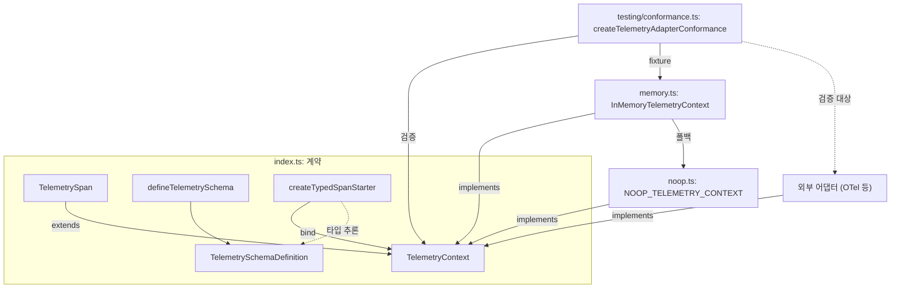
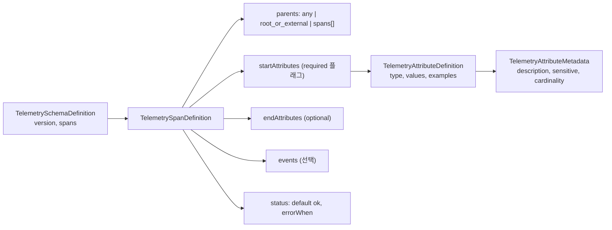
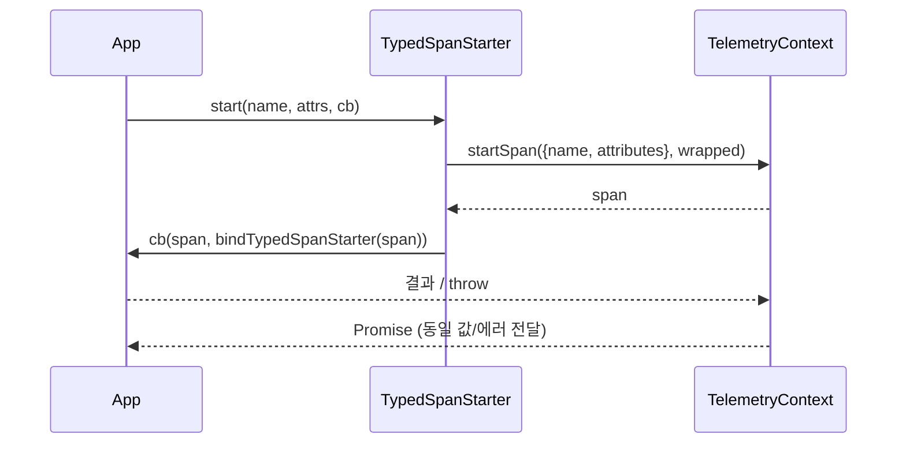
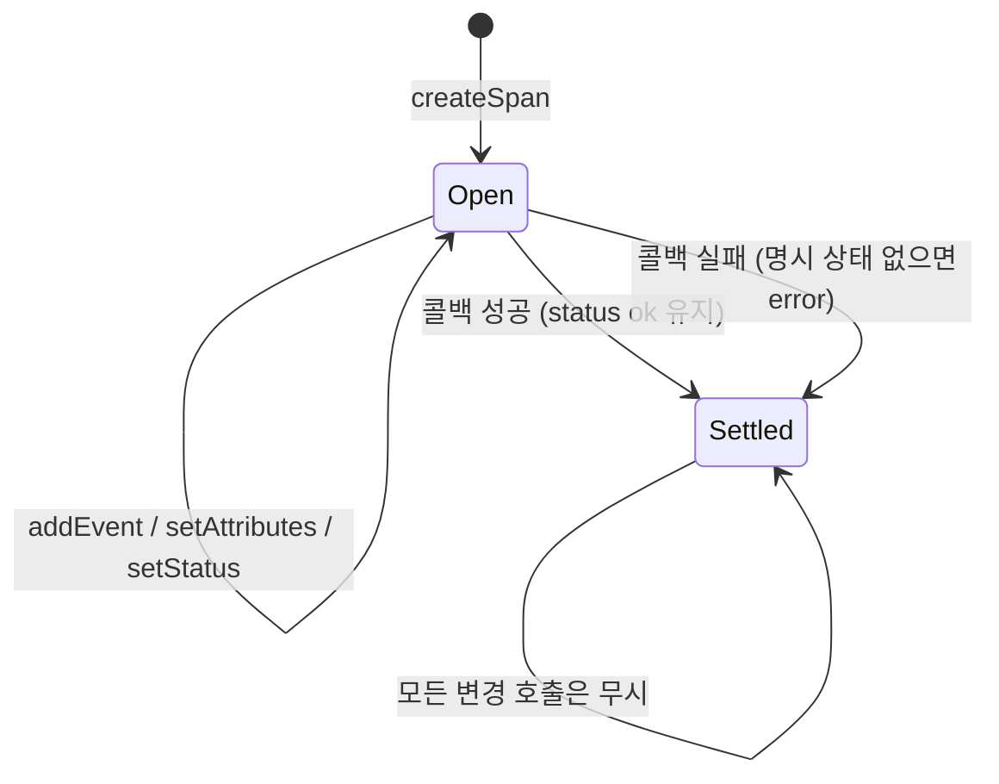
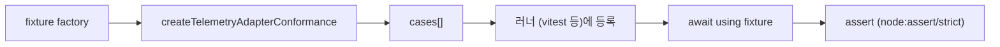

# telemetry 모듈

`packages/telemetry` (`@earendil-works/pi-telemetry`)는 pi 전체에서 쓰는 **벤더 중립 텔레메트리 계약(contract)과 타입 안전 스키마 유틸리티**를 제공하는 소규모 패키지다. 특정 백엔드(OpenTelemetry 등)에 의존하지 않고, 콜백 기반 span API, no-op 구현, 인메모리 참조 구현, 그리고 외부 어댑터가 계약을 지키는지 검증하는 conformance 테스트 스위트로 구성된다.

상위 맥락: 이 모듈은 [Build, Release, CI and Quality Infrastructure](Build,_Release,_CI_and_Quality_Infrastructure.md) 그룹에 속한다. 이 문서에서 다루는 패키지 자체는 런타임 의존성이 없다(`devDependencies`: `@types/node`, `vitest`만 존재, `packages/telemetry/package.json`).

## 1. 패키지 구성

| 파일 | 역할 |
|---|---|
| `src/index.ts` | 핵심 타입(`TelemetryContext`, `TelemetrySpan`, ...), 스키마 정의 타입, `defineTelemetrySchema`, `createTypedSpanStarter`; `NOOP_TELEMETRY_CONTEXT`·`InMemoryTelemetryContext` 재export |
| `src/noop.ts` | `startNoopSpan`, `NOOP_TELEMETRY_CONTEXT` (기본값) |
| `src/memory.ts` | `InMemoryTelemetryContext` (참조 구현, 테스트용 기록기) |
| `src/testing/conformance.ts` | `createTelemetryAdapterConformance` — 러너 독립 conformance 케이스 |
| `src/testing/types.ts` | `TelemetryAdapterFixture`, `TelemetryAdapterFixtureFactory`, `TelemetryAdapterConformanceCase` |
| `src/testing/index.ts` | `./testing` 서브패스 export |

`package.json`의 `exports`는 `.`(`dist/index.js`)와 `./testing`(`dist/testing/index.js`) 두 진입점을 노출한다. 빌드는 `tsc -p tsconfig.build.json`(루트 `tsconfig.base.json` 상속, `src` → `dist`), 테스트는 `vitest --run`, `prepublishOnly`는 `clean` + `build`다. Node `>=22.19.0` 필요.

## 2. 아키텍처



핵심 설계 원칙:

1. **콜백 라이프사이클**: span은 `startSpan(options, callback)` 안에서만 존재한다. 콜백이 끝나면(동기/비동기 모두) span이 settle된다.
2. **수동적(passive) 텔레메트리**: 텔레메트리 코드의 실패는 애플리케이션 동작에 영향을 주면 안 된다. 읽을 수 없는 payload(throw하는 Proxy 등)는 조용히 무시된다.
3. **에러 값 보존**: 콜백이 던진/reject한 값은 *동일한 값 그대로* 호출자에게 전달된다.
4. **스키마는 타입 전용**: 런타임 검증 없이 컴파일 타임 추론에만 쓰인다.

## 3. 핵심 계약 (`src/index.ts`)

- `AttributeValue`: `string | number | boolean` 및 각각의 readonly 배열.
- `SpanAttributes`: `undefined` 값을 허용하는 인덱스 맵 (undefined는 기록 시 무시).
- `SpanStatus`: `{ status: "ok" }` 또는 `{ status: "error"; error?: { name, message } }`.
- `TelemetryContext.startSpan<T>(options, callback): Promise<T>`.
- `TelemetrySpan`은 `TelemetryContext`를 확장하므로 `span.startSpan(...)`으로 자식 span을 만든다(부모-자식은 명시적 컨텍스트로 연결, 암묵적 전역 컨텍스트 없음). 추가로 `addEvent`, `setAttributes`, `setStatus` 제공.

## 4. 타입 안전 스키마

### 4.1 스키마 정의

`defineTelemetrySchema(schema)`는 `const` 제네릭 identity 함수로, 직렬화 가능한 스키마 데이터의 리터럴 타입을 보존한다.



속성 정의는 `string`, `number`, `boolean`, `string[]`, `number[]`, `boolean[]` 타입과 선택적 `values`(열거형 제한)/`elementValues`/`examples`를 가지며, 메타데이터로 `description`, `sensitive`, `cardinality`(`low`/`high`)를 선언한다.

### 4.2 타입 추론 계층

- `AttributeDefinitionValue`: 정의 → TS 타입 (`values`가 있으면 리터럴 유니온).
- `InferStartAttributes` / `InferEventAttributes`: `required: true`는 필수, 나머지는 optional.
- `InferOptionalAttributes`: end 속성은 전부 optional.
- `ExactTelemetryAttributes<Expected, Actual>`: 정의에 없는 키를 `never`로 만들어 **초과 속성 차단**.
- `SchemaTelemetrySpan<Schema, Name>`: `addEvent`/`setAttributes`가 해당 span의 이벤트·end 속성으로 좁혀진 span 타입.
- `TelemetrySchemaSpanUnion`: 스키마의 모든 span을 `{name, startAttributes, endAttributes, events}` 유니온으로 변환.

### 4.3 `createTypedSpanStarter`

```ts
const start = createTypedSpanStarter(context, [schemaA, schemaB] as const);
await start("span.name", { requiredAttr: "x" }, async (span, startChild) => {
  span.setAttributes({ endAttr: 1 });
  await startChild("child.span", { ... }, async () => { ... });
});
```

- 하나 이상의 스키마를 튜플로 받아 span 이름별 오버로드 집합(`TypedSpanStarter`, `UnionToIntersection`으로 구성)을 만든다.
- 스키마 간 **중복 span 이름은 컴파일 오류**(`UniqueTelemetrySchemas`, `"duplicate telemetry span names"`).
- 콜백의 두 번째 인자 `startChildSpan`은 방금 만든 span에 바인딩된 starter(`bindTypedSpanStarter(span)`)이므로 부모-자식 관계가 명시적으로 이어진다.
- 런타임에서는 `telemetryContext.startSpan({ name, attributes }, ...)`로 위임할 뿐이며 스키마 값은 사용하지 않는다(`_schemas` 인자).



## 5. No-op 구현 (`src/noop.ts`)

`NOOP_TELEMETRY_CONTEXT`는 애플리케이션이 컨텍스트를 제공하지 않을 때의 공유 기본값이다. 동결(`Object.freeze`)된 단일 span 객체이며 `startSpan`은 `startNoopSpan`으로, 콜백을 즉시(동기적으로) 한 번 호출하고 결과를 `Promise.resolve`로, 동기 throw를 `Promise.reject`로 변환한다. 나머지 메서드는 빈 함수다.

## 6. 인메모리 구현 (`src/memory.ts`)

`InMemoryTelemetryContext`는 span을 프로세스 메모리에 기록하는 참조 구현이다. 테스트/독립 기록 범위마다 새 인스턴스를 만든다.

동작 요약:

| 항목 | 동작 |
|---|---|
| ID | `nextSpanId`(1부터), 종료 순서는 `nextEndSequence` |
| 속성 | 입력을 복사(`copyAttributes`)하고 `undefined`는 제외, 배열은 얕은 복사. `setAttributes`는 병합 후 한 번에 교체(원자적) |
| 상태 | 기본 `ok`. `setStatus`가 호출되면 `explicitStatus`로 표시, **마지막 명시 상태가 우선**하며 자동 에러 상태가 덮어쓰지 않음 |
| 실패 | 콜백 throw/reject 시 명시 상태가 없으면 `automaticErrorStatus`(Error면 name/message 포함) 적용 후 원래 값을 그대로 rethrow |
| settle 후 | `addEvent`/`setAttributes`/`setStatus`는 무시. 이미 settle된 부모의 `startSpan`은 `NOOP_TELEMETRY_CONTEXT`로 폴백(콜백은 실행하되 기록 안 함) |
| 수동성 | 기록 중 예외(unreadable payload 등)는 `try/catch`로 삼킴. span 생성 자체가 실패하면 no-op으로 폴백 |
| 조회 | `getSpans()`는 span 시작 순서의 분리된 스냅샷(`RecordedTelemetrySpan`) 반환 |



## 7. Conformance 스위트 (`src/testing/conformance.ts`)

`createTelemetryAdapterConformance(factory)`는 `TelemetryAdapterConformanceCase[]`(`group`, `name`, `run()`)를 반환한다. 특정 테스트 러너에 묶이지 않으므로 vitest, `node:test` 등에 자유롭게 등록할 수 있다. 각 케이스는 `await using fixture = await factory()`로 케이스마다 새 어댑터를 만들고 자동 정리한다.

Fixture 계약(`src/testing/types.ts`): `context: TelemetryContext`와 정규화된 스냅샷을 읽는 `getSpans(): Promise<readonly RecordedTelemetrySpan[]>`를 가진 `AsyncDisposable`.

검증 그룹:

| 그룹 | 검증 내용 |
|---|---|
| callback lifecycle | 콜백이 동기적으로 정확히 한 번 실행, 결과 보존; 동기/비동기/`undefined`/unreadable 거부 값을 동일하게 전달하고 span은 `error` |
| status | 마지막 명시 상태 우선, 자동 덮어쓰기 없음, 반환된 실패 표현 가능 |
| recording | 속성 병합(undefined는 제거/무시), 이벤트 순서 보존, 실패한 `setAttributes`는 원자적으로 무시, settle 후 호출은 inert(자식 `startSpan`은 콜백 실행) |
| parentage | 중첩·동시 자식 관계(`parentId`), 종료 순서(`endSequence`: second < first < parent) |
| passivity | unreadable options/attributes/status가 예외를 내지 않음, 실패한 `setStatus`는 원자적 무시 |



저장소 내 사용처는 `packages/telemetry/test/conformance.test.ts`(인메모리 구현을 fixture로 검증)와 `test/telemetry.test.ts`다(파일 존재 확인, 내용은 이 문서 작성 시 미검토).

## 8. 의존성 및 다른 모듈과의 관계

- 외부 런타임 의존성 없음, `node:assert/strict`는 testing 서브패스에서만 사용.
- 이 패키지는 계약만 정의하므로 소비자(예: [Agent_Loop_and_Session_Core](Agent_Loop_and_Session_Core.md), [LLM_Provider_Abstraction_and_Auth](LLM_Provider_Abstraction_and_Auth.md))는 `TelemetryContext`를 주입받아 사용하는 구조가 자연스럽다. 다만 제공된 코드 범위에서는 이들 패키지가 실제로 이 모듈을 import하는지 확인하지 않았다(미확인).
- 빌드/CI 연결은 루트 `package.json`의 워크스페이스 스크립트와 [CI 워크플로](Build,_Release,_CI_and_Quality_Infrastructure.md)를 따른다.

## 9. 사용 시 유의점

- 컨텍스트 미지정 시 `NOOP_TELEMETRY_CONTEXT`를 사용한다.
- 스키마에서 `sensitive`, `cardinality`는 **메타데이터일 뿐** 런타임 마스킹/제한은 수행되지 않는다. 어댑터가 이를 해석해야 한다.
- `status.errorWhen`, `parents` 제약도 문서화용 데이터이며 런타임 강제는 없다(코드 확인: `createTypedSpanStarter`는 스키마를 사용하지 않음).
- 새 어댑터를 만들면 conformance 스위트를 반드시 통과시킨다.
