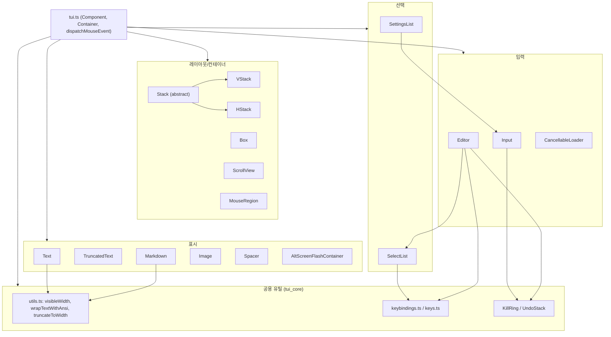
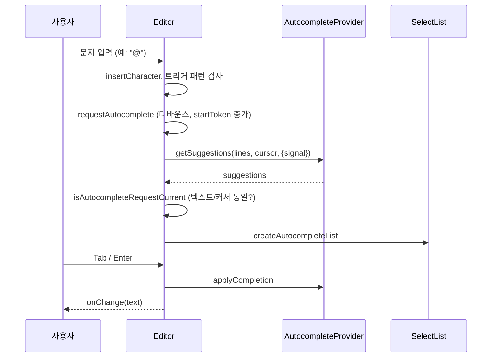

# tui_components 모듈

`packages/tui/src/components/` 아래의 **재사용 가능한 TUI 컴포넌트 모음**이다. 모든 컴포넌트는 `tui.ts`의 `Component` 인터페이스(`render(width): string[]`, `invalidate()`, 선택적 `handleInput`/`handleMouse`)를 구현하며, 렌더 결과는 ANSI가 포함된 문자열 줄 배열이다. 핵심 렌더러·터미널·키 처리는 [tui_core](tui_core.md), 네이티브 클립보드/빌드는 [tui_native_and_build](tui_native_and_build.md)를 참고한다.

검증 수준: 아래 내용은 제공된 소스 코드를 직접 읽어 확인했다(코드 확인). 이 모듈이 `Component`/`Container`/`dispatchMouseEvent`를 어떻게 소비하는지의 내부 구현은 tui_core 소관이며 여기서는 미확인이다.

## 아키텍처 개요

공통 패턴:
- **렌더 캐시**: `Text`, `Markdown`, `Image`, `Box`는 (text, width) 또는 자식 줄 동일성으로 캐시하고 `invalidate()`로 비운다.
- **키 바인딩 간접 참조**: `getKeybindings().matches(data, "tui.select.up")`처럼 ID로만 매칭한다(하드코딩 키 없음).
- **마우스**: `handleMouse(event)`가 `{ handled, focus, render }`를 반환. 좌표는 부모가 컴포넌트-로컬로 변환해 전달한다.
- **커서**: 포커스된 입력 컴포넌트는 `CURSOR_MARKER`(IME 위치용)와 역상(`\x1b[7m`) 가짜 커서를 함께 출력한다.

## 하위 컴포넌트 요약

하위 모듈로 분리하지 않고 이 문서 하나에서 다룬다.

### 레이아웃/컨테이너

| 컴포넌트 | 파일 | 역할 |
|---|---|---|
| `Box` | `box.ts` | 자식에 `paddingX/Y`와 배경 함수(`bgFn`)를 적용. 자식 줄을 동일성 비교해 캐시, `handleMouse`에서 자식 높이로 y를 매핑해 `dispatchMouseEvent` 전달 |
| `Stack` / `VStack` / `HStack` | `stack.ts`, `v-stack.ts`, `h-stack.ts` | flex 유사 레이아웃. `StackEntry`(`basis`, `grow`, `shrink`, `minSize`, `maxSize`, `visible`)와 `allocateStackSizes`로 크기 분배. `HStack`은 `compositeTuiLine`으로 열을 합성하고 `align`(start/center/end/stretch) 지원 |
| `ScrollView` | `scroll-view.ts` | 단일 자식을 수직 스크롤. `follow: "end"`(끝 추적), `scrollbar: hidden/auto/always`, 자동 숨김 타이머. `[LAYOUT_NODE]()`로 렌더러에 스크롤 노드 노출. `addChild/removeChild/clear`는 예외 발생 |
| `MouseRegion` | `mouse-region.ts` | 렌더 변경 없이 기존 컴포넌트에 마우스 핸들러 추가. 자식이 먼저 처리, 미처리 시 `onMouse` |

### 표시

| 컴포넌트 | 역할 |
|---|---|
| `Text` | 줄바꿈(`wrapTextWithAnsi`) + 패딩 + 선택적 배경. 탭은 3칸 |
| `TruncatedText` | 첫 줄만 취해 `truncateToWidth`로 자름 |
| `Markdown` | `marked` 기반. `StrictStrikethroughTokenizer`(`~~` 엄격 규칙), LaTeX 확장(`tokenizeBlockLatex`, `tokenizeInlineLatex` → `renderLatex`), 표 너비 분배, OSC 8 하이퍼링크, 스트리밍 중 불완전한 닫는 펜스 제거(`trimPartialClosingFences`). 토큰은 `WeakRef`로 캐시 |
| `Image` | `terminal-image.ts`의 Kitty/iTerm 렌더링 사용, 미지원 시 `imageFallback` 텍스트. Kitty `imageId` 재사용 가능 |
| `Spacer` | 빈 줄 N개 |
| `AltScreenFlashContainer` | 대체 화면용 일시 메시지(기본 1000ms), 역상 표시, 타이머 `unref` |

### 입력

- **`Editor`** (가장 복잡): 다중 줄 편집기.
  - 상태: `lines`, `cursorLine`, `cursorCol`; 시각 줄 맵(`buildVisualLineMap`)과 `wordWrapLine`(CJK 줄바꿈 허용, 긴 토큰 강제 분할).
  - 큰 붙여넣기(>10줄 또는 >1000자)는 `[paste #N +M lines]` 마커로 치환하고 마커를 원자 단위로 취급(`segmentWithMarkers`). 제출 시 `expandPasteMarkers`로 복원.
  - 편집 기능: Kill ring(`KillRing`), 실행 취소(`UndoStack`, fish 방식 병합), 히스토리(최대 100개), 문자 점프, sticky column(`computeVerticalMoveColumn`), `\` + Enter 줄바꿈 우회.
  - 자동완성: `AutocompleteProvider` 연동, 트리거 문자(`@`, `#`, `/` 등), 20ms 디바운스, 요청 토큰/AbortController로 오래된 응답 폐기, 결과는 `SelectList`로 표시.
  - 뷰포트는 터미널 높이의 30%(최소 5줄)이며 `↑ N more`/`↓ N more` 경계 표시.
- **`Input`**: 한 줄 입력. 가로 스크롤, placeholder, 붙여넣기 시 개행 제거, Kill ring/Undo 지원.
- **`CancellableLoader`**: `Loader` 확장. `tui.select.cancel` 시 `AbortController.abort()`와 `onAbort` 호출, `signal`/`aborted` 노출.

### 선택

- **`SelectList`**: `SelectItem{value,label,description}` 목록. 선택 항목 중심으로 스크롤, 위/아래 순환, 기본 컬럼 너비 32(`layout`으로 조정), 휠/클릭 지원. 호버는 선택을 바꾸지 않음. `setFilter`는 value 접두사 일치.
- **`SettingsList`**: `SettingItem`(`values` 순환 또는 `submenu`). `fuzzyFilter` 검색(`enableSearch`), 서브메뉴가 열리면 입력/렌더/마우스를 위임, `navigateTo`로 닫은 뒤 다른 항목 서브메뉴 자동 오픈.

## 대표 흐름: Editor 자동완성

## 참고

- 소비처: `packages/coding-agent`의 인터랙티브 모드 컴포넌트(예: 선택기/대화상자)가 이들을 조합한다 → [User-Facing_Modes_(Interactive_and_RPC)](User-Facing_Modes_(Interactive_and_RPC).md) (관계는 모듈 트리 기반 추론, 코드 미확인).
- 빌드/테스트 설정: `packages/tui/package.json`, `packages/tui/tsconfig.build.json`.
