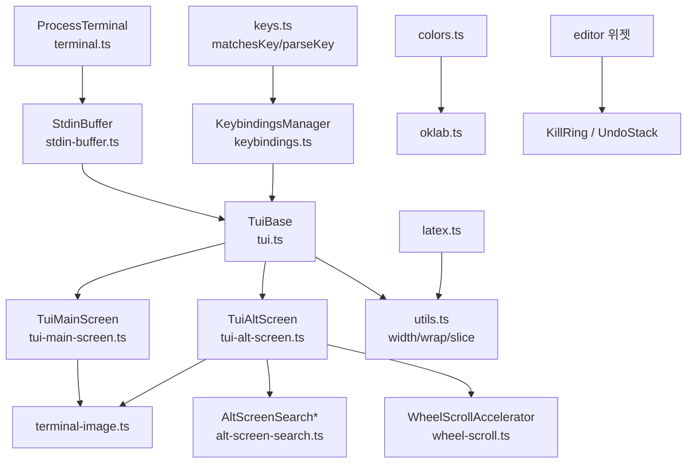
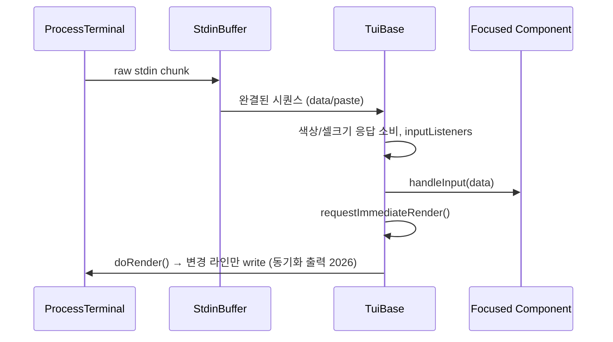

# tui_core 모듈

`packages/tui`의 핵심 계층이다. 터미널 입출력, 키 입력 해석, 차등 렌더링(differential rendering), 오버레이, 마우스/선택/검색, 이미지 프로토콜, 색상 수학, LaTeX 렌더링을 제공한다. 위젯 모음은 [tui_components](tui_components.md), 네이티브 클립보드/빌드는 [tui_native_and_build](tui_native_and_build.md)를 참고한다. 이 모듈을 사용하는 쪽은 [User-Facing_Modes_(Interactive_and_RPC)](User-Facing_Modes_(Interactive_and_RPC).md)의 interactive 모드 등이다.

검증 수준: 아래 내용은 제공된 소스 코드를 직접 읽고 작성했다(코드 확인). 호출 관계 중 제공되지 않은 파일(`layout.ts`, `terminal-colors.ts` 등)은 import 이름 기준의 추론이다.

## 아키텍처

## 하위 영역별 기능

### 터미널 계층 — `terminal.ts`, `stdin-buffer.ts`, `keys.ts`
- `ProcessTerminal`(`Terminal` 인터페이스 구현): raw mode, bracketed paste(`\x1b[?2004h`), 리사이즈, 커서/화면 제어, OSC 0 제목, OSC 9;4 진행 표시. `start()`가 Kitty keyboard protocol(flags 7)을 질의하고 DA1 센티넬로 응답이 없으면 xterm `modifyOtherKeys`로 폴백한다. `drainInput()`은 SSH에서 Kitty release 이벤트가 셸로 새는 것을 막는다.
- `StdinBuffer`: 조각나서 도착하는 이스케이프 시퀀스(CSI/OSC/DCS/APC/SS3, SGR 마우스)를 완결된 시퀀스 단위로 emit한다. 단독 ESC는 10ms(SSH는 `PI_TUI_ESC_TIMEOUT`/기본 100ms) 후 Escape로 확정한다. 붙여넣기는 `paste` 이벤트로 분리.
- `keys.ts`: `matchesKey(data, keyId)`, `parseKey(data)`. Kitty CSI-u, modifyOtherKeys, 레거시 시퀀스를 모두 처리하고 비라틴 레이아웃(base layout key)을 고려한다. `isKeyRepeat`, `isKeyRelease`, `isKittyProtocolActive`로 이벤트 종류를 판별한다.
- `normalizeAppleTerminalInput`: Apple Terminal/Windows에서 Shift+Enter를 네이티브 modifier 상태로 보정(`native-modifiers`는 [tui_native_and_build](tui_native_and_build.md)).

### 키 바인딩 — `keybindings.ts`
`TUI_KEYBINDINGS`가 `tui.editor.*`, `tui.input.*`, `tui.select.*`, `tui.altScreen.*` 기본 키를 정의한다. `KeybindingsManager`는 사용자 설정을 병합하고 충돌(`getConflicts`)을 계산하며, `getKeybindings()`/`setKeybindings()`로 전역 인스턴스를 공유한다. `Keybindings` 인터페이스는 declaration merging으로 하위 패키지(예: coding-agent의 `AppKeybindings`)가 확장한다. 규칙: 키를 하드코딩하지 않고 정의에 추가한다.

### 렌더링 코어 — `tui.ts`, `tui-main-screen.ts`, `tui-alt-screen.ts`
- `Component`(`render(width)`, `handleInput`, `handleMouse`, `invalidate`), `Container`, `Focusable`, `CURSOR_MARKER`(APC 제로폭 마커로 IME용 하드웨어 커서 위치 지정).
- `TuiBase`: 렌더 스케줄링(최소 16ms 간격, 키 입력은 즉시 렌더), 포커스, 입력 리스너 체인, 오버레이 스택(앵커/마진/퍼센트 크기, 포커스 복원 상태기계), 터미널 색상 질의(OSC 10/11/4 + DA1 종료 마커), 셀 크기 질의(`CSI 16 t`), 마우스 이벤트 디스패치.
- `TuiMainScreen`(regular 모드): 스크롤백을 쓰는 차등 렌더링. 변경 구간(`firstChanged`~`lastChanged`)만 다시 쓰고, 너비/높이 변경·clear-on-shrink 등은 전체 재그리기. `BoundedTerminalWriter`가 1 MiB 단위로 분할해 쓰며 서로게이트 쌍을 보존한다. Kitty 이미지 예약 행/삭제 처리 포함. 너비 초과 라인은 크래시 로그를 남기고 예외를 던진다.
- `TuiAltScreen`(fullscreen 모드): 대체 화면 + 앱이 소유하는 `ScrollView` 뷰포트. 마우스(휠 가속, 스크롤바 드래그, 단어/줄 선택, OSC 8 링크 클릭, 클립보드 복사), OSC 133 프롬프트 점프, 오버레이/플래시, scroll-to-end 표시, 트랜스크립트 검색 하이라이트, Kitty 이미지 캐시 한도(16개/32MiB/64MiB)를 관리한다.

### 대체 화면 검색 — `alt-screen-search.ts`
`AltScreenSearchIndex.search`는 렌더된 라인에서 코퍼스(공백 정규화, 셀 컬럼 매핑)를 만들고 변경이 없으면 캐시를 재사용한다. `findAltScreenSearchMatches`는 일회성 검색이며, 줄바꿈에 걸친 매치는 여러 segment로 합쳐진다. `AltScreenSearchComponent`는 입력창+결과 카운트+이전/다음 버튼 오버레이로, 키는 `tui.altScreen.search*` 바인딩을 쓴다.

### 입력 보조 — `kill-ring.ts`, `undo-stack.ts`, `wheel-scroll.ts`
- `KillRing`: Emacs 식 kill/yank. `accumulate`+`prepend`로 연속 삭제를 병합.
- `UndoStack<S>`: push 시 `structuredClone`, pop은 그대로 반환.
- `WheelScrollAccelerator`: `"auto"` 모드에서 이벤트 간격에 따라 1~6줄. macOS 로컬 터미널은 OS가 이미 가속하므로 비활성.

### 문자열/ANSI 유틸 — `utils.ts`
`visibleWidth`(ASCII 빠른 경로, 그래핌 단위 폭, 512개 캐시), `wrapTextWithAnsi`, `truncateToWidth`, `sliceByColumn`, `extractSegments`(오버레이 합성), `AnsiCodeTracker`(SGR·OSC 8 상태 보존), `stripTerminalSequences`, 그래핌/단어 `Intl.Segmenter` 공유 인스턴스.

### 이미지 — `terminal-image.ts`
환경 변수로 터미널 능력(Kitty/iTerm2 이미지, truecolor, OSC 8)을 감지하고(`PI_IMAGE_PROTOCOL`, `PI_TRUE_COLOR`, `PI_HYPERLINKS`로 재정의, tmux는 `probeTmuxHyperlinks`), `encodeKitty`/`encodeITerm2`, PNG/JPEG/GIF/WebP 크기 파싱, `calculateImageRows`, Kitty 배치/크롭 보조 함수를 제공한다. `resetCapabilitiesCache`는 캐시 초기화.

### 색상 — `colors.ts`, `oklab.ts`
`parseColor`는 숫자(ANSI 256), `#rgb/#rrggbb`, `oklch()`, `okhsl()`을 `Color`로 파싱한다. OKLCH는 chroma bisection으로 sRGB 가멋 매핑, `mixColors`(oklch/srgb), `styleText`/`styleTextWithAnsi`(닫는 시퀀스 역순), 256색 폴백(`rgbToAnsi256`)을 지원한다. `oklab.ts`는 Björn Ottosson OKHSL 참조 구현의 포팅(MIT)이다.

### LaTeX — `latex.ts`
`renderLatex(source, {display})`가 기본 LaTeX 수식을 유니코드 텍스트로 변환한다. 분수·연산자 한계·위/아래 첨자·행렬·cases는 레이아웃 노드(`FractionNode`, `OperatorNode`, `ScriptNode`, `MatrixNode`)로 2D 배치하고, 지원하지 않는 구문이면 `undefined`를 반환해 호출자가 원문으로 폴백한다. Markdown 위젯의 `tokenizeBlockLatex`/`tokenizeInlineLatex`가 사용한다([tui_components](tui_components.md)).

## 설계 포인트
- 모든 렌더 결과는 "문자열 라인 배열"이며, 라인 끝에 `SEGMENT_RESET`을 붙여 스타일 누수를 막는다.
- 입력은 늘 시퀀스 단위로 정규화된 뒤 `matchesKey`로 비교되므로 컴포넌트는 터미널 프로토콜 차이를 모른다.
- 전역 상태(Kitty 활성 여부, 능력 캐시, 키바인딩)는 모듈 싱글턴이며 테스트용 리셋/오버라이드 함수가 있다.
