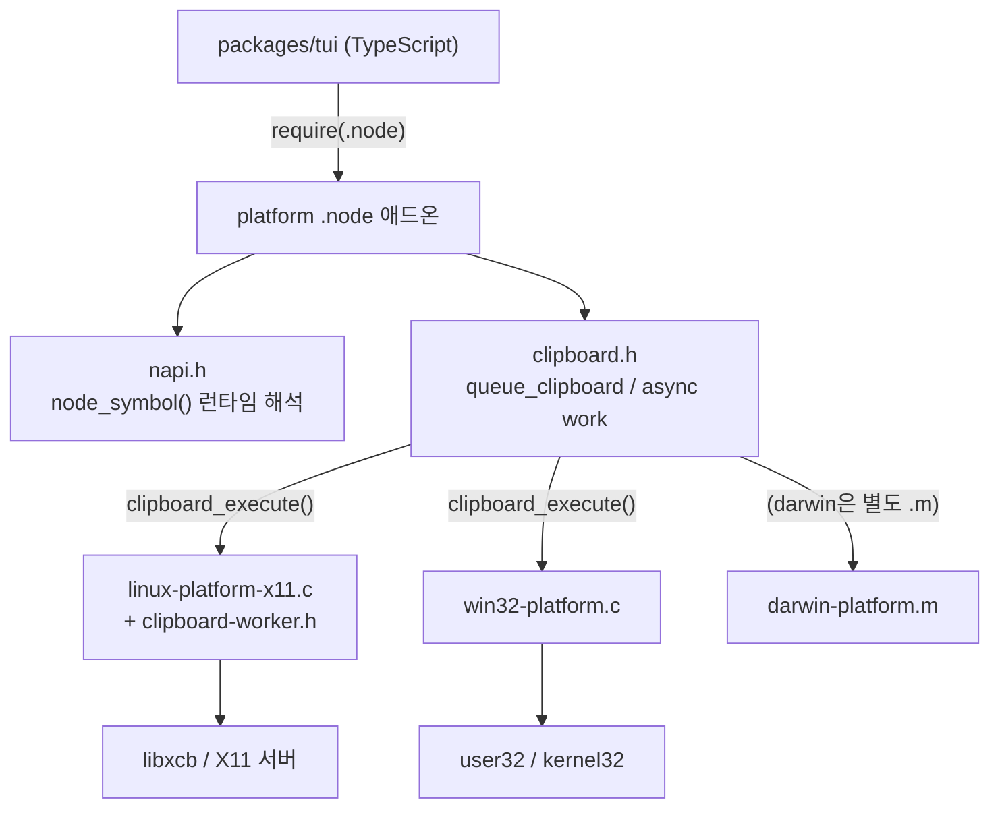
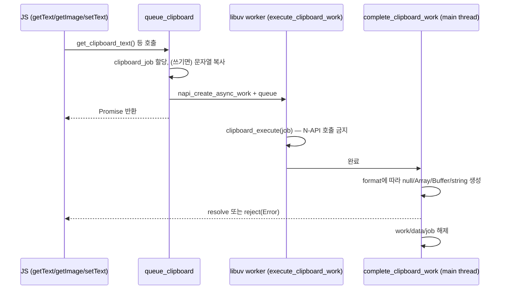
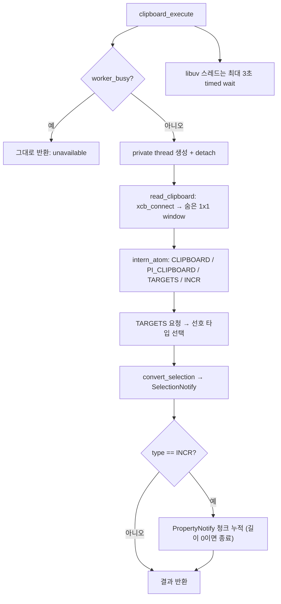
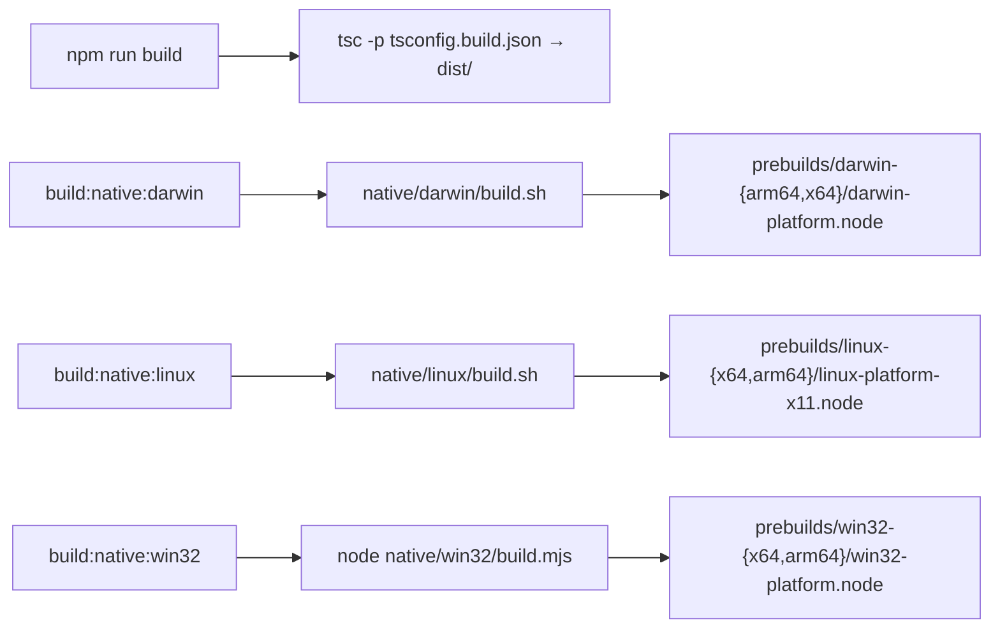

# tui_native_and_build 모듈

`packages/tui`(`@earendil-works/pi-tui`)의 **네이티브 애드온(C/Objective-C)** 과 **패키지 빌드 설정**을 다루는 모듈이다. 순수 TypeScript로는 할 수 없는 OS 수준 기능(클립보드 읽기/쓰기, Windows 콘솔 VT 입력 활성화, Windows 수정자 키 상태 조회)을 플랫폼별 `.node` 바이너리로 제공한다. TUI 렌더링·입력 처리 자체는 [tui_core](tui_core.md), 위젯은 [tui_components](tui_components.md)를 참고한다.

## 1. 구성 요소 한눈에 보기

| 파일 | 역할 |
|---|---|
| `packages/tui/native/napi.h` (모듈 트리 외, 참조용) | Node/Bun 헤더 없이 N-API 심볼을 런타임에 `dlsym`/`GetProcAddress`로 해석하는 최소 shim |
| `packages/tui/native/clipboard.h` | 플랫폼 공통 비동기 클립보드 작업(Promise + `napi_async_work`) 골격 |
| `packages/tui/native/linux/src/linux-platform-x11.c` | X11(xcb) 클립보드 읽기 구현 |
| `packages/tui/native/linux/src/clipboard-worker.h` | Linux용 private thread + 타임아웃 래퍼 |
| `packages/tui/native/win32/src/win32-platform.c` | Win32 클립보드 읽기/쓰기, VT 입력, 수정자 키 상태 |
| `packages/tui/native/darwin/build.sh`, `linux/build.sh`, `win32/build.mjs` | 플랫폼별 prebuild 스크립트 |
| `packages/tui/package.json`, `tsconfig.build.json` | npm 스크립트, 배포 파일 목록, TS 빌드 설정 |

(`darwin/src/darwin-platform.m`은 제공된 컴포넌트에 코드가 없어 본 문서에서 내용을 다루지 않는다. 빌드 스크립트와 `files` 목록으로만 존재가 확인된다. — 코드 미확인)

## 2. 아키텍처

핵심 설계: **헤더 공유 + 플랫폼별 `clipboard_execute` 구현**. `clipboard.h`는 `clipboard_execute(clipboard_job*)`를 선언만 하고(`static`), 각 플랫폼 소스가 구현한다. 하나의 `.node`가 한 플랫폼만 담당한다.

### N-API 비의존 설계 (`napi.h`)
- Node 헤더·링크 시점 의존성이 없다. `node_symbol()`이 `dlsym(RTLD_DEFAULT, …)`(POSIX) 또는 `GetProcAddress`(Windows; 실행 파일 → `node.dll` 순)로 `napi_*` 함수를 호출 시점에 찾는다. 그래서 Node와 Bun 모두 동일 바이너리를 로드할 수 있다.
- Linux 빌드는 `-nostdlib -Wl,--unresolved-symbols=ignore-all`, Windows는 `/NOENTRY /NODEFAULTLIB` 또는 `-nostdlib -Wl,--no-entry`로 이 전략과 맞춘다. 이 때문에 win32 소스에 `_DllMainCRTStartup` 더미 정의가 있다.
- 심볼 해석 실패 시 `fail()`이 `napi_throw_error`로 JS 예외를 던진다.

## 3. 클립보드 비동기 파이프라인 (`clipboard.h`)

- `clipboard_job`: `operation`(TEXT/IMAGE/WRITE/FILES), `format`(UNAVAILABLE/EMPTY/UTF8/LATIN1/UTF16/BUFFER/PATHS), `data`, `length`, `error`.
- **워커 스레드는 N-API를 호출하지 않는다**(주석으로 명시). 결과 JS 값 생성은 모두 `complete_clipboard_work`(메인 스레드)에서 한다.
- 결과 매핑: `EMPTY → null`, `BUFFER → Buffer`(이미지), `UTF16 → napi_create_string_utf16`, `UTF8/LATIN1 → 문자열`, `PATHS → 배열`(NUL 구분 UTF-8 경로; 종결자 없으면 실패). 상태가 0이 아니면 `"Clipboard operation cancelled"`.
- `PI_CLIPBOARD_WRITE`가 정의된 경우에만 `set_clipboard_text`와 `clipboard_copy`가 컴파일된다. 현재 **Windows만 쓰기를 지원**한다(Linux는 `getText`/`getImage`만 export).
- 메모리: Windows는 `GlobalAlloc/GlobalFree`, 그 외는 `calloc/free`. Windows 복사는 `volatile` 루프로 `memcpy` 의존을 피한다(`-nostdlib` 대응).

## 4. Linux: X11 클립보드 (`linux-platform-x11.c`, `clipboard-worker.h`)

핵심 포인트:
- **선호 MIME**: 텍스트 `text/plain;charset=utf-8 → UTF8_STRING → text/plain → STRING`, 이미지 `png → jpeg → webp → gif → bmp → tiff`. 소유자가 TARGETS를 거부하면 텍스트에 한해 `UTF8_STRING`으로 폴백.
- **하나의 데드라인**(`CLIPBOARD_TIMEOUT_MS = 2000`)을 탐색·응답·INCR 청크 전체가 공유한다. `wait_for_input`은 `poll` + `EINTR` 재시도.
- **상한** `MAX_CLIPBOARD_BYTES = 50MiB`. `append_bytes`/`append_property`가 오버플로·형식/타입 불일치를 검증한다.
- **스레드 모델**: libuv 워커는 3초(`CLOCK_MONOTONIC`) 안에서만 대기하고, 실제 xcb 호출은 분리된 private thread에서 한다. 타임아웃되면 늦은 결과는 스레드가 스스로 폐기하며(`worker_waiting == false`), 이미 진행 중이면 다른 호출은 "unavailable"로 즉시 반환해 libuv 풀 고갈을 막는다.
- `pthread_cond_*`는 `node_symbol`로 해석한다(주석: 버전 없는 ELF import가 glibc x64에서 구버전 조건변수에 바인딩되는 문제 회피). `CLOCK_MONOTONIC` 조건변수 속성을 설정한다.
- 반환 포맷: 이미지는 `BUFFER`, 텍스트는 타입이 `XCB_ATOM_STRING`이면 `LATIN1` 아니면 `UTF8`, 데이터 없음은 `EMPTY`.
- export: `getText`, `getImage`.

## 5. Windows (`win32-platform.c`)

export: `enableVirtualTerminalInput`, `isModifierPressed`, `getText`, `setText`, `getImage`.

| 함수 | 동작 |
|---|---|
| `enable_virtual_terminal_input` | stdin 콘솔 모드에 `ENABLE_VIRTUAL_TERMINAL_INPUT` 추가, boolean 반환 |
| `is_modifier_pressed` | 이름(`shift`/`control`/`option`·`alt`/`command`·`super`·`win`)을 받아 `GetAsyncKeyState` 상위 비트 검사 |
| `open_clipboard` | `OpenClipboard`를 5ms 간격 10회 재시도 |
| `clipboard_execute` | 쓰기 시 `HWND_MESSAGE` 소유자 창을 같은 워커 스레드에서 생성/파괴. 텍스트는 `CF_UNICODETEXT`, 읽기는 NUL까지 길이 계산 후 UTF-16 반환 |
| `read_clipboard_image` | 등록된 `PNG` 포맷 우선, 없으면 `CF_DIBV5` → `CF_DIB`. DIB는 `dib_pixel_offset`으로 픽셀 오프셋을 계산해 14바이트 BMP 파일 헤더를 붙여 Buffer로 반환 |

`dib_pixel_offset`은 `BITMAPCOREHEADER`(12바이트)와 INFO 헤더(≥40), 팔레트, `BI_BITFIELDS`/`BI_ALPHABITFIELDS` 마스크 크기를 처리한다.

## 6. 빌드 파이프라인

### 플랫폼별 빌드 스크립트
- **darwin/build.sh**: `CC` → `xcrun --find clang` → `clang` 순으로 컴파일러 선택, `SDKROOT` 또는 `xcrun --show-sdk-path`로 sysroot 지정. `arm64-apple-macos11.0`, `x86_64-apple-macos10.15` 두 타깃을 `-bundle -undefined dynamic_lookup -Oz -flto`로 빌드하며 AppKit/CoreGraphics/Foundation을 링크. 임시 디렉터리에서 빌드 후 `install -m 755`.
- **linux/build.sh**: Linux 호스트 전용(아니면 오류). `uname -m`으로 `x64`/`arm64` 결정, `-Werror -Os -flto -fPIC -pthread -shared -nostdlib`, `--gc-sections`, `-s`. `-z nodelete`는 타임아웃된 private thread가 Node 환경보다 오래 살 수 있기 때문(스크립트 주석). `-lxcb` 링크. 호스트 아키텍처만 빌드한다.
- **win32/build.mjs**: `PI_TUI_WIN32_TOOLCHAIN=msvc|mingw`로 강제 가능. 미지정 시 Windows + VS 개발자 환경이 있으면 MSVC(`cl /LD /NOENTRY /NODEFAULTLIB kernel32 user32`), 아니면 MinGW/clang 크로스 컴파일(`CC_X64`, `CC_ARM64`, `CC`, 접두사 컴파일러 탐색). x64/arm64 둘 다 빌드. 종료/SIGINT 시 임시 디렉터리 정리.

### `packages/tui/package.json`
- 스크립트: `clean`(`shx rm -rf dist`), `build`(tsc), `build:native:*`, `test`(`node --test`), `prepublishOnly`(clean + build).
- `files`: `dist`, `native/napi.h`, `native/clipboard.h`, 각 플랫폼의 `prebuilds/**/*.node`·소스·빌드 스크립트·README를 배포에 포함 → 사용자는 컴파일러 없이 prebuild를 쓰고, 소스는 재빌드용으로 동봉.
- `engines.node >= 22.19.0`, 런타임 의존성 `get-east-asian-width`, `marked`.
- 루트 `package.json`에도 `build:native:*`가 있다(루트 build 구성은 [Build,_Release,_CI_and_Quality_Infrastructure](Build,_Release,_CI_and_Quality_Infrastructure.md) 참고).

### `tsconfig.build.json`
`../../tsconfig.base.json`을 상속, `rootDir: ./src`, `outDir: ./dist`. **네이티브 코드는 tsc 빌드에 포함되지 않으며** prebuild 산출물이 별도로 커밋·패키징된다.

## 7. 다른 모듈과의 관계
- 소비자: [tui_core](tui_core.md)의 `ProcessTerminal`(VT 입력, 수정자 키), 에디터 붙여넣기/이미지 붙여넣기 경로. 정확한 호출 지점은 이 모듈 컴포넌트에서 확인되지 않았다 — 추론.
- 상위 앱 [packages/coding-agent](Agent_Loop_and_Session_Core.md)는 클립보드 이미지를 입력에 첨부하는 데 이 애드온을 쓸 것으로 보이나 본 자료로는 미확인.
- 단일 바이너리 배포와의 연동은 `scripts/build-binaries.sh`, `.github/workflows/build-binaries.yml`을 참고(코드 미확인).

## 8. 유지보수 시 주의
1. 워커 스레드(`clipboard_execute`)에서 N-API 호출 금지.
2. 새 `napi_*` 함수를 쓰려면 `napi.h`에 typedef를 추가하고 `node_symbol`로 해석한다.
3. 플랫폼 기능 추가 시 `package.json`의 `files` 목록(prebuilds, 소스, 스크립트)도 갱신한다.
4. 클립보드 크기·타임아웃 상수(50MiB, 2s/3s)는 Linux 코드에 하드코딩되어 있다.
5. prebuild `.node`는 바이너리이므로 소스 변경 후 각 플랫폼에서 재빌드해야 한다(Linux는 호스트 아키텍처만 가능).
