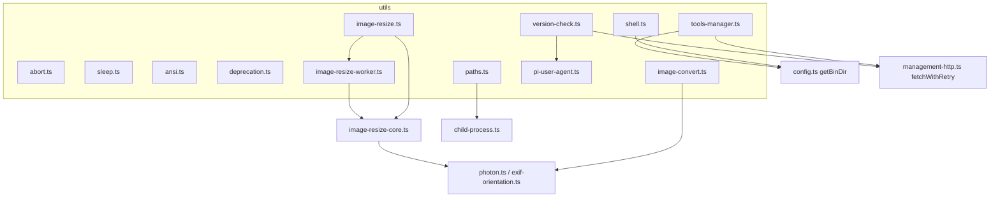
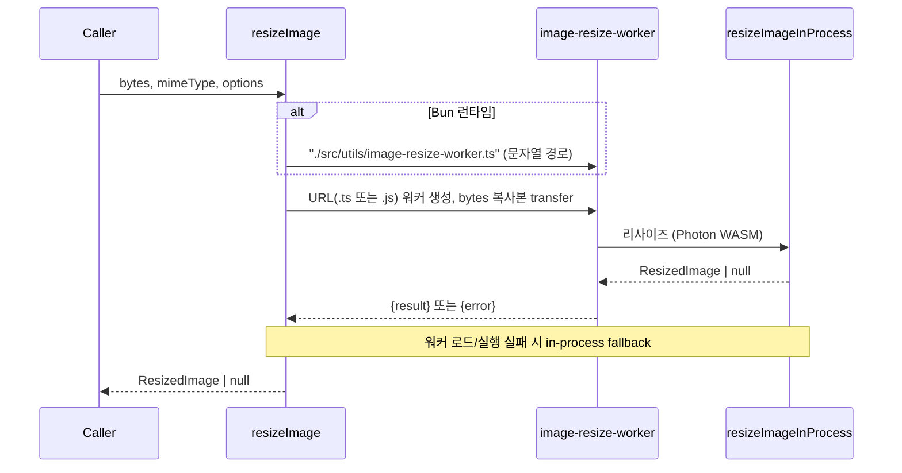
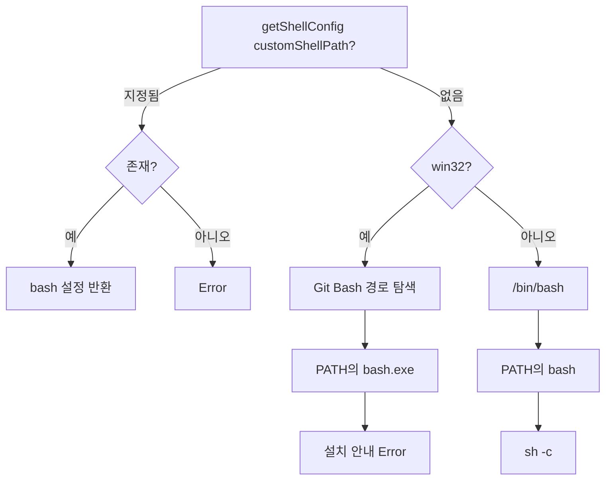
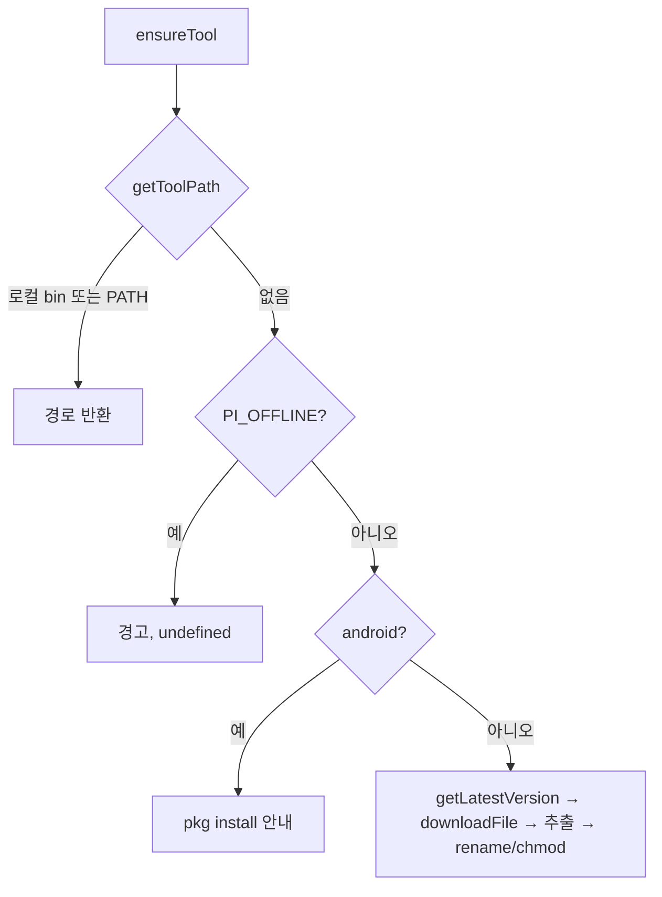

# utils 모듈

`packages/coding-agent/src/utils/` 는 coding-agent 전반에서 재사용하는 범용 헬퍼 모음이다. 도메인 로직은 없고, 중단(abort) 처리, 경로 정규화, 셸/프로세스 관리, 이미지 변환·리사이즈, 외부 도구(fd, rg) 설치, 버전 확인 같은 횡단 관심사를 담당한다.

관련 모듈:
- 설정/경로 상수(`getBinDir` 등): [cli_bootstrap_and_config](cli_bootstrap_and_config.md)
- 세션/에이전트 코어(abort, sleep 소비자): [agent_session_core](agent_session_core.md)
- 내장 도구(셸, 경로 사용): [builtin_tools](builtin_tools.md)
- 터미널 이미지 표시: [tui_core](tui_core.md)
- `packages/ai` 쪽의 유사 유틸(`sleep`, `pi-user-agent`, `abort-signals`): [ai_utils](ai_utils.md)

> 참고: `packages/ai/src/utils/sleep.ts`, `pi-user-agent.ts` 와 이름이 같은 파일이 coding-agent 에도 있다. 별개의 구현이다.

## 구성 요소 한눈에 보기

| 파일 | 핵심 심볼 | 역할 |
|---|---|---|
| `abort.ts` | `operationSignal`, `raceWithAbortSignal` | AbortSignal 정규화, 중단 시 대기 포기 |
| `ansi.ts` | `ansiRegex`, `stripAnsi` | ANSI/OSC 이스케이프 시퀀스 제거 |
| `deprecation.ts` | `warnDeprecation`, `clearDeprecationWarningsForTests` | 메시지당 1회 deprecation 경고 |
| `image-convert.ts` | `convertToPng`, `convertImageBytesToPng` | Kitty 프로토콜용 PNG 변환 |
| `image-resize.ts` | `resizeImage`, `formatDimensionNote` | 워커 스레드 기반 리사이즈 |
| `image-resize-worker.ts` | `ResizeImageWorkerRequest/Response`, `isResizeImageWorkerRequest` | 리사이즈 워커 엔트리 |
| `paths.ts` | `canonicalizePath`, `normalizePath`, `resolvePath` 등 | 경로 정규화/해석 |
| `pi-user-agent.ts` | `getPiUserAgent` | HTTP User-Agent 문자열 |
| `shell.ts` | `getShellConfig`, `getPowerShellConfig`, `killProcessTree` 등 | 셸 탐색, 프로세스 정리 |
| `sleep.ts` | `sleep` | abort 가능한 sleep |
| `tools-manager.ts` | `ToolConfig`, `ensureTool`, `getToolPath` | fd/rg 탐색·다운로드 |
| `version-check.ts` | `getLatestPiVersion`, `checkForNewPiVersion` | 최신 pi 버전 조회 |

(코드 확인: 제공된 소스 기준. `image-resize-core.ts`, `exif-orientation.ts`, `photon.ts`, `child-process.ts`, `management-http.ts` 는 본문이 제공되지 않아 호출 관계만 확인했고 내부 동작은 미확인.)

## 아키텍처

## 주요 컴포넌트

### abort.ts — 중단 처리
- `operationSignal(signal?)`: 공개 API 가 받는 선택적 signal 을 항상 유효한 `AbortSignal` 로 바꾼다. 없으면 새 `AbortController` 의 signal 을 만들 뿐 deadline 은 부여하지 않는다.
- `raceWithAbortSignal(operation, signal)`: signal 이 abort 되면 즉시 reject 하되, 버려진 operation 의 reject 는 삼켜 unhandled rejection 을 막는다. 이미 aborted 면 바로 reject. `signal.reason` 이 없으면 `AbortError` 를 만든다. 정산(settle) 시 리스너를 제거하고 `settled` 플래그로 중복 처리를 막는다.
- 주의: operation 자체를 취소하지는 않는다. "기다리기를 멈출" 뿐이다.

### sleep.ts
`sleep(ms, signal?)`: abort 시 타이머를 지우고 `Error("Aborted")` 로 reject. 이미 aborted 면 즉시 reject. (코드 확인: abort 리스너는 `once` 옵션이 없고 타이머 완료 후에도 제거되지 않는다. 짧은 수명의 signal 에서는 무해하나 장수 signal 에 반복 호출하면 리스너가 누적될 수 있다.)

### ansi.ts
`ansiRegex({ onlyFirst })` 는 OSC(`ESC ] ... ST`)와 CSI 시퀀스를 매칭하는 정규식을 만든다(chalk 의 `ansi-regex`/`strip-ansi` 에서 파생, MIT). `stripAnsi` 는 ESC/CSI 문자가 없으면 정규식을 건너뛰는 fast path 를 쓰며, 문자열이 아니면 `TypeError`. 소스상 `ansiRegex` 는 `export` 되지 않은 모듈 내부 함수다.

### deprecation.ts
모듈 수준 `Set` 으로 이미 출력한 메시지를 기억해 같은 경고를 한 번만 `chalk.yellow` 로 `console.warn` 한다. `clearDeprecationWarningsForTests` 는 테스트용 초기화.

### 이미지 처리

- `resizeImage`: Photon WASM 디코딩·리사이즈·인코딩이 TUI 이벤트 루프를 막지 않도록 워커 스레드에서 실행한다. 입력은 복사본을 transfer 해 호출자의 버퍼가 detach 되지 않게 한다. 워커는 `finally` 에서 항상 terminate. Bun 컴파일 바이너리에서는 문자열 경로를 먼저 시도하고, 모든 워커 시도가 실패하면 `resizeImageInProcess` 로 fallback.
- `image-resize-worker.ts`: `parentPort` 가 없으면 즉시 throw. 첫 메시지 하나만(`once`) 처리하며 `isResizeImageWorkerRequest` 로 `inputBytes`(Uint8Array)·`mimeType`(string)을 검증 후 결과 또는 `error` 를 `postMessage`.
- `formatDimensionNote`: 리사이즈된 경우 원본/표시 크기와 좌표 배율을 설명하는 문자열을 만들어 모델이 좌표를 원본으로 환산하게 돕는다.
- `convertToPng(base64, mimeType)`: Kitty graphics 프로토콜이 PNG(`f=100`)를 요구하므로 변환한다. 이미 PNG 면 그대로 반환, Photon 이 없거나 변환 실패 시 `null`. EXIF orientation 을 적용하며 WASM 객체는 `free()` 로 해제.

### paths.ts
- `canonicalizePath`: `realpathSync` 로 심볼릭 링크를 해소하고, 대상이 없으면 원본 경로를 반환(예외를 던지지 않음).
- `normalizePath`: trim, 유니코드 공백 정규화, `@` 접두 제거, Windows 셸 경로(`/c/...`, `/mnt/c`, `/cygdrive/c`) 변환, `~` 확장, `file://` URL 변환을 옵션(`PathInputOptions`)에 따라 수행.
- `resolvePath`, `getCwdRelativePath`, `formatPathRelativeToCwdOrAbsolute`: cwd 기준 해석과 표시. cwd 밖이면 절대 경로.
- `isLocalPath`: `npm:`, `git:`, `github:`, `http(s):`, `ssh:`, `builtin:` 이 아니면 로컬로 간주.
- `getFileRevision`: `dev:ino:size:mtimeNs:ctimeNs` 지문.
- `markPathIgnoredByCloudSync`: macOS(`xattr`)/Linux(`setfattr`)에서 Dropbox 등 동기화 제외 속성을 설정.

### shell.ts

- 레거시 WSL `bash.exe`(`System32`/`Sysnative`)는 `-s` + stdin 으로 명령을 전달(`commandTransport: "stdin"`), 그 외는 `-c`.
- `getPowerShellConfig`(핵심 컴포넌트): Windows 에서만 동작, `pwsh.exe` 우선 후 `powershell.exe`. 인자는 `-NoProfile -NonInteractive -ExecutionPolicy Bypass -Command`. 비 Windows 면 throw.
- `getShellEnv`: `getBinDir()` 를 PATH 맨 앞에 추가(대소문자 무시한 PATH 키 탐색).
- `sanitizeBinaryOutput`: string-width 크래시를 유발하는 제어 문자와 U+FFF9..FFFB 제거(탭·개행·CR 유지).
- `trackDetachedChildPid` / `killTrackedDetachedChildren` / `killProcessTree`: 종료 시그널에서 detached 자식 정리. Windows 는 System32 `taskkill /F /T`, Unix 는 프로세스 그룹 `SIGKILL` 후 실패 시 단일 pid.

### tools-manager.ts
`ToolConfig`(name, repo, binaryName, systemBinaryNames, tagPrefix, getAssetName)로 `fd`, `rg` 를 선언한다.

- 최신 버전은 api.github.com(익명 60회/시간 제한) 대신 `/releases/latest` 리다이렉트의 태그로 해석한다.
- fd 는 darwin/x64 에서 `10.3.0` 고정.
- 추출은 고유 temp 디렉터리(pid+시간+난수)를 써서 fd/rg 동시 다운로드 경합을 피하고, `.tar.gz` 는 `tar`, `.zip` 은 Windows 의 System32 `tar.exe` → PowerShell `Expand-Archive`, 그 외 `unzip` → `tar` 순으로 시도.
- 실패 시 `cause` 체인(최대 깊이 5)을 합쳐 경고 메시지로 전달.

### version-check.ts / pi-user-agent.ts
- `getPiUserAgent(version)`: `pi/<version> (<platform>; bun|node/<ver>; <arch>)`.
- `getLatestPiRelease` → `https://pi.dev/api/latest-version` 조회(기본 타임아웃 10초, `retry` 시 2회). `PI_OFFLINE` 이면 `undefined`. 응답 필드는 타입 검사 후 trim.
- `getLatestPiVersion`: 위 결과의 `version` 만 반환.
- `checkForNewPiVersion`: `PI_SKIP_VERSION_CHECK` 면 건너뛰고, 모든 오류를 삼켜 `undefined`. `isNewerPackageVersion` 은 semver 비교, 유효하지 않으면 문자열 불일치로 판단.
- `formatVersionCheckError`: Node 의 "fetch failed" 뒤에 숨은 errno 코드/원인 메시지를 노출.

## 설계 메모
- 대부분 부작용이 국소적이며 실패 시 `null`/`undefined`/무시로 degrade 한다(이미지, 버전 확인, 경로 정규화). 반대로 셸 탐색은 사용자에게 조치를 안내하는 오류를 던진다.
- 환경 변수: `PI_OFFLINE`(다운로드/버전 확인 차단), `PI_SKIP_VERSION_CHECK`.
- 플랫폼 분기(Windows, Termux/Android, Bun 바이너리)가 코드 곳곳에 있으므로 수정 시 세 환경 모두 고려해야 한다.
- 저장소 규칙(`AGENTS.md`)상 패키지 에셋 경로는 `src/config.ts` 헬퍼로 해석하며, 이 모듈의 `getBinDir` 사용이 그 예다.
