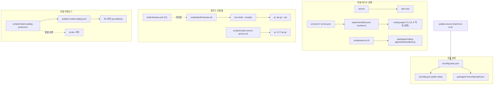
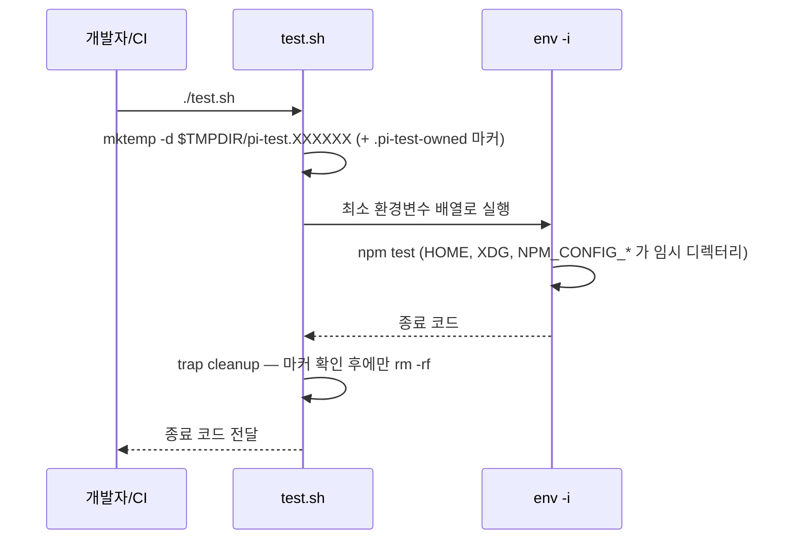
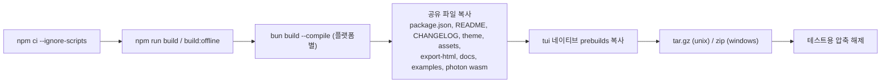
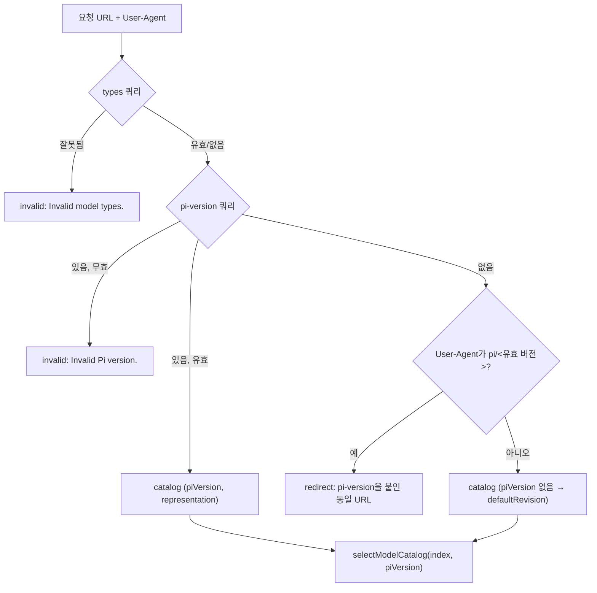

# workspace_build_and_scripts

## 1. 개요

`workspace_build_and_scripts`는 `pi` 모노레포 루트의 **개발 보조 스크립트, 테스트 격리 래퍼, 공유 TypeScript 설정, 모델 카탈로그 프로토콜**을 담당하는 모듈이다. 개별 패키지(`packages/ai`, `packages/agent`, `packages/coding-agent` 등)의 로직은 포함하지 않고, 그 패키지들을 빌드·테스트·실행·배포하는 "바깥 껍질"에 해당한다.

| 파일 | 역할 |
|---|---|
| `tsconfig.base.json` | 모든 패키지가 상속하는 공통 컴파일러 옵션 |
| `tsconfig.json` | 루트 type-check(`noEmit`)용 설정과 `@earendil-works/*` path alias |
| `test.sh` | 사용자 홈·자격증명과 격리된 환경에서 `npm test` 실행 |
| `pi-test.sh` / `pi-test.ps1` | 소스 체크아웃에서 CLI 실행 (`--no-env`로 API 키 제거) |
| `scripts/auto-pi.sh` | 빌드된 개발용 `pi`를 `PATH`의 `pi`처럼 쓰게 하는 래퍼 |
| `scripts/build-binaries.sh` | Bun으로 6개 플랫폼 단일 실행 파일과 아카이브 생성 |
| `scripts/create-source-archive.sh` | 릴리스용 결정적(deterministic) 소스 아카이브 생성 |
| `scripts/update-source-imports-to-ts.sh` | 상대 import의 `.js` 확장자를 `.ts`로 일괄 변환 |
| `scripts/model-catalog-protocol.ts` | pi와 pi.dev가 공유하는 모델 카탈로그 선택 프로토콜 |

## 2. 아키텍처

## 3. 구성 요소

### 3.1 TypeScript 설정 (`tsconfig.base.json`, `tsconfig.json`)

- `tsconfig.base.json`: `target`/`lib`는 `ES2024`, `module`/`moduleResolution`은 `Node16`, `strict`. 핵심은 `erasableSyntaxOnly`(enum·parameter property 등 JS 방출이 필요한 문법 금지, Node strip-only 모드 호환), `allowImportingTsExtensions` + `rewriteRelativeImportExtensions`(소스에서 `.ts`로 import하고 방출 시 `.js`로 재작성)이다. `verbatimModuleSyntax`로 type import를 명시하게 한다.
- `tsconfig.json`: base를 상속하고 `noEmit`, `NodeNext`로 전환한다. `paths`로 `@earendil-works/pi-ai`, `pi-agent-core`, `pi-coding-agent`, `pi-tui`, `pi-mcp`, `pi-codemode`, `pi-durable`, `chord`, `pi-protocol/client/server`, `pi-telemetry` 등을 각 패키지의 `src/`로 직접 매핑하므로 빌드 없이도 type-check와 소스 실행이 가능하다. `include`에 `scripts/model-catalog-protocol.ts`와 각 패키지의 `src`·`test`·예제가 들어가고 `dist`는 제외된다.
- `scripts/update-source-imports-to-ts.sh`: `packages/*/src` 아래 `.ts` 파일에서 `from "./x.js"`, `import("./x.js")`, `declare module "./x.js"`, `importNodeOnlyProvider("./x.js")` 형태를 `perl`로 `.ts`로 바꾼다. 위 `rewriteRelativeImportExtensions` 정책으로 전환하기 위한 일회성 마이그레이션 도구이다.

### 3.2 테스트 격리 (`test.sh`)

흐름:

- `env -i`로 환경을 비우고 `PATH`, `PWD`, 임시 `HOME`/`USERPROFILE`/`TMPDIR`/`XDG_*`, `LANG=C`, `TZ=UTC`, git·npm 전역 설정 무력화(`GIT_CONFIG_NOSYSTEM`, `NPM_CONFIG_USERCONFIG` 등), `PI_NO_LOCAL_LLM=1`, `AWS_EC2_METADATA_DISABLED=true`만 허용한다. API 키는 전달되지 않는다.
- Windows 실행에 필요한 `SystemRoot`, `COMSPEC`, `PATHEXT` 등과 CI 감지용 `CI`, `GITHUB_ACTIONS`만 선택적으로 상속한다.
- `cleanup`은 경로가 `$temp_parent/pi-test.*` 패턴이고, 심볼릭 링크가 아니며, `.pi-test-owned` 마커가 있을 때만 삭제한다. 검증 실패 시 삭제를 거부하고 종료 코드를 1로 만든다.
- 루트 `package.json`의 `test`는 `test:scripts`(`node --test scripts/*.test.mjs scripts/*.test.ts`) 후 각 워크스페이스의 `test`를 실행한다. 저장소 규칙상 e2e를 피하려면 전체 vitest 대신 이 래퍼를 쓴다.

### 3.3 CLI 실행 래퍼 (`pi-test.sh`, `pi-test.ps1`, `scripts/auto-pi.sh`)

- `pi-test.sh` / `pi-test.ps1`: `--no-env` 플래그를 소비하면 Anthropic, OpenAI, Gemini, Groq, xAI, OpenRouter, Bedrock(AWS_*), Azure OpenAI, GitHub 토큰 등 약 35개 환경변수를 unset한 뒤 실행한다 (목록의 기준은 `packages/ai/src/env-api-keys.ts`). 그 다음 `node --import <source-resolver.ts의 file URL> <cli>`로 TypeScript 소스를 직접 실행한다. `--import`는 모듈 지정자를 받으므로 경로를 file URL로 변환한다(`#`, `?`, `%` 및 Windows 경로 문제 회피).
  - 관찰된 차이: `pi-test.sh`는 `packages/coding-agent/src/experimental/cli.ts`를, `pi-test.ps1`은 `packages/coding-agent/src/cli.ts`를 실행한다. 두 스크립트의 진입점이 다르므로 한쪽이 오래되었을 수 있다 (코드 확인, 의도는 추론 불가).
- `scripts/auto-pi.sh`: `~/.local/bin/pi`에 심볼릭 링크로 설치하는 개발자용 래퍼다. 심볼릭 링크를 따라 실제 체크아웃 위치를 찾고, `packages/coding-agent/dist/bundle/cli.js`(최근 `npm run build` 결과)를 `PI_EXPERIMENTAL=1` 기본값으로 실행한다. `--stable` 또는 첫 인자가 `update`이면 `PATH`에서 자기 자신을 제외한 다음 `pi`를 찾아 실행하여 자체 업데이트가 동작하게 한다.

### 3.4 릴리스 산출물 스크립트

**`scripts/build-binaries.sh`** (`.github/workflows/build-binaries.yml`을 로컬에서 미러링)

- 옵션: `--skip-install`, `--skip-build`, `--offline-model-data`(번들된 모델 데이터 사용, `build:offline`), `--platform`, `--out`. 지원 플랫폼은 `darwin-arm64`, `darwin-x64`, `linux-x64`, `linux-arm64`, `windows-x64`, `windows-arm64`.
- x64 타깃은 `bun-<platform>-baseline`을 사용한다. 진입점 `./dist/bun/cli.js`와 함께 `image-resize-worker.ts`, `codemode/worker.ts`를 명시 entrypoint로 넘겨야 Bun이 워커 스크립트를 실행 파일에 포함한다. `--no-compile-autoload-bunfig`는 cwd의 `bunfig.toml` preload가 바이너리를 깨뜨리는 문제(#7684)를 막는다.
- 아카이브: unix는 `pi/` 래퍼 디렉터리 안에 담은 tar.gz(mise 호환), windows는 zip. 플랫폼별 `packages/tui/native/<os>/prebuilds/<platform>`을 실행 파일 옆에 복사한다 ([tui_native_and_build](tui_native_and_build.md) 참조).

**`scripts/create-source-archive.sh`**

- 사용: `--version <v> [--ref <git-ref>] --out <archive.tar.gz>`. 사전에 `npm run hydrate:model-data` 필요.
- 해당 ref의 `packages/coding-agent/package.json` 버전과 `--version`이 일치하는지 검증한다.
- git에서 무시되는 `packages/ai/src/providers/data/` 모델 데이터 스냅샷을 **임시 인덱스**(`GIT_INDEX_FILE`)에 `git add -f`하여 커밋 트리에 합친 후 `git archive`에 `--mtime`을 커밋 시각으로 주고 `gzip -n -9`로 압축한다. 같은 커밋·같은 데이터면 동일한 결과가 나온다.
- 검증: 필수 경로 목록(네이티브 prebuilds, `models.generated.ts`, `image-resize-worker.ts` 등) 존재, 모든 경로가 `pi-<version>/` 접두사 아래, `node_modules`·`binaries` 미포함, 압축 해제 후 `packages/ai/scripts/check-model-data.ts` 통과를 확인하고 나서야 최종 경로로 `mv`한다.

### 3.5 모델 카탈로그 프로토콜 (`scripts/model-catalog-protocol.ts`)

파일 헤더에 따르면 이 파일은 `earendil-works/pi`와 `earendil-works/pi.dev`(`src/shared/models/protocol.ts`)에 **바이트 단위로 동일하게** 복사되며, import와 런타임 특정 API가 없어 Node.js와 Cloudflare Workers에서 그대로 동작한다. pi는 카탈로그 리비전을 게시하고 클라이언트 테스트에 쓰고, pi.dev는 요청 응답에 쓴다.

저장소 레이아웃(`MODEL_CATALOG_PREFIX = models/v1`): `index.json`, `revisions/<revision>/models.json`, `models.all.json`, `providers.json`, `providers/<id>.json`, `providers/<id>.all.json`. `?types=`를 보내는 클라이언트는 타입 포함 `.all.json`, 구버전 클라이언트는 chat 전용 legacy 변형을 받는다.

| 함수 | 동작 |
|---|---|
| `getModelCatalogArtifactKey` | 리비전·아티팩트 이름으로 저장소 키 생성 |
| `getModelCatalogProviderKey` | 프로바이더·표현(`legacy`/`typed`)에 따라 `.json`/`.all.json` 키 생성 |
| `compareModelCatalogPiVersions` | semver 우선순위 비교(잘못된 버전은 throw), prerelease 규칙 포함 |
| `parseModelCatalogRequest` | URL과 User-Agent로 응답 방식 결정 |
| `selectModelCatalog` | 요청 버전 이하 `minimumPiVersion` 중 최대값의 엔트리 선택, 버전 없으면 `defaultRevision` |
| `parseModelCatalogIndex` | 저장소에서 읽은 index 검증, 프로토콜 필드만 반환 |

설계 포인트: 응답이 URL 기준으로 캐시되므로 User-Agent에 따라 응답을 달리하는 대신, 구버전 클라이언트를 명시적 `pi-version`이 붙은 URL로 리다이렉트한다. 리비전 이름은 `sha256-<64 hex>` 형식(`MODEL_CATALOG_REVISION_RE`)이어야 하고, `defaultRevision`은 `catalogs` 중 하나여야 한다.

게시는 `.github/workflows/publish-model-catalog.yml`이 수행한다: `npm run generate:model-catalog` → `npm run check:model-catalog`(`scripts/publish-model-catalog.mjs --dry-run`) → artifact 업로드 후, 평일 Europe/Vienna 10:00–15:00 창(스케줄은 10:17, 12:17, 14:17, 수동 게시는 예외)에서만 R2 버킷 `pi-artifacts`로 업로드한다. 이 `.mjs` 스크립트 본문은 이번 입력에 없어 내용은 미확인이다.

## 4. 전체 시스템과의 관계

- 루트 `package.json`의 `build`는 의존 순서대로 `chord → tui → telemetry → codemode → mcp → ai → durable → agent → protocol → client → server → coding-agent`를 빌드한다. `check`는 biome, 의존성 고정·런타임 의존성·상대 import·entry graph·shrinkwrap·install-lock 검사와 `tsc --noEmit`, browser smoke를 순차 실행한다.
- 이 모듈의 설정과 스크립트는 다음 모듈의 산출물을 소비한다:
  - 모델 데이터·카탈로그: `packages/ai`의 `generate-models`, `hydrate-model-data`, `check:model-data` (ai 패키지 문서 참조)
  - 바이너리 패키징: `packages/coding-agent`의 `build:binary`, `copy-binary-assets`
  - 네이티브 클립보드 prebuilds: `packages/tui/native/*`
- CI 워크플로(`ci.yml`, `build-binaries.yml`, `publish-model-catalog.yml` 등)와 `biome.json`, 패키지별 `package.json`은 형제 모듈 `Build,_Release,_CI_and_Quality_Infrastructure`의 하위 모듈(`ci_workflows`, `root_build_config`, `coding_agent_packaging`, `build_and_test_config`)에서 다룬다.

## 5. 참고 사항

- 이 모듈은 파일 수가 적고 서로 독립적이어서 별도 하위 모듈 문서로 나누지 않았다.
- 검증 수준: 위 내용은 제공된 소스와 루트 `package.json`, `publish-model-catalog.yml`을 읽고 작성했다(코드 확인). `scripts/*.mjs` 등 입력에 없는 스크립트 내부 동작은 미확인이다.
