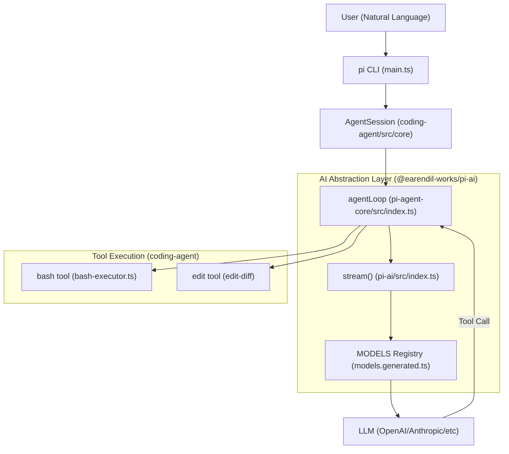
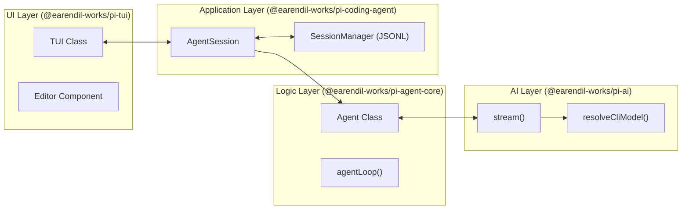

# Overview

Relevant source files

The following files were used as context for generating this wiki page:

- [AGENTS.md](AGENTS.md)
- [README.md](README.md)
- [package-lock.json](package-lock.json)
- [package.json](package.json)
- [packages/agent/CHANGELOG.md](packages/agent/CHANGELOG.md)
- [packages/agent/package.json](packages/agent/package.json)
- [packages/ai/CHANGELOG.md](packages/ai/CHANGELOG.md)
- [packages/ai/package.json](packages/ai/package.json)
- [packages/coding-agent/CHANGELOG.md](packages/coding-agent/CHANGELOG.md)
- [packages/coding-agent/README.md](packages/coding-agent/README.md)
- [packages/coding-agent/package.json](packages/coding-agent/package.json)
- [packages/coding-agent/src/cli/args.ts](packages/coding-agent/src/cli/args.ts)
- [packages/coding-agent/src/main.ts](packages/coding-agent/src/main.ts)
- [packages/coding-agent/test/args.test.ts](packages/coding-agent/test/args.test.ts)
- [packages/tui/CHANGELOG.md](packages/tui/CHANGELOG.md)
- [packages/tui/package.json](packages/tui/package.json)

The `pi` monorepo is a minimal terminal coding harness and AI agent framework designed for high extensibility. It allows developers to build, run, and embed autonomous agents that can interact with the local file system and execute shell commands [packages/coding-agent/package.json:4-4]().

The project follows a modular architecture, separating the core agent logic, LLM provider abstractions, and terminal UI components into distinct, reusable packages. It is designed to be adapted to specific workflows via TypeScript extensions, skills, and prompt templates [packages/coding-agent/README.md:20-22]().

### Package Architecture

The monorepo is organized into five primary packages using npm workspaces [package-lock.json:10-17](). Each package serves a specific layer of the system:

| Package | Purpose | Key Code Entities |
|:---|:---|:---|
| `@earendil-works/pi-ai` | Unified LLM provider abstraction layer. | `AssistantMessageEventStream`, `MODELS`, `streamSimple` |
| `@earendil-works/pi-agent-core` | General-purpose agent loop and state management. | `Agent`, `agentLoop`, `AgentState` |
| `@earendil-works/pi-tui` | Differential terminal rendering engine and UI components. | `TUI`, `Terminal`, `Editor`, `ProcessTerminal` |
| `@earendil-works/pi-coding-agent` | The main CLI application and coding-specific tools. | `AgentSession`, `SessionManager`, `createAgentSession` |
| `@earendil-works/pi-web-ui` | Web-based interface components for embedding. | `ChatPanel`, `AgentInterface` |

For a deep dive into the directory layout and build pipeline, see [Monorepo Structure and Build System](#1.2).

**Sources:** [package-lock.json:10-17](), [packages/coding-agent/package.json:39-41](), [packages/agent/package.json:31-32](), [packages/ai/package.json:2-3](), [packages/tui/package.json:2-4]().

---

### System Concept Map

The following diagram illustrates how natural language requests move from the user through the various code entities to reach an LLM and eventually execute local system tools.

**Request Flow: User Input to Tool Execution**

**Sources:** [packages/coding-agent/src/main.ts:1-6](), [packages/agent/package.json:3-4](), [packages/ai/package.json:63-65](), [packages/coding-agent/package.json:39-41]().

---

### Core Components and Relationships

The `pi` ecosystem is built on the interaction between the **Agent Loop**, **Provider Abstraction**, and **Terminal UI**.

#### 1. The Agent Loop (`pi-agent-core`)
The core logic resides in `@earendil-works/pi-agent-core`. It manages the conversation state (`AgentState`) and orchestrates the "turn" lifecycle: sending messages to an LLM, parsing tool calls, and executing those tools (supporting hooks like `beforeToolCall` and `afterToolCall`) [packages/agent/CHANGELOG.md:155-184]().

#### 2. LLM Abstraction (`pi-ai`)
This package provides a unified interface for multiple LLM providers (Anthropic, OpenAI, Google, Bedrock, etc.). It handles the complexities of streaming responses, thinking/reasoning blocks, and credential resolution [packages/ai/package.json:69-80](). It allows the rest of the system to remain provider-agnostic.

#### 3. Terminal UI (`pi-tui`)
A custom TUI library that uses differential rendering to update the terminal efficiently [packages/tui/package.json:2-4](). It provides the interactive experience found in the `pi` CLI, including a multi-line `Editor` and `ProcessTerminal` abstraction [packages/tui/CHANGELOG.md:130-131]().

#### 4. The Coding Agent (`pi-coding-agent`)
This is the primary CLI application. It bundles the core loop with specific coding tools: `read`, `write`, `edit`, and `bash` [packages/coding-agent/README.md:96-96](). It also manages persistent sessions using a JSONL-based structure and provides features like branching and compaction [packages/coding-agent/README.md:51-53]().

**System Component Interaction**

**Sources:** [packages/coding-agent/package.json:39-41](), [packages/agent/CHANGELOG.md:155-184](), [packages/coding-agent/src/main.ts:31-41]().

---

### Key Features and Extensibility

*   **Multi-mode Execution**: Pi runs in `interactive` mode (TUI), `print`/`json` mode (one-shot), `rpc` mode (for integration), and as an `SDK` for embedding [packages/coding-agent/README.md:24-24]().
*   **Session Management**: Supports forking, cloning, and automatic compaction of sessions to manage context window limits [packages/coding-agent/README.md:51-53]().
*   **Extension System**: Users can add tools, slash commands, and lifecycle hooks via TypeScript extensions loaded using `jiti` [packages/coding-agent/package.json:50-50]().
*   **Resource Discovery**: Automatically discovers context files like `AGENTS.md` or `CLAUDE.md` to shape agent behavior [packages/coding-agent/README.md:55-55]().
*   **Project Trust**: Pi includes a security layer that asks before loading project-local settings or packages [packages/coding-agent/CHANGELOG.md:51-53]().

For instructions on installing the CLI and running your first session, see [Getting Started](#1.1).

**Sources:** [packages/coding-agent/README.md:24-24](), [packages/coding-agent/package.json:50-50](), [AGENTS.md:1-25](), [packages/coding-agent/CHANGELOG.md:51-53]().
